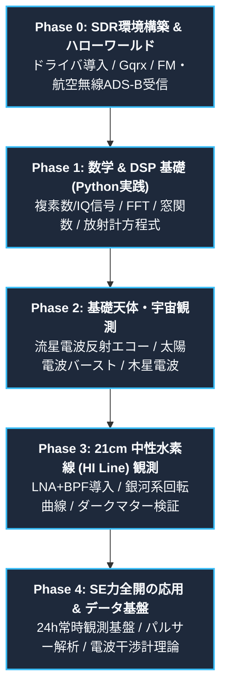
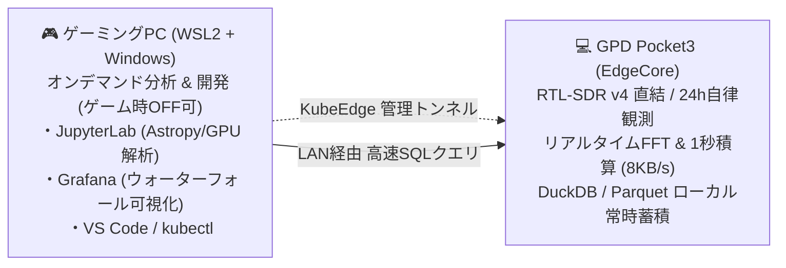

# 🌌 Radio Astronomy with RTL-SDR v4

> **ソフトウェアエンジニアのための電波天文学 & デジタル信号処理（DSP）実践リポジトリ**  
> RTL-SDR Blog V4 を活用し、数学・信号処理の基礎補完から、21cm中性水素線（HI Line）観測、銀河系回転曲線の導出、自動観測データパイプライン構築までを段階的に探求します。  
>  
> *(※ 本リポジトリは、AI アシスタント「Antigravity」とペアプログラミング・対話を行いながら、電波天文学およびデジタル信号処理を実践的に学んでいく学習・実験プロジェクトです)*

---

## 📑 目次

- [🌌 Radio Astronomy with RTL-SDR v4](#-radio-astronomy-with-rtl-sdr-v4)
  - [📑 目次](#-目次)
  - [🎯 本プロジェクトの目的・アプローチ](#-本プロジェクトの目的アプローチ)
  - [🗺️ 5段階 学習ロードマップ](#️-5段階-学習ロードマップ)
    - [Phase 0: SDR環境構築 \& ハローワールド](#phase-0-sdr環境構築--ハローワールド)
    - [Phase 1: 数学 \& デジタル信号処理 (DSP) 基礎](#phase-1-数学--デジタル信号処理-dsp-基礎)
    - [Phase 2: 基礎天体・宇宙観測（付属アンテナで実践）](#phase-2-基礎天体宇宙観測付属アンテナで実践)
    - [Phase 3: 電波天文学の金字塔 — 21cm 中性水素線（HI Line）観測](#phase-3-電波天文学の金字塔--21cm-中性水素線hi-line観測)
    - [Phase 4: SE力全開の応用 \& データエンジニアリング](#phase-4-se力全開の応用--データエンジニアリング)
  - [📚 厳選教材・リファレンスマトリクス](#-厳選教材リファレンスマトリクス)
  - [📖 電波天文学 & SDR 用語集 (Glossary)](#-電波天文学--sdr-用語集-glossary)
  - [📐 ソフトウェアエンジニアのための数学・DSP 要点チートシート](#-ソフトウェアエンジニアのための数学dsp-要点チートシート)
    - [1. 複素数とIQ信号（直交検波）](#1-複素数とiq信号直交検波)
    - [2. 離散フーリエ変換 (DFT / FFT) とパワースペクトル密度 (PSD)](#2-離散フーリエ変換-dft--fft-とパワースペクトル密度-psd)
    - [3. 放射計方程式（Radiometer Equation）](#3-放射計方程式radiometer-equation)
    - [4. ドップラー効果と視線速度](#4-ドップラー効果と視線速度)
  - [🛠️ ハードウェア仕様 \& 構成](#️-ハードウェア仕様--構成)
    - [RTL-SDR Blog V4 仕様概要](#rtl-sdr-blog-v4-仕様概要)
    - [観測フェーズ別ハードウェア構成](#観測フェーズ別ハードウェア構成)
  - [🛰️ 自宅Kubernetesシステム構成](#️-自宅kubernetesシステム構成)
  - [🚀 クイックスタート](#-クイックスタート)
    - [1. RTL-SDR Blog V4 ドライバのインストール (Linux)](#1-rtl-sdr-blog-v4-ドライバのインストール-linux)
    - [2. Python 開発環境のセットアップ](#2-python-開発環境のセットアップ)
    - [3. 動作確認 (SDR ハローワールド)](#3-動作確認-sdr-ハローワールド)
  - [📁 ディレクトリ構成](#-ディレクトリ構成)
  - [📄 ライセンス](#-ライセンス)

---

## 🎯 本プロジェクトの目的・アプローチ

- **背景**: 電波天文学は、光学望遠鏡では見えない宇宙のガス構造や高エネルギー現象を電波で捉える学問です。現代のアマチュア電波天文学は、安価なSDR（ソフトウェア無線）とオープンソースの進化により、個人の手で銀河系の腕やダークマターの証拠を観測できる時代になりました。
- **強みを活かす**: ソフトウェアエンジニアとしての **プログラミング力・Linux・データパイプライン・自動化・時系列解析** のスキルをフル活用します。
- **数学・理論の補完**: 数式を単に暗記するのではなく、**「Pythonコードでシミュレーション・可視化しながら、直感と数式を一致させる」** エンジニア的アプローチで着実にステップアップします。

---

## 🗺️ 5段階 学習ロードマップ



### Phase 0: SDR環境構築 & ハローワールド
- **到達目標**: RTL-SDR v4のハードウェア・ドライバを正しくセットアップし、電波を受信・可視化・復調する体験を得る。
- **主なトピック**:
  - RTL-SDR Blog V4 特有のドライバ（HFアップコンバータ対応版）のビルド・導入
  - GUIツール（Gqrx, SDR++）によるスペクトラムとウォーターフォールの可視化
  - 広帯域FM（FM放送）の受信と復調
  - 航空機位置情報（ADS-B 1090MHz, `readsb` / `dump1090`）の受信・パケット解析

### Phase 1: 数学 & デジタル信号処理 (DSP) 基礎
- **到達目標**: 複素IQ信号、FFT、窓関数、フィルタリング、ノイズ理論の数学的背景を理解し、Python（NumPy/SciPy/sdr）で自作処理が書ける。
- **主なトピック**:
  - **オイラーの公式と直交検波**: $e^{j\theta} = \cos\theta + j\sin\theta$、なぜ複素数が必要なのか（正負の周波数分離）
  - **サンプリング定理**: ナイキスト周波数、エイリアシング、帯域幅とサンプリングレートの関係
  - **フーリエ変換**: DFT / FFT、窓関数（Hann, Blackman）によるスペクトル漏れ（Leakage）低減、パワースペクトル密度（PSD）
  - **熱雑音と放射計方程式**: 白色雑音、Johnson-Nyquistノイズ、長時間の積算（Integration）による微弱信号の抽出

### Phase 2: 基礎天体・宇宙観測（付属アンテナで実践）
- **到達目標**: 追加の高価な専用アンテナを購入する前に、付属アンテナや簡易自作アンテナで実際の天体・宇宙現象を捉える。
- **主なトピック**:
  - **流星電波観測（Meteor Scatter）**: 遠方のFM放送波やビーコン波が流星痕（電離プラズマ）で反射されるエコーの自動検出
  - **太陽電波バースト（Solar Radio Burst）**: 太陽フレアに伴う広帯域電波（VHF帯 30〜80MHz）の検出と宇宙天気情報との照合
  - **木星デカメートル電波（Radio JOVE）**: 木星と衛星イオの相互作用による 20.1 MHz 付近の電波バースト観測

### Phase 3: 電波天文学の金字塔 — 21cm 中性水素線（HI Line）観測
- **到達目標**: 天の川銀河の水素原子スピン反転輝線（1420.405 MHz）を受信し、ドップラー偏移から銀河回転曲線をプロットして暗黒物質（ダークマター）の証拠を確認する。
- **主なトピック**:
  - **物理**: 水素原子の超微細構造遷移（21cm線）の放射機構
  - **ハードウェア**: 1420MHz専用LNA + BPF（SAWbird+ H1等）、ホーンアンテナ（Cantenna）やグリッドパラボラ
  - **較正（Calibration）**: Cold Sky / Hot Load 較正、Yファクター法
  - **天文学的解析**: 天球座標変換（赤道座標 $\leftrightarrow$ 銀河座標 $\leftrightarrow$ 地平座標）、局所静止座標系（LSR）へのドップラー速度補正、銀河回転曲線の導出

### Phase 4: SE力全開の応用 & データエンジニアリング
- **到達目標**: ソフトウェアエンジニアのスキルを最大限に活かした24時間自律観測システムと高度な天体信号処理パイプラインの構築。
- **主なトピック**:
  - **エッジ観測基盤**: Raspberry Pi / ミニPC + Docker + RTL-SDR による24時間自動観測デーモン
  - **データエンジニアリング**: 時系列DB（TimescaleDB / InfluxDB / SQLite）への保存、Grafana / Webダッシュボードによる可視化
  - **パルサー信号処理**: 星間物質による周波数分散遅延補正（De-dispersion）と周期折りたたみ（Epoch Folding）
  - **電波干渉計（Interferometry）理論**: 二素子干渉計、開口合成、ファン・シッタート＝ツェルニケの定理とuv空間解析

---

## 📚 厳選教材・リファレンスマトリクス

| 教材・リソース名 | 分野 / 形態 | 主な講義内容・特徴 | 推奨到達目標 / 活用フェーズ |
| :--- | :--- | :--- | :--- |
| **[Essential Radio Astronomy (ERA)](https://www.cv.nrao.edu/~scondon/era/)**<br>*(Condon & Ransom / NRAO)* | 基礎理論（英）<br>*(Web / 書籍)* | 放射輸送、ラジオメータ方程式、輝度温度、各種天文放射機構（制動放射、シンクロトロン、HI輝線）の数学的導出 | 電波天文学の天体物理学的背景と定量的理論の完全修得<br>**(Phase 1, 3)** |
| **シリーズ現代の天文学 第16巻<br>『宇宙の観測II ―電波天文学』**<br>*(日本評論社)* | 基礎・専門（日）<br>*(書籍)* | 日本語による電波天文学の最高峰テキスト。電波望遠鏡、受信機・分光計の構造、HI線・分子線観測、干渉計理論 | 専門用語・物理概念の日本語での網羅的かつ厳密な理解<br>**(Phase 1, 3, 4)** |
| **『電波天文学』**<br>*(森北出版)* | 基礎入門（日）<br>*(書籍)* | 初学者向けに電波観測の基礎知識からデータ解析までを図版や数式導出を交えて丁寧に解説した実用書 | 電波観測の基本理論と数値計算に必要なパラメータの把握<br>**(Phase 0, 2)** |
| **シリーズ現代の天文学 第5巻<br>『銀河系』**<br>*(日本評論社)* | 応用・構造（日）<br>*(書籍)* | 銀河系の構造、HI 21cm線の観測解析、星間ガス運動、銀河回転曲線と暗黒物質ハローの物理 | HIスキャンデータの天体物理学的解釈と回転曲線解析の補強<br>**(Phase 3)** |
| **[PySDR: A Guide to SDR and DSP using Python](https://pysdr.org/)**<br>*(Marc Lichtman)* | DSP / SDR<br>*(Web教科書)* | IQサンプリング、FFT、窓関数、FIR/IIRフィルタ設計、ノイズ特性、Pythonコード例と幾何学的可視化 | SDR固有の離散信号処理アルゴリズムのコード実装力の確立<br>**(Phase 1)** |
| **[sdr Library](https://github.com/mhostetter/sdr)**<br>*(Matt Hostetter)* | DSPライブラリ<br>*(Python / GitHub)* | Numba高速化によるポリフェーズ・チャネライザ、フィルタ設計、自動利得制御、各種変復調・検出関数 | カスタム分光器・信号処理パイプラインの高速実装<br>**(Phase 1, 4)** |
| **[DSPIRA / gr-radio_astro](https://github.com/WVU-DSPIRA/gr-radio_astro)**<br>*(WVU / GBO)* | 実践・観測<br>*(GNU Radio / GitHub)* | HI 21cm分光観測用フローグラフ（`spectrometer_w_cal.grc`）、Yファクター絶対校正、宇宙線検出 | 校正済みスペクトルデータの自動取得と感度評価の実現<br>**(Phase 3)** |
| **[MIT Haystack srt-py](https://github.com/MITHaystack/srt-py)** | 実践・制御<br>*(Python / GitHub)* | 小型電波望遠鏡の制御ソフト、Astropyを用いた天体追尾、スカイマップ描画、ビームパターン測定 | 望遠鏡駆動制御および座標変換・解析パイプラインの自動化<br>**(Phase 3, 4)** |
| **[CCERA spectro_radiometer](https://github.com/marcusleech/spectro_radiometer)**<br>*(Marcus Leech)* | 実践・分光器<br>*(GNU Radio / C++)* | トータルパワー、相関、差動モードをサポートする軽量分光プログラム。SBC（Raspberry Pi等）対応 | 低消費電力環境におけるリアルタイム電波観測基盤の構築<br>**(Phase 4)** |

---

## 📖 電波天文学 & SDR 用語集 (Glossary)

電波天文学・SDR・デジタル信号処理（DSP）の専門用語を、ソフトウェアエンジニアやSRE向けにIT・ネットワークの概念に例えながらわかりやすく解説した用語集を用意しています。
各用語の詳細な解説は **[docs/00_glossary.md](docs/00_glossary.md)** をご覧ください。

- **[Bias-T](docs/00_glossary.md#bias-t)**: 同軸ケーブルに「電波」と「DC電源」を重畳してLNAに給電する仕組み（アンテナ線の **PoE**）。
- **[LNA](docs/00_glossary.md#lna)**: アンテナ直下でノイズを増やさずに微弱電波を増幅する低雑音アンプ。
- **[21cm線 (HI線)](docs/00_glossary.md#21cm)**: 中性水素原子のスピン反転遷移（1420.405 MHz）。天の川の渦巻き構造を可視化する電波。
- **[ドップラー効果](docs/00_glossary.md#doppler) & [LSR補正](docs/00_glossary.md#lsr)**: 天体の運動による周波数シフトから速度を逆算し、地球・太陽系の動きを引いて真の速度を求める計算。
- **[放射計方程式](docs/00_glossary.md#radiometer)**: $\Delta T = \frac{T_{\text{sys}}}{\sqrt{B \tau}}$。長時間の[積算](docs/00_glossary.md#integration)（平均化）によってノイズを圧縮し、微弱シグナルを抽出する原理。
- **[ウォーターフォール](docs/00_glossary.md#waterfall)**: 横軸=周波数、縦軸=時間、色=強度 で表したリアルタイムヒートマップ。

---

## 📐 ソフトウェアエンジニアのための数学・DSP 要点チートシート
*(※ 専門用語の詳細は [docs/00_glossary.md](docs/00_glossary.md) を参照)*

### 1. 複素数と[IQ信号（直交検波）](docs/00_glossary.md#iq)
[SDR](docs/00_glossary.md#sdr)は高周波（RF）信号を中心周波数 $f_c$ でダウンコンバートし、互いに90度位相がずれた2つのベースバンド信号 **I (In-phase: 同相成分)** と **Q (Quadrature: 直交成分)** として複素数形式でサンプリングします。

$$x[n] = I[n] + j Q[n]$$

- **なぜ複素数なのか？**: 実数信号だけをサンプリングすると正の周波数 $+f$ と負の周波数 $-f$ を区別できず（エイリアシング）、帯域幅の半分が無駄になります。複素IQ信号を用いることで、搬送波周波数を中心とした $\pm B/2$ の全帯域を一意に表現できます。

### 2. 離散フーリエ変換 (DFT / [FFT](docs/00_glossary.md#fft)) とパワースペクトル密度 (PSD)
時間領域の複素サンプリングデータ $x[n]$（$N$ 点）を周波数領域 $X[k]$ に変換します。

$$X[k] = \sum_{n=0}^{N-1} x[n] e^{-j \frac{2\pi}{N} k n}, \quad k = 0, 1, \dots, N-1$$

パワースペクトル密度（PSD: Power Spectral Density）は各周波数ビンにおける電力の強さを表します：

$$P[k] = \frac{1}{N \cdot f_s} |X[k]|^2$$

> 💡 **[窓関数 (Windowing)](docs/00_glossary.md#window)**: 有限長切り出しによる「スペクトル漏れ（Spectral Leakage）」を防ぐため、FFTの前に Hann 窓や Blackman 窓を乗算します。

### 3. [放射計方程式（Radiometer Equation）](docs/00_glossary.md#radiometer)
宇宙から届く電波は極めて微弱で、受信機内部の熱雑音（Noise）に埋もれています。電波天文学において最も重要な感度限界の式が**放射計方程式**です。

$$\Delta T = \frac{T_{\text{sys}}}{\sqrt{B \cdot \tau}}$$

- $T_{\text{sys}}$: システム雑音温度（受信機、アンテナ、大気の総合ノイズ） $[K]$
- $B$: 観測帯域幅 $[Hz]$
- $\tau$: 積分・[積算時間（Integration Time）](docs/00_glossary.md#integration) $[s]$
- $\Delta T$: 最小検出可能温度（ノイズの標準偏差） $[K]$

> 💡 **ポイント**: 積算時間 $\tau$ を長くすればするほど、ノイズのばらつきは $\frac{1}{\sqrt{\tau}}$ で減少します。これにより、目視では見えない微弱な水素輝線が[積算](docs/00_glossary.md#integration)によって浮かび上がってきます。

### 4. [ドップラー効果](docs/00_glossary.md#doppler)と視線速度
天体が観測者に対して視線速度 $v$ で移動している場合、観測される周波数 $\nu$ は静止周波数 $\nu_0$（水素線の場合は $1420.40575 \text{ MHz}$）からシフトします。

$$\frac{\Delta \nu}{\nu_0} = \frac{\nu - \nu_0}{\nu_0} \approx -\frac{v}{c} \quad (v \ll c)$$

観測された周波数を速度に変換し、地球の自転・公転運動成分を差し引いて **[局所静止座標系（LSR: Local Standard of Rest）](docs/00_glossary.md#lsr)** に補正することで、銀河系内の中性水素ガスの真の運動速度が得られます。

---

## 🛠️ ハードウェア仕様 & 構成

### RTL-SDR Blog V4 仕様概要
- **ADCチップ**: Realtek RTL2832U（8-bit ADC）
- **チューナー**: Rafael Micro R828D
- **受信周波数範囲**: 500 kHz 〜 1.76 GHz
  - **HF帯 (500kHz〜24MHz)**: 内蔵アップコンバータによるダイレクト受信（V3のようなダイレクトサンプリングモードへの手動切り替え不要）
- **最大帯域幅**: 2.4 MSPS（安定動作時）〜 3.2 MSPS（ドロップの可能性あり）
- **TCXO**: 1 PPM 温度補償型水晶発振器（周波数ドリフト極小）
- **Bias-T**: 4.5V 内蔵（ソフトウェアからON/OFF可能。外付けLNAへの同軸給電が可能）
- **アンテナ端子**: SMA メス (50 $\Omega$)

### 観測フェーズ別ハードウェア構成

```text
[Phase 0〜2: 基礎観測]
RTL-SDR V4 ─── 付属アンテナ / 自作ダイポールアンテナ ─── PC (USB)

[Phase 3: 21cm 水素線観測]
ホーン/ディッシュアンテナ ─── LNA+BPF (SAWbird+ H1等) ─── RTL-SDR V4 (Bias-T ON) ─── PC
```

---

## 🛰️ 自宅KubeEdgeシステム構成

**GPD Pocket3** と **ゲーミングデスクトップ（Windows + WSL2）** の2台を活用し、CNCF **KubeEdge** を中核に据えた「**エッジ完結・オフライン自律稼働型 電波観測基盤**」のアーキテクチャです。詳細な仕様とデータフローは [docs/03_system_architecture.md](docs/03_system_architecture.md) を参照してください。



| マシン | 役割 | 主なワークロード / 動作ポリシー |
| :--- | :--- | :--- |
| **GPD Pocket3** | **【常時自律】エッジ観測ノード** | アンテナ直下設置、SDR制御、リアルタイムFFT・1秒積算（8KB/s圧縮）、DuckDB/Parquetローカル蓄積。**ゲーミングPCの電源状態に依存せず24h単独稼働**。 |
| **ゲーミングデスクトップ** | **【オンデマンド】分析 & 開発・運用** | Windows 11 + WSL2 (`k3s` + KubeEdge `cloudcore`)。ゲームをしていない時間に起動し、LAN越しにGPD Pocket3のデータを直接SQL/Jupyterで高速分析。VS Codeやブラウザも同マシンで完結。 |

---

## 🚀 クイックスタート

### 1. RTL-SDR Blog V4 ドライバのインストール (Linux)
RTL-SDR Blog V4 は R828D チューナーとHFアップコンバータを搭載しているため、**RTL-SDR Blog公式の修正ドライバ**が必要です（標準のOSパッケージの旧ドライバではV4が認識されない場合があります）。

```bash
# 依存パッケージのインストール
sudo apt update
sudo apt install -y build-essential cmake libusb-1.0-0-dev git pkg-config

# RTL-SDR Blog V4 対応ドライバのクローンとビルド
git clone https://github.com/rtlsdrblog/rtl-sdr-blog.git
cd rtl-sdr-blog
mkdir build && cd build
cmake ../ -DINSTALL_UDEV_RULES=ON
make
sudo make install
sudo ldconfig

# デフォルトのDVB-Tカーネルモジュールをブラックリスト化
echo 'blacklist dvb_usb_rtl28xxu' | sudo tee /etc/modprobe.d/blacklist-dvb_usb_rtl28xxu.conf

# 再起動またはudevリロード
sudo udevadm control --reload-rules
sudo udevadm trigger
```

### 2. Python 開発環境のセットアップ
本リポジトリでは Python 3.10+ を推奨します。

```bash
# 仮想環境の作成と有効化
python3 -m venv .venv
source .venv/bin/activate

# 依存ライブラリの一括インストール
pip install -U pip setuptools wheel
pip install -r requirements.txt
```

### 3. 動作確認 (SDR ハローワールド)

```bash
# 接続確認
rtl_test -t

# Jupyter Lab の起動 (ノートブックで学習開始)
jupyter lab
```

---

## 📁 ディレクトリ構成

```text
radio-astronomy/
├── README.md                 # 本ドキュメント
├── pyproject.toml            # プロジェクト設定・パッケージ定義
├── requirements.txt          # Python依存ライブラリ一覧
├── docs/                     # 数学・DSP・電波天文学の詳細解説ノート
│   ├── 00_glossary.md                 # 電波天文学 & SDR 用語集 (Glossary)
│   ├── 01_math_and_dsp_cheatsheet.md  # 複素数・IQ・FFT・窓関数・雑音理論
│   ├── 02_radio_astronomy_guide.md    # 21cm線・銀河回転・座標系・ドップラー効果
│   └── 03_system_architecture.md      # 自宅KubeEdge分散観測システム構成図
├── notebooks/                # 実践 Jupyter Notebook
│   ├── 01_iq_and_dsp_foundations.ipynb  # IQ信号生成・FFT・PSD・窓関数の実験
│   ├── 02_radiometer_and_noise.ipynb   # 放射計方程式とノイズ積算シミュレーション
│   ├── 03_meteor_scatter_analysis.ipynb # 流星電波反射エコー検出
│   └── 04_hi_line_rotation_curve.ipynb # 21cm線解析と銀河回転曲線のプロット
└── src/                      # 観測・信号処理・パイプラインコード
    ├── collector/            # RTL-SDR制御・生IQデータ/スペクトル収集
    ├── dsp/                  # FFT・ポリフェーズフィルタ・積算処理
    └── pipeline/             # 自動観測・DB保存・エクスポートパイプライン
```

---

## 📄 ライセンス

本リポジトリのコードおよびドキュメントは [MIT License](LICENSE) のもとで公開されています。
