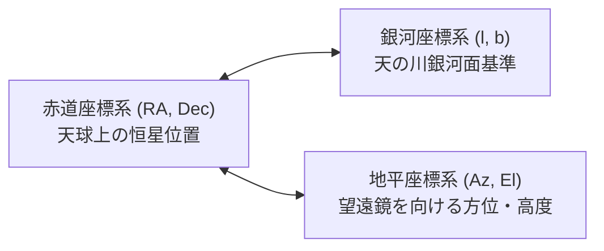

# 🔭 電波天文学 & 21cm中性水素線 観測ガイド

本ドキュメントでは、電波天文学の最重要ターゲットである **「21cm中性水素線（HI Line）」** の観測原理、天球座標系、ドップラー効果、そして銀河系回転曲線の解析手順を解説します。  
*(※ 不明な用語や前提知識は [00_glossary.md](00_glossary.md) を参照してください)*

---

## 1. [21cm 中性水素輝線 (HI Line)](00_glossary.md#21cm) の物理

### なぜ冷たい宇宙のガスから電波が出るのか？
宇宙空間の大部分を占める冷たい中性水素原子（H I）は、陽子（プロトン）1個の周りを電子1個が回っているシンプルな構造をしています。

- **超微細構造遷移（Hyperfine Transition）**:
  - 陽子と電子はそれぞれ固有の「スピン（自転のような磁気モーメント）」を持っています。
  - **平行スピン（高エネルギー状態）** から **反平行スピン（低エネルギー状態）** へ電子が自発的に反転するとき、その微小なエネルギー差 $\Delta E$ が電磁波として放出されます。

$$\Delta E = h \nu \implies \nu_0 = 1420.405751768 \text{ MHz} \quad (\lambda_0 \approx 21.106 \text{ cm})$$

- **天文学における重要性**:
  - 1つの原子がこの遷移を起こす確率は **約1100万年に1回** と極めて稀です。
  - しかし、銀河系内には膨大な量の中性水素ガスが存在するため、地球からは連続的な電波輝線として十分に観測できます。
  - [21cm電波](00_glossary.md#21cm)は宇宙の塵（ダスト）を透過するため、光学望遠鏡では見えない天の川銀河の裏側や腕の構造を直接見通すことができます。

---

## 2. 天球座標系と座標変換

アンテナを向けたい天体や天の川の位置を特定するために、3つの座標系を使い分けます。



1. **[地平座標系（Horizontal Coordinates: Az / El）](00_glossary.md#horizontal-coord)**:
   - **方位角 (Azimuth, Az)**: 北=0°, 東=90°, 南=180°, 西=270°
   - **高度 (Elevation, El)**: 地平線=0°, 天頂=90°
   - 望遠鏡を物理的に向ける角度。観測地と現在時刻によって刻々変化します。
2. **[赤道座標系（Equatorial Coordinates: RA / Dec）](00_glossary.md#equatorial-coord)**:
   - **赤経 (Right Ascension, RA)**: 春分点を基準とする角度（時角 $0^h \sim 24^h$）
   - **赤緯 (Declination, Dec)**: 天の赤道を基準とする角度（$-90^\circ \sim +90^\circ$）
3. **[銀河座標系（Galactic Coordinates: l / b）](00_glossary.md#galactic-coord)**:
   - **銀経 (Galactic Longitude, $l$)**: 銀河中心（いて座方向）を $l=0^\circ$ とし、反時計回りに $0^\circ \sim 360^\circ$
   - **銀緯 (Galactic Latitude, $b$)**: 銀河面（天の川）を $b=0^\circ$ とし、銀河北極を $+90^\circ$

### Python (`Astropy`) による座標変換コード例:
```python
from astropy.coordinates import SkyCoord, EarthLocation, AltAz
from astropy.time import Time
import astropy.units as u

# 観測地点 (例: 東京 緯度 35.68°, 経度 139.76°, 標高 50m)
location = EarthLocation(lat=35.68*u.deg, lon=139.76*u.deg, height=50*u.m)
obs_time = Time.now()

# 銀河中心 (l=0, b=0) の地平座標 (Az, El) を計算
galactic_center = SkyCoord(l=0*u.deg, b=0*u.deg, frame='galactic')
altaz_frame = AltAz(obstime=obs_time, location=location)
target_altaz = galactic_center.transform_to(altaz_frame)

print(f"Azimuth: {target_altaz.az.deg:.2f}°")
print(f"Elevation: {target_altaz.alt.deg:.2f}°")
```

---

## 3. [ドップラー効果](00_glossary.md#doppler) と [局所静止座標系 (LSR) 補正](00_glossary.md#lsr)

### 視線速度の計算
観測周波数 $\nu$ から、中性水素ガスの視線速度 $v$（観測者に近づくか遠ざかるか）を求めます。

$$v = - c \cdot \frac{\nu - \nu_0}{\nu_0}$$

- $\nu > \nu_0$（青方偏移）: ガスが観測者に **近づいている**（$v < 0$）
- $\nu < \nu_0$（赤方偏移）: ガスが観測者から **遠ざかっている**（$v > 0$）

### LSR (Local Standard of Rest) への補正
測定された生の視線速度には、以下の運動が含まれています：
1. 地球の自転（$\approx 0.4 \text{ km/s}$）
2. 地球の公転（$\approx 30 \text{ km/s}$）
3. 太陽系の特異運動（ヘルクレス座方向へ約 $20 \text{ km/s}$）

`Astropy` を用いてこれらを差し引くことで、銀河系全体に対する純粋なガスの速度 $v_{\text{LSR}}$ を得ます。

```python
# Astropy による LSR 速度補正
v_topo = -3.0e5 * (nu_obs - 1420.40575) / 1420.40575  # km/s
v_lsr = v_topo + target_skycoord.radial_velocity_correction('lsr', obstime=obs_time, location=location).to(u.km/u.s).value
```

---

## 4. [銀河回転曲線 (Galactic Rotation Curve)](00_glossary.md#rotation-curve) とダークマターの検証

銀河中心からの距離 $R$ と、その位置での回転速度 $V(R)$ の関係を **銀河回転曲線（Rotation Curve）** と呼びます。

```text
速度 V(R)
  ▲
  │        ─────────────── 実際の観測結果 (フラットな回転曲線: ダークマターの証拠)
  │       /
  │      /
  │     /   - - - - - - - ケプラー則予測 (V ∝ 1/√R: 目に見える質量のみの場合)
  │    /
  └───┴────────────────────►
      R_sun                銀河中心からの距離 R
```

- **ケプラー回転の予測**: 質量が中心部に集中している場合、外側の速度は $V(R) \propto \frac{1}{\sqrt{R}}$ で減少するはず。
- **電波天文学の発見**: 実際の21cm線観測では、外側に行っても速度が落ちずに **ほぼ一定（Flat）** に保たれる。
- **結論**: 目に見える恒星やガスの外側に、莫大な質量を持つ **「暗黒物質（ダークマター）ハロー」** が存在することの決定的な証拠。
