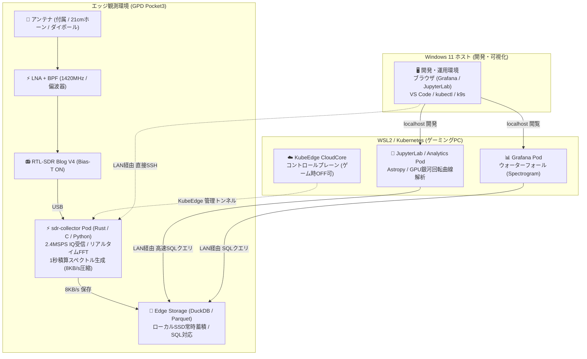

# 🛰️ 自宅KubeEdge電波天文学システム構成図

本ドキュメントでは、**GPD Pocket3** と **ゲーミングデスクトップ（WSL2 + Windows）** の2台を活用し、CNCF **KubeEdge** を中核に据えた「**エッジ完結・オフライン自律稼働型 電波観測基盤**」のシステム構成を定義します。  
*(※ 不明な用語やハードウェア構成要素は [00_glossary.md](00_glossary.md) を参照してください)*

---

## 1. 全体アーキテクチャ図（2台構成: エッジ常時稼働 + オンデマンド分析）



---

## 2. なぜ電波天文学に「KubeEdge」なのか？（SRE的メリット）

1. **ゲーミングPCの稼働状態（ゲーム中・電源OFF）からの完全な独立性**:
   - GPD Pocket3 上の `edgecore` は、クラウド（ゲーミングPC）との通信が途切れても、ローカルキャッシュ（MetaManager / SQLite）を使って **Podの稼働を自律的に継続** します。
   - ゲーミングPCでApexや重量級ゲームをプレイしていても、PCをシャットダウンしていても、**観測データは1秒も欠損することなくGPD Pocket3に記録され続けます**。
2. **クラウド復帰時の自動ステータス同期**:
   - ゲーミングPCを起動し、WSL2上の `cloudcore` がオンラインになると、自動的にエッジノードのヘルスチェックや設定（ConfigMap/Secret）が同期されます。
3. **エッジでの極小データフットプリント**:
   - 生[IQデータ](00_glossary.md#iq)（4.8 MB/s = 415 GB/日）をエッジ内で即座に[FFT](00_glossary.md#fft) & 1秒[積算](00_glossary.md#integration)し、**8 KB/s（約 20 MB/日）のスペクトルデータに圧縮**。
   - GPD Pocket3 の内蔵SSD（512GB〜1TB）だけで **数年分の観測データをローカル完結で蓄積** できます。

---

## 3. 各マシンの役割分担マトリクス

| マシン | スペック・設置場所 | 担当コンポーネント | 役割と動作ポリシー |
| :--- | :--- | :--- | :--- |
| **GPD Pocket3** | ・超小型 UMPC<br>・ベランダ / 窓際 / 屋外 | **KubeEdge: EdgeCore**<br>・`sdr-collector` Pod<br>・`edge-storage` Pod (DuckDB/Parquet) | **【24h 常時自律観測ノード】**<br>・[SDR](00_glossary.md#sdr)直結（[Bias-T](00_glossary.md#bias-t)で[LNA](00_glossary.md#lna)+[BPF](00_glossary.md#bpf)給電）で電波を受信し、エッジDSP（[積算](00_glossary.md#integration)）を実行。<br>・ゲーミングPCの電源状態に一切依存せず24時間稼働。 |
| **ゲーミングPC** | ・高火力 CPU/GPU/RAM<br>・Windows 11 + WSL2 | **KubeEdge: CloudCore & クライアント**<br>・`jupyterlab-astro` Pod (GPU活用)<br>・`grafana` Pod (可視化)<br>・VS Code, ブラウザ, `kubectl` | **【オンデマンド分析 & 開発・運用】**<br>・ゲームをしていない時間や休止時に起動。<br>・LAN越しにGPD Pocket3のデータを高速クエリして分析（[ウォーターフォール](00_glossary.md#waterfall)・[LSRドップラー補正](00_glossary.md#lsr)・[銀河回転曲線](00_glossary.md#rotation-curve)）。 |

---

## 4. データアクセスとクエリパターン

ゲーミングPCから、GPD Pocket3 に蓄積された観測データを分析する手法：

```text
[ GPD Pocket3 (Edge) ]                           [ ゲーミングPC (WSL2 / Windows) ]
Parquetファイル / DuckDB ─── (宅内LAN 2.5GbE / Wi-Fi 6) ───► DuckDB / Polars / Astropy (Jupyter)
                                                                 │
                                                                 ▼
                                                        ・21cm線 ドップラー解析
                                                        ・天の川銀河回転曲線プロット
                                                        ・流星電波反射エコーの集計
```

- **DuckDB over LAN / Parquet直接参照**:
  - GPD Pocket3 で日別に保存された Parquet ファイル（例: `data/spec_2026-08-15.parquet`）を、ゲーミングPCの JupyterLab から直接SQLでクエリし、[21cm線](00_glossary.md#21cm)の[ドップラー効果](00_glossary.md#doppler)や[銀河回転曲線](00_glossary.md#rotation-curve)を解析。
  - クエリ実行時のみネットワーク帯域を消費するため、極めて高速かつ省リソース。

---

## 5. 推奨 KubeEdge マニフェスト構成

```text
k8s/
├── cloud/                          # ゲーミングPC (WSL2) 側の構成
│   ├── cloudcore/                  # KubeEdge CloudCore デプロイ設定
│   ├── analytics/
│   │   ├── jupyterlab-deployment.yaml  # 天文解析用 JupyterLab (GPU対応)
│   │   └── grafana-deployment.yaml     # 観測ダッシュボード
│   └── ingress/                    # 各種WebUIへのルーティング
└── edge/                           # GPD Pocket3 (EdgeCore) 側の構成
    ├── sdr-collector-pod.yaml      # RTL-SDR v4 受信 & FFT積算デーモン
    └── edge-storage-pod.yaml       # DuckDB / Parquet ローカルストレージ
```
