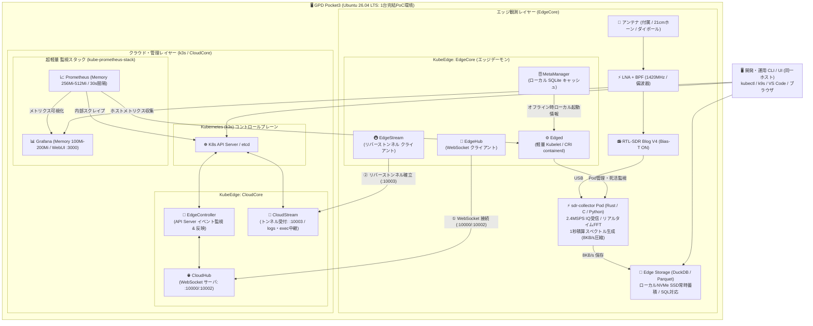

# 🛰️ 自宅KubeEdge電波天文学システム構成図

本ドキュメントでは、**GPD Pocket3（Ubuntu 26.04 LTS）** を活用し、CNCF **KubeEdge** を中核に据えた「**エッジ完結・自律稼働型 電波観測基盤**」のシステム構成を定義します。  
初期PoCフェーズでは、**GPD Pocket3 単一ホスト上に CloudCore（k3s）と EdgeCore を同居** させ、超軽量な **kube-prometheus-stack** による監視基盤を含めて1台で動作検証を行い、将来的に物理2台（別PCへのコントロールプレーン分離）へシームレスにスケールアウトできる設計を採用します。  
*(※ 不明な用語やハードウェア構成要素は [00_glossary.md](00_glossary.md) を、KubeEdge の内部通信コンポーネントの詳細は [docs/qa/13_kubeedge_architecture_and_edge_cloud_communication.md](qa/13_kubeedge_architecture_and_edge_cloud_communication.md) を参照してください)*

---

## 1. 全体アーキテクチャ図（GPD Pocket3 単一ホスト PoC 構成）


```mermaid
flowchart TB
    subgraph HostBox["🖥️ GPD Pocket3 (Ubuntu 26.04 LTS: 1台完結PoC環境)"]
        direction TB

        subgraph EdgeArea["エッジ観測レイヤー (EdgeCore)"]
            direction TB
            Antenna["📡 アンテナ (付属 / 21cmホーン / ダイポール)"]
            LNA["⚡ LNA + BPF (1420MHz / 偏波器)"]
            RTLSDR["📻 RTL-SDR Blog V4 (Bias-T ON)"]

            subgraph EdgeCoreBox["KubeEdge: EdgeCore (エッジデーモン)"]
                EdgeHub["🔌 EdgeHub<br/>(WebSocket クライアント)"]
                EdgeStream["🚇 EdgeStream<br/>(リバーストンネル クライアント)"]
                MetaManager["🗄️ MetaManager<br/>(ローカル SQLite キャッシュ)"]
                Edged["⚙️ Edged<br/>(軽量 Kubelet / CRI containerd)"]
            end

            SDR_Pod["⚡ sdr-collector Pod (Rust / C / Python)<br/>2.4MSPS IQ受信 / リアルタイムFFT<br/>1秒積算スペクトル生成 (8KB/s圧縮)"]
            EdgeDB["💾 Edge Storage (DuckDB / Parquet)<br/>ローカルNVMe SSD常時蓄積 / SQL対応"]

            Antenna --> LNA --> RTLSDR -->|USB| SDR_Pod
            SDR_Pod -->|"8KB/s 保存"| EdgeDB
            Edged -->|"Pod管理・死活監視"| SDR_Pod
            MetaManager -->|"オフライン時ローカル起動情報"| Edged
        end

        subgraph CloudArea["クラウド・管理レイヤー (k3s / CloudCore)"]
            direction TB
            
            subgraph K8sControl["Kubernetes (k3s) コントロールプレーン"]
                APIServer["☸️ K8s API Server / etcd"]
            end

            subgraph CloudCoreBox["KubeEdge: CloudCore"]
                EdgeController["🔄 EdgeController<br/>(API Server イベント監視 & 反映)"]
                CloudHub["🌐 CloudHub<br/>(WebSocket サーバ: :10000/:10002)"]
                CloudStream["🚪 CloudStream<br/>(トンネル受付: :10003 / logs・exec中継)"]
            end

            APIServer <--> EdgeController
            EdgeController <--> CloudHub
            APIServer <--> CloudStream

            subgraph MonitoringStack["超軽量 監視スタック (kube-prometheus-stack)"]
                Prometheus["📈 Prometheus (Memory 256Mi-512Mi / 30s間隔)"]
                Grafana["📊 Grafana (Memory 100Mi-200Mi / WebUI :3000)"]
            end

            Prometheus -->|"メトリクス可視化"| Grafana
            Prometheus -->|"内部スクレイプ"| APIServer
            Prometheus -->|"ホストメトリクス収集"| Edged
        end

        %% ホスト内相互通信
        EdgeHub -->|"① WebSocket 接続 (:10000/:10002)"| CloudHub
        EdgeStream -->|"② リバーストンネル確立 (:10003)"| CloudStream
    end

    DevCLI["🖥️ 開発・運用 CLI / UI (同一ホスト)<br/>kubectl / k9s / VS Code / ブラウザ"]
    DevCLI --> APIServer
    DevCLI --> Grafana
    DevCLI --> EdgeDB
```

---

## 2. なぜ電波天文学に「KubeEdge」なのか？（SRE的メリット）

1. **GPD Pocket3（1台完結）での安全な検証と自律性**:
   - GPD Pocket3 上の `edgecore` は、クラウドコンポーネント（k3s / CloudCore）がメンテナンスやリソース逼迫で停止しても、ローカルキャッシュ（`MetaManager` / SQLite）を使って **Podの稼働を自律的に継続** します。
   - 観測デーモン（SDR受信・積算）はコントロールプレーンの状態に引きずられず、**1秒も欠損することなくGPD Pocket3のSSDにデータを記録** し続けます。
2. **クラウド復帰時の自動ステータス同期**:
   - `cloudcore` が再起動すると、エッジ側の `EdgeHub` が自動再接続し、ノードのヘルスチェックや設定（ConfigMap/Secret）が即座に再同期されます。
3. **エッジでの極小データフットプリント**:
   - 生[IQデータ](00_glossary.md#iq)（4.8 MB/s = 415 GB/日）をエッジ内で即座に[FFT](00_glossary.md#fft) & 1秒[積算](00_glossary.md#integration)し、**8 KB/s（約 20 MB/日）のスペクトルデータに圧縮**。
   - GPD Pocket3 の内蔵SSDだけで **数年分の観測データをローカル完結で蓄積** できます。
4. **NAT超え・リバースアクセス（CloudStream / EdgeStream）**:
   - 将来別のPCへCloudCoreを切り離した場合でも、エッジ側ルーターのポートフォワーディングなしに `kubectl logs` や `kubectl exec` が透過的に利用可能です。

---

## 3. レイヤー別 役割分担マトリクス

| レイヤー | 実行場所 | 担当コンポーネント | 役割とリソースポリシー |
| :--- | :--- | :--- | :--- |
| **エッジ観測レイヤー** | GPD Pocket3 (Ubuntu 26.04) | **KubeEdge: EdgeCore**<br>・`EdgeHub`, `EdgeStream`<br>・`MetaManager` (SQLite)<br>・`Edged` (containerd)<br>・`sdr-collector` Pod<br>・DuckDB / Parquet | **【常時自律観測】**<br>・RTL-SDR v4 直結（Bias-TでLNA給電）。<br>・リアルタイムFFT・1秒積算を実行。<br>・k3sやPrometheusの負荷に関わらず優先度高く稼働。 |
| **クラウド管理レイヤー** | GPD Pocket3 (Ubuntu 26.04) | **KubeEdge: CloudCore & k3s**<br>・k3s API Server / etcd<br>・`CloudHub`, `CloudStream`, `EdgeController` | **【コントロールプレーン】**<br>・エッジノードのライフサイクルと構成管理。<br>・将来のマルチノード化にもそのまま対応。 |
| **監視・運用レイヤー** | GPD Pocket3 (Ubuntu 26.04) | **kube-prometheus-stack (超軽量)**<br>・Prometheus (Memory 256Mi〜512Mi)<br>・Grafana (Memory 100Mi〜200Mi)<br>・node-exporter | **【リソース・観測可視化】**<br>・スペック最低要件チューニングによりCPU/メモリ消費を極小化。<br>・観測SSD残量、SDR温度、DSP負荷をリアルタイムダッシュボード表示。 |

---

## 4. 推奨インフラ ディレクトリ構成

```text
infrastructure/
├── kubeedge/
│   ├── cloud/                          # k3s および CloudCore セットアップ手順・設定
│   │   ├── README.md
│   │   └── k3s-config.yaml
│   └── edge/                           # EdgeCore セットアップ手順・設定
│       ├── README.md
│       └── edgecore.yaml
└── monitoring/
    └── kube-prometheus-stack/          # 超軽量モニタリング設定
        ├── README.md                   # Helm インストールガイド
        └── values-minimal.yaml         # スペック最低要件用 values 定義
```
