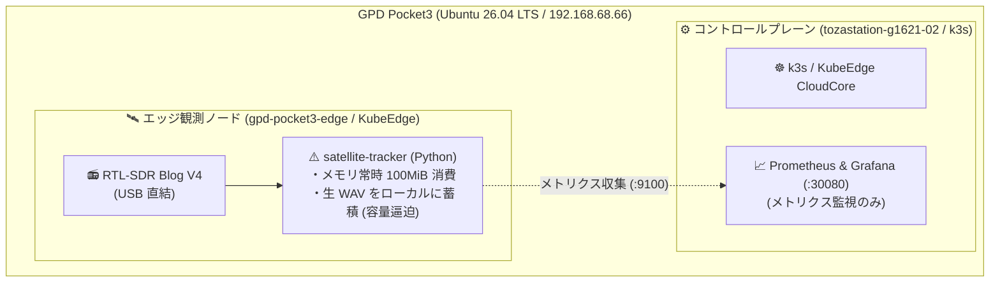
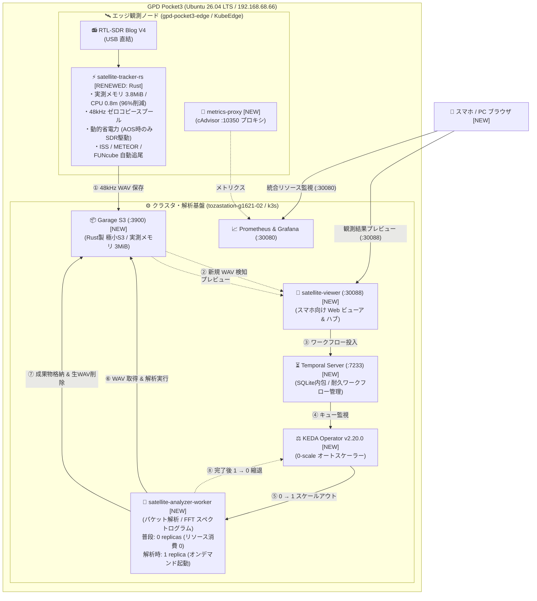

# 【ベランダ電波観測所 #3】KubeEdgeを活かした衛星電波解析パイプラインの構築 〜Rust 3.8MiBエッジとTemporal×KEDAによる0-scale自律解析〜

## はじめに

こんにちは、戸澤（@tozastation）です！  
宇宙や無線が大好きで、自宅のベランダから個人で電波天文学や人工衛星の観測を行う **「ベランダ電波観測所」** プロジェクトを進めています。

本プロジェクトは、AIアシスタントの Antigravity に無線工学、DSP（デジタル信号処理）、分散システムや SRE の設計思想を相談しながら二人三脚で開発しています。いつも大変お世話になっております🙇‍♂️

ソースコードや Kubernetes マニフェストはすべて GitHub にオープンソースとして公開しています：  
👉 [tozastation/radio-astronomy (GitHub)](https://github.com/tozastation/radio-astronomy)

---

## 前回の振り返りと今回の課題

これまでの歩み：
- **第1弾**: [【ベランダ電波観測所 #1】RTL-SDR Blog V4 と WSL2 で電波を受信してみる](https://qiita.com/tozastation/items/b7e411ba034ddf46be22)
- **第2弾**: [【ベランダ電波観測所 #2】KubeEdge×SDRで始める衛星電波観測と単一ノード運用の記録](https://github.com/tozastation/radio-astronomy/blob/main/docs/articles/qiita_kubeedge_satellite_tracker.md)

第2弾では、手のひらサイズの UMPC（GPD Pocket3: Ubuntu 26.04 LTS）上で **k3s（CloudCore）と KubeEdge（EdgeCore）を 1台に同居** させ、頭上を通過する人工衛星（ISS や CubeSat 等）の電波を SGP4 軌道予測で自動追尾し、Prometheus と Grafana で可視化するエッジ観測の足場を固めました。

しかし、実際にベランダで連続稼働させていく中で、**SRE 的に無視できない「リソースの壁」** に直面しました。

### 直面した 3 つの課題
1. **Python 製エッジ観測コンテナのフットプリント**:
   - SGP4 軌道計算、RTL-SDR 受信（2.4MSPS）、FFT ドップラー追尾を Python で行うと常時約 100MiB を消費。GC（ガベージコレクション）によるレイテンシスパイクやバッファ詰まりのリスクが常に伴います。
   - 屋外設置やバッテリー運用、Raspberry Pi 等の小型 Edge デバイス運用を見据えると、**消費電力や発熱は低ければ低いほど持続性の面で有利** です。
2. **生音声ファイル（WAV）によるディスク逼迫**:
   - 衛星通過（パス）ごとに広帯域を生録音すると、数分で数十〜数百 MB に達し、エッジのローカル SSD を圧迫します。
3. **エッジで「観測」と「重い信号解析」を同居させる限界**:
   - 受信音声からのパケットデコードやスペクトログラム画像生成は、CPU とメモリ（150〜200MiB）を瞬間的に激しく消費します。観測と解析を同じ場所で常駐させると、肝心の受信処理のドロップを招きます。

### 理想のアーキテクチャ像
そこで、単一端末の中で無理にやりくりするのではなく、**「Cloud / Edge 本来の用途に立ち返った、以下のアプローチが理想的ではないか」** と考えました：

- **エッジはデータ収集に専念させる**: アンテナ直下で最小限のリソースと電力（Rust 3.8MiB、動的省電力）で観測に徹する。
- **将来の物理分離を見据えたオフロード設計にする**: たとえ現在は 1台の UMPC 同居検証（PoC）であっても、将来物理マシンを分離した際に設定変更だけで成立する疎結合な構成にしておく。
- **必要な時だけ動かす（0-scale）**: 衛星が飛んできた時だけ解析ワーカーを起動し、完了したらリソース消費ゼロに戻す。

この理想をもとに、KubeEdge の特性を活かした **「エッジ極小化 ＆ クラウド側への完全オフロードを前提とした、イベント駆動型 0-scale 解析パイプライン」** へ全面刷新しました！

---

## システム構成の進化（#2 からの差分）

### 1. アーキテクチャの比較（Before vs After）

#### 【Before: #2 の状態】単一観測コンテナ ＆ メトリクス監視のみ
エッジで Python 製観測コンテナが常駐し、生 WAV をローカルに溜め込むだけでした。解析基盤はなく、メトリクス監視のみです。



#### 【After: #3 の状態】エッジ極小化 ＆ イベント駆動型 0-scale 解析パイプライン
エッジを Rust で極限まで絞り込み、クラスタ側へ極小 S3（Garage）、ワークフロー（Temporal）、0-scale オートスケーラー（KEDA）を配備。**観測から解析・可視化・クリーンアップまで完全自律で完走するパイプライン** を構築しました。



---

### 2. スペック進化一覧表 ＆ コンポーネント設計思想

| コンポーネント | Before (#2) | After (#3) | 設計思想と SRE 的メリット |
| :--- | :--- | :--- | :--- |
| **エッジ観測** | Python (約 100MiB) | **Rust (`satellite-tracker-rs`)** | **実測メモリ 3.8MiB（96%削減）**。GC 停止によるバッファドロップを撲滅 |
| **省電力制御** | 常時チューナー稼働 | **動的省電力 (Dynamic Power Mgmt)** | 衛星通過直前（AOS）のみ SDR 起動。待機時の発熱・消費電力を最小化 |
| **WAV スプール** | 2.4MSPS (数十〜数百MB) | **48kHz ゼロコピー狭帯域スプール** | 音声帯域に絞り、**ファイルサイズを数十分の一（数百KB〜数MB）に圧縮** |
| **ストレージ** | ローカル SSD 生蓄積 | **Garage S3 (:3900)** | **実測メモリ 3MiB** の超軽量分散 S3（MinIO は 200MiB 必要）。生データ自動削除 |
| **ワークフロー** | なし | **Temporal Server (:7233)** | 取得 $\to$ 解析 $\to$ 保存 $\to$ 削除 をコードとして**耐久実行 (Durable Execution)** |
| **解析ワーカー** | なし | **KEDA による「0-scale」** | **待機時 0 レプリカ（リソース 0）**。S3 到着時のみ 1 に起動し、完了後 0 に縮退 |
| **Web ビューア** | なし (CLIログ) | **`satellite-viewer` (:30088)** | スマホ最適化 UI ＆ KEDA 用メトリクス API（`/api/pending-tasks`）のハブ |
| **リソース監視** | プロセス内部値のみ | **KubeEdge cAdvisor 連携** | **ホスト全体 (6.8GB / 0.4コア) と Pod毎 (Rust: 3.8MB)** の二層監視 |

#### 💡 設計の要点：S3 境界による完全オフロード
現在は GPD Pocket3 単一マシン上で動かしていますが、**Garage S3 へのアップロード完了を唯一の境界線** としています。  
エッジ側は単純な HTTP PUT だけで完結するため、Temporal や重い解析ライブラリを一切持ちません。これにより、将来室内 PC（GPU マシン）を追加した際も、クラスタ側の Pod 群を別ノードへ移すだけで、**エッジ観測コードを 1行も変えずに完全オフロードされた真の分散エッジ基盤へ昇華** できます。

---

## 自律パイプラインの実証（E2E ＆ 本物衛星パス通過）

### 1. E2E 結合検証（0 $\to$ 1 $\to$ 0 の完全自動ライフサイクル）
擬似音声ファイルを S3 に投入し、パイプラインの自律動作を検証しました。

```text
$ python3 scripts/trigger_cluster_e2e.py
🚀 [E2E] S3 音声アップロード完了: s3://satellite-recordings/raw/ISS/test_pass.wav
⏳ [E2E] Temporal ワークフロー開始: AnalyzeSatellitePassWorkflow
⚖️ [E2E] KEDA ワーカー起動検知: replicas = 0 → 1
🔬 [E2E] 解析実行中 (パケット解析 & スペクトログラム生成)...
📦 [E2E] 成果物格納完了 (spectrogram.png / summary.json)
🧹 [E2E] 元生 WAV の自動クリーンアップ完了
⚖️ [E2E] KEDA ワーカー縮退確認: replicas = 1 → 0 (リソース消費ゼロ復帰)
✅ [E2E] すべてのパイプラインが完全自律で完走しました！
```

---

### 2. 本物の人工衛星（ISS）通過時の自律観測ログ
実際にベランダ上空を通過した **ISS (ZARYA)**（145.825 MHz APRS、最大仰角 43.4°）の電波を捉えた際の実機ログです。人間が一切介入せずに全自動で完走しました。

```text
# 1. AOS 突入（14:26:10 JST）: SGP4予測に基づきSDRが動的スタンバイから自動起動
2026-10-10 14:26:10 [INFO] AOS entered: ISS (ZARYA) (El: 10.2°, Az: 73.5°, Freq: 145.825 MHz)
2026-10-10 14:26:10 [INFO] SDR warmup completed. 48kHz WAV streaming spool started.

# 2. LOS 完了（14:29:03 JST）: 録音クローズと Garage S3 への自動アップロード
2026-10-10 14:29:03 [INFO] LOS completed: ISS (ZARYA) (Max El: 43.4°)
2026-10-10 14:29:05 [INFO] S3Uploader: Successfully uploaded: raw/ISS (ZARYA)/...wav (152KB)

# 3. 自動ディスパッチ & Temporal ワークフロー発火
🚀 [Dispatcher] Found new raw recording. Starting Temporal workflow for ISS...

# 4. KEDA ワーカー自動起動 (0 → 1) & 解析実行
2026-10-10 14:29:12 [INFO] satellite-analyzer-worker: Temporal Worker started.
2026-10-10 14:29:14 [INFO] Running packet analysis & Generating Spectrogram (Matplotlib)...
2026-10-10 14:29:16 [INFO] Uploading artifact spectrogram.png (931KB) to S3...
2026-10-10 14:29:18 [INFO] Cleaning up raw WAV from S3 (容量自動維持)...
2026-10-10 14:29:19 [INFO] Successfully completed AnalyzeSatellitePassWorkflow!

# 5. KEDA による完全自動縮退 (1 → 0)
satellite-analyzer-worker-7f7c765f7f-fbcvt   1/1     Terminating   0   42s
```

#### 📊 生成された実測スペクトログラム成果物
ベランダのモービルホイップアンテナと RTL-SDR v4 が受信し、パイプラインが全自動で生成した ISS 通過時のパワースペクトログラムです。


生録音（約 150KB）は解析完了と同時に Garage S3 およびエッジから自動消去され、成果物（スペクトログラム PNG: 約 932KB、サマリ JSON）のみが永続化されました。

---

## スマホからの観測結果プレビュー ＆ 統合監視

### 1. スマホ向け Web ビューア（`satellite-viewer`: NodePort 30088）
同一 Wi-Fi のスマホブラウザからアクセスできる軽量ダッシュボード（メモリ 40MiB）です。

- **ワンタップ絞り込み**: 「すべて」「🚀 ISS」「🛰️ METEOR」「📻 FUNcube」のカテゴリチップ。
- **データ検出トグル**: 「📡 パケット/データ検出ありのみ」にワンタッチで抽出。
- **インラインプレビュー ＆ タップ拡大**: スペクトログラム画像をその場で全画面拡大表示。
- **JSON アコーディオン**: `summary.json` や `packets.json` をブラウザ上で展開・閲覧。

### 2. Grafana によるエッジ全体 ＆ Pod別リソース監視（NodePort 30080）
- **エッジノード全体**: CPU 約 0.43 cores（約 10%） / メモリ 約 6.8 GiB / 16GB
- **Pod別（Rust観測Pod）**: **CPU 0.8m（約 0.08%） / メモリ 3.8 MiB**

---

## SRE 視点での泥臭いトラブルシューティング集

開発・運用中に遭遇した、現場ならではのリアルなトラブルの解決記録です。

### 厳選！ハイライトトラブル 3 選

#### 1. KubeEdge cAdvisor（:10350）と CloudCore のポート競合
- **事象**: Prometheus からエッジノードの cAdvisor メトリクスを取得しようとすると `Connection Refused` や TLS エラーが発生する。
- **原因**: KubeEdge の `edged` はループバック（`127.0.0.1:10350`）のみでリッスンしており、ホスト外から遮断されていた。さらに隣接ポート `10351` は CloudCore が HTTPS で握っていた。
- **解決策**: `hostNetwork: true` を持つ極小 Python プロキシ DaemonSet（`kubeedge-metrics-proxy`）を空きポート（`19095`）で動かし、cAdvisor を平文 HTTP でクラスタ内に露出して解決。

#### 2. Temporal SDK Core（Rust）のメモリ特性と OOMKilled（Exit Code 137）の壁
- **事象**: Web ビューア内にディスパッチャーを組み込んだ直後、`Exit Code: 137`（OOMKilled）で不定期にクラッシュする。
- **原因**: 当初 `limits.memory: 64Mi` を割り当てていたが、Python 版 Temporal SDK は内部で Rust 製コア（`temporal-sdk-core`）を内包しており、gRPC 接続・スレッドプール初期化時に一時的にヒープを急激に消費してリミットを超過していた。
- **解決策**: メモリプロファイリングに基づき、リミットを `64Mi` $\to$ **`160Mi`**（Requests: `48Mi`）へ緩和。平常時は約 59MiB で安定稼働。

#### 3. Temporal Dev モードのメトリクス欠落と KEDA `metrics-api` scaler
- **事象**: S3 へ音声が届いても、KEDA のワーカーが自動で立ち上がらず `0` レプリカのままスタックする。
- **原因**: KEDA ScaledObject が Prometheus 経由で Temporal のキュー長メトリクスを監視していたが、軽量な Temporal 開発サーバー（Dev モード）がメトリクスを出力していなかった。
- **解決策**: 常駐 Web ビューアに未処理ファイル数を返す極小エンドポイント `/api/pending-tasks` を追加。KEDA 公式の **`metrics-api` scaler** で直接ポーリング監視させ、S3 ファイル到着をトリガーとする確実な自律スケーリングを確立。

---

<details>
<summary><b>🛠️ その他の泥臭いTips 4選（クリックで展開）</b></summary>

#### 4. IPv6 未導通ネットワークにおける Happy Eyeballs 遅延
- **事象**: `ghcr.io` からのイメージ Pull や外部 API 通信が数分間フリーズする。
- **原因**: 宅内ネットワークで IPv6 外部ルーティングが通っていないのに、OS が IPv6 タイムアウト待ち $\to$ IPv4 フォールバックを起こしていた。
- **解決策**: `/etc/gai.conf` で `precedence ::ffff:0:0/96 100` を有効化し、IPv4 優先接続を強制。

#### 5. Docker Hub レート制限回避とローカルレジストリ徹底
- **事象**: ローリングアップデート時に Docker Hub のレート制限（Too Many Requests）に引っかかる。
- **解決策**: クラスタ内にローカルレジストリ（`localhost:5000` / NodePort `30500`）を構築し、固定バージョンをミラーリングして完全宣言的に管理。

#### 6. KubeEdge エッジノードにおける内部 DNS 未解決と NodePort ルーティング
- **事象**: エッジノードの観測 Pod からクラスタ内 S3 エンドポイント（`garage-s3...svc.cluster.local`）へのアクセスが失敗する。
- **原因**: KubeEdge のエッジコンテナはクラスタの CoreDNS ではなくホスト OS の `/etc/resolv.conf` を参照するため、内部ドメインが引けない。
- **解決策**: エッジ Pod に渡す S3 エンドポイントをホスト物理 IP の NodePort（`http://192.168.68.66:30900`）に明示指定。

#### 7. コンテナ Ephemeral ストレージの教訓と hostPath 永続スプール
- **事象**: Pod を再作成した際に、未アップロードの生録音（コンテナ内 `/tmp`）が消失するリスクに直面。
- **解決策**: ホスト物理ディレクトリ `/tmp/satellite-recordings` を `hostPath` バインドマウントし、自己治癒スプール同期（`sync_pending_spool`）を実装してデータ保全を徹底。

</details>

---

## まとめと今後の展望

今回、KubeEdge の特性を活かして **「エッジ極小観測（Rust 3.8MiB）」** と **「イベント駆動型ゼロスケール解析（Garage + Temporal + KEDA）」** を組み合わせることで、手のひらサイズの UMPC 1台でもリソースを枯渇させずに、24時間365日自律稼働する衛星電波観測パイプラインを構築することができました。

初期PoCとして 1台に同居させてはいるものの、**Cloud / Edge 本来の用途に立ち返り、境界線を S3 疎結合イベント駆動として徹底的にオフロード前提で設計** しました。エッジ側はアンテナ直下で絶対に落ちずに省電力で観測に専念し、クラスタ側は衛星が通過したときだけオンデマンドで解析ワーカーを立ち上げて成果物を生成し、終わったらメモリを即座に返却する――。SRE として求めていた理想の分散アーキテクチャがベランダで実現しました。

このオフロード構成を確立できたことで、次のステップである「物理マシンの分離（ベランダ Edge PC ＋ 室内 GPU 解析クラスタ）」への移行も、エッジ側のコードや観測ロジックを何一つ変えることなくシームレスに行うことができます。

### 次回予告：第4弾【衛星デコード＆宇宙データ可視化編】
次回はいよいよ、今回完成した自律基盤の上で各種衛星の電波を本格的にデコード・可視化していく挑戦をお届けします！
- **ISS (ZARYA)**: 地球上のアマチュア無線局と交わされる APRS パケットの復調・パケットデコード
- **METEOR-M2 4**: ロシアの極軌道気象衛星から送られてくる高解像度 LRPT 地球雲画像のリアルタイム復調
- **FUNCUBE-1 (AO-73)**: 宇宙空間の環境を伝える BPSK テレメトリのデコードとダッシュボード可視化
- **物理2台分離**: ベランダの GPD Pocket3（エッジ）と室内の GPU 分析専用 PC（クラスタ）の完全物理分離

最後までお読みいただきありがとうございました！  
質問やフィードバックなどありましたら、コメントや GitHub の Issue / PR などでお気軽にいただけると嬉しいです！
