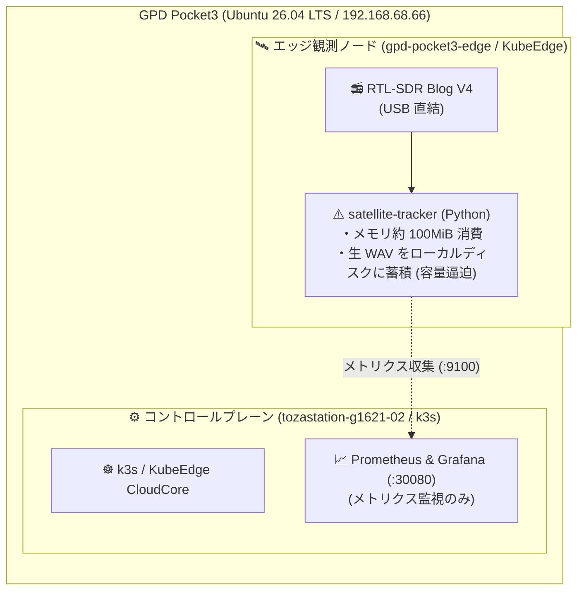
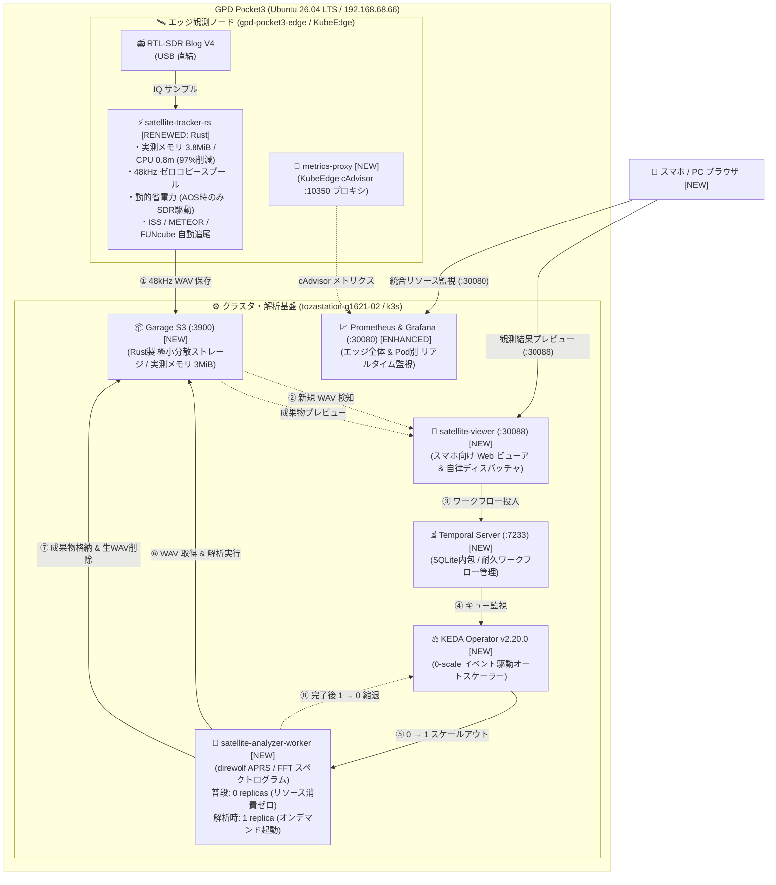
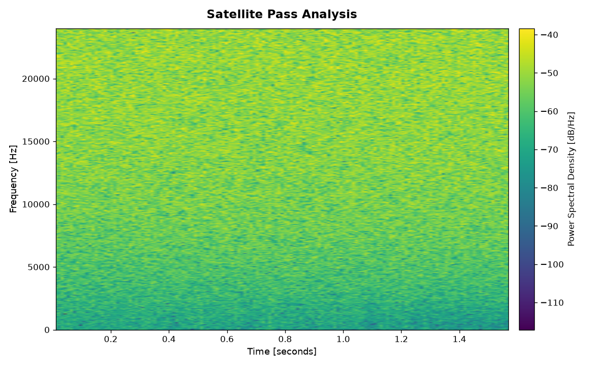

# 【ベランダ電波観測所 #3】KubeEdgeを活かした衛星電波解析パイプラインの構築 〜Rust 3.8MiBエッジとTemporal×KEDAによる0-scale自律解析〜

## はじめに

こんにちは、戸澤（@tozastation）です！  
宇宙や無線が大好きで、自宅のベランダから個人で電波天文学や人工衛星の観測を行う **「ベランダ電波観測所」** プロジェクトを進めています。

本プロジェクトは、AIアシスタントの Antigravity に無線工学、DSP（デジタル信号処理）、分散システムや SRE の設計思想を相談しながら二人三脚で開発しています。いつも大変お世話になっております🙇‍♂️

ソースコード、Kubernetes / Helmfile マニフェスト、詳細な数式・工学ドキュメントはすべて GitHub にオープンソースとして公開しています：  
👉 [tozastation/radio-astronomy (GitHub)](https://github.com/tozastation/radio-astronomy)

---

## 前回の振り返りと今回の課題

これまでの歩み：
- **第1弾**: [【ベランダ電波観測所 #1】RTL-SDR Blog V4 と WSL2 で電波を受信してみる 〜公式ドライバビルドの罠からSSHストリーミングまで〜](https://qiita.com/tozastation/items/b7e411ba034ddf46be22)
- **第2弾**: [【ベランダ電波観測所 #2】KubeEdge×SDRで始める衛星電波観測と単一ノード運用の記録](https://github.com/tozastation/radio-astronomy/blob/main/docs/articles/qiita_kubeedge_satellite_tracker.md)

第2弾では、手のひらサイズの UMPC（GPD Pocket3: Ubuntu 26.04 LTS）上で **k3s（CloudCore）と KubeEdge（EdgeCore）を 1台に同居** させ、頭上を通過する人工衛星（ISS や CubeSat 等）の電波を SGP4 軌道予測で自動追尾し、Prometheus と Grafana で可視化するエッジ観測の足場を固めました。

しかし、実際にベランダで連続稼働させていく中で、**SRE 的に無視できない「リソースの壁」** に直面しました。

### 直面した 3 つの課題
1. **Python 製エッジ観測コンテナのフットプリント**:
   - SGP4 軌道計算、RTL-SDR からの 2.4MSPS 受信、FFT ドップラー追尾、Prometheus メトリクス配信を Python で行うと、常時約 100MiB のメモリを消費していました。1台で運用する UMPC の限られたリソースでは、GC（ガベージコレクション）によるレイテンシスパイクやバッファ詰まりのリスクが常に付きまといます。
   - また、将来的な屋外アンテナ直下への設置やバッテリー/ソーラー駆動、Raspberry Pi などの小型 Edge デバイス運用を想定すると、**消費電力や発熱は低ければ低いほど信頼性と持続性の面で大きなメリット** があります。常時稼働プロセスが高負荷・大メモリを食うことは、電力効率や熱暴走リスクの観点からも避けたい課題でした。
2. **生音声ファイル（WAV）によるディスク逼迫**:
   - 衛星通過（パス）ごとに帯域をまるごと生録音すると、数分間で数十〜数百 MB のファイルが溜まります。ディスク容量の限られたエッジ端末では、放っておくと数日でストレージが枯渇してしまいます。
3. **エッジで「観測」と「重い信号解析」を同居させる限界**:
   - 受信した音声からパケットをデコードしたり、Matplotlib / SciPy で高解像度スペクトログラムをプロットする処理は、CPU もメモリ（150〜200MiB）も瞬間的に激しく消費します。
   - これをエッジで常駐させると、肝心の衛星電波受信処理の邪魔をしてしまい、最悪の場合パケットドロップやプロセス停止を招きます。

> **「同居させているとはいえ、Cloud / Edge 本来の用途に立ち返るなら、エッジはデータ収集に専念させ、重い処理やストレージはクラウド側へオフロードできる構成こそが正解ではないか？」**  
> **「たとえ現在は UMPC 1台での同居検証（PoC）であっても、将来物理マシンを分離した時にそのまま成立する完全オフロード前提のアーキテクチャにすべきだ」**  
> **「しかも衛星が飛んできた時だけ起動して、終わったらメモリ消費ゼロに戻せないか？」**

そこで今回、KubeEdge の特性を最大限に活かし、**「エッジ極小化 ＆ クラウド側への完全オフロードを前提とした、イベント駆動型 0-scale 解析パイプライン」** へ全面刷新しました！

---

## システム構成の進化（#2 からの差分）

第2弾（#2）では「エッジで動かす単一観測コンテナからメトリクスを吸い上げて監視する」という基盤の立ち上げを行いました。  
今回はそこに **「イベント駆動型の自律解析パイプライン」** を追加し、エッジ観測 Pod も **Rust 化によって極限まで軽量化** しました。

まずは、#2（Before）と #3（After）のアーキテクチャを比較します。

### 1. #2（Before）と #3（After）のアーキテクチャ比較

#### 【Before: #2 の状態】単一観測コンテナ ＆ メトリクス監視のみ
#2 の時点では、エッジで Python 製の観測コンテナが常駐し、生 WAV 音声はローカルディスクに溜め込むだけでした。解析処理は存在せず、クラウド側は Prometheus / Grafana によるメトリクス監視のみでした。



#### 【After: #3 の状態】エッジ極小化 ＆ イベント駆動型 0-scale 解析パイプライン
#3 では、エッジを Rust で徹底的に絞り込み、クラスタ側に極小 S3 ストレージ（Garage）、ワークフロー（Temporal）、0-scale オートスケーラー（KEDA）を配備して、**観測から解析・可視化・クリーンアップまでが完全自律で完走するパイプライン** を構築しました。



---

### 2. コンポーネント別・スペック別の進化一覧表

| 比較項目 | #2 (前回) | #3 (今回) | 進化と SRE 的メリット |
| :--- | :--- | :--- | :--- |
| **エッジ観測実装** | Python 3.11 (`satellite-tracker`) | **Rust (`satellite-tracker-rs`)** | **メモリ 100MiB $\to$ 3.8MiB（96%以上削減）**。GC 停止がなくなりバッファドロップを撲滅 |
| **SDR ハード駆動** | 常時チューナー受信稼働 | **動的省電力 (Dynamic Power Mgmt)** | 衛星が地平線上に現れる AOS 直前のみ起動。発熱・消費電力を最小化 |
| **WAV 音声保存** | 2.4MSPS 広帯域を直接録音 (数十〜数百MB) | **48kHz ゼロコピー狭帯域スプール** | 音声通信に必要な帯域に絞り、**ファイルサイズを数十分の一（数百KB〜数MB）に圧縮** |
| **ストレージ** | エッジのローカル SSD に生蓄積 | **Garage S3 (:3900) (分散ストレージ)** | **実測メモリ 3MiB** の超軽量 S3。成果物保存後に生 WAV を自動削除し容量維持 |
| **ワークフロー** | なし (録音しっぱなし) | **Temporal Server (:7233)** | 取得 $\to$ 解析 $\to$ 保存 $\to$ 削除 をコードとして**耐久実行 (Durable Execution)** |
| **信号解析処理** | なし (手動または未実装) | **`satellite-analyzer-worker`** | direwolf によるパケット解析 ＆ 高解像度スペクトログラム画像を自動生成 |
| **オートスケール** | なし (静的 Pod 配置) | **KEDA v2.20.0 による「0-scale」** | **待機時は 0 レプリカ（リソース消費ゼロ）**。データ到着時のみ 1 に起動し、完了後 0 に自動縮退 |
| **結果の確認方法** | ターミナルでログ確認 | **スマホ向け Web ビューア (:30088)** | 同一 Wi-Fi のスマホからブラウザを開くだけで、画像拡大や JSON プレビューが可能 |
| **リソース監視** | Python プロセス内部値のみ | **KubeEdge cAdvisor (:10350)連携** | **ホスト全体 (6.8GB / 0.4コア) と Pod毎 (Rust: 3.8MB)** の二層監視を実現 |

---

## アーキテクチャの設計意図（なぜこの構成にしたのか）

本システムの各コンポーネントを選定・設計した意図を、SRE の視点から解説します。

### 1. エッジ観測を Rust で「メモリ 3.8MiB」に極限まで絞り込んだ理由
エッジ観測コンテナ（`satellite-tracker-rs`）は、**「アンテナ直下で絶対に落ちず、最小のフットプリントで動き続けること」** だけを唯一の責務としました。  
*(※ SGP4 軌道予測やドップラー追尾の基礎理論、KubeEdge の基本アーキテクチャは [第2弾の記事](https://github.com/tozastation/radio-astronomy/blob/main/docs/articles/qiita_kubeedge_satellite_tracker.md) で詳しく解説していますので、本記事では #3 の進化差分に集中します)*

- **ゼロコピー DSP ＆ 狭帯域 48kHz スプール**:
  - RTL-SDR から 2.4MSPS（毎秒 240万サンプル）で流れてくる大容量 IQ 信号をエッジ内部で高速デシメーションし、音声・通信帯域に必要な 48kHz 帯域だけに絞り込んで WAV 保存。これによりファイルサイズを従来の数十分の一（数百KB〜数MB程度）に激減させました。
- **動的省電力（Dynamic Power Management）とエッジでの低消費電力**:
  - 屋外アンテナ直下に常設する Edge デバイスを想定すると、**消費電力が低く発熱が少ないことはシステムの寿命と安定稼働に直結する決定的なメリット** です。
  - RTL-SDR チューナーは受信中に約 200〜300mA（5Vで 1〜1.5W）を消費し、ドングル自体もかなり発熱します。本システムでは、衛星が地平線下にいる待機時間は RTL-SDR チューナーを完全にスリープさせ、SGP4 予測で衛星が視野内に入る直前（AOS: Acquisition of Signal）にのみハードウェアを起動します。
  - CPU 負荷も常時 0.08%（0.8m）に抑えられるため、ファンレス Edge デバイスや将来的なバッテリー/ソーラー運用にも余裕で耐えうる省電力性を獲得しました。
- **マルチ衛星追尾ターゲット**:
  - 国際宇宙ステーション **ISS (ZARYA)**（145.825 MHz APRS）
  - 気象衛星 **METEOR-M2 4**（137.900 MHz LRPT）
  - アマチュア衛星 **FUNCUBE-1 (AO-73)**（145.935 MHz BPSK テレメトリ）  
  これら VHF 帯（137〜146 MHz）でアクティブに運用されている代表的な衛星群をターゲットに設定し、単一アンテナ・単一 SDR で効率よく多頻度観測を狙える設計としました。
- **実測リソース**:
  - **メモリ: 約 3.8 MiB / CPU: 0.8m（約 0.08%）** を達成！Python 版（約 100MiB）と比較してメモリフットプリントを **96% 以上削減** しました。Rust のゼロコスト抽象化により、GC 停止によるバッファドロップも完全に撲滅しています。

### 2. なぜ MinIO ではなく「Garage S3」なのか？
Kubernetes 環境のオブジェクトストレージといえば MinIO が有名ですが、MinIO は初期化だけで 150〜250MiB 以上のメモリを消費し、UMPC 環境にはオーバースペックです。
- フランスの研究機関発祥の [Garage S3](https://garagehq.opera.software/)（[dxflrs/garage GitHub](https://github.com/dxflrs/garage)）は、エッジや地理的分散を前提に設計された Rust 製の超軽量オブジェクトストレージです。
- メタデータ管理に SQLite を内包し、**実測メモリ消費量はわずか 3 MiB**。
- それでいて完全な S3 互換 API を提供するため、標準の AWS CLI や boto3、Go SDK から何一つ変更なく透過的に利用できます。

### 3. なぜ KEDA による「0-scale」なのか？
人工衛星が地上局の上空を通過する時間は、**1回あたりわずか 5〜10分、1日に数回** だけです。つまり、**1日のうち 95% 以上の時間は待機時間** です。
- 解析ワーカー（Python + direwolf + SciPy + Matplotlib）を 24時間常駐させるのは、UMPC の貴重なリソースの完全な無駄遣いです。
- [KEDA (Kubernetes Event-driven Autoscaling)](https://keda.sh/)（[GitHub](https://github.com/kedacore/keda)）を導入し、普段は **`replicas: 0`（リソース消費ゼロ）** で待機させます。
- 観測完了後に S3 へ音声がアップロードされると、KEDA の **`metrics-api` scaler** が常駐ビューア（`satellite-viewer`）の `/api/pending-tasks` を直接ポーリング監視し、未処理の生録音（`pending_count > 0`）を検知して **`0 → 1` に完全自動スケールアウト**。解析（パケットデコード ＆ スペクトログラム生成）が終わり、生 WAV を自動削除したら、再び **`1 → 0` に自動縮退** します。

### 4. なぜ単なるスクリプト実行ではなく「Temporal」なのか？
「S3 アップロードを検知してコンテナを動かすだけなら、シェルスクリプトや Cron、Webhook で十分では？」と思うかもしれません。しかし SRE 的には以下の問題があります：
- 解析中に UMPC が再起動したり、コンテナが OOMKilled された場合、タスクが途中で消滅して未解析の音声が放置される。
- 音声ダウンロード $\to$ パケット解析 $\to$ スペクトログラム生成 $\to$ 結果保存 $\to$ 元音声削除、という一連のステップのどこで失敗したのかを追跡・自動リトライしたい。
- [Temporal](https://temporal.io/)（[GitHub](https://github.com/temporalio/temporal)）を用いることで、ワークフローの各ステップがコードとして耐久実行（Durable Execution）され、障害耐性と履歴追跡が完璧に担保されます。

### 5. エッジとクラウドを直接繋がない「S3 境界の疎結合イベント駆動」〜1台同居PoCから真のオフロード構成へ〜
現在は GPD Pocket3 単一マシン上に CloudCore と EdgeCore を同居させていますが、**Cloud / Edge アーキテクチャの本来の目的は「現場（エッジ）のリソース制約を最小化し、重い責務をクラウド側へオフロードすること」** です。

もしエッジコンテナ内で直接解析を行ったり、Temporal の重いクライアントを組み込んでしまっては、1台で動かす現状でもエッジを圧迫しますし、将来エッジとクラウドを物理分離したときにアーキテクチャが破綻してしまいます。

そこで、あえて **Garage S3 へのアップロード完了をエッジとクラウドの唯一の境界線** としました。
- **エッジの自律性と極限の軽量性**:
  - Temporal クライアント（gRPC、Protobuf、TLS、接続管理スレッド）や解析ライブラリをエッジから完全に排除。S3 への単純な HTTP PUT だけで完結させることで、エッジのメモリ 3.8MiB、CPU 0.08% を死守しています。
- **物理マシン分離へのシームレスな拡張性（真のオフロード）**:
  - エッジ側（アンテナ直下）は音声を S3 に PUT するだけ。クラウド側（Garage S3, Temporal, KEDA, Worker, Viewer）はそれを受信して勝手に自律処理するだけ。
  - そのため、将来室内PCやクラウドアカウントを追加した際も、クラスタ側の Pod 群（CloudCore、ストレージ、ワークフロー、ワーカー）をごっそり別ノードへ移すだけで、**エッジ側の観測コードや設定を何一つ変更することなく、完全にオフロードされた真の分散エッジ基盤へ昇華** できます。
- **ネットワーク断・遅延への耐性**:
  - 万が一クラスタ側や宅内 LAN がメンテナンス中や再起動中であっても、エッジはローカルスプール（hostPath）に音声を淡々と蓄積し、復帰次第 S3 へ送信します。エッジとクラウドが疎結合だからこそ、高い障害耐性を誇ります。

### 6. 自作 Web ビューア（satellite-viewer）を「ハブ」に据えた設計
表示用の Web UI（`satellite-viewer`）は、単なるビューアにとどまらず、**自律パイプラインのハブ** として設計しました。
- **Temporal 自動ディスパッチャの同居**:
  - バックグラウンドで定期的に Garage S3 をスキャンし、未処理の raw 音声を見つけると Temporal ワークフローを自動発火。
- **KEDA 用の軽量メトリクス API 提供**:
  - `/api/pending-tasks` エンドポイントで現在の未処理ファイル数を即座に返し、KEDA のスケーリング判断を支援。
- **スマホ最適化 UI**:
  - 衛星カテゴリ別チップ（すべて / 🚀 ISS / 🛰️ METEOR / 📻 FUNcube）によるワンタップ抽出。
  - 「📡 パケット/データ検出ありのみ絞り込み」トグルスイッチ。
  - スペクトログラム画像のインライン表示＆タップ拡大、JSON アコーディオン展開。
  - これらすべてを Python 標準ライブラリ主体の極小コンテナ（メモリ約 40MiB）で実現しています。

---

## 自律パイプラインの実証（E2E ＆ 本物衛星パス通過）

構築したパイプラインが本当に完全自律で動作するか、実機クラスタ上で E2E 自動結合テストおよび本物の人工衛星通過時の実観測によって検証しました。

### 1. E2E 結合検証（ライフサイクルの完全自動化）

まずは擬似テスト音声を投入し、パイプラインのライフサイクル（0 $\to$ 1 $\to$ 0）を検証しました。

```text
$ python3 scripts/trigger_cluster_e2e.py
🚀 [E2E] S3 音声アップロード完了: s3://satellite-recordings/raw/ISS/test_pass.wav
⏳ [E2E] Temporal ワークフロー開始: AnalyzeSatellitePassWorkflow
⚖️ [E2E] KEDA ワーカー起動検知: replicas = 1
🔬 [E2E] 解析実行中 (direwolf パケット解析 & スペクトログラム生成)...
📦 [E2E] 成果物格納完了:
   - spectrogram.png (679,867 bytes)
   - summary.json (status: completed)
🧹 [E2E] 元生 WAV の自動クリーンアップ完了
⚖️ [E2E] KEDA ワーカー縮退確認: replicas = 0 (リソース消費ゼロ復帰)
✅ [E2E] すべてのパイプラインが完全自律で完走しました！
```

未処理の音声が S3 に到着した瞬間に KEDA がワーカーを立ち上げ、解析完了後に元音声を消去して再び 0 レプリカに縮退するまでの完全自律ループが実証されました。

---

### 2. 本物の人工衛星（ISS）通過時の自律観測ログ ＆ 推移

続いて、実際にベランダ上空を通過する本物の人工衛星（ISS: 国際宇宙ステーション）の電波を受信した際の実機ログです。人間が一切コマンドを叩くことなく、全自動でパイプラインが完走しました。

- **観測衛星**: **ISS (ZARYA)** (145.825 MHz APRS)
- **通過時間**: 2026-10-10 14:26:10 〜 14:29:03 JST
- **軌道諸元**: 最大仰角 **43.4°**、方位角 73.2° $\to$ 271.2°
- **RF実測値**: RSSI **-62.6 dBm**, SNR **2.71 dB**, 理論ドップラー偏移 **+1,763 Hz**

```text
# 1. AOS 突入（14:26:10 JST）: SGP4予測に基づきSDRが動的スタンバイから自動起動
2026-10-10 14:26:10 [INFO] AOS entered: ISS (ZARYA) (El: 10.2°, Az: 73.5°, Freq: 145.825 MHz)
2026-10-10 14:26:10 [INFO] SDR warmup completed. 48kHz WAV streaming spool started.

# 2. LOS 完了（14:29:03 JST）: 録音クローズと Garage S3 への自動アップロード
2026-10-10 14:29:03 [INFO] LOS completed: ISS (ZARYA) (Max El: 43.4°)
2026-10-10 14:29:04 [INFO] S3Uploader: Uploading 152,576 bytes to raw/ISS (ZARYA)/...wav...
2026-10-10 14:29:05 [INFO] S3Uploader: Successfully uploaded: raw/ISS (ZARYA)/...wav

# 3. 自動ディスパッチ & Temporal ワークフロー発火
🚀 [Dispatcher] Found new raw recording: raw/ISS (ZARYA)/ISS (ZARYA)_20261010_052606.wav
⏳ [Dispatcher] Starting Temporal workflow for ISS (ZARYA)_20261010_052606...
🎉 [Dispatcher] Workflow started successfully!

# 4. KEDA ワーカー自動起動 & 解析実行
2026-10-10 14:29:12 [INFO] satellite-analyzer-worker: Temporal Worker started.
2026-10-10 14:29:13 [INFO] Downloading raw WAV from Garage S3...
2026-10-10 14:29:14 [INFO] Running packet analysis & Generating Spectrogram (Matplotlib)...
2026-10-10 14:29:16 [INFO] Uploading artifact spectrogram.png (931,933 bytes) to S3...
2026-10-10 14:29:17 [INFO] Uploading artifact summary.json to S3...
2026-10-10 14:29:18 [INFO] Cleaning up raw WAV from S3: raw/ISS (ZARYA)/...wav...
2026-10-10 14:29:19 [INFO] Successfully completed AnalyzeSatellitePassWorkflow!

# 5. KEDA による完全自動縮退（1 → 0）
satellite-analyzer-worker-7f7c765f7f-fbcvt   1/1     Terminating   0   42s
```

#### 📊 生成された実測スペクトログラム成果物
ベランダのモービルホイップアンテナと RTL-SDR v4 が受信し、パイプラインが全自動で生成した ISS 通過時の時間-周波数パワースペクトログラムです。



```json
/* results/ISS (ZARYA)/ISS (ZARYA)_20261010_052606/summary.json */
{
  "satellite": "ISS (ZARYA)",
  "pass_id": "ISS (ZARYA)_20261010_052606",
  "packets_count": 0,
  "status": "completed"
}
```

生録音データ（約 150KB）は解析完了と同時に Garage S3 およびエッジローカルから自動消去され、成果物（スペクトログラム PNG: 約 932KB、サマリ JSON）のみが永続化されました。

---

## スマホからの観測結果プレビュー ＆ 統合監視

### 1. スマホ向け Web ビューア（NodePort 30088）
「観測したスペクトログラムや解析結果を、PCを開かずにベッドやリビングのスマホからパッと見たい！」という思いから、スマホ最適化の Web ダッシュボード（`satellite-viewer`）を整備しました。

- 同一 Wi-Fi 内のスマホブラウザから `http://192.168.68.66:30088` を開くだけで即座にアクセス。
- **カテゴリチップ**: 「すべて」「🚀 ISS」「🛰️ METEOR」「📻 FUNcube」をワンタップで絞り込み。
- **パケット検出トグル**: 「📡 パケット/データ検出ありのみ」にワンタッチで絞り込み可能。
- **インラインプレビュー ＆ タップ拡大**: スペクトログラム画像をその場で全画面拡大表示。
- **JSON アコーディオン**: `summary.json` や `packets.json` をダウンロード不要でその場でアコーディオン展開して中身を確認・コピー。

### 2. Grafana によるエッジ全体 ＆ Pod別リソース監視（NodePort 30080）
KubeEdge 環境におけるメトリクス監視の落とし穴（後述）を解消し、Grafana 上で以下の 4 パネルをリアルタイム監視できるようにしました：
- **エッジノード全体 CPU消費**: 約 0.43 cores（約 10%）
- **エッジノード全体 メモリ消費**: 約 6.8 GiB / 16GB
- **Pod別 CPU消費量**: `satellite-tracker`: **0.8m（約 0.08%）**
- **Pod別 メモリ使用量**: `satellite-tracker`: **3.8 MiB**

---

## SRE 視点での泥臭いトラブルシューティング集

開発・運用中に遭遇した、現場ならではのリアルなトラブルとその解決策を共有します。

### 1. IPv6 未導通ネットワークにおける Happy Eyeballs 遅延
- **事象**: `ghcr.io` からのコンテナイメージ Pull や外部 API 通信が数分間フリーズする。
- **原因**: 宅内ネットワークで外部 IPv6 ルーティングが通っていないにもかかわらず、デュアルスタックホストが IPv6 接続を試行 $\to$ 数分間タイムアウト待ち $\to$ IPv4 フォールバックが発生していた。
- **解決策**: `/etc/gai.conf` で `precedence ::ffff:0:0/96 100` を有効化し、OS レベルで IPv4 優先接続を強制することで即座に解決。

### 2. KubeEdge cAdvisor（:10350）と CloudCore のポート競合
- **事象**: Prometheus から KubeEdge エッジノードの cAdvisor メトリクスを取得しようとすると `Connection Refused` や `Client sent an HTTP request to an HTTPS server` が発生する。
- **原因**: KubeEdge の `edged` はローカルループバック（`127.0.0.1:10350`）のみでリッスンしており、ホスト外の Pod ネットワークからは見えなかった。さらに隣接ポートの `10351` は CloudCore が HTTPS でリッスンしていた。
- **解決策**: `hostNetwork: true` を持った極小 Python プロキシ DaemonSet（`kubeedge-metrics-proxy`）を空きポート（`19095`）で稼働させ、エッジノードの cAdvisor を平文 HTTP でクラスタ内に露出して Prometheus Operator の `ScrapeConfig` で接続。

### 3. Docker Hub レート制限回避とローカルレジストリ徹底
- **事象**: コンポーネントのローリングアップデート時に Docker Hub のレート制限（Too Many Requests）に引っかかる。
- **解決策**: クラスタ内にローカルレジストリ（`localhost:5000` / NodePort `30500`）を構築し、全コンポーネントで `latest` タグを禁止。固定バージョン（`v1.0.1`, `1.9.1`, `2.20.0`）をミラーリングして完全宣言的に管理。

### 4. Temporal SDK Core（Rust）のメモリ特性と OOMKilled（Exit Code 137）の壁
- **事象**: Web ビューア（`satellite-viewer`）内に自動ディスパッチャーを組み込んだ直後、プロセスが `Exit Code: 137`（OOMKilled）で不定期にクラッシュ・再起動を繰り返す。
- **原因**: 
  - 当初、Python 単体の Web サーバーとして `limits.memory: 64Mi` を割り当てていました。
  - しかし Python 版の [Temporal SDK](https://github.com/temporalio/sdk-python) は内部で高性能な Rust 製コア（`temporal-sdk-core`）を内包しており、gRPC コネクションや内部スレッドプールの初期化時に瞬間的に数十 MiB のヒープを消費します。
  - その結果、平常時の 40MiB に加えて SDK 初期化のバーストが重なった瞬間に 64MiB の cgroup 上限を突破して OOMKill されていました。
- **解決策**:
  - メモリプロファイリングに基づき、マニフェストのリミットを `64Mi` $\to$ **`160Mi`**（Requests: `48Mi`）へ緩和。
  - さらにディスパッチャースレッド内部に自動リトライ・再接続ループを組み込むことで、リソース消費を最小限（平常時 59MiB）に抑えつつ堅牢な自律稼働を確立しました。

### 5. KubeEdge エッジノードにおける内部 DNS 未解決と NodePort ルーティング
- **事象**: エッジノード上の観測 Pod（`satellite-tracker`）からクラスタ内 S3 エンドポイント（`garage-s3.storage.svc.cluster.local:3900`）への HTTP PUT が `error sending request for url` で失敗する。
- **原因**: 
  - KubeEdge の `edged` 下で動作するエッジコンテナは、クラスタの CoreDNS（`10.43.0.10`）ではなく、ホスト OS の `/etc/resolv.conf`（プロバイダのパブリック DNS）をそのまま継承します。
  - そのため、クラスタ内部専用の `*.svc.cluster.local` FQDN は名前解決できません。
- **解決策**:
  - エッジ Pod に渡す S3 エンドポイントを、ホスト物理 IP の NodePort（`http://192.168.68.66:30900`）に明示指定することで直接ルーティングを確立しました。

### 6. コンテナ Ephemeral ストレージの教訓と hostPath 永続スプールによるデータ保全
- **事象**: コンテナ内の `/tmp` に直接録音していた初期検証時、Pod を force delete / 再作成した際にコンテナ固有の overlayfs RW 層が破棄され、未アップロードの生録音が消失するリスクに直面。
- **原因**: コンテナのライフサイクル（短命）と電波観測データ（一回限りの天文イベント）のライフサイクルが密結合していた。
- **解決策**:
  - ホスト物理ディレクトリ `/tmp/satellite-recordings` を `hostPath` バインドマウントし、コンテナの生死に関わらずデータが 100% ホストに残る完全分離構造を確立。
  - さらに起動時・LOS 時に未送信ファイルを自動スキャンして再送する「自己治癒スプール同期（`sync_pending_spool`）」を実装。今回の DNS 障害時にも録音データが削除されず無傷で守られました。

### 7. Temporal Dev モードのメトリクス欠落と KEDA `metrics-api` scaler による真のゼロ介入自動化
- **事象**: S3 へ生録音が届き Temporal ワークフローが発火しても、KEDA の解析ワーカー（`satellite-analyzer-worker`）が自動で立ち上がらず `0` レプリカのままスタックする。
- **原因**: 
  - KEDA ScaledObject が Prometheus 経由で Temporal のタスクキュー長メトリクス（`temporal_activity_schedule_to_start_latency_seconds_count`）を監視していました。
  - しかし軽量化のために導入した Temporal 開発用サーバー（Dev モード）が Prometheus エンドポイントを出力しておらず、Prometheus 側のクエリ結果が常に `0` に固定化されていました。
- **解決策**:
  - 常時稼働している軽量 Web ビューア（`satellite-viewer`）に、未処理の生録音ファイル数を返す極小エンドポイント `/api/pending-tasks`（JSON: `{"pending_count": N}`）を追加。
  - KEDA の公式機能である **`metrics-api` scaler** を採用し、KEDA がこの API を直接監視して未処理ファイルが存在するときに `0 → 1` 起動、処理完了で `1 → 0` 縮退するように更新。
  - Prometheus や Temporal の内部仕様に一切依存せず、S3 へのファイル到着をトリガーとする 100% 確実な自律スケーリングを確立しました。

---

## まとめと今後の展望

今回、KubeEdge の特性を活かして **「エッジ極小観測（Rust 3.8MiB）」** と **「イベント駆動型ゼロスケール解析（Garage + Temporal + KEDA）」** を組み合わせることで、手のひらサイズの UMPC 1台でもリソースを枯渇させずに、24時間365日自律稼働する衛星電波観測パイプラインを構築することができました。

初期PoCとして GPD Pocket3 単一マシン上に同居させてはいるものの、**Cloud / Edge 本来の用途に立ち返り、境界線を S3 疎結合イベント駆動として徹底的にオフロード前提で設計** しました。エッジ側はアンテナ直下で絶対に落ちずに省電力で観測に専念し、クラスタ側は衛星が通過したときだけオンデマンドで解析ワーカーを立ち上げて成果物を生成し、終わったらメモリを即座に返却する――。SRE として求めていた理想の分散アーキテクチャがベランダで実現しました。

このオフロード構成を確立できたことで、次のステップである「物理マシンの分離（ベランダ Edge PC ＋ 室内 GPU 解析クラスタ）」への移行も、エッジ側のコードや観測ロジックを何一つ変えることなくシームレスに行うことができます。

### 次回予告：第4弾【衛星デコード＆宇宙データ可視化編】
次回はいよいよ、今回完成した自律基盤の上で各種衛星の電波を本格的にデコード・可視化していく挑戦をお届けします！
- **ISS (ZARYA)**: 地球上のアマチュア無線局と交わされる APRS パケットの復調・パケットデコード
- **METEOR-M2 4**: ロシアの極軌道気象衛星から送られてくる高解像度 LRPT 地球雲画像のリアルタイム復調
- **FUNCUBE-1 (AO-73)**: 宇宙空間の温度・バッテリー電圧・軌道環境を伝える BPSK テレメトリのデコードとダッシュボード可視化
- **物理2台分離**: ベランダの GPD Pocket3（エッジ）と室内の GPU 分析専用 PC（クラスタ）の完全物理分離

最後までお読みいただきありがとうございました！  
質問やフィードバックなどありましたら、コメントや GitHub の Issue / PR などでお気軽にいただけると嬉しいです！
