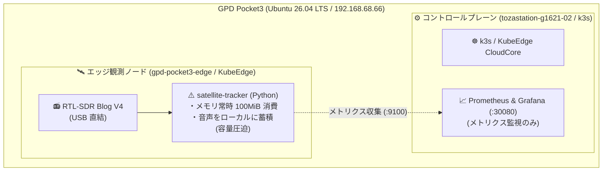
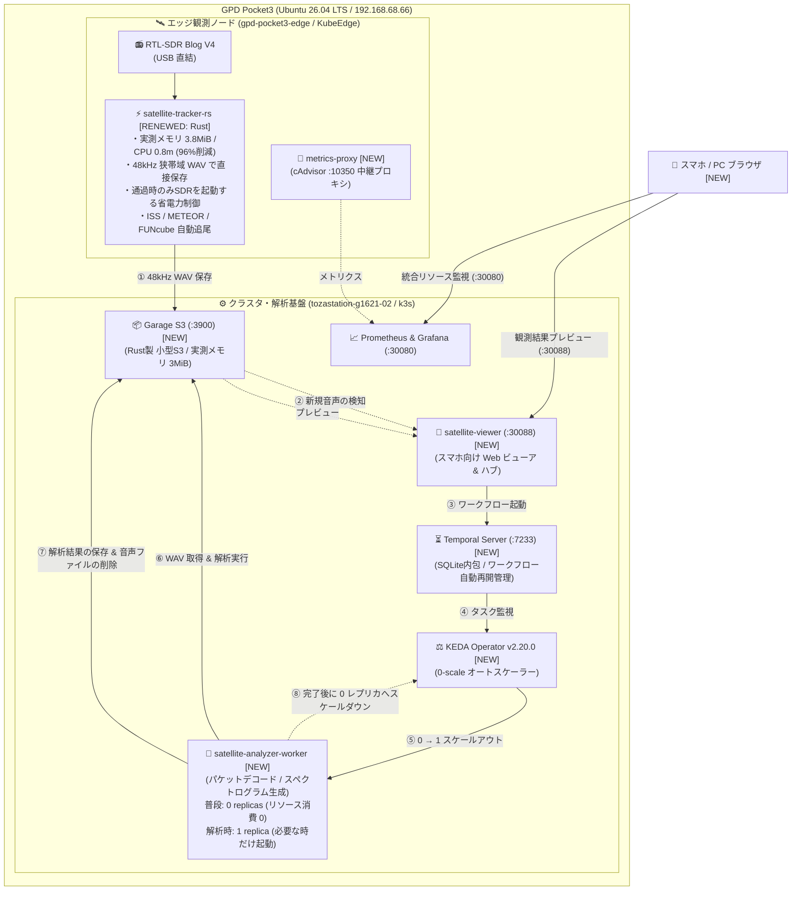
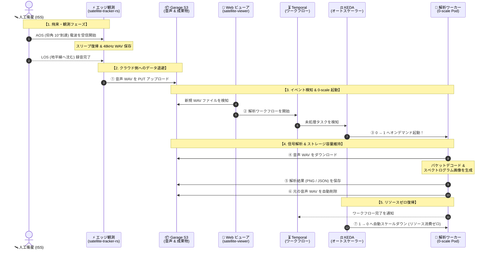

# 【ベランダ電波観測所 #3】KubeEdgeを活かした衛星電波解析パイプラインの構築 〜Rust 3.8MiBの超軽量エッジとTemporal×KEDAによるゼロスケール自律解析〜

## はじめに

こんにちは、戸澤（@tozastation）です！  
宇宙や無線が大好きで、自宅のベランダから個人で電波天文学や人工衛星の観測を行う **「ベランダ電波観測所」** プロジェクトを進めています。

本プロジェクトは、AIアシスタントの Antigravity に無線工学、DSP（デジタル信号処理）、分散システムや SRE の設計思想を相談しながら二人三脚で開発しています。いつも大変お世話になっております🙇‍♂️

ソースコードや Kubernetes マニフェストはすべて GitHub にオープンソースとして公開しています：  
👉 [tozastation/radio-astronomy (GitHub)](https://github.com/tozastation/radio-astronomy)

---

## 前回の振り返りと今回の課題

これまでの歩み：
- **第1弾**: [【ベランダ電波観測所 #1】RTL-SDR Blog V4 と WSL2 で電波を受信してみる](https://qiita.com/tozastation/items/b7e411ba034ddf46be22)
- **第2弾**: [【ベランダ電波観測所 #2】KubeEdge×SDRで始める衛星電波観測と単一ノード運用の記録](https://github.com/tozastation/radio-astronomy/blob/main/docs/articles/qiita_kubeedge_satellite_tracker.md)

第2弾では、手のひらサイズの UMPC（GPD Pocket3: Ubuntu 26.04 LTS）上で **k3s（CloudCore）と KubeEdge（EdgeCore）を 1台に同居** させ、頭上を通過する人工衛星（ISS や CubeSat 等）の電波を SGP4 軌道予測で自動追尾し、Prometheus と Grafana で可視化するエッジ観測の足場を固めました。

しかし、実際にベランダで連続稼働させていく中で、**SRE 的に無視できない「リソースの壁」** に直面しました。

### 直面した 3 つの課題
1. **Python 製エッジ観測コンテナのメモリ消費**:
   - SGP4 軌道計算、RTL-SDR からの信号受信（2.4MSPS）、FFT ドップラー追尾を Python で行うと、常時約 100MiB のメモリを消費していました。UMPC の限られたリソースでは、GC（ガベージコレクション）による処理の一時停止やバッファ詰まりのリスクが常に伴います。
   - また、屋外設置やバッテリー運用、Raspberry Pi などの小型デバイス運用を見据えると、**消費電力や発熱は低ければ低いほど安定稼働の面で有利** です。
2. **録音データ（WAV）によるストレージ容量の圧迫**:
   - 衛星が通過するたびに広帯域の音声をそのまま録音すると、数分で数十〜数百 MB に達し、エッジ端末のストレージを圧迫してしまいます。
3. **エッジで「観測」と「重い信号解析」を同居させる限界**:
   - 受信した音声からパケットを解析したり、高解像度のスペクトログラム画像を生成する処理は、CPU とメモリ（150〜200MiB）を瞬間的に激しく消費します。観測と解析を同じ場所で同時に動かすと、肝心の電波受信が途切れてしまう原因になります。

### 理想のアーキテクチャ像
そこで、単一端末の中で無理にやりくりするのではなく、**「Cloud / Edge 本来の用途に立ち返った、以下のようなアプローチが理想ではないか」** と考えました：

- **エッジはデータ収集に専念させる**: アンテナ直下では最小限のリソースと電力（Rust 3.8MiB、動的なスリープ制御）で観測だけに徹する。
- **将来の物理分離を見据えたオフロード設計にする**: たとえ現在は 1台の UMPC 同居検証（PoC）であっても、将来物理マシンを分けた際に設定変更だけでそのまま成立する疎結合な構成にしておく。
- **必要な時だけ動かす（0-scale）**: 衛星が飛んできた時だけ解析コンテナを起動し、処理が終わったらリソース消費ゼロに戻す。

この理想像をもとに、KubeEdge の特性を活かした **「エッジを極限まで軽量化し、重い処理はクラウドへ逃がすイベント駆動型のゼロスケール解析パイプライン」** へ全面刷新しました！

---

## システム構成と採用コンポーネント

### 1. アーキテクチャの比較（Before vs After）

#### 【Before: #2 の状態】単一観測コンテナ ＆ メトリクス監視のみ
エッジで Python 製の観測コンテナが常駐し、生音声をローカルに溜め込むだけでした。解析基盤はなく、メトリクスの監視のみを行う構成です。



#### 【After: #3 の状態】エッジ極小化 ＆ イベント駆動型 0-scale 解析パイプライン
エッジを Rust で徹底的に軽量化し、クラスタ側へ超小型 S3（Garage）、ワークフロー（Temporal）、オートスケーラー（KEDA）を配備。**観測から解析・可視化・ファイルのクリーンアップまで完全自律で完走するパイプライン** を構築しました。



---

### 2. システムを構成するコンポーネント一覧

| コンポーネント | 配置ノード | #2 (前回) | #3 (今回) | 役割と特徴 |
| :--- | :--- | :--- | :--- | :--- |
| **`satellite-tracker-rs`** | EdgeCore | Python (約 100MiB) | **Rust (実測 3.8MiB)** | 衛星自動追尾・SDR 受信・48kHz WAV 保存・通過時のみ起動する省電力制御 |
| **`garage`** | CloudCore | なし (ローカル生蓄積) | **Garage S3 (実測 3MiB)** | 超軽量な S3 互換ストレージ。音声の一時保管と、解析結果（画像やJSON）の保存 |
| **`temporal`** | CloudCore | なし | **Temporal Server** | 耐障害性に優れたワークフローエンジン。処理が中断しても確実に自動再開 |
| **`keda`** | CloudCore | なし | **KEDA v2.20.0** | イベント駆動オートスケーラー。解析ワーカーの 0 $\leftrightarrow$ 1 自動スケーリング |
| **`satellite-analyzer`** | CloudCore | なし | **Python / direwolf** | 解析ワーカー（普段は 0 レプリカ）。パケットデコードとスペクトログラム生成 |
| **`satellite-viewer`** | CloudCore | なし (CLIログ) | **Python (実測 40MiB)** | スマホ向け Web ビューア ＆ KEDA 用メトリクス API ハブ |
| **`metrics-proxy`** | EdgeCore | なし | **Python DaemonSet** | KubeEdge の cAdvisor（:10350）をクラスタ内へ HTTP で中継するプロキシ |

---

### 3. 主要テクノロジーの役割と選定理由

本パイプラインの中核を担う各 OSS テクノロジーが、単体としてどういう役割を持つツールなのか、なぜ選定したのかを解説します。

#### 📦 Garage S3：超軽量な分散オブジェクトストレージ
- **単体での役割**:
  - フランスの研究機関発祥のオープンソース分散オブジェクトストレージ（[公式サイト](https://garagehq.opera.software/) / [GitHub (dxflrs/garage)](https://github.com/dxflrs/garage)）。
  - 大規模データセンターを前提とする MinIO 等と異なり、**エッジ環境や地理的分散、リソースの限られた端末での運用を前提に Rust で開発** されています。
  - メタデータ管理に SQLite を内包しており、外部データベースを一切必要としません。
- **本システムでの選定理由**:
  - Kubernetes で S3 といえば MinIO が定番ですが、MinIO は初期化時でも 150〜250MiB 以上のメモリを消費し、小型端末には重すぎます。
  - Garage S3 は **実測メモリ消費量わずか 3 MiB** で動作し、標準の AWS CLI や boto3、Rust の aws-sdk-s3 から何一つ変更なく透過的に利用できます。

#### ⏳ Temporal：処理の中断に強いワークフローエンジン
- **単体での役割**:
  - 分散システム向けのマイクロサービス・オーケストレーション基盤（[公式サイト](https://temporal.io/) / [GitHub (temporalio/temporal)](https://github.com/temporalio/temporal)）。
  - 最大の特徴は、**処理が途中で落ちても確実に自動再開できる「Durable Execution（耐久実行）」** です。ワークフローの実行状態（ステートマシン、タイマー、リトライ回数、変数）を自動でイベントとして永続化します。
  - 処理途中でワーカープロセスがクラッシュしたり端末が再起動しても、最後に成功したステップの直後から何事もなかったかのように処理を再開できます。
- **本システムでの選定理由**:
  - 「音声取得 $\to$ パケット解析 $\to$ スペクトログラム生成 $\to$ S3 保存 $\to$ 元音声削除」という一連の処理をコード（Python）として記述。
  - 一時的なリソース不足でワーカーが停止してもタスクが消える心配がなく、自動リトライや進捗を Web 画面上で視覚的に追跡できます。

#### ⚖️ KEDA：イベント駆動でコンテナ数を制御するオートスケーラー
- **単体での役割**:
  - CNCF Graduated プロジェクトの Kubernetes イベント駆動オートスケーラー（[公式サイト](https://keda.sh/) / [GitHub (kedacore/keda)](https://github.com/kedacore/keda)）。
  - Kubernetes 標準の HPA（Horizontal Pod Autoscaler）は CPU やメモリ使用率をトリガーとするため「0 から 1 への起動（0-scale）」ができません。KEDA は各種メッセージキュー、DB、HTTP API、Prometheus などの外部イベントを監視し、**0 $\to$ 1 および 1 $\to$ 0 の完全自動スケーリング** を実現します。
- **本システムでの選定理由**:
  - 人工衛星がベランダ上空を通過するのは 1日あたり数回・各 5〜10分程度であり、**1日の 95% 以上は待機時間** です。
  - 解析ワーカーを 24時間常駐させるのはリソースの無駄遣いであるため、普段は **`replicas: 0`（リソース消費ゼロ）** で完全待機。
  - S3 に未処理音声が到着した瞬間だけワーカーを `0 → 1` 起動し、解析が完了したら再び `1 → 0` に自動スケールダウンさせます。

---

### 4. S3 境界による完全オフロード設計

現在は GPD Pocket3 単一マシン上で動かしていますが、**Garage S3 へのアップロード完了をエッジとクラウドの唯一の境界線** としています。

- **エッジの自律性と極限の軽量性**:
  - エッジ側（`satellite-tracker-rs`）は単純な HTTP PUT だけで完結するため、Temporal クライアントや重い解析ライブラリを一切持ちません。これにより、エッジのメモリ 3.8MiB、CPU 0.08% を死守しています。
- **将来の物理分離へのシームレスな拡張**:
  - エッジ側（ベランダアンテナ直下）は音声を S3 に PUT するだけ。クラウド側（Garage S3, Temporal, KEDA, Worker, Viewer）はそれを受信して勝手に自律処理するだけです。
  - そのため、将来室内 PC（GPU マシン）を投入した際も、クラスタ側の Pod 群をごっそり室内ノードへ移すだけで、**エッジ側の観測コードを 1行も変えずに、本格的な分散エッジ構成へスムーズに移行** できます。

---

## 自律パイプラインの実証（E2E ＆ 本物衛星パス通過）

### 1. E2E 結合検証（0 $\to$ 1 $\to$ 0 の完全自動ライフサイクル）
擬似音声ファイルを S3 に投入し、パイプラインの自律動作を検証しました。

```text
$ python3 scripts/trigger_cluster_e2e.py
🚀 [E2E] S3 音声アップロード完了: s3://satellite-recordings/raw/ISS/test_pass.wav
⏳ [E2E] Temporal ワークフロー開始: AnalyzeSatellitePassWorkflow
⚖️ [E2E] KEDA ワーカー起動検知: replicas = 0 → 1
🔬 [E2E] 解析実行中 (パケット解析 & スペクトログラム生成)...
📦 [E2E] 解析結果（画像・JSON）の保存完了
🧹 [E2E] 処理済みの音声ファイルを自動削除
⚖️ [E2E] KEDA ワーカーが 0 レプリカへスケールダウン (リソース消費ゼロ復帰)
✅ [E2E] すべてのパイプラインが完全自律で完走しました！
```

---

### 2. 本物の人工衛星（ISS）通過時の自律観測ログ
実際にベランダ上空を通過した **ISS (ZARYA)**（145.825 MHz APRS、最大仰角 43.4°）の電波を捉えた際の実機ログです。

衛星の飛来から、観測、クラウドへのデータ転送、ワーカーの起動、解析、ストレージの片付け、そしてリソースゼロへの縮退まで、**人間が一切コマンドを叩くことなく全自動で連鎖実行** されます。

#### 🔄 自律パイプラインの実行シーケンス
各コンポーネントがイベント駆動でどのようにバトンを渡していくのかを図解しました：



#### 📜 実際の動作ログ（シーケンスと完全一致）
上記シーケンスの通りにパイプラインが自律完走したときのログです：

```text
# 1. AOS 突入（14:26:10 JST）: SGP4予測に基づきSDRが動的スタンバイから自動起動
2026-10-10 14:26:10 [INFO] AOS entered: ISS (ZARYA) (El: 10.2°, Az: 73.5°, Freq: 145.825 MHz)
2026-10-10 14:26:10 [INFO] SDR warmup completed. 48kHz WAV streaming spool started.

# 2. LOS 完了（14:29:03 JST）: 録音クローズと Garage S3 への自動アップロード
2026-10-10 14:29:03 [INFO] LOS completed: ISS (ZARYA) (Max El: 43.4°)
2026-10-10 14:29:05 [INFO] S3Uploader: Successfully uploaded: raw/ISS (ZARYA)/...wav (152KB)

# 3. 自動ディスパッチ & Temporal ワークフロー発火
🚀 [Dispatcher] Found new raw recording. Starting Temporal workflow for ISS...

# 4. KEDA ワーカー自動起動 (0 → 1) & 解析実行
2026-10-10 14:29:12 [INFO] satellite-analyzer-worker: Temporal Worker started.
2026-10-10 14:29:14 [INFO] Running packet analysis & Generating Spectrogram (Matplotlib)...
2026-10-10 14:29:16 [INFO] Uploading artifact spectrogram.png (931KB) to S3...
2026-10-10 14:29:18 [INFO] Cleaning up raw WAV from S3 (ストレージ空き容量を自動維持)...
2026-10-10 14:29:19 [INFO] Successfully completed AnalyzeSatellitePassWorkflow!

# 5. KEDA による自動スケールダウン (1 → 0)
satellite-analyzer-worker-7f7c765f7f-fbcvt   1/1     Terminating   0   42s
```

#### 📊 生成された実測スペクトログラム成果物
ベランダのアンテナと RTL-SDR v4 が受信し、パイプラインが全自動で生成した ISS 通過時のパワースペクトログラムです。


録音データ（約 150KB）は解析完了と同時に自動削除され、解析結果（スペクトログラム画像: 約 932KB、サマリ JSON）だけが Garage S3 に保存されました。

---

## スマホからの観測結果プレビュー ＆ 統合監視

### 1. スマホ向け Web ビューア（`satellite-viewer`: NodePort 30088）
同一 Wi-Fi のスマホブラウザからアクセスできる軽量ダッシュボード（メモリ 40MiB）です。

- **ワンタップ絞り込み**: 「すべて」「🚀 ISS」「🛰️ METEOR」「📻 FUNcube」のカテゴリチップ。
- **データ検出トグル**: 「📡 パケット/データ検出ありのみ」にワンタッチで抽出。
- **インラインプレビュー ＆ タップ拡大**: スペクトログラム画像をその場で全画面拡大表示。
- **JSON アコーディオン**: `summary.json` や `packets.json` をブラウザ上で展開・閲覧。

### 2. Grafana によるエッジ全体 ＆ Pod別リソース監視（NodePort 30080）
- **ノード全体**: CPU 約 0.43 cores（約 10%） / メモリ 約 6.8 GiB / 16GB
- **Pod単位（Rust観測Pod）**: **CPU 0.8m（約 0.08%） / メモリ 3.8 MiB**

---

## 設計・運用で直面した課題とトラブルシューティング

開発・運用中に遭遇した技術的課題とその解決策を記録します。

### 1. KubeEdge cAdvisor（:10350）と CloudCore のポート競合
- **事象**: Prometheus からエッジノードの cAdvisor メトリクスを取得しようとすると `Connection Refused` や TLS エラーが発生する。
- **原因**: KubeEdge の `edged` はループバック（`127.0.0.1:10350`）のみでリッスンしており、ホスト外からアクセスできませんでした。さらに隣接ポート `10351` は CloudCore が HTTPS で握っていました。
- **解決策**: `hostNetwork: true` を持つ極小 Python プロキシ DaemonSet（`kubeedge-metrics-proxy`）を空きポート（`19095`）で動かし、cAdvisor のメトリクスをクラスタ内から HTTP で取得できるように中継して解決。

### 2. Temporal SDK Core（Rust）のメモリ特性と OOMKilled（Exit Code 137）の壁
- **事象**: Web ビューア内にディスパッチャーを組み込んだ直後、`Exit Code: 137`（OOMKilled）で不定期にクラッシュする。
- **原因**: 当初 `limits.memory: 64Mi` を割り当てていたが、Python 版 Temporal SDK は内部で Rust 製コア（`temporal-sdk-core`）を内包しており、通信接続や内部スレッドの初期化時に一時的にメモリ消費が跳ね上がり、メモリ上限を超過していました。
- **解決策**: メモリプロファイリングに基づき、リミットを `64Mi` $\to$ **`160Mi`**（Requests: `48Mi`）へ緩和。平常時は約 59MiB で安定稼働。

### 3. Temporal Dev モードのメトリクス欠落と KEDA `metrics-api` scaler
- **事象**: S3 へ音声が届いても、KEDA のワーカーが自動で立ち上がらず `0` レプリカのままスタックする。
- **原因**: KEDA ScaledObject が Prometheus 経由で Temporal のキュー長メトリクスを監視していたが、軽量な Temporal 開発サーバー（Dev モード）がメトリクスを出力していなかった。
- **解決策**: 常駐 Web ビューアに未処理ファイル数を返す極小エンドポイント `/api/pending-tasks` を追加。KEDA 公式の **`metrics-api` scaler** で直接ポーリング監視させ、S3 ファイル到着をトリガーとする確実な自動起動を確立。

---

<details>
<summary><b>その他のトラブルシューティング（IPv6 / レジストリ / 内部DNS / hostPath）</b></summary>

### 4. IPv6 未導通ネットワークにおける Happy Eyeballs 遅延
- **事象**: `ghcr.io` からのイメージ Pull や外部 API 通信が数分間フリーズする。
- **原因**: 宅内ネットワークで IPv6 外部ルーティングが通っていないのに、OS が IPv6 タイムアウト待ち $\to$ IPv4 フォールバックを起こしていた。
- **解決策**: `/etc/gai.conf` で `precedence ::ffff:0:0/96 100` を有効化し、IPv4 優先接続を強制。

### 5. Docker Hub レート制限回避とローカルレジストリ徹底
- **事象**: ローリングアップデート時に Docker Hub のレート制限（Too Many Requests）に引っかかる。
- **解決策**: クラスタ内にローカルレジストリ（`localhost:5000` / NodePort `30500`）を構築し、固定バージョンをミラーリングして完全宣言的に管理。

### 6. KubeEdge エッジノードにおける内部 DNS 未解決と NodePort ルーティング
- **事象**: エッジノードの観測 Pod からクラスタ内 S3 エンドポイント（`garage-s3...svc.cluster.local`）へのアクセスが失敗する。
- **原因**: KubeEdge のエッジコンテナはクラスタの CoreDNS ではなくホスト OS の `/etc/resolv.conf` を参照するため、内部ドメインが引けない。
- **解決策**: エッジ Pod に渡す S3 エンドポイントをホスト物理 IP の NodePort（`http://192.168.68.66:30900`）に明示指定。

### 7. コンテナ Ephemeral ストレージの教訓と hostPath 永続化
- **事象**: Pod を再作成した際に、未アップロードの音声ファイル（コンテナ内 `/tmp`）が消失するリスクに直面。
- **解決策**: ホスト物理ディレクトリ `/tmp/satellite-recordings` を `hostPath` バインドマウントし、未送信ファイルの自動再送処理（`sync_pending_spool`）を実装してデータ保護を徹底。

</details>

---

## まとめと今後の展望

今回、KubeEdge の特性を活かして **「エッジ極小観測（Rust 3.8MiB）」** と **「イベント駆動型ゼロスケール解析（Garage + Temporal + KEDA）」** を組み合わせることで、手のひらサイズの UMPC 1台でもリソースを枯渇させずに、24時間365日自律稼働する衛星電波観測パイプラインを構築することができました。

初期PoCとして 1台に同居させてはいるものの、**Cloud / Edge 本来の用途に立ち返り、境界線を S3 疎結合イベント駆動として徹底的にオフロード前提で設計** しました。エッジ側はアンテナ直下で絶対に落ちずに省電力で観測に専念し、クラスタ側は衛星が通過したときだけオンデマンドで解析ワーカーを立ち上げて成果物を生成し、終わったらメモリを即座に返却する――。SRE として求めていた理想の分散アーキテクチャがベランダで実現しました。

このオフロード構成を確立できたことで、次のステップである「物理マシンの分離（ベランダ Edge PC ＋ 室内 GPU 解析クラスタ）」への移行も、エッジ側のコードや観測ロジックを何一つ変えることなくシームレスに行うことができます。

### 次回予告：第4弾【衛星デコード＆宇宙データ可視化編】
次回はいよいよ、今回完成した自律基盤の上で各種衛星の電波を本格的にデコード・可視化していく挑戦をお届けします！
- **ISS (ZARYA)**: 地球上のアマチュア無線局と交わされる APRS パケットの復調・パケットデコード
- **METEOR-M2 4**: ロシアの極軌道気象衛星から送られてくる高解像度 LRPT 地球雲画像のリアルタイム復調
- **FUNCUBE-1 (AO-73)**: 宇宙空間の環境を伝える BPSK テレメトリのデコードとダッシュボード可視化
- **物理2台分離**: ベランダの GPD Pocket3（エッジ）と室内の GPU 分析専用 PC（クラスタ）の完全物理分離

最後までお読みいただきありがとうございました！  
質問やフィードバックなどありましたら、コメントや GitHub の Issue / PR などでお気軽にいただけると嬉しいです！
