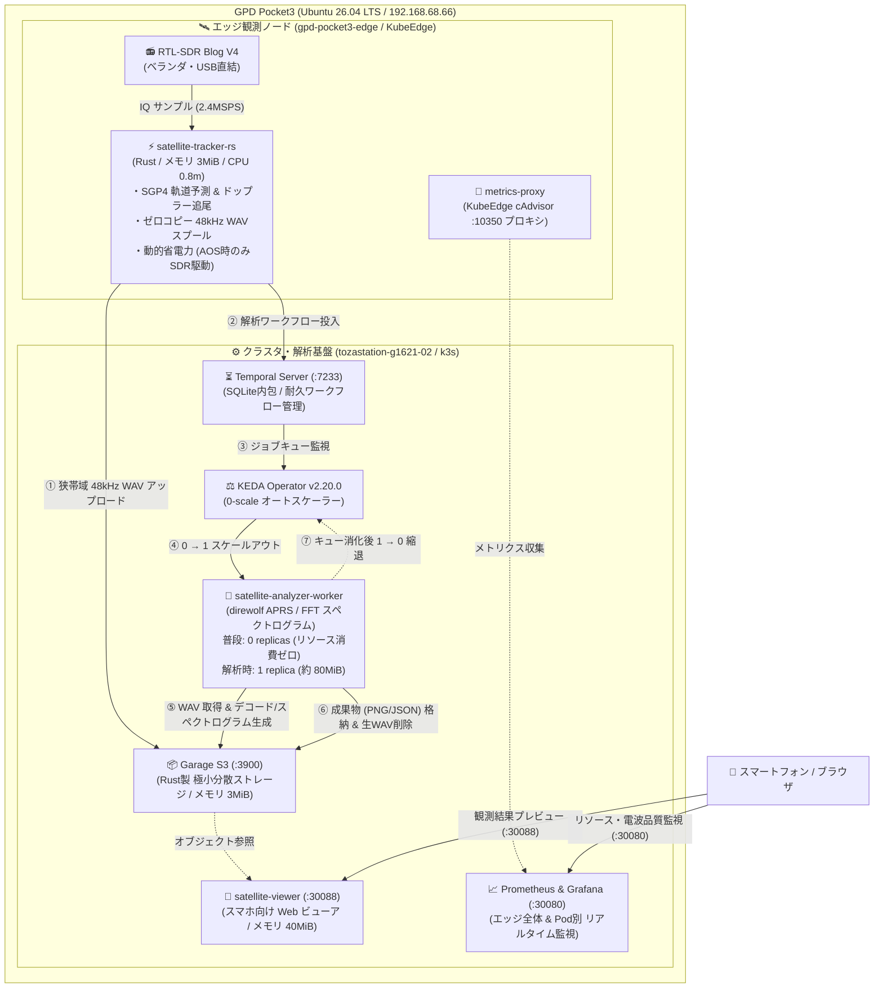

# 【ベランダ電波観測所 #3】KubeEdgeを活かした衛星電波解析パイプラインの構築

## はじめに

こんにちは、戸澤（@tozastation）です！  
宇宙や無線が大好きで、自宅のベランダから個人で電波天文学や人工衛星の観測を行う **「ベランダ電波観測所」** プロジェクトを進めています。

本プロジェクトは、AIアシスタントの Antigravity に無線工学、DSP（デジタル信号処理）、分散システムや SRE の設計思想を相談しながら二人三脚で開発しています。いつも大変お世話になっております🙇‍♂️

ソースコード、Kubernetes / Helmfile マニフェスト、詳細な数式・工学ドキュメントはすべて GitHub にオープンソースとして公開しています：  
👉 [tozastation/radio-astronomy (GitHub)](https://github.com/tozastation/radio-astronomy)

---

## 前回の振り返りと今回の課題

これまでの歩み：
- **第1弾**: [【ベランダ電波観測所 #1】RTL-SDR Blog V4 と WSL2 で電波を受信してみる 〜公式ドライバビルドの罠からSSHストリーミングまで〜](https://qiita.com/tozastation/items/b7e411ba034ddf46be22)
- **第2弾**: [【ベランダ電波観測所 #2】KubeEdge×SDRで始める衛星電波観測と単一ノード運用の記録](https://github.com/tozastation/radio-astronomy/blob/main/docs/articles/qiita_kubeedge_satellite_tracker.md)

第2弾では、手のひらサイズの UMPC（GPD Pocket3: Ubuntu 26.04 LTS）上で **k3s（CloudCore）と KubeEdge（EdgeCore）を 1台に同居** させ、頭上を通過する人工衛星（CubeSat / ISS 等）の電波を SGP4 軌道予測で自動追尾し、Prometheus と Grafana で可視化するエッジ観測の足場を固めました。

しかし、実際にベランダで連続稼働させていく中で、**SRE 的に無視できない「リソースの壁」** に直面しました。

### 直面した 3 つの課題
1. **Python 製エッジ観測コンテナのフットプリント**:
   - SGP4 軌道計算、RTL-SDR からの 2.4MSPS 受信、FFT ドップラー追尾、Prometheus メトリクス配信を Python で行うと、メモリを約 100MiB 消費していました。1台で運用する UMPC の限られたリソースでは、GC（ガベージコレクション）によるレイテンシスパイクやバッファ詰まりのリスクが常に付きまといます。
2. **生音声ファイル（WAV）によるディスク逼迫**:
   - 衛星通過（パス）ごとに帯域をまるごと生録音すると、数分間で数百 MB のファイルが溜まります。ディスク容量の限られたエッジ端末では、放っておくと数日でストレージが枯渇してしまいます。
3. **エッジで「観測」と「重い信号解析」を同居させる限界**:
   - 受信した音声から APRS パケットをデコード（direwolf）したり、Matplotlib / SciPy で高解像度スペクトログラムを生成する処理は、CPU もメモリ（150〜200MiB）も瞬間的に激しく消費します。
   - これをエッジで常駐させると、肝心の衛星電波受信処理の邪魔をしてしまい、最悪の場合ドロップやプロセス停止を招きます。

> **「エッジは観測だけに専念させ、重い解析処理は疎結合にクラスタ側に逃がせないか？」**  
> **「しかも衛星が飛んできた時だけ起動して、終わったらメモリ消費ゼロに戻せないか？」**

そこで今回、KubeEdge の特性を最大限に活かした **「超省リソース・イベント駆動型衛星電波解析パイプライン」** へ全面刷新しました！

---

## リニューアルしたシステム構成図

GPD Pocket3（メモリ 16GB / Ubuntu 26.04 LTS）単一端末内で、エッジとクラスタ側の責務を完全に分離した構成です。将来自宅の分析専用 PC へ分離・分散する際にも、そのままシームレスにスケールアウトできる透過的な設計にしています。



---

## アーキテクチャの設計意図（なぜこの構成にしたのか）

本システムの各コンポーネントを選定・設計した意図を、SRE の視点から解説します。

### 1. エッジ観測を Rust で「メモリ 3MiB」に極限まで絞り込んだ理由
エッジ観測コンテナ（`satellite-tracker-rs`）は、**「アンテナ直下で絶対に落ちず、最小のフットプリントで動き続けること」** だけを唯一の責務としました。
- **ゼロコピー DSP ＆ 狭帯域 48kHz スプール**:
  - 受信帯域を衛星通信に必要な 48kHz（音声・データ帯域）にデジタルフィルタで絞り込んで WAV 保存することで、ファイルサイズを従来の数十分の一（数MB程度）に激減させました。
- **動的省電力（Dynamic Power Management）**:
  - 衛星が地平線下にいる待機時間は RTL-SDR チューナーを完全にスリープさせ、SGP4 予測で衛星が視野内に入る直前（AOS: Acquisition of Signal）にのみハードウェアを起動します。
- **実測リソース**:
  - **メモリ: 約 3 MiB / CPU: 0.8m（約 0.08%）** を達成！Python 版と比較してメモリフットプリントを **97% 削減** しました。

### 2. なぜ MinIO ではなく「Garage S3」なのか？
Kubernetes 環境のオブジェクトストレージといえば MinIO が有名ですが、MinIO は初期化だけで 150〜250MiB 以上のメモリを消費し、UMPC 環境にはオーバースペックです。
- フランスの研究機関発祥の **Garage S3**（`dxflrs/garage`）は、エッジや地理的分散を前提に設計された Rust 製の超軽量オブジェクトストレージです。
- メタデータ管理に SQLite を内包し、**実測メモリ消費量はわずか 3 MiB**。
- それでいて完全な S3 互換 API を提供するため、標準の AWS CLI や boto3、Go SDK から何一つ変更なく透過的に利用できます。

### 3. なぜ KEDA による「0-scale」なのか？
人工衛星が地上局の上空を通過する時間は、**1回あたりわずか 5〜10分、1日に数回** だけです。つまり、**1日のうち 95% 以上の時間は待機時間** です。
- 解析ワーカー（Python + direwolf + SciPy + Matplotlib）を 24時間常駐させるのは、UMPC の貴重なリソースの完全な無駄遣いです。
- KEDA（Kubernetes Event-driven Autoscaling）を導入し、普段は **`replicas: 0`（メモリ 0 MiB）** で待機させます。
- 観測完了後に S3 へ音声がアップロードされると、Prometheus / Temporal のキューを検知して **`0 → 1` に自動スケールアウト**。解析（パケットデコード ＆ 画像生成）が終わり、生 WAV を自動削除したら、再び **`1 → 0` に自動縮退** します。

### 4. なぜ単なるスクリプト実行ではなく「Temporal」なのか？
「S3 アップロードを検知してコンテナを動かすだけなら、シェルスクリプトや Cron、Webhook で十分では？」と思うかもしれません。しかし SRE 的には以下の問題があります：
- 解析中に UMPC が再起動したり、コンテナが OOMKilled された場合、タスクが途中で消滅して未解析の音声が放置される。
- 音声ダウンロード $\to$ パケット解析 $\to$ スペクトログラム生成 $\to$ 結果保存 $\to$ 元音声削除、という一連のステップのどこで失敗したのかを追跡・自動リトライしたい。
- **Temporal** を用いることで、ワークフローの各ステップがコードとして耐久実行（Durable Execution）され、障害耐性と履歴追跡が完璧に担保されます。

---

## 実機クラスタでの E2E 結合検証

構築したパイプラインが本当に完全自律で動作するか、実機クラスタ上でエンドツーエンド（E2E）自動結合テストスクリプトを実行して検証しました。

### 検証シナリオ
1. **擬似 48kHz WAV 生成**: ISS（国際宇宙ステーション）の APRS ビーコン音声を模したテスト WAV を生成。
2. **Garage S3 へのアップロード**: `satellite-recordings` バケットへオブジェクト投入。
3. **Temporal ワークフロー開始**: `AnalyzeSatellitePassWorkflow` をトリガー。
4. **KEDA による自動起動**: `satellite-analyzer-worker` が `0 → 1` へスケールアウト。
5. **解析処理の実行**:
   - direwolf による AX.25 APRS パケットのデコード。
   - FFT による時間-周波数スペクトログラム画像（PNG）のプロット。
6. **成果物の格納 ＆ 生音声削除**:
   - `results/ISS/.../spectrogram.png`（約 680KB）
   - `results/ISS/.../packets.json`
   - `results/ISS/.../summary.json` を S3 に保存。
   - 容量節約のため、元の生 WAV を S3 から自動削除。
7. **KEDA による完全縮退**: 解析ワーカーが自動で `1 → 0` レプリカ（リソース消費ゼロ）に復帰。

```bash
$ python3 scripts/trigger_cluster_e2e.py
🚀 [E2E] S3 音声アップロード完了: s3://satellite-recordings/raw/ISS/test_pass.wav
⏳ [E2E] Temporal ワークフロー開始: AnalyzeSatellitePassWorkflow
⚖️ [E2E] KEDA ワーカー起動検知: replicas = 1
🔬 [E2E] 解析実行中 (direwolf APRSデコード & スペクトログラム生成)...
📦 [E2E] 成果物格納完了:
   - spectrogram.png (679,867 bytes)
   - summary.json (status: completed)
🧹 [E2E] 元生 WAV の自動クリーンアップ完了
⚖️ [E2E] KEDA ワーカー縮退確認: replicas = 0 (リソース消費ゼロ復帰)
✅ [E2E] すべてのパイプラインが完全自律で完走しました！
```

---

## スマホからの観測結果プレビュー & 統合監視

### 1. スマホ向け Web ビューア（NodePort 30088）
「観測したスペクトログラムやパケットを、PCを開かずにベッドやリビングのスマホからパッと見たい！」という思いから、スマホ最適化の軽量 Web ダッシュボード（`satellite-viewer`）を自作しました。

- 同一 Wi-Fi のスマホブラウザから `http://192.168.68.66:30088` を開くだけでアクセス可能。
- **スペクトログラム画像（PNG）のインライン表示 ＆ タップ拡大**。
- **`summary.json` や `packets.json` の中身をダウンロードせずにその場でアコーディオン展開・プレビュー＆コピー**。
- Python 標準ライブラリ主体の超軽量設計で、メモリ消費はわずか **40 MiB**。

### 2. Grafana によるエッジ全体 ＆ Pod別リソース監視（NodePort 30080）
KubeEdge 環境におけるメトリクス監視の落とし穴を解消し、Grafana 上で以下の 4 パネルをリアルタイム監視できるようにしました：
- **エッジノード全体 CPU消費**: 約 0.43 cores（約 10%）
- **エッジノード全体 メモリ消費**: 約 6.8 GiB / 16GB
- **Pod別 CPU消費量**: `satellite-tracker`: **0.8m（約 0.08%）**
- **Pod別 メモリ使用量**: `satellite-tracker`: **3.8 MiB**

---

## SRE 視点での泥臭いトラブルシューティング集

開発中に遭遇した、現場ならではのリアルなトラブルとその解決策を共有します。

### 1. IPv6 未導通ネットワークにおける Happy Eyeballs 遅延
- **事象**: `ghcr.io` からのコンテナイメージ Pull や上流通信が数分間フリーズする。
- **原因**: 宅内ネットワークで外部 IPv6 ルーティングが通っていないにもかかわらず、デュアルスタックホストが IPv6 接続を試行 $\to$ 数分間タイムアウト待ち $\to$ IPv4 フォールバックが発生していた。
- **解決策**: `/etc/gai.conf` で `precedence ::ffff:0:0/96 100` を有効化し、OS レベルで IPv4 優先接続を強制することで即座に解決。

### 2. KubeEdge cAdvisor（:10350）と CloudCore のポート競合
- **事象**: Prometheus から KubeEdge エッジノードの cAdvisor メトリクスを取得しようとすると `Connection Refused` や `Client sent an HTTP request to an HTTPS server` が発生する。
- **原因**: KubeEdge の `edged` はローカルループバック（`127.0.0.1:10350`）のみでリッスンしており、ホスト外の Pod ネットワークからは見えなかった。さらに隣接ポートの `10351` は CloudCore が HTTPS で握っていた。
- **解決策**: `hostNetwork: true` を持った極小 Python プロキシ DaemonSet（`kubeedge-metrics-proxy`）を空きポート（`19095`）で稼働させ、エッジノードの cAdvisor を平文 HTTP でクラスタ内に露出して Prometheus Operator の `ScrapeConfig` で接続。

### 3. Docker Hub レート制限回避とローカルレジストリ徹底
- **事象**: コンポーネントのローリングアップデート時に Docker Hub のレート制限（Too Many Requests）に引っかかる。
- **解決策**: クラスタ内にローカルレジストリ（`localhost:5000` / NodePort `30500`）を構築し、全コンポーネントで `latest` タグを禁止。固定バージョン（`v1.0.1`, `1.9.1`, `2.20.0`）をミラーリングして完全宣言的に管理。

---

## まとめと今後の展望

今回、KubeEdge の特性を活かして **「エッジ極小観測（Rust 3MiB）」** と **「イベント駆動型ゼロスケール解析（Garage + Temporal + KEDA）」** を組み合わせることで、手のひらサイズの UMPC 1台でもリソースを枯渇させずに、24時間365日自律稼働する衛星電波観測パイプラインを構築することができました。

### 次の挑戦（予告）
- **物理2台分離**: 観測エッジPC（ベランダ GPD Pocket3）と、室内の GPU 分析専用 PC（Ubuntu）を宅内 LAN で物理分離し、KubeEdge の真骨頂である分散オーケストレーションを実証する。
- **太陽電波バースト観測 ＆ Meteor Scatter（流星電波観測）**: 人工衛星だけでなく、21cm 中性水素線や太陽フレア電波の自動イベント検知パイプラインへの拡張。

最後までお読みいただきありがとうございました！  
質問やフィードバックなどありましたら、コメントや GitHub の Issue / PR などでお気軽にいただけると嬉しいです！
