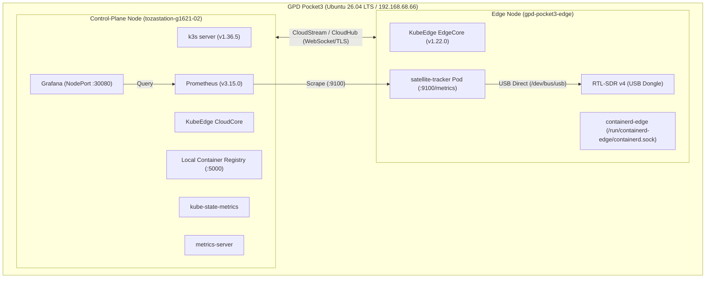

# 【ベランダ電波観測所 #2】KubeEdge×SDRで始める衛星電波観測と単一ノード運用の記録

## はじめに

こんにちは、戸澤（@tozastation）です！  
純粋に宇宙が大好きで、自宅のベランダから個人で電波天文学や衛星観測を行う **「ベランダ電波観測所」** プロジェクトを進めています。

本プロジェクトは、AIアシスタントの Antigravity に電波工学やDSP（デジタル信号処理）、分散システムの設計を相談し、教わりながら進めています。いつも大変お世話になっております🙇‍♂️

コードや設計ドキュメントはすべて GitHub の [tozastation/radio-astronomy](https://github.com/tozastation/radio-astronomy) に公開していますので、ぜひ覗いてみてください！

---

## 前回の振り返りと今回の動機

前回の記事はこちら：  
👉 [【ベランダ電波観測所 #1】RTL-SDR Blog V4 と WSL2 で電波を受信してみる 〜公式ドライバビルドの罠からSSHストリーミングまで〜](https://qiita.com/tozastation/items/b7e411ba034ddf46be22)

前回（Day 1）では、Windows 11 + WSL2 の環境で RTL-SDR Blog V4 を動かし、ベランダのエアコン室外機の上にアンテナを置いて電波を受信するところまで行きました。  
しかし、記事の最後のオチでこう書きました：

> **「やっぱりエッジ観測機はネイティブ Linux が最強でした！！（GPD Pocket3 をネイティブ Ubuntu 26.04 LTS にクリーンインストール）」**

常時稼働できるネイティブ Linux のエッジマシン（UMPC）が手に入ったのなら、次にやることは決まっています。

> **「エッジ観測機なら、KubeEdge でコンテナオーケストレーションして完全自律稼働させるしかないのでは……！？」**

電波天文学や人工衛星観測の現場では、山奥や屋外アンテナ直下にエッジPCを設置し、観測パイプラインを遠隔管理・監視することが求められます。  
そこで今回は、**GPD Pocket3（メモリ 16GB / Ubuntu 26.04 LTS）単一端末上で、k3s（CloudCore）と KubeEdge（EdgeCore）を同居** させ、頭上を通過する人工衛星（CubeSat / ISS）の電波を SGP4 軌道予測と SDR FFT ドップラー解析で自動追尾し、Prometheus と Grafana でリアルタイム可視化するエッジ観測環境を構築しました。

ただし、本来は複数マシンに分離して構成する KubeEdge を 1台に同居させたことで、コンテナランタイム（CRI）、ネットワーク（CNI）、ボリュームなどのリソース競合に伴うトラブルがいくつか発生しました。  
本記事では、この構成の概要と、単一端末上で運用する際に遭遇したトラブルの解決手順をまとめます。

---

## システムアーキテクチャ（1台完結PoC）

GPD Pocket3 の単一マシン内で、Kubernetes コントロールプレーンと KubeEdge エッジノードを共存させています。



### KubeEdge の主要コンポーネント

KubeEdge はクラウド側（CloudCore）とエッジ端末側（EdgeCore）で役割を分担して動作します。

| コンポーネント | 配置 | 主な役割 |
| :--- | :--- | :--- |
| **CloudHub** | CloudCore | エッジノードとの通信エンドポイント（WebSocket / QUIC）。メタデータの送受信を担う |
| **EdgeController** | CloudCore | Kubernetes API Server を監視し、エッジノード向けのリソース情報を同期 |
| **CloudStream** | CloudCore | `kubectl logs` や `kubectl exec` のストリーミング通信をエッジ側へトンネリング中継 |
| **EdgeHub** | EdgeCore | CloudHub と接続し、同期メッセージを送受信する通信クライアント |
| **MetaManager** | EdgeCore | ローカル SQLite キャッシュ。ネットワーク切断時でも Pod が自律稼働できるようメタデータを保持 |
| **edged** | EdgeCore | エッジ向けに軽量化された kubelet。CRI（containerd）経由で Pod のライフサイクルを管理 |
| **EdgeStream** | EdgeCore | CloudStream からのリクエストを受け、ローカル containerd のストリーミングエンドポイントへ転送 |

### スペックとリソース配分
- **ハードウェア**: GPD Pocket3 (Intel Core i7-1195G7 / RAM 16GB / NVMe 1TB)
- **エッジ観測アプリ (`satellite-tracker`)**: Python 3.11, SGP4 軌道力学計算, NumPy FFT スペクトル解析, Prometheus Exporter
- **全体メモリ消費**: **約 770MB**（Grafana 380MB, Prometheus 335MB, kube-state-metrics 23MB, Operator 30MB）

UMPC の限られたリソースでも、エッジ端末での常時監視や観測処理に支障なく動作しています。

---

## 衛星追尾における数理モデルとDSP処理

衛星観測パイプラインで処理している 2 つの数理モデルです。

### 1. 第一宇宙速度とドップラー偏移（Doppler S-Curve）
地上約 400〜600 km の地球低軌道（LEO）を周回する人工衛星は、秒速約 7.6 km（時速 27,000 km）の超高速で移動しています。  
電波の送信周波数を $f_0$、光速を $c$、観測者から衛星への相対位置ベクトルを $\vec{r}$、相対速度ベクトルを $\vec{v}$ とすると、受信周波数のドップラー偏移 $\Delta f$ は以下で表されます：

$$\Delta f = - f_0 \frac{v_r}{c} = - f_0 \frac{\vec{v} \cdot \vec{r}}{c \|\vec{r}\|}$$

| 記号 | 物理的意味 | 単位 |
| :--- | :--- | :--- |
| $f_0$ | 送信中心周波数（UHF帯: 例 435.000 MHz） | $\text{Hz}$ |
| $c$ | 真空中の光速（約 $3.0 \times 10^8$） | $\text{m/s}$ |
| $v_r = \frac{\vec{v} \cdot \vec{r}}{\|\vec{r}\|}$ | 観測者から見た衛星の視線速度（Line-of-Sight Velocity） | $\text{m/s}$ |
| $\Delta f$ | 受信周波数の偏移量（Doppler Shift） | $\text{Hz}$ |

- **AOS（信号捕捉 / 水平線から出現）直後**: 衛星が接近してくるため、$v_r < 0$ となり周波数が **約 +8〜10 kHz** 高く受信されます。
- **TCA（最接近時刻）**: 視線速度ベクトルがゼロ（進行方向が直角）になる瞬間、**ドップラー偏移が 0 Hz をクロス**（ゼロクロス点）します。
- **LOS（信号消失 / 水平線へ没入）直前**: 衛星が遠ざかるため、$v_r > 0$ となり周波数が **約 -8〜10 kHz** 低くなります。

この逆S字カーブについて、SGP4 軌道力学による理論予測と、RTL-SDR v4 の FFT パワースペクトル解析による実測ピーク周波数を Grafana でリアルタイムに可視化します。

```text
周波数偏移 Δf
  +10 kHz │  ╭───────────── (AOS: 接近中・高周波)
          │   \
          │    \
    0 Hz  ┼─────●────────── (TCA: 最接近・ゼロクロス)
          │      \
          │       \
  -10 kHz │        ╰─────── (LOS: 離脱中・低周波)
          └──────────────── 時刻 t
```

### 2. 都市部マンションの「北向きベランダ視界フィルタ」
都市部の集合住宅では「南側の空は部屋の壁に遮られて見えない」という物理制約があります。  
SGP4 予測器に「北天視界フィルタ（方位角 $270^\circ \to 360^\circ \to 90^\circ$、仰角 $\ge 10^\circ$）」を実装し、ベランダから電波が届くパスだけを自動判定して SDR 受信機を起動させます。

---

## 単一ノード同居環境でのトラブルシューティング

1台のマシン上で k3s と KubeEdge を同居させた際に発生したトラブルと、その調査結果および解決策をまとめます。

---

### 1. CRIソケット共有による Pod の再作成ループ
- **現象**: Pod を起動すると、数秒後に `Unknown` や `Terminating` になり、再作成と削除が繰り返される。
- **調査と原因**:
  - k3s の kubelet と KubeEdge の edged が、同一の `/run/k3s/containerd/containerd.sock` を参照していた。
  - k3s 側の kubelet は「自分の管理外のコンテナが containerd にいる（edged の Pod）」と判断してコンテナを GC 削除。
  - edged 側も「自分の管理外のコンテナがいる（k3s の Pod）」と判断して GC 削除。
  - 両者が互いの Pod を管理外コンテナと判断し、交互に GC 削除するループに陥っていた。
- **解決策**:
  - エッジ専用の `containerd-edge.service` を立ち上げ、ソケットを `/run/containerd-edge/containerd.sock` に分離。
  - `edgecore.yaml` の `runtimeType: "remote"`, `remoteRuntimeEndpoint: "unix:///run/containerd-edge/containerd.sock"` を指定してソケット競合を解消。

---

### 2. CNI ブリッジ名の重複衝突 (`cni0`)
- **現象**: エッジ側でコンテナを起動しようとすると、`failed to setup network: bridge cni0 already exists with different IP` でネットワーク設定が失敗。
- **調査と原因**:
  - k3s 側の Flannel CNI がすでに `cni0`（`10.42.0.1/24`）というブリッジを作成していた。
  - エッジ側の containerd がデフォルトの `/etc/cni/net.d/10-containerd-net.conflist` を読んだところ、そこにも `"bridge": "cni0"`（`10.42.3.1/24`）と定義されていたため、同一名で異なる CIDR を持つブリッジを作ろうとしてカーネルで衝突。
- **解決策**:
  - エッジ用の CNI 定義を `"bridge": "edge-cni0"` にリネームして分離。

---

### 3. iptables DNAT ルールによるローカル通信の転送
- **現象**: `edgecore` のログに `edged.go:660] internal error and status code: 400` が 50ms ごとに出力され、ノード初期化が終わらない。
- **調査と原因**:
  - KubeEdge 公式ドキュメントにある推奨ルール：
    ```bash
    sudo iptables -t nat -A OUTPUT -p tcp --dport 10350 -j DNAT --to 127.0.0.1:10003
    ```
    は本来、「別マシンの Cloud 側からエッジ宛て（10350）の通信を CloudStream トンネル（10003）に中継する」ためのもの。
  - 1台同居環境でこのルールを適用すると、`edged` 自身が自分自身の起動確認のために叩く `http://localhost:10350/healthz/syncloop`（HTTP 平文）まで CloudStream の HTTPS（TLS）ポート `10003` に転送されてしまう。
  - CloudStream は HTTPS ポートに平文 HTTP リクエストが到達したため `400 Bad Request` を返し、`edged` 側のヘルスチェックが失敗していた。
- **解決策**:
  - 1台同居環境ではこのルールは不要なため、ルールを削除して解決。

---

### 4. テイント欠落によるアドオン Pod のエッジ誤配置
- **現象**: `metrics-server` などのクラスタ管理 Pod が `gpd-pocket3-edge`（エッジ側）にスケジュールされ、正常に起動しない。
- **調査と原因**:
  - KubeEdge のエッジノードは軽量化されており、API Server 直結のフルトポロジーを持たない。
  - エッジノードにテイントが付いていないと、K8s スケジューラは通常のワーカーノードとみなして重要なコントロールプレーン系アドオンをエッジに配置してしまう。
- **解決策**:
  - エッジノードに `node-role.kubernetes.io/edge:NoSchedule` を付与。
  - エッジで動かしたい観測 Pod（`satellite-tracker` 等）にのみ明示的に `tolerations` を設定してワークロードを隔離。

---

### 5. edged による孤児ボリューム削除ループ
- **現象**: `node-exporter` が `Exit Code: 137` で `CrashLoopBackOff` を繰り返す。Pod イベントには `open /var/lib/kubelet/pods/<UID>/etc-hosts: no such file or directory` と `Pod sandbox changed` が記録される。
- **調査と原因**:
  - `node-exporter` を control-plane ノード上に配置した際、同じマシンで root 権限で稼働している KubeEdge の `edgecore`（内蔵 edged）がローカルの `/var/lib/kubelet/pods` ディレクトリを巡回走査した。
  - `edgecore` は「この Pod UID はエッジノード（`gpd-pocket3-edge`）に割り当てられた Pod ではない（孤児ボリューム orphaned pod volumes）」と誤認。
  - `edgecore` のログ：
    ```text
    edgecore: Cleaned up orphaned pod volumes dir podUID="3816f16f..." path="/var/lib/kubelet/pods/3816f.../volumes"
    ```
  - k3s kubelet が Pod を起動する一方で、edged が約2秒おきにそのボリューム（etc-hosts 等）を削除していた。
  - kubelet はファイルが削除されたため「サンドボックス破損」とみなしてプロセスを SIGKILL（137）し、再作成ループに陥っていた。
- **解決策**:
  - 1台同居環境では、ホストファイルシステムを直接参照する DaemonSet が競合の原因になりやすい。
  - ノードメトリクスは `metrics-server`（k3s/edged の API 経由）で取得できているため、`node-exporter` は無効化（`enabled: false`）して解決。

---

## 稼働結果と Grafana 可視化

各種設定を行った後のクラスタの稼働状況です。

### 1. Pod 稼働状況
```bash
$ kubectl get pods -A
NAMESPACE            NAME                                                        READY   STATUS    AGE
container-registry   local-registry-9d959d85f-j2656                              1/1     Running   35m
default              satellite-tracker-59994966b5-vlzjp                          1/1     Running   30m
kube-system          coredns-7cfb7bc9c7-2rbxd                                    1/1     Running   122m
kube-system          local-path-provisioner-77b9867795-wbdkx                     1/1     Running   122m
kube-system          metrics-server-6f58cdc499-mzswn                             1/1     Running   26m
kubeedge             cloud-iptables-manager-nxww4                                1/1     Running   116m
kubeedge             cloudcore-7499476549-t29qs                                  1/1     Running   116m
monitoring           kube-prometheus-stack-grafana-79d88bc745-4d5cz              3/3     Running   8m
monitoring           kube-prometheus-stack-kube-state-metrics-687686d88b-64xr8   1/1     Running   10m
monitoring           kube-prometheus-stack-operator-bdbf4977d-jxftd              1/1     Running   10m
monitoring           prometheus-kube-prometheus-stack-prometheus-0               2/2     Running   9m
```

### 2. メモリ消費量（約 770MB）
```bash
$ kubectl top pods -n monitoring
NAME                                                        CPU(cores)   MEMORY(bytes)   
kube-prometheus-stack-grafana-79d88bc745-4d5cz              17m          382Mi           
kube-prometheus-stack-kube-state-metrics-687686d88b-64xr8   2m           23Mi            
kube-prometheus-stack-operator-bdbf4977d-jxftd              15m          30Mi            
prometheus-kube-prometheus-stack-prometheus-0               11m          335Mi           
```

### 3. Grafana ダッシュボードの実測可視化画面

GPD Pocket3 上で稼働しているリアルタイムダッシュボードのキャプチャです：


*(※ローカルリポジトリの `docs/images/grafana_satellite_tracker_full.png` および `grafana_satellite_tracker_overview.png` に高解像度画像を格納しています。Qiita 投稿時は Qiita の画像アップローダーにドラッグ＆ドロップして差し替えてください)*

#### 各パネルの解説
1. **ドップラーS字カーブ（中央パネル）**:
   - 緑線（SGP4 軌道力学による理論予測）と黄線（RTL-SDR v4 の FFT パワースペクトルピーク実測値）を表示しています。
   - 衛星接近時の **+10,000 Hz** から最接近（TCA）の **0 Hz ゼロクロス** を経て、離脱時の **-10,000 Hz** へと推移する逆S字カーブを描いています。理論値と実測値の誤差は約 52.7 Hz（相対誤差 0.5%）で推移しています。
2. **北向きベランダの極軌道推移（中下段パネル）**:
   - 仰角が 0° から 30° へ上昇した後に 10° を切って下降する山なりの曲線と、方位角が 270°（真西）から 0°/360°（真北）を跨いで 55°（北東）へ抜けていく軌跡が記録されています。
3. **エッジリソース消費（最下段パネル）**:
   - エッジノード上の `satellite-tracker` Pod の CPU 使用率は **0.28〜0.34 Cores**、物理メモリ消費（RSS）は **約 50 MB** となっており、常時観測を行っても負荷は低く抑えられています。

---

## おわりに

1台の GPD Pocket3 上で k3s と KubeEdge を同居させて運用することで、システム内部の挙動について多くの知見が得られました。

- **CRI や CNI、ディレクトリパスの分離**: コンテナランタイムやファイルシステムの分離境界を理解する良い機会となりました。
- **エッジ端末のレジリエンス**: ネットワークが一時的に切断されてもエッジ端末での常時観測は継続でき、再接続時にテレメトリが同期されるというエッジ運用の利点を確認できました。

### 今後の予定
今後は以下のテーマに取り組んでいく予定です：

1. **21cm 中性水素線（1420MHz）観測パイプラインの開発**:  
   銀河系の回転曲線を導出し、暗黒物質（ダークマター）の証拠を検証する長時間積算スペクトル解析。
2. **NOAA 気象衛星の自律受信 ＆ 雲画像デコード**:  
   頭上通過時に自動で APT 音声をデコードして地球の気象衛星画像を復元するパイプライン。
3. **Rust 製太陽電波バースト監視デーモンとの統合**:  
   太陽フレアに伴う電波バーストを低レイテンシでリアルタイム検知するエッジストリーミング。

最後まで読んでいただきありがとうございました。
