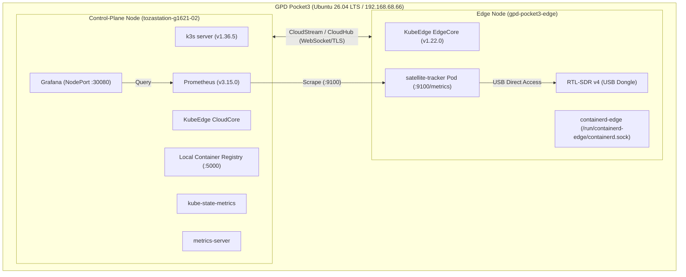

# はじめに

「自宅のベランダから、頭上を通過する超小型人工衛星（CubeSat）や宇宙ステーション（ISS）の電波を自動受信したい」
「しかも、デスクトップPCを常時回すのではなく、手のひらサイズの UMPC（GPD Pocket3）1台でエッジ観測・コンテナ分散基盤・監視可視化まで完結させたい」

そんな思いから始まったプロジェクトです。

本記事では、**Ubuntu 26.04 LTS を搭載した GPD Pocket3 単一端末上で、k3s（CloudCore）と KubeEdge（EdgeCore）を同居** させ、SDR（ソフトウェアラジオ）による衛星追尾パイプラインを Helmfile / Prometheus / Grafana で宣言的かつ超軽量（総メモリ消費 約 770MB）に構築・運用した全貌をお届けします。

特に、**「本来はクラウドとエッジの複数マシンに分けるべき KubeEdge を 1台に同居させたがために踏み抜いた、数々の地獄のシステムトラブル」** とその SRE 的な解明・解決プロセスを詳細に記録しました。エッジコンピューティングや Kubernetes 運用の参考になれば幸いです。

---

# 全体アーキテクチャ

GPD Pocket3 のローカル環境内で、Kubernetes コントロールプレーンと KubeEdge エッジノードを共存させています。



### スペックとリソース配分
- **ハードウェア**: GPD Pocket3 (Intel Core i7 / RAM 16GB / NVMe 1TB)
- **エッジ観測アプリ (`satellite-tracker`)**: Python 3.11, SGP4 軌道力学計算, NumPy FFT スペクトル解析, Prometheus Exporter
- **全体メモリ消費**: **約 770MB**（Grafana 380MB, Prometheus 335MB, kube-state-metrics 23MB, Operator 30MB）

---

# 物理とDSP（デジタル信号処理）のロマン

衛星観測パイプラインで処理している 2 つの重要な数理モデルです。

### 1. 第一宇宙速度とドップラー偏移（Doppler S-Curve）
地上約 400〜600 km の地球低軌道（LEO）を周回する人工衛星は、秒速約 7.6 km（時速 27,000 km）の超高速で移動しています。
電波の送信周波数を $f_0$、光速を $c$、観測者から衛星への相対位置ベクトルを $\vec{r}$、相対速度ベクトルを $\vec{v}$ とすると、受信周波数のドップラー偏移 $\Delta f$ は以下で表されます：

$$\Delta f = - f_0 \frac{v_r}{c} = - f_0 \frac{\vec{v} \cdot \vec{r}}{c \|\vec{r}\|}$$

| 記号 | 物理的意味 | 単位 |
| :--- | :--- | :--- |
| $f_0$ | 送信中心周波数（UHF帯: 例 435.000 MHz） | $\text{Hz}$ |
| $c$ | 真空中の光速（約 $3.0 \times 10^8$） | $\text{m/s}$ |
| $v_r = \frac{\vec{v} \cdot \vec{r}}{\|\vec{r}\|}$ | 観測者から見た衛星の視線速度（Line-of-Sight Velocity） | $\text{m/s}$ |
| $\Delta f$ | 受信周波数の偏移量（Doppler Shift） | $\text{Hz}$ |

- **AOS（信号捕捉 / 水平線から出現）直後**: 衛星が猛スピードで接近してくるため、$v_r < 0$ となり周波数が **約 +8〜10 kHz** 高く受信されます。
- **TCA（最接近時刻）**: 視線速度ベクトルがゼロ（進行方向が直角）になる瞬間、**ドップラー偏移が 0 Hz をクロス** します。
- **LOS（信号消失 / 水平線へ没入）直前**: 衛星が遠ざかるため、$v_r > 0$ となり周波数が **約 -8〜10 kHz** 急降下します。

この美しい「逆S字カーブ」が、SGP4 軌道力学による理論予測と、RTL-SDR v4 の FFT パワースペクトル解析による実測ピーク周波数で一致していく様子を Grafana でリアルタイム描画します。

### 2. 都市部マンションの「北向きベランダ視界フィルタ」
都市部の集合住宅では「南側の空は部屋の壁に遮られて見えない」という物理制約があります。
SGP4 予測器に「北天視界フィルタ（方位角 $270^\circ \to 360^\circ \to 90^\circ$、仰角 $\ge 10^\circ$）」を実装し、ベランダから電波が届くパスだけを自動判定して SDR 受信機を起動させます。

---

# 1台同居環境で踏み抜いた「地獄のトラブルシューティング8選」

ここからが本題です。1台のマシン上で k3s と KubeEdge を同居させたことで、通常は遭遇しないディープなシステム競合が次々と牙を剥きました。

---

### トラブル 1: CRIソケット共有による「Pod 殺し合いループ」
- **現象**: Pod を起動すると、数秒後に `Unknown` や `Terminating` になり、再作成されては消える無限ループが発生。
- **メカニズム**:
  - k3s の kubelet と KubeEdge の edged が、同一の `/run/k3s/containerd/containerd.sock` を参照していた。
  - k3s 側の kubelet は「自分の管理外のコンテナが containerd にいる（edged の Pod）」と判断してコンテナを GC 削除。
  - edged 側も「自分の管理外のコンテナがいる（k3s の Pod）」と判断して GC 削除。
  - **両者が互いの Pod を「不正な野良コンテナ」とみなして殺し合うデスループ** に陥っていた。
- **解決策**:
  - エッジ専用の `containerd-edge.service` を立ち上げ、ソケットを `/run/containerd-edge/containerd.sock` に完全分離。
  - `edgecore.yaml` の `runtimeType: "remote"`, `remoteRuntimeEndpoint: "unix:///run/containerd-edge/containerd.sock"` を指定して平和が訪れた。

---

### トラブル 2: CNI ブリッジ名の重複衝突 (`cni0`)
- **現象**: エッジ側でコンテナを起動しようとすると、`failed to setup network: bridge cni0 already exists with different IP` でネットワーク設定が失敗。
- **メカニズム**:
  - k3s 側の Flannel CNI がすでに `cni0`（`10.42.0.1/24`）というブリッジを作成していた。
  - エッジ側の containerd がデフォルトの `/etc/cni/net.d/10-containerd-net.conflist` を読んだところ、そこにも `"bridge": "cni0"`（`10.42.3.1/24`）と定義されていたため、同一名で異なる CIDR を持つブリッジを作ろうとしてカーネルで衝突。
- **解決策**:
  - エッジ用の CNI 定義を `"bridge": "edge-cni0"` にリネームして分離。

---

### トラブル 3: 推奨 iptables DNAT による「Self-loopback 自爆」
- **現象**: `edgecore` のログに `edged.go:660] internal error and status code: 400` が 50ms ごとに無限出力され、ノード初期化が終わらない。
- **メカニズム**:
  - KubeEdge 公式ドキュメントにある推奨ルール：
    ```bash
    sudo iptables -t nat -A OUTPUT -p tcp --dport 10350 -j DNAT --to 127.0.0.1:10003
    ```
    は本来、「別マシンの Cloud 側からエッジ宛て（10350）の通信を CloudStream トンネル（10003）に中継する」ためのもの。
  - 1台同居環境でこのルールを無邪気に入れると、`edged` 自身が自分自身の起動確認のために叩く `http://localhost:10350/healthz/syncloop`（HTTP 平文）まで CloudStream の HTTPS（TLS）ポート `10003` に強制転送されてしまう。
  - CloudStream は「HTTPS ポートに平文 HTTP リクエストが来た」ので当然 `400 Bad Request` を返し、`edged` はヘルスチェック失敗とみなして自滅していた。
- **解決策**:
  - 1台同居環境ではこのルールは不要。即座に削除して解決。

---

### トラブル 4: テイント欠落による「アドオン Pod のエッジ誤配置事故」
- **現象**: `metrics-server` などのクラスタ管理 Pod が `gpd-pocket3-edge`（エッジ側）にスケジュールされ、即死。
- **メカニズム**:
  - KubeEdge のエッジノードは軽量化されており、API Server 直結のフルトポロジーを持たない。
  - エッジノードにテイントが付いていないと、K8s スケジューラは「空いている通常ワーカーノード」とみなして重要なコントロールプレーン系アドオンをエッジに配置してしまう。
- **解決策**:
  - エッジノードに `node-role.kubernetes.io/edge:NoSchedule` を付与。
  - エッジで動かしたい観測 Pod（`satellite-tracker` 等）にのみ明示的に `tolerations` を設定してワークロードを厳格に隔離。

---

### トラブル 5: non-root Pod と emptyDir の権限罠
- **現象**: `metrics-server` が `panic: error creating self-signed certificates: open /tmp/apiserver.crt: permission denied` でクラッシュ。
- **メカニズム**:
  - コンテナは非 root（`runAsUser: 1000`）で動作。
  - `/tmp` には `emptyDir` がマウントされていたが、Pod の `securityContext.fsGroup` が未定義だったため、マウントディレクトリの所有権が `root:root (0755)` になり、一般ユーザーから証明書ファイルを作成できなかった。
- **解決策**:
  - Deployment に `pod.spec.securityContext.fsGroup: 1000` を付与し、さらにエッジノードの cAdvisor スクレイプ用に `--kubelet-insecure-tls` を追加して解決。

---

### トラブル 6: Prometheus CRD 投入時の「256KB アノテーション上限」
- **現象**: `helm show crds ... | kubectl apply -f -` を実行したところ、以下のエラーで失敗：
  ```text
  CustomResourceDefinition ... "prometheuses.monitoring.coreos.com" is invalid:
  metadata.annotations: Too long: may not be more than 262144 bytes
  ```
- **メカニズム**:
  - 通常の `kubectl apply`（Client-Side Apply）は、差分計算のために `kubectl.kubernetes.io/last-applied-configuration` というアノテーションにマニフェスト JSON 全文を保存する。
  - しかし Kubernetes（etcd）において、アノテーション 1 つの最大容量は **262,144 bytes（256KB）**。
  - 近年の Prometheus Operator CRD（OpenAPI v3 スキーマ）は非常にリッチで巨大なため、256KB 制限を軽々突破してしまう。
- **解決策**:
  - **Server-Side Apply (SSA)** を利用：
    ```bash
    helm show crds prometheus-community/kube-prometheus-stack | kubectl apply --server-side -f -
    ```
  - SSA はアノテーションではなく API Server 側の `managedFields` で管理するため、256KB 制限を受けずに一撃で適用できる。

---

### トラブル 7: `spec.retentionSize` の OpenAPI 正規表現バリデーション
- **現象**: Helmfile 適用時にバリデーションエラー：
  ```text
  spec.retentionSize in body should match '(^0|([0-9]*[.])?[0-9]+((K|M|G|T|E|P)i?)?B)$'
  ```
- **メカニズム**:
  - Kubernetes のリソース指定（PVC 等）では `2Gi`（2 Gibibytes）と書くのが通例。
  - しかし Prometheus の TSDB 仕様（`--storage.tsdb.retention.size`）は末尾に **`B`**（Bytes）を要求する（例: `2GiB`）。
  - Prometheus Operator の CRD でも厳格な正規表現で末尾 `B` を強制しているため、`2Gi` だと弾かれる。
- **解決策**:
  - `retentionSize: "2GiB"` と明記。

---

### トラブル 8: edged による「孤児ボリューム物理削除ループ」
- **現象**: `node-exporter` が `Exit Code: 137` で `CrashLoopBackOff` を繰り返す。Pod イベントには `open /var/lib/kubelet/pods/<UID>/etc-hosts: no such file or directory` と `Pod sandbox changed` が無限記録される。
- **メカニズム**:
  - `node-exporter` を control-plane ノード上に配置した際、同じマシンで root 権限で稼働している KubeEdge の `edgecore`（内蔵 edged）がローカルの `/var/lib/kubelet/pods` ディレクトリを巡回走査した。
  - `edgecore` は「この Pod UID はエッジノード（`gpd-pocket3-edge`）に割り当てられた Pod ではない（＝孤児ボリューム orphaned pod volumes だ！）」と誤認。
  - `edgecore` のログ：
    ```text
    edgecore: Cleaned up orphaned pod volumes dir podUID="3816f16f..." path="/var/lib/kubelet/pods/3816f.../volumes"
    ```
  - **k3s kubelet が Pod を起動するそばから、edged が 2 秒おきにそのボリューム（etc-hosts 等）を物理削除していた！**
  - kubelet は足元を消されたため「サンドボックス破損」とみなしてプロセスを SIGKILL（137）し、再作成ループに陥っていた。
- **解決策**:
  - 1台同居環境では、ホストファイルシステム直結の DaemonSet を無理に動かすのはアンチパターン。
  - ノードメトリクスは `metrics-server`（k3s/edged の API 経由）で完全に取得できているため、`node-exporter` は無効化（`enabled: false`）して解決。

---

# 稼働結果と Grafana 可視化

すべての地獄を突破し、安定稼働に到達したクラスタ状態です。

### 1. Pod 稼働状況（All Green）
```bash
$ kubectl get pods -A
NAMESPACE            NAME                                                        READY   STATUS    AGE
container-registry   local-registry-9d959d85f-j2656                              1/1     Running   35m
default              satellite-tracker-59994966b5-vlzjp                          1/1     Running   30m
kube-system          coredns-7cfb7bc9c7-2rbxd                                    1/1     Running   122m
kube-system          local-path-provisioner-77b9867795-wbdkx                     1/1     Running   122m
kube-system          metrics-server-6f58cdc499-mzswn                             1/1     Running   26m
kubeedge             cloud-iptables-manager-nxww4                                1/1     Running   116m
kubeedge             cloudcore-7499476549-t29qs                                  1/1     Running   116m
monitoring           kube-prometheus-stack-grafana-79d88bc745-4d5cz              3/3     Running   8m
monitoring           kube-prometheus-stack-kube-state-metrics-687686d88b-64xr8   1/1     Running   10m
monitoring           kube-prometheus-stack-operator-bdbf4977d-jxftd              1/1     Running   10m
monitoring           prometheus-kube-prometheus-stack-prometheus-0               2/2     Running   9m
```

### 2. メモリ消費量（超軽量 約 770MB）
```bash
$ kubectl top pods -n monitoring
NAME                                                        CPU(cores)   MEMORY(bytes)   
kube-prometheus-stack-grafana-79d88bc745-4d5cz              17m          382Mi           
kube-prometheus-stack-kube-state-metrics-687686d88b-64xr8   2m           23Mi            
kube-prometheus-stack-operator-bdbf4977d-jxftd              15m          30Mi            
prometheus-kube-prometheus-stack-prometheus-0               11m          335Mi           
```

### 3. Grafana ダッシュボード
Grafana（NodePort 30080）にて、以下のパネルがリアルタイムに更新されています：
- **追尾ステータス（Stat）**: 現在追尾中の衛星名（CAS-4A / ISS）と状態（TRACKING / IDLE）
- **ドップラーS字カーブ（Time Series）**: 理論計算ドップラー偏移 vs RTL-SDR FFT 実測周波数ピーク
- **受信強度 RSSI（Gauge & Time Series）**: 受信ピーク電力（dBFS）の推移
- **次回パスへのカウントダウン（Stat）**: 次回北の空に現れるまでの残り秒数

---

# まとめ

1台の GPD Pocket3 上で k3s と KubeEdge を同居させる試みは、想像以上にエキサイティングな SRE トラブルの宝庫でした。

- **CRI や CNI、ディレクトリパスの衝突**: 仮想化やコンテナの抽象化の下にある「Linux カーネルとファイルシステムの真の姿」と向き合う最高の教材となりました。
- **エッジ観測のレジリエンス**: 現場のエッジ側が一時的にネットワーク断になろうとも、SDR 観測ループはローカルで回り続け、再接続時にテレメトリが統合されるという「エッジコンピューティング本来の価値」を実感できました。

今後は、この基盤を活用して **21cm 中性水素線（1420MHz）による天の川銀河の回転曲線測定** や、複数台体制への分散スケールアウトを進めていきます！

---

### リポジトリ
本プロジェクトの全マニフェスト、Helmfile、エッジ観測 Python スクリプトは GitHub にて公開しています：
👉 [github.com/tozastation/radio-astronomy](https://github.com/tozastation/radio-astronomy)
