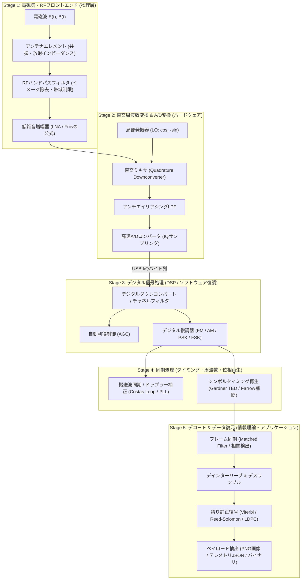

# 電波受信・信号処理・デコードの仕組みとパイプライン詳解

本ドキュメントでは、空間を伝搬する電磁波がアンテナによって捕捉され、アナログRF回路、直交ミキサ、A/D変換器（ADC）、デジタル信号処理（DSP）、そして最終的なデータ/画像としてデコードされるまでの一連の物理的・数学的・アルゴリズム的メカニズムを解説します。
大学初年級・高校数学（三角関数、複素数、ベクトル、微積分）および基礎物理の視点から、**各公式の記号の意味・日本語での読み解き・途中式の展開** を網羅しています。

---

## 1. 全体パイプライン

電波を受信してデジタルデータを取り出す処理は、以下の5つのステージに分解されます。

---

## 2. Stage 1: アンテナとRFフロントエンドの物理

### 2.1 電磁波から高周波起電力への変換

空間を伝搬する電磁波がアンテナ導体に当たると、ファラデーの電磁誘導の法則およびローレンツ力により、アンテナの両端に起電力（高周波交流電圧）が発生します。

$$\mathcal{E} = \oint_C \vec{E} \cdot d\vec{l} = -\frac{\partial}{\partial t} \iint_S \vec{B} \cdot d\vec{S}$$

#### 🔍 数式の構成要素と記号の意味
| 記号 | 名称 | 物理的な意味・単位 |
| :--- | :--- | :--- |
| $\mathcal{E}$ | 誘導起電力 | アンテナの給電点（コネクタ部）に生じる電圧 $[\text{V}]$ |
| $\vec{E}$ | 電場ベクトル | 空間を飛ぶ電波の電場の強さと向き $[\text{V/m}]$ |
| $d\vec{l}$ | 微小線素 | アンテナ素子（導体棒）に沿った微小な長さベクトル |
| $\oint_C \vec{E} \cdot d\vec{l}$ | 電場の線積分 | アンテナ導体に沿って電子を動かす仕事（電圧）の総和 |
| $\vec{B}$ | 磁束密度ベクトル | 空間を飛ぶ電波の磁場の強さと向き $[\text{T}]$ (テスラ) |
| $d\vec{S}$ | 微小面積素 | アンテナ回路が囲む微小なループの法線面積ベクトル |
| $\iint_S \vec{B} \cdot d\vec{S}$ | 磁束 $\Phi$ | アンテナの輪を貫く磁力線の総本数 $[\text{Wb}]$ (ウェーバ) |
| $-\frac{\partial}{\partial t}$ | 時間微分（偏微分） | 「時間あたりの変化のスピード」。負符号は変化を妨げる向き（レンツの法則） |

#### 💬 日本語で読み解く数式
> **「アンテナが囲む空間を貫く磁場が時間とともに激しく変化すると、その変化を打ち消そうとする向きに電子を動かす力（電場）が生じ、導体に沿って積分された結果としてアンテナ端子に交流電圧 $\mathcal{E}$ が現れる」**

> [!NOTE]
> #### 💡 初学者のための物理コラム：なぜ金属棒に電波が当たると電気が起きるのか？
> 金属（アンテナ素子）の中には、自由に動き回れる「自由電子」が無数に存在します。
> 空間を飛んでくる電磁波の正体は「周期的に向きが変わる電場 $\vec{E}$ と磁場 $\vec{B}$」です。
> - 電場が上向きになると、マイナスの電荷を持つ電子は下向きに引っ張られます（クーロン力 $\vec{F} = q\vec{E}$）。
> - 次の瞬間、電場が下向きになると、電子は上向きに引っ張られます。
> 
> このように電磁波の振動周波数に合わせて導体内の電子が一斉に往復運動を始めます。**「電子の移動＝電流」** ですから、アンテナの端子には電波と全く同じ周波数・振幅の高周波交流電圧（起電力）が現れます。

---

### 2.2 アンテナの共振とインピーダンス整合

アンテナが電波を効率よく吸収・放出する条件は、電気長が波長 $\lambda = c / f$ の整数倍または分数倍（$\lambda/2$ ダイポール、$\lambda/4$ モノポールなど）となり、素子上で定在波が形成される共振状態です。

- **入力インピーダンス**:
  $$Z_{in} = R_{rad} + R_{loss} + jX_A$$
- **反射係数 $\Gamma$ と電圧定在波比 (SWR)**:
  $$\Gamma = \frac{Z_{in} - Z_0}{Z_{in} + Z_0}, \quad \text{SWR} = \frac{1 + |\Gamma|}{1 - |\Gamma|}$$

#### 🔍 数式の構成要素と記号の意味
| 記号 | 名称 | 物理的な意味 |
| :--- | :--- | :--- |
| $Z_{in}$ | 入力インピーダンス | アンテナ給電点から見た交流抵抗 $[\Omega]$（複素数） |
| $R_{rad}$ | 放射抵抗 | 電波をエネルギーとして空間に放出・吸収する実効抵抗分 |
| $R_{loss}$ | 損失抵抗 | アンテナ素子の金属抵抗によって熱に逃げるロス分 |
| $X_A$ | アンテナリアクタンス | アンテナが持つインダクタンス（コイル成分）やキャパシタンス（コンデンサ成分）。共振時は $X_A = 0$ となる |
| $Z_0$ | 特性インピーダンス | 同軸ケーブルやSDR受信機内部の基準抵抗（通常 $50\ \Omega$） |
| $\Gamma$（ガンマ） | 反射係数 | 入射した電波の電圧に対して、境界面で跳ね返される電圧の比率（$-1 \le \Gamma \le 1$） |
| $\text{SWR}$ | 電圧定在波比 | ケーブル内に発生する定在波の最大電圧と最小電圧の比（$1.0 \le \text{SWR} < \infty$） |

#### 💬 日本語で読み解く数式
> 1. **反射係数 $\Gamma$**:
>    アンテナのインピーダンス $Z_{in}$ と同軸ケーブルの抵抗 $Z_0$ がピッタリ一致（$Z_{in} = Z_0$）していると、分子がゼロになり $\Gamma = 0$ となります。すなわち**「反射波ゼロで、電波のエネルギーが100%ケーブルに吸い込まれる」** ことを意味します。
> 2. **定在波比 $\text{SWR}$**:
>    完全一致なら $\text{SWR} = \frac{1+0}{1-0} = 1.0$（理想値）。逆にアンテナが断線していると $Z_{in} = \infty$ となり、$\Gamma = 1$、$\text{SWR} = \infty$ となって電波はすべて跳ね返され、受信機に全く届きません。

> [!TIP]
> #### 💡 初学者のための物理・数学コラム：共振とインピーダンス整合の直感イメージ
> 1. **ブランコの共振（なぜ長さが波長に関係するのか？）**:
>    ブランコに乗った人をタイミングよく押すと、わずかな力でも大きく揺れます。
>    アンテナの両端は開放されているため、電子が端に到達すると壁に当たった波のように反射します。アンテナの長さを波長 $\lambda$ の半分（$\lambda/2$）に揃えると、往復して戻ってきた波と新しく入ってきた波の山と谷が完全に重なり合い（強め合いの干渉）、電子の揺れが最大（定在波の共振）になります。
> 2. **インピーダンス整合（最大電力伝送定理）**:
>    水路の幅が急に狭くなったり広くなったりすると、水の波が境界面で跳ね返ります。
>    電気回路でも、アンテナの抵抗値 $Z_{in}$ と同軸ケーブルの特性インピーダンス $Z_0$（50 $\Omega$）が一致していないと、電波のエネルギーが同軸ケーブルの入り口で反射波となって跳ね返ってしまい、SDRチューナーまで届きません。

---

### 2.3 初段低雑音増幅（LNA）とフリスの伝達公式 (Friis' Formula)

アンテナ直下に低雑音増幅器（LNA）を配置する根拠は、直列（カスケード）接続された受信回路全体のノイズ性能を決定づける **フリスの公式** にあります。

$$F_{total} = F_1 + \frac{F_2 - 1}{G_1} + \frac{F_3 - 1}{G_1 G_2} + \dots + \frac{F_n - 1}{\prod_{k=1}^{n-1} G_k}$$

#### 🔍 数式の構成要素と記号の意味
| 記号 | 名称 | 物理的な意味 |
| :--- | :--- | :--- |
| $F_{total}$ | トータル雑音係数 | システム全体で「どれだけS/N比が悪化したか」の比率（真数表現）。理想値は $F=1$（ノイズ追加ゼロ） |
| $F_1, F_2, F_3$ | 各段の雑音係数 | 第1段（LNA）、第2段（同軸ケーブルの減衰）、第3段（SDRチューナー）がそれぞれ独自に付加してしまうノイズ |
| $G_1, G_2$ | 各段の電力利得 | 第1段、第2段が信号を何倍に増幅するか（ケーブルの場合は損失なので $G < 1$） |

#### 💬 日本語で読み解く数式
> **「第2段以降で発生するノイズ $(F_2 - 1)$ や $(F_3 - 1)$ は、初段アンプの利得 $G_1$ で割られて極小化される。したがって、システム全体のノイズの良し悪しは、ほぼ100%『一番最初に電波を通すアンプ（LNA）のノイズ $F_1$』だけで決まる」**
> 
> これが、「長い同軸ケーブルを部屋に引き込んだ後（PC側）でいくらアンプを付けても手遅れで、必ずアンテナ直下にLNAを置かなければならない」理由です。

---

## 3. Stage 2: 直交周波数変換（Quadrature Downconversion）とADC

### 3.1 スーパーヘテロダインと周波数変換

高周波（RF）を低い中間周波数（IF）やベースバンドへ落とすため、局所発振器（Local Oscillator, LO）の正弦波とアナログ乗算器（ミキサ）で掛け合わせます。

$$\cos(\omega_{RF} t) \cos(\omega_{LO} t) = \frac{1}{2} \left[ \cos((\omega_{RF} - \omega_{LO}) t) + \cos((\omega_{RF} + \omega_{LO}) t) \right]$$

#### 🔍 数式の展開ステップ
高校数学の「三角関数の加法定理」から導かれます：
1. $\cos(\alpha - \beta) = \cos\alpha \cos\beta + \sin\alpha \sin\beta$
2. $\cos(\alpha + \beta) = \cos\alpha \cos\beta - \sin\alpha \sin\beta$
3. 両辺を足し合わせると、$\sin$ の項が相殺して消えます：
   $$\cos(\alpha - \beta) + \cos(\alpha + \beta) = 2 \cos\alpha \cos\beta$$
4. 両辺を 2 で割れば、上の公式が導出されます。

#### 💬 日本語で読み解く数式
> **「2つの異なる周波数の波を掛け算すると、必ず『周波数の引き算（差）』と『周波数の足し算（和）』の2つの新しい波が半分ずつの強さで生まれる」**
> 
> ここで、ローパスフィルタ（LPF）を通せば、高周波の「和」成分は遮断され、**「差」の成分 $|\omega_{RF} - \omega_{LO}|$ だけ** を取り出すことができます。これにより、例えば 137.91 MHz の電波を、安価な低速回路で処理できる数十kHz〜数MHzの波へダウンコンバートできます。

---

### 3.2 直交復調（IQ直交サンプリング）の数学的必然性

実数信号単体のダウンコンバートでは、中心周波数より高い信号 $f_{LO} + \Delta f$ と低い信号 $f_{LO} - \Delta f$ の双方が同一の差分周波数 $\Delta f$ に折り返してしまい、符号が判別できません（イメージ妨害）。

$$\cos((+\Delta \omega) t) = \cos((-\Delta \omega) t)$$

これを解決するため、LO信号を90度移相させた2つの信号（同相成分 $\cos$ と直交成分 $-\sin$）を用意し、別々にミキシングします。

$$I(t) = \text{LPF}\left\{ s(t) \cdot 2\cos(\omega_{LO} t) \right\}$$
$$Q(t) = \text{LPF}\left\{ s(t) \cdot (-2\sin(\omega_{LO} t)) \right\}$$

これにより、入力RF信号 $s(t)$ はオイラーの公式を用いて複素解析信号（Analytic Signal） $z(t)$ として表現されます。

$$z(t) = I(t) + j Q(t) = A(t) e^{j \phi(t)}$$

- **瞬時振幅（包絡線）**: $A(t) = \sqrt{I(t)^2 + Q(t)^2}$
- **瞬時位相**: $\phi(t) = \operatorname{atan2}(Q(t), I(t))$
- **瞬時周波数偏差**: $f(t) = \frac{1}{2\pi} \frac{d\phi(t)}{dt}$

#### 🔍 複素数化による正負周波数の分離メカニズム
オイラーの公式 $e^{j\theta} = \cos\theta + j\sin\theta$ より：
- 正の周波数（$+ \Delta \omega$）:
  $$z_+(t) = e^{j(+\Delta \omega) t} = \cos(\Delta \omega t) + j \sin(\Delta \omega t)$$
  複素平面上で原点を中心に **反時計回り** に回転するベクトル。
- 負の周波数（$- \Delta \omega$）:
  $$z_-(t) = e^{j(-\Delta \omega) t} = \cos(-\Delta \omega t) + j \sin(-\Delta \omega t) = \cos(\Delta \omega t) - j \sin(\Delta \omega t)$$
  複素平面上で原点を中心に **時計回り** に回転するベクトル。

実数部（$I = \cos$）だけを見ると両者は全く同一ですが、虚数部（$Q = \pm \sin$）を併せ持つことで、**符号（回転方向）が数学的に100%区別可能** になります。

> [!TIP]
> #### 💡 初学者のための幾何学コラム：なぜIQ（複素数）だと回転方向がわかるのか？
> 振り子が左右に揺れている様子を真横から見ると、行きの波と帰りの波の区別がつきません。実数 $\cos(\theta)$ は、複素平面上の円運動を「横軸だけに投影した影」だからです。影だけ見ていると、時計回りに回っているのか反時計回りに回っているのか区別がつきません。
> 
> しかし、**「横軸の影（$I = \cos\theta$）」** と同時に **「縦軸の影（$Q = \sin\theta$）」** を記録すればどうでしょうか？
> - $I$ が増えてから $Q$ が増える $\to$ **反時計回り（正の周波数 $+f$）**
> - $I$ が増えてから $Q$ が減る $\to$ **時計回り（負の周波数 $-f$）**
> 
> このように、$I$（同相）と $Q$（直交）のペアを複素数 $(I + jQ)$ として扱うことで、中心周波数より高い電波と低い電波を一切混同せずに分離できるようになります。

---

### 3.3 A/D変換とサンプリング定理

- **サンプリング定理**: 帯域幅 $B$ の実数信号を再現するには $f_s \ge 2B$ が必要ですが、直交サンプリング（$I$ と $Q$ の2系列）を行う場合、複素サンプリングレート $f_s$ で帯域幅 $B = f_s$ の全帯域を完全に網羅できます。
- **量子化ビット数とダイナミックレンジ**:
  $$\text{SQNR} \approx 6.02 N + 1.76 \text{ [dB]}$$

#### 🔍 数式の係数の由来
- **$6.02$ の由来**: $20 \log_{10}(2) \approx 6.0206$。1ビット増えるごとに表現できる電圧分解能が 2倍（2進数の桁上がり）になるため、電圧比のデシベル計算で約 6 dB 改善します。
- **$1.76$ の由来**: 正弦波信号の実効電力（RMS: $V_{pp} / (2\sqrt{2})$）と、一様量子化誤差（$- \Delta/2 \sim + \Delta/2$ の一様分布）の持つノイズ分散（$\sigma^2 = \Delta^2 / 12$）の比率をデシベル換算した値（$10 \log_{10}(1.5) \approx 1.7609 \text{ dB}$）です。

RTL-SDR（$N=8$ bit）の場合：
$$\text{SQNR} \approx 6.02 \times 8 + 1.76 = 49.92 \text{ dB}$$
となり、最大信号と量子化ノイズの比率は約 50 dB（約10万倍の電力比）となります。

---

## 4. Stage 3: デジタル信号処理（DSP）と復調アルゴリズム

### 4.1 チャネルフィルタリング（FIRフィルタ）

目的帯域幅に合わせた有限インパルス応答（FIR）フィルタを通し、不要な隣接信号や帯域外ノイズを除去します。

$$y[n] = \sum_{k=0}^{M-1} h[k] \cdot z[n-k]$$

#### 🔍 数式の構成要素と記号の意味
| 記号 | 名称 | 意味 |
| :--- | :--- | :--- |
| $y[n]$ | 出力サンプル | フィルタを通過した後の $n$ 番目の新しい信号サンプル |
| $M$ | フィルタタップ数 | 計算に用いる「過去のデータの個数」（例: 64タップ、128タップなど） |
| $h[k]$ | フィルタ係数 | 各過去サンプルに掛け合わせる重み（インパルス応答） |
| $z[n-k]$ | 入力サンプル | 現在から $k$ サンプル前の過去のIQデータ |

#### 💬 日本語で読み解く数式
> **「現在のサンプルと過去 $M-1$ 個のサンプルに対し、あらかじめ設計した重み係数 $h[k]$ をそれぞれ掛けて足し合わせる（畳み込み積分）」**
> 
> 本質は株価チャートの**「重み付き移動平均」**です。重みの形を数学的にうまく設計することで、高周波の不要なノイズ成分を滑らかにして落とし、目的の周波数帯だけを急峻に通過させます。

---

### 4.2 FM（周波数変調）復調アルゴリズム

FM変調は、送信情報 $m(t)$ に応じて搬送波の瞬時周波数が変化する変調方式です。

$$s_{FM}(t) = A \cos\left( \omega_c t + 2\pi k_f \int_0^t m(\tau) d\tau \right)$$

離散複素信号 $z[n]$ において、瞬時周波数は隣接サンプル間の位相差 $\Delta \phi[n] = \phi[n] - \phi[n-1]$ に比例します。$\operatorname{atan2}$ の直接演算は高コストであるため、**共役複素数の乗算** を用いた以下の手法が実装されます。

$$z[n] \cdot z^*[n-1] = |z[n]| |z[n-1]| e^{j(\phi[n] - \phi[n-1])}$$

$$\Delta \phi[n] = \operatorname{atan2}\left( I[n-1]Q[n] - Q[n-1]I[n], \; I[n]I[n-1] + Q[n]Q[n-1] \right)$$

#### 🔍 代数展開のステップ（なぜこの式になるのか？）
1. $n$ 番目のサンプル: $z[n] = I[n] + j Q[n]$
2. 1つ前のサンプル $z[n-1] = I[n-1] + j Q[n-1]$ の共役複素数は、虚数部の符号を反転させたもの:
   $$z^*[n-1] = I[n-1] - j Q[n-1]$$
3. 両者を普通に掛け算します（$j^2 = -1$ に注意）：
   $$z[n] \cdot z^*[n-1] = (I[n] + j Q[n])(I[n-1] - j Q[n-1])$$
   $$= I[n]I[n-1] - j I[n]Q[n-1] + j Q[n]I[n-1] - j^2 Q[n]Q[n-1]$$
   $$= \underbrace{(I[n]I[n-1] + Q[n]Q[n-1])}_{\text{実数部 } X} + j \underbrace{(I[n-1]Q[n] - Q[n-1]I[n])}_{\text{虚数部 } Y}$$
4. この複素数の角度（偏角）は、$\operatorname{atan2}(Y, X)$ で求まります。
   $$\Delta \phi[n] = \operatorname{atan2}(Y, X)$$

#### 💬 日本語で読み解く数式
> **「複素数の世界では、共役複素数を掛けると『角度の引き算（位相差）』が求まる。したがって、サンプル同士の四則演算（掛け算と引き算）を数回行って最後に $\operatorname{atan2}$ を1回呼ぶだけで、前回のサンプルから位相が何度進んだか（＝瞬時周波数）が瞬時に求まる」**

---

### 4.3 AM（振幅変調）復調（包絡線検波）

搬送波の振幅に輝度や情報が乗っている場合、複素サンプルの絶対値を算出します。

$$A[n] = \sqrt{I[n]^2 + Q[n]^2}$$

#### 💬 日本語で読み解く数式
> **「複素平面上で $(I, Q)$ の座標と原点を結ぶベクトルの長さを、三平方の定理（ピタゴラスの定理）で計算する」**
> 
> 搬送波が激しくプラスマイナスに振動していても、複素ベクトルの長さを取れば、波の外枠（エンベロープ／包絡線）の大きさだけが綺麗に取り出せます。

---

## 5. Stage 4: 同期処理（Synchronization）

### 5.1 シンボルタイミング再生（Gardner Timing Error Detector）

送信シンボルレートと受信機サンプリングクロックの微小なズレを検出し、最適なサンプリング瞬時値を特定します。

$$e[n] = y_I\left[n - \frac{1}{2}\right] \left( y_I[n] - y_I[n-1] \right) + y_Q\left[n - \frac{1}{2}\right] \left( y_Q[n] - y_Q[n-1] \right)$$

#### 🔍 数式の構成要素と記号の意味
| 記号 | 名称 | 幾何学的な意味 |
| :--- | :--- | :--- |
| $e[n]$ | タイミング誤差 | 正ならサンプリングタイミングが「遅れている」、負なら「進んでいる」 |
| $y_I[n], y_I[n-1]$ | ストロボ点 | 現在のシンボル中心、および1つ前のシンボル中心でのサンプル値 |
| $y_I[n - 1/2]$ | 遷移点 | シンボルとシンボルのちょうど境界（真ん中）でのサンプル値 |
| $(y[n] - y[n-1])$ | シンボルの傾き | 前後のシンボル値の差（波形が右肩上がりか右肩下がりか） |

#### 💬 日本語で読み解く数式
> **「シンボルの遷移境界での値 $y[n - 1/2]$ と、前後のシンボルの傾き $(y[n] - y[n-1])$ を掛け合わせることで、サンプリング点が左右どちらにズレているかを検出する」**
> 
> タイミングが完璧であれば、シンボルの境界点はゼロクロス（$y[n-1/2] = 0$）を通過するため誤差 $e[n] = 0$ となります。タイミングがズレて $e[n] \ne 0$ になると、Farrow補間フィルタを駆動してサンプリング位相を微調整します。

---

## 6. Stage 5: フレーム同期・誤り訂正・デコード

### 6.1 フレーム同期（相関検出 / Matched Filter）

受信した連続ストリームからパケットや画像行の開始位置を同定するため、既知のビットパターン（プリアンブル / Sync Word）との相互相関（Cross-Correlation）を計算します。

$$R_{xy}[k] = \sum_{n} x[n] \cdot s[n-k]$$

#### 🔍 数式の構成要素と記号の意味
| 記号 | 名称 | 意味 |
| :--- | :--- | :--- |
| $R_{xy}[k]$ | 相互相関値 | 受信信号と既知パターンを $k$ サンプルずらしたときの「一致度スコア」 |
| $x[n]$ | 受信信号列 | アンテナから入ってきた未知のデータサンプル列 |
| $s[n-k]$ | 既知パターン | あらかじめ分かっている同期信号（Sync Word）を時間軸上で $k$ だけスライドさせた波形 |
| $\sum_n$ | 総和 | 各サンプル同士を掛け合わせて足し合わせた値（ベクトルの内積） |

#### 💬 日本語で読み解く数式
> **「高校数学のベクトルの内積 $\vec{x} \cdot \vec{s} = |\vec{x}| |\vec{s}| \cos\theta$ そのもの。既知パターンの波形ベクトルを受信データの上に少しずつスライドさせ、波形の形がピッタリ一致した瞬間に内積（相関値）が巨大なスパイク（ピーク）となる。そのピークの場所がフレームの先頭である」**

---

## 7. まとめ：全体の数学的・物理的つながり

| ステージ | 主な物理・数学的メカニズム | 得られる成果 |
| :--- | :--- | :--- |
| **Stage 1 (アンテナ・RF)** | ファラデーの電磁誘導、共振（定在波）、インピーダンス整合、フリスの公式 | 空間電波を低ノイズなRF高周波電流として捕捉 |
| **Stage 2 (直交変換・ADC)** | 三角関数の積和（唸り）、オイラーの公式（複素解析信号）、サンプリング定理 | ギガ/メガHzの高周波を、正負周波数が分離されたデジタルIQバイト列へ変換 |
| **Stage 3 (ソフトウェア復調)** | FIR畳み込み（重み付き移動平均）、共役複素数乗算による位相微分、三平方の定理 | IQデータから元の音声PCM波形やピクセル輝度（明暗）を抽出 |
| **Stage 4 (同期処理)** | 位相同期（Costas Loop）、Gardnerタイミング誤差検出器、多項式補間 | ドップラーシフトや水晶クロックの微小なズレを自動補正 |
| **Stage 5 (デコード・復元)** | ベクトルの内積（相互相関・Matched Filter）、ビタビ/リードソロモン復号 | 同期パターンの検出により行・パケットを揃え、PNG画像やテレメトリを確定 |

---

## 参考文献・一次情報
- [Software-Defined Radio for Engineers (Analog Devices / Travis F. Collins et al.)](https://www.analog.com/en/resources/analog-dialogue/articles/software-defined-radio-for-engineers.html)
- [Digital Signal Processing in Modern Communication Systems (Schwarzinger, 2022)](https://link.springer.com/)
- [NOAA KLM User's Guide (NOAA NESDIS)](https://www.star.nesdis.noaa.gov/jpss/documents/UserGuides/NOAA_KLM_Users_Guide.pdf)
- [RTL-SDR Blog V4 Technical Specifications](https://www.rtl-sdr.com/rtl-sdr-blog-v4-dongle-initial-release/)
- [GNU Radio Guided Tutorials (DSP & SDR Architecture)](https://wiki.gnuradio.org/index.php/Guided_Tutorials)
