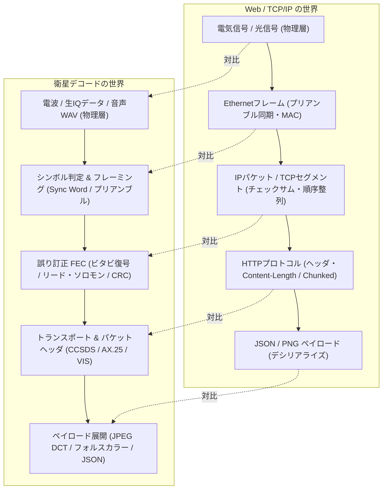
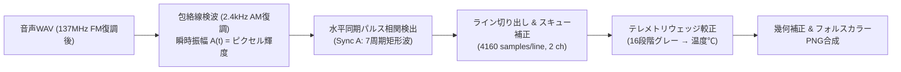
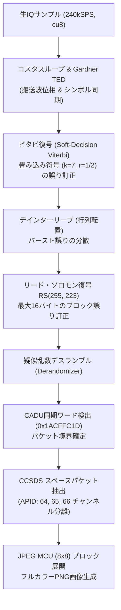
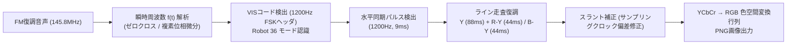

# 衛星データデコード処理・アルゴリズム詳解（音声・生IQから画像・テレメトリへの変換プロセス）

本ドキュメントでは、受信機（SDR）で録音された「ザーザー・ピロピロ」という音声（WAV）や生IQサンプル（バイト列）から、**どのようなアルゴリズムとプロトコル階層を経て、最終的な地球観測画像（PNG）やテレメトリ（JSON）に変換されるのか** を解説します。

WebAPIやTCP/IP、ネットワークプロトコルスタックに親しみのあるエンジニア向けに、**「Webの世界でいうHTTP/TCPのどの概念に対応する処理なのか」** を対比させながら、無線工学・デジタル信号処理（DSP）・情報理論の数理的メカニズムを解説します。

---

## 1. ネットワーク・Webプロトコルとの対比（OSI参照モデル）

Web通信において、LANケーブルを流れる電気信号からJSONボディを取り出すのと同様に、宇宙からの電波信号も階層的なプロトコルスタックを経てパースされます。



### 階層別メカニズム対比表

| 階層 | Web / TCP/IP | 衛星通信 / デコード | 衛星信号処理で何をしているか？ |
| :--- | :--- | :--- | :--- |
| **L1 (物理層)** | LANケーブルの電圧、光ファイバ | 電波（137MHz/145MHz/436MHz）、直交IQサンプル、音声WAV | アナログ電波を直交周波数変換（ダウンコンバート）し、複素数サンプル列として捕捉する |
| **L2 (データリンク層)** | Ethernetプリアンブル（`0xAA..`）、SFD（`0xAB`） | **フレーム同期ワード**（CADU `0x1ACFFC1D`、HDLC `0x7E`、同期パルス） | 連続したサンプル列から「1シンボル/1ビット」を判定し、データの「先頭境界」を特定する（フレーミング） |
| **信頼性・誤り制御** | TCPチェックサム、ACK/NACK再送制御 | **前方誤り訂正 (FEC)**: ビタビ復号、Reed-Solomon、CRC-16 | 衛星には「再送要求（HTTPリトライ/TCP再送）」ができないため、冗長パリティから受信側で自律修復する |
| **L3/L4 (トランスポート層)** | IPヘッダ、TCPポート、シーケンス番号 | **CCSDS スペースパケットヘッダ**（APID、パケット長、シーケンス番号）、AX.25ヘッダ | 「どの観測機器（可視光/赤外線）のデータか」「何バイト続くか」「欠落はないか」を識別する |
| **L5/L6 (セッション/表現層)** | `Content-Type: image/jpeg`、Gzip圧縮 | **デインターリーブ、デランダマイズ、JPEG DCT展開**、VISコード | バースト誤り防止の並び替えを戻し、圧縮された画像ブロックを展開する |
| **L7 (アプリケーション層)** | APIレスポンス（JSON / PNG） | **観測PNG画像**（RGB合成、温度較正）、**テレメトリJSON**（電圧・温度） | 人間や分析プログラムが消費できる最終成果物 |

---

## 2. NOAA APT (Automatic Picture Transmission) のデコードロジック

NOAA-15, 18, 19 などの米気象衛星が送信する APT は、**「音声の音量（振幅）がそのままピクセルの白黒の明るさになっている」** アナログ画像ファクシミリ伝送です。



### 2.1 音声からピクセル値（輝度）を取り出す：包絡線検波
NOAA APTの音声WAVを再生すると、「ピッ・ピッ・ピッ……」という高い電子音（2400 Hzの可聴サブキャリア）が聞こえます。この音声信号 $s(t)$ は、2400 Hz の正弦波が画像ピクセルの明るさ $m(t)$（0〜1）によって振幅変調（AM）されています。

$$s(t) = \left[ 1 + k \cdot m(t) \right] \cos(2\pi f_c t + \theta)$$

デコーダ（`noaa-apt`）は、ヒルベルト変換によって信号を複素解析信号 $z(t) = s(t) + j \hat{s}(t)$ に変換し、その絶対値（包絡線）を計算します。

$$A(t) = |z(t)| = \sqrt{s(t)^2 + \hat{s}(t)^2}$$

#### 🔍 数式の構成要素と記号の意味
| 記号 | 名称 | 物理的・工学的な意味 |
| :--- | :--- | :--- |
| $s(t)$ | 受信音声波形 | FM復調された2.4kHzの音声WAV信号 |
| $\hat{s}(t)$ | ヒルベルト変換信号 | 元の音声の位相を90度遅らせた直交信号 |
| $A(t)$ | 瞬時包絡線（振幅） | 2400Hzの振動を取り除いた「音の大きさの外枠」。これがピクセル輝度（0〜255）となる |
| $f_c$ | サブキャリア周波数 | $2400\ \text{Hz}$ |
| $m(t)$ | 画素情報 | 地球の雲や地表の明暗（0.0: 真っ黒 〜 1.0: 真っ白） |

#### 💬 日本語で読み解く数式
> **「2400Hzで激しく振動している音波の『山と谷のてっぺんを繋いだ輪郭線（包絡線）』を計算すると、搬送波の振動が消え去り、元のピクセルの白黒情報 $A(t)$ だけが綺麗に残る」**

---

### 2.2 フレーム同期：行（Line）の先頭を見つける相互相関
1秒間に2行（Line）送信され、1行の長さは $0.5\ \text{秒}$ です。サンプリングレートが $f_s = 4160\ \text{Hz}$ の場合、1行はちょうど $2080\ \text{サンプル}$ となります（2チャンネル分で計 $4160\ \text{サンプル}$）。
Webの世界でいう `\r\n`（改行コード）やHTTPヘッダ区切りのように、デコーダは行の先頭境界を特定しなければ、画像が斜めに崩れてしまいます。

NOAA APTでは、各ラインの先頭に **Sync A（39サンプル周期のパルス列：7本の白バー）** が埋め込まれています。デコーダは既知のパルス波形 $p[n]$ と受信波形 $x[n]$ の **相互相関（Matched Filter）** を計算します。

$$R_{xp}[k] = \sum_{n=0}^{L-1} x[k + n] \cdot p[n]$$

```text
Sync A 既知パターン:  _||_||_||_||_||_||_||_
受信データ列:        ~~~~_||_||_||_||_||_||_||_~~~~
相関スコア R[k]:     0.1  0.2  0.98(PEAK!) 0.1  0.0
                              ↑ ここが行の先頭インデックス
```

相関値 $R_{xp}[k]$ が閾値を超えて極大値（ピーク）となったインデックス $k$ が、ラインの先頭（第0ピクセル）と確定します。

---

### 2.3 データの意味付け：テレメトリウェッジと赤外線温度較正
1行（2080サンプル）のフォーマットは規格で厳密に決まっています：

```text
[Sync A (39px)] [Space (47px)] [画像チャンネル A: 可視光 (909px)] [Telemetry A (45px)]
[Sync B (39px)] [Space (47px)] [画像チャンネル B: 赤外線 (909px)] [Telemetry B (45px)]
```

ライン端の `Telemetry` 領域には、フレーム（128行）ごとに「16ステップの階段状グレーパッチ（テレメトリウェッジ）」が送信されます。
デコーダはこれをHTTPヘッダのメタデータのように読み取ります：
1. **ステップ1〜8**: 衛星内部の基準電圧（ADCのゲインとオフセットの自動較正）
2. **ステップ9〜15**: 衛星に搭載された黒体（PRT: Platinum Resistance Thermometer）の基準温度
3. **プランクの放射則による逆算**: 赤外線チャンネル（Ch 4: 10.8 $\mu\text{m}$）のデジタル数値を輝度温度（Brightness Temperature $[^\circ\text{C}]$）に変換します。雲頂高度が高いほどマイナス40℃〜マイナス60℃と極低温になるため、白い雲として可視化されます。

---

## 3. Meteor-M LRPT (Low Rate Picture Transmission) のデコードロジック

ロシアの気象衛星（Meteor-M N2-3, N2-4）が送信する LRPT は、**CCSDS（宇宙データシステム諮問委員会）標準に完全準拠したデジタルパケット通信** です。



### 3.1 IQサンプルからシンボル（0/1）の判定：OQPSK復調
Meteor-M は **OQPSK（Offset Quadrature Phase Shift Keying）** 変調を採用しています。Qチャンネルの遷移タイミングがIチャンネルに対して $1/2$ シンボル周期だけ意図的に遅延されており、位相が原点（振幅ゼロ）を通過しないため、送信アンプの非線形歪みに強い特徴を持ちます。

デコーダ（`satdump`）内部では、以下のデジタル位相同期ループが常時動作します：
1. **Costas Loop（コスタスループ）**: 送信機と受信機の水晶振動子の周波数ズレやドップラーシフトによる回転を相殺し、複素平面上の4点（Constellation）を静止させます。
2. **Gardner TED（Timing Error Detector）**: 最適なアイ開口率（シンボル中心）のサンプル点を特定します。

---

### 3.2 宇宙通信の生命線：前方誤り訂正 (FEC) パイプライン
宇宙からの信号は距離が数千km離れており、電波が微弱でノイズ（熱雑音）に埋もれます。TCPのような「ACK/再送」ができないため、**数学的なパリティ冗長性を利用して、受信機側が自律的にビット化けを直す（FEC: Forward Error Correction）** 仕組みが何層にも施されています。

```text
[送信側] パケット ──> RS符号化 ──> インターリーブ ──> 畳み込み符号化 ──> 送信 (電波)
                                                                        │ (宇宙空間でノイズ混入)
                                                                        ▼
[受信側] 画像 ◄── CCSDS ◄── RS復号 ◄── デインターリーブ ◄── ビタビ復号 ◄── 受信 (IQ)
```

#### ① ビタビ復号（Viterbi Algorithm: 畳み込み復号）
- **仕組み**: 拘束長 $k=7$、符号化率 $r=1/2$（1ビットのデータを送るのに2ビットの符号を送信）。過去6ビットの状態遷移履歴（トレリス線図）を記憶しています。
- **軟判定（Soft-decision）**: 受信したIQベクトルの位置を単に「0か1か」の硬い2値で判定せず、「0.8くらい1に近い」といった確からしさ（対数尤度比: LLR）を保持したまま、過去から未来へ最も確率の高いパス（最尤経路）を動的計画法で生き残り探索します。これにより、劣悪なノイズ下でも誤り率（BER）を劇的に改善します。

#### ② デインターリーブ（Interleaving）
- **仕組み**: ビタビ復号を抜けた直後は、訂正しきれなかったビット化けが数ビット〜十数ビット連続して固まる「バースト誤り」が発生しやすくなります。
- データを一度縦横の行列（マトリクス）に並べ替えてから送信しているため、受信側で元の順序に戻す（デインターリーブする）ことで、**「固まったバースト誤りを、単発のパラパラとした孤立誤りに分散」** させます。

#### ③ リード・ソロモン復号（Reed-Solomon RS(255, 223)）
- **仕組み**: ガロア体 $\text{GF}(2^8)$ 上の多項式演算を用いる強力なブロック誤り訂正符号です。
- **スペック**: $255\ \text{バイト}$ のブロック（CADUフレーム）の中に、$223\ \text{バイト}$ の実データと $32\ \text{バイト}$ のパリティを含みます。
- **修復能力**:
  $$t = \frac{N - K}{2} = \frac{255 - 223}{2} = 16\ \text{バイト}$$
  フレーム内のどの場所であっても、**最大16バイトまでのあらゆる誤りを100%完全に検出し、元通りに復元** します。誤りが17バイト以上の場合は「修復不能」として破棄されます。

---

### 3.3 フレーミング：CADU 同期ワード（Sync Word）
誤り訂正を通過したビット列は、まだどこがパケットの先頭か分からない「無限に続くビットのストリーム」です。
デコーダは、CCSDS標準で定められた **32ビットのマジックナンバー** をビット単位でスライド探索します。

$$\text{CADU Sync Word} = \mathtt{0x1ACFFC1D} \quad (\mathtt{00011010\,11001111\,11111100\,00011101}_2)$$

この32ビットが一致した瞬間、**「ここからちょうど 1024 バイトが 1 つの CADU（Channel Access Data Unit）フレームである」** ことが確定します。

---

### 3.4 CCSDS パケットヘッダのパースと画像再構成
CADUの中身は、TCP/IPヘッダと酷似した構造を持つ **CCSDS スペースパケット** です。

```text
+-----------------------+-----------------------+-----------------------+
|  APID (11 bits)       | Sequence Count (14b)  | Packet Length (16b)   |  (CCSDS Primary Header)
+-----------------------+-----------------------+-----------------------+
|  Payload Data: MSU-MR マルチスペクトルセンサの画像ストリーム...         |
+-----------------------------------------------------------------------+
```

1. **APID（Application Process Identifier）**:
   - WebAPIでいうルーティングURLやリソース識別子に相当します。
   - `APID 64`: 可視光チャンネル（Ch 1: 0.5〜0.7 $\mu\text{m}$）
   - `APID 65`: 近赤外線チャンネル（Ch 2: 0.7〜1.1 $\mu\text{m}$）
   - `APID 66`: 熱赤外線チャンネル（Ch 3: 10.5〜11.5 $\mu\text{m}$）
2. **JPEG MCU（Minimum Coded Unit）展開**:
   - ペイロードには、$8 \times 8$ ピクセルのDCT係数がハフマン符号化されて詰まっています。
   - デコーダは逆離散コサイン変換（IDCT）を実行して各ピクセルブロックを復元し、APID 64（赤）、65（緑）、66（青）を三原色にアサインして、超高解像度なフルカラー地球観測PNG画像を生成します。

---

## 4. ISS SSTV (Slow Scan Television / Robot 36) のデコードロジック

国際宇宙ステーション（ISS）のアマチュア無線局（ARISS）から記念イベント時に送信される SSTV は、**「音声の周波数（音の高さ）で明るさを表し、音の高さの遷移でRGB/色差を送る」** アナログテレビジョン方式です。



### 4.1 周波数によるピクセル値の表現
SSTVでは、音声の周波数が直接画素のパラメータに対応します：
- **$1200\ \text{Hz}$**: 同期パルス（Sync Pulse: 改行シグナル）
- **$1500\ \text{Hz}$**: 黒レベル（RGB = 0）
- **$2300\ \text{Hz}$**: 白レベル（RGB = 255）
- **$1500 \sim 2300\ \text{Hz}$**: 中間調（周波数が高くなるほど明るい）

瞬時周波数 $f[n]$ は、隣接サンプルの位相差から瞬時に計算されます：

$$f[n] = \frac{f_s}{2\pi} \left( \phi[n] - \phi[n-1] \right)$$

ピクセル輝度 $V[n]$ への変換式：

$$V[n] = \text{clip}\left( \frac{f[n] - 1500\ \text{Hz}}{2300\ \text{Hz} - 1500\ \text{Hz}} \times 255, \; 0, \; 255 \right)$$

---

### 4.2 VISコード：HTTPの Content-Type に相当するヘッダ
SSTVには数十種類のモード（Robot 36, PD120, Martin 1, Scottie 1 など）があり、走査時間や色の並び順が全く異なります。
画像送信の直前に、送信機は必ず **VIS（Vertical Interval Signaling）コード** というヘッダを 1100Hz〜1300Hz の周波数シフト（FSK）で送信します。

- リーダー音: $1900\ \text{Hz}\ (300\ \text{ms})$
- 開始ビット: $1200\ \text{Hz}\ (30\ \text{ms})$
- データ: 7ビットのデータ ＋ 1ビットのパリティ（各ビット $30\ \text{ms}$）
  - 例: `VIS = 0x08` $\to$ **Robot 36** モードと確定。
- 停止ビット: $1200\ \text{Hz}\ (30\ \text{ms})$

デコーダはこのVISコードを受信することで、事前の人間による設定なしに、自動で「Robot 36パーサー」をロードします。

---

### 4.3 Robot 36 のカラー走査と色空間変換
Robot 36 は、人間の目が「輝度（白黒の解像度）には敏感だが、色味（色差）の解像度には鈍感である」という視覚特性（JPEGの 4:2:0 サブサンプリングと同様）を利用した高速伝送モードです。

1本の走査線（Line）は以下のように分割送信されます：

```text
| 1200Hz (9ms) | 1500Hz (3ms) | 輝度 Y 走査 (88ms) | 色分離パルス (4.5ms) | 色差 (44ms) |
  水平同期       バックポーチ     全解像度(320px)     偶数行: 1500Hz (R-Y)    半解像度(160px)
                                                    奇数行: 1900Hz (B-Y)
```

- 偶数行では「輝度 $Y$」と「赤色差 $R-Y$」を送信
- 奇数行では「輝度 $Y$」と「青色差 $B-Y$」を送信
- 受信機は、前後の行から色差を補間し、カラーテレビ規格（BT.601）の逆行列を掛けて RGB を復元します：

$$\begin{bmatrix} R \\ G \\ B \end{bmatrix} = \begin{bmatrix} 1.0 & 0.0 & 1.402 \\ 1.0 & -0.344136 & -0.714136 \\ 1.0 & 1.772 & 0.0 \end{bmatrix} \begin{bmatrix} Y \\ C_b \\ C_r \end{bmatrix}$$

---

### 4.4 スラント補正（画像の斜め歪み修復）
送信側の時計（ISS搭載トランスミッタ）と受信側のPCサウンドカードのクロック周波数には、数ppm（百万分率）のハードウェア個体差が存在します。
1ラインあたりわずか 0.1 サンプルずれるだけでも、240行走査するうちに画像全体が右または左へ大きく斜めに傾いてしまいます（スラント現象）。

デコーダは、各行の先頭にある **9msの水平同期パルス（1200Hz）の検出位置を最小二乗法で直線フィッティング** し、クロックのズレ係数 $\alpha$ を推定して画像をリアルタイムにリサンプリング（アフィン変換）することで、まっすぐに起立した長方形画像を復元します。

---

## 5. CubeSat (超小型衛星) 通信デコード詳解 (AX.25 / SSDV / CW)

大学や高専、研究機関が打ち上げる CubeSat からのテレメトリや小型カメラ画像の復調ロジックです。

### 5.1 AX.25 パケット通信（アマチュア無線パケット通信の標準プロトコル）
CubeSatの多くは、データリンク層として **AX.25（HDLC派生規格）** を採用しています。

```text
+----------+--------------------+--------------------+----------+---------+----------+----------+
| Flag     | 宛先コールサイン   | 送信元コールサイン | Control  | PID     | Payload  | FCS(CRC) |
| 0x7E     | (7 bytes)          | (7 bytes)          | (1 byte) | (1 byte)| (可変長) | (2 bytes)|
+----------+--------------------+--------------------+----------+---------+----------+----------+
```

1. **HDLCフラグ（`0x7E` = `01111110`）**: パケットの開始と終了を示す境界フラグ。
2. **ビットスタッフィング（Bit Stuffing）**: ペイロードの中に偶然 `01111110` というフラグと同じ並びが現れるとパケットが途中で切れてしまうため、送信側は「1が5個連続したら無条件で0を1つ挿入」して送信し、受信側は「1が5個連続した後の0を自動削除」して元のバイト列に戻します。
3. **FCS（Frame Check Sequence: CRC-16-CCITT）**:
   $$G(x) = x^{16} + x^{12} + x^5 + 1$$
   TCPチェックサムと同様、受信したパケットのビット化けを厳密に検査し、1ビットでも破損していれば破棄します。

---

### 5.2 SSDV (Slow Scan Digital Video): パケット化JPEG
CubeSatが撮影した宇宙画像をパケット無線で地上へ降ろす際、通常のJPEGファイル（単一バイナリ）をそのまま送ると、途中で1パケットでも欠落した瞬間にJPEGデコーダがエラーで落ち、画像全体が開けなくなります。

これを解決したのが **SSDV** です。宇宙通信に最適化された以下の特長を持ちます：
1. **パケットごとの独立性**: 画像を $16 \times 16$ ピクセルのMCUブロックに細分化し、各パケット（256バイト）に「画像ID」「パケット番号」「MCUブロックのX/Y座標」ヘッダを含めます。
2. **パケット内FEC**: 各パケットの末尾に Reed-Solomon RS(32, 28) 誤り訂正パリティを付与。
3. **部分復元（グレースフル・デグラデーション）**: 受信パケットが全体の 50% しか届かなかった場合でも、**「届いたブロックだけをジグソーパズルのように正しい座標にはめ込み、受信できなかった部分は黒塗りのまま画像を表示する」** ことが可能です。

---

### 5.3 CWビーコン (モールス信号) の自動復号
衛星が最小電力モードの際、送信機は単純な搬送波の断続（OOK: On-Off Keying）でモールス信号を打ちます。

1. **包絡線検波**: 複素信号の振幅 $|z[n]|$ を算出し、音の有無（High / Low）を矩形パルス列へ2値化。
2. **パルス幅クラスタリング**:
   - 短点（Dot: $\cdot$）の長さを $T$ とすると、長点（Dash: $-$）の長さは $3T$。
   - 文字内スペースは $1T$、文字間スペースは $3T$、単語間スペースは $7T$。
   - k-means法などを用いてパルス幅のヒストグラムから基準単位時間 $T$ を自己適応推定し、`... --- ...` $\to$ `SOS` といった文字列（テレメトリデータ）へ復号します。

---

## 6. まとめ：各衛星デコード仕様・対比一覧表

| 衛星種別 | 主な対象衛星 | 物理変調 (L1) | フレーム同期 (L2) | 誤り訂正 (FEC) | 主なペイロード | 地上局使用モジュール |
| :--- | :--- | :--- | :--- | :--- | :--- | :--- |
| **NOAA APT** | NOAA-15, 18, 19 | 137MHz FM $\to$ 2.4kHz AM | Sync A (39px 相関検出) | なし（アナログ） | 可視光/赤外線 2ch画像 (ファクシミリ) | `noaa-apt` CLI |
| **Meteor LRPT** | Meteor-M N2-3, N2-4 | 137MHz OQPSK (72k/80k) | CADU Sync Word (`0x1ACFFC1D`) | 畳み込み/Viterbi + Reed-Solomon (255,223) | CCSDS スペースパケット (JPEG画像) | `satdump` CLI |
| **ISS SSTV** | 国際宇宙ステーション (ARISS) | 145.8MHz FM (周波数偏移) | VISコード (`0x08`) + 水平同期パルス | なし（アナログFSK） | Robot 36 カラー走査線画像 | `satdump` / SSTV decoder |
| **CubeSat SSDV** | 各種大学・アマチュア衛星 | 436MHz GFSK / AFSK | HDLCフラグ (`0x7E`) | RS(32, 28) + CRC-16 | パケット化JPEGブロック画像 | `satdump` / `gr-satellites` |
| **CubeSat Telemetry** | CubeSat 一般 | 436MHz AFSK 1200bps / GFSK 9600bps | HDLCフラグ (`0x7E`) | CRC-16-CCITT | AX.25 UIフレーム (電圧・温度JSON) | `satdump` / `direwolf` |
| **CubeSat CW** | ビーコン送信衛星 | 436MHz OOK (搬送波断続) | パルス幅適応判定 ($T, 3T, 7T$) | なし | モールス英数字 (電源電圧・温度) | 振幅検波 + 閾値デコーダ |

---

## 7. 参考文献・仕様書・一次情報

1. **NOAA APT 仕様書**:
   - [NOAA KLM User's Guide with 2009 Supplement (NOAA NESDIS)](https://www.star.nesdis.noaa.gov/jpss/documents/UserGuides/NOAA_KLM_Users_Guide.pdf) - Section 4.2 Automatic Picture Transmission (APT).
2. **CCSDS 宇宙通信標準規格**:
   - [CCSDS 131.0-B-4: TM Synchronization and Channel Coding (Blue Book)](https://public.ccsds.org/Pubs/131x0b4.pdf) - CADU同期、リード・ソロモン符号、ビタビ復号、デランダマイザ仕様。
   - [CCSDS 133.0-B-2: Space Packet Protocol (Blue Book)](https://public.ccsds.org/Pubs/133x0b2.pdf) - APID、シーケンス番号、パケット長仕様。
3. **Meteor-M LRPT 技術資料**:
   - [SatDump Documentation - Meteor-M LRPT Pipeline](https://www.satdump.org/)
   - [Russian Space Systems (RKS) - MSU-MR Instrument Technical Description](https://space.geoscan.aero/)
4. **ISS SSTV (Robot 36) 仕様**:
   - [ARISS (Amateur Radio on the International Space Station) SSTV Guidelines](https://www.ariss.org/)
   - [Dayton SSTV Handbook - Mode Specifications and Timings](http://www.barc.org/sstv/)
5. **SSDV (Slow Scan Digital Video) 規格**:
   - [SSDV Specification (Philip Heron / fsphil)](https://github.com/fsphil/ssdv)
6. **AX.25 プロトコル仕様**:
   - [AX.25 Link Access Protocol for Amateur Packet Radio (TAPR)](https://www.tapr.org/pdf/AX25_2.2.pdf)
