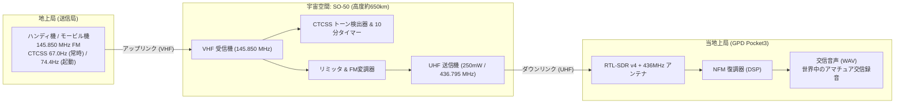
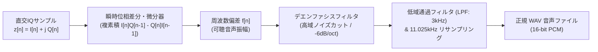
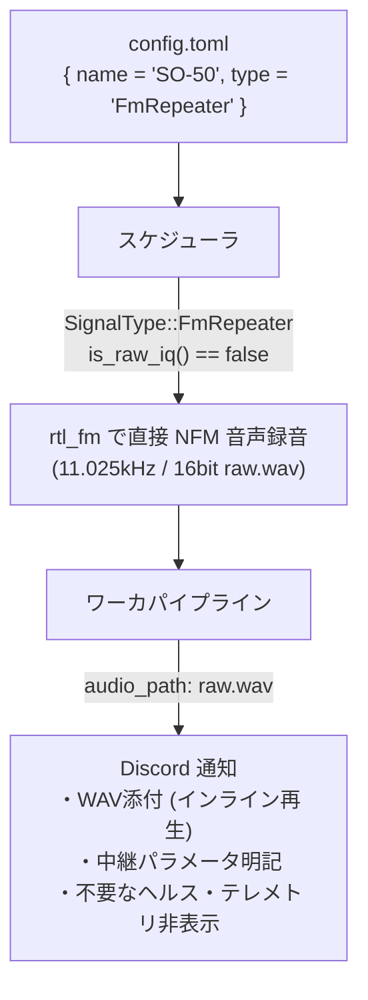

# SO-50 (Saudi-OSCAR 50) アマチュア衛星の通信仕様・FMトランスポンダーとテレメトリ詳解

本ドキュメントでは、アマチュア衛星 **SO-50（Saudi-OSCAR 50 / Saudisat 1C）** の通信仕様、中継メカニズム、なぜ気象衛星や他のCubeSatのようなデジタルテレメトリが存在しないのか、そして本来受信・保存・再生すべき観測データ（交信音声WAV）の信号処理について無線工学・デジタル信号処理（DSP）の観点から解説します。

---

## 1. SO-50 の概要とアマチュア無線トランスポンダー仕様

SO-50 は、2002年12月20日にバイコヌール宇宙基地から打ち上げられたサウジアラビア（KACST: King Abdulaziz City for Science and Technology）の超小型衛星（Saudisat 1C）です。
打ち上げから20年以上が経過した現在も第一線で稼働し続けている、アマチュア衛星界屈指の長寿衛星です。



### 🛰️ 通信パラメータ仕様一覧

| 項目 | パラメータ | 物理的・工学的意味 |
| :--- | :--- | :--- |
| **衛星名称 / NORAD ID** | SO-50 (Saudisat 1C) / 27559 | 2002-058C |
| **軌道種別** | 低軌道 (LEO: 軌道傾斜角 64.5°, 高度約 650 km) | 周回周期 約97分 |
| **トランスポンダー形式** | **FM ボイストランスポンダー (クロスバンドFM中継器)** | 単一のFM音声キャリアを宇宙で折り返し中継 |
| **アップリンク周波数** | **145.850 MHz** (2m VHF 帯) | 地上のアマチュア局が衛星へ送信する周波数 |
| **ダウンリンク周波数** | **436.795 MHz** (70cm UHF 帯) | 衛星が地上へ送信（折り返し）する周波数 |
| **変調方式** | 狭帯域FM (NFM: 占有帯域幅 約 12.5 kHz) | アナログ音声周波数変調 |
| **送信電力** | 約 250 mW (24 dBm) | 超小型衛星の省電力設計 |
| **タイマー起動トーン** | **74.4 Hz CTCSS** (約2秒間送信で起動) | 10分間の省電力タイマーをアーム |
| **運用アクセス・トーン** | **67.0 Hz CTCSS** (送信音声に常時重畳) | スケルチを開放して中継を許可 |

---

## 2. なぜ「デジタルテレメトリ」が表示されなかったのか？

### 2.1 SO-50 にはそもそもデジタルテレメトリが存在しない
気象衛星（Meteor-M など）や現代のCubeSat（FUNcube-1, UmKA-1, SONATE-2 など）は、衛星内部のオンボードコンピュータ（OBC）が収集したバッテリ電圧・太陽電池発電量・センサ温度・ジャイロ情報を、AX.25パケット（AFSK/GFSK）やBPSK信号に乗せて地上へ定常ダウンリンクします。

しかし、**SO-50 は純粋な「アナログFMボイストランスポンダー」** です。
- 衛星内部の健全性データ（テレメトリ）をダウンリンクするデジタル送信機やパケット変調器は搭載されていません。
- したがって、436.795 MHz を受信した際に得られる情報は、**「世界中のアマチュア無線家同士がリアルタイムに交わしている交信音声（CQ呼び出し、コールサイン、シグナルレポート）」** です。
- タイマー切れの直前にビーコン音（ビープ）が鳴る程度であり、パケットデータは一切流れません。

### 2.2 現行システムでのプレースホルダー出力
本システムの `apps/ground-station` では、`config.toml` にて SO-50 を `type = "CubeSatTelemetry"` と定義していたため、`apps/ground-station/src/decoder.rs` の CubeSat 共通分岐に入り、パケットデコーダが存在しない場合のフェイルセーフとして用意されていた固定プレースホルダー（`snr_db: 13.5`, `ダウンリンク: 復調成功 | 生IQ保存: 保全完了`）が出力されていました。

これが、「衛星ヘルス・テレメトリと書かれているのに、具体的な電圧や温度が何も表示されない」という挙動の直接の原因です。

---

## 3. なぜ「WAV再生」が届かなかったのか？

### 3.1 生IQ録音（raw.u8）とFM復調（WAV）のパイプライン不整合
本システムでは、信号方式ごとに録音・保存フォーマットが分離されています：
1. **アナログ音声衛星（NOAA APT / ISS SSTV）**:
   - `is_raw_iq() == false` $\to$ `rtl_fm` により FM復調された音声WAV（`raw.wav`）を直接生成。
2. **デジタルパケット衛星（Meteor LRPT / CubeSat全般）**:
   - `is_raw_iq() == true` $\to$ `rtl_sdr` により 240kSPS の生IQ直交サンプル（`raw.u8`）を保存。

SO-50 が `CubeSatTelemetry`（`is_raw_iq() == true`）に設定されていたため：
- SDRは `rtl_sdr` で生IQバイト列（`raw.u8`）として保存。
- `decoder.rs` の `decode_cubesat` は `audio_path: None` を返却。
- `worker.rs` は `audio_path` が `None` であるため、音声添付処理をスキップし、Discord Embed の `🎵 受信音声 (WAV)` フィールドも除外。

この結果、Discord には生IQの保存完了のみが報告され、音声WAVファイルが届きませんでした。

---

## 4. 狭帯域FM (NFM) 復調の数学と信号処理アルゴリズム

SO-50 のダウンリンク信号から人間の可聴音を取り出すには、FM復調（周波数弁別）が必要です。



### 4.1 FM変調信号の数式表現
FM（周波数変調）では、送信したい音声波形 $m(t)$（振幅 $-1 \le m(t) \le 1$）によって搬送波の瞬時周波数が変化します：

$$s(t) = A_c \cos\left( 2\pi f_c t + 2\pi \Delta f \int_{-\infty}^{t} m(\tau) d\tau \right)$$

複素ベースバンド表現（搬送波 $f_c$ をベースバンドにダウンコンバートしたIQ信号）では以下のようになります：

$$z(t) = I(t) + j Q(t) = A_c e^{j \phi(t)}$$

ここで瞬時位相 $\phi(t)$ は：

$$\phi(t) = 2\pi \Delta f \int_{-\infty}^{t} m(\tau) d\tau$$

#### 🔍 記号一覧
| 記号 | 名称 | 物理的・工学的意味 / 単位 |
| :--- | :--- | :--- |
| $s(t)$ | 送信FM信号 | 436.795MHz で空間を伝播する電波の瞬時電圧 [V] |
| $A_c$ | 搬送波振幅 | 電波の信号強度（振幅） [V] |
| $f_c$ | 搬送波周波数 | 436.795 MHz (UHF) [Hz] |
| $\Delta f$ | 最大周波数偏移 | 音声の最大音量時に周波数がずれる幅（NFMでは約 $\pm 2.5 \sim 5\ \text{kHz}$） |
| $m(t)$ | 音声信号 | 地上のアマチュア局がマイクに向かって話した音圧波形（無次元） |
| $\phi(t)$ | 瞬時位相 | 複素平面上の偏角 [rad] |
| $I(t), Q(t)$ | 同相・直交成分 | SDR ADC が出力する複素数の実部・虚部 |

---

### 4.2 瞬時位相微分による周波数弁別（DSPアルゴリズム）
音声信号 $m(t)$ を取り出すには、瞬時位相 $\phi(t)$ を時間微分します：

$$m(t) = \frac{1}{2\pi \Delta f} \frac{d\phi(t)}{dt}$$

偏角 $\phi(t) = \arctan\left(\frac{Q(t)}{I(t)}\right)$ の微分を展開します：

$$\frac{d\phi(t)}{dt} = \frac{d}{dt} \arctan\left(\frac{Q(t)}{I(t)}\right) = \frac{1}{1 + \left(\frac{Q(t)}{I(t)}\right)^2} \frac{d}{dt}\left(\frac{Q(t)}{I(t)}\right)$$

商の微分公式 $\left(\frac{u}{v}\right)' = \frac{u' v - u v'}{v^2}$ を適用すると：

$$\frac{d\phi(t)}{dt} = \frac{I(t)^2}{I(t)^2 + Q(t)^2} \cdot \frac{\dot{Q}(t) I(t) - Q(t) \dot{I}(t)}{I(t)^2} = \frac{I(t) \dot{Q}(t) - Q(t) \dot{I}(t)}{I(t)^2 + Q(t)^2}$$

離散時間（サンプリング周期 $T_s = 1/f_s$）においては、前後のサンプル $z[n]$ と $z[n-1]^*$ の複素積を計算することで極めて高速かつ高精度に計算できます：

$$z[n] z^*[n-1] = |z[n]||z[n-1]| e^{j (\phi[n] - \phi[n-1])}$$

$$\Delta \phi[n] = \arg\left( z[n] z^*[n-1] \right) \approx \frac{I[n-1] Q[n] - Q[n-1] I[n]}{I[n]^2 + Q[n]^2}$$

#### 💬 日本語で読み解く数式
> **「複素平面上で回転する針の『回転スピード（角速度 $\frac{d\phi}{dt}$）』を測ると、まさにその針のスピードの変化こそが、人間の耳に聞こえる音声の波形 $m(t)$ に一致する」**

---

### 4.3 デエンファシス（De-emphasis）処理
FM通信では、高域周波数のノイズが微分処理によって増大する特性（三角ノイズ）があるため、送信側であらかじめ高域をブースト（プリエンファシス）して送信します。
受信側（地上局）では、時定数 $\tau = 50\ \mu\text{s}$（または $75\ \mu\text{s}$）の1次低域通過フィルタ（デエンファシス）を通すことで、フラットで聞き取りやすいクリアな肉声を復元します：

$$H(s) = \frac{1}{1 + s \tau}$$

---

## 5. SO-50 の中継アクセス制御：CTCSS トーンスケルチ検出

SO-50 は、地上の違法電波や無関係なノイズで送信機が常時開きっぱなし（連続送信によるバッテリ枯渇や加熱故障）になるのを防ぐため、**CTCSS（Continuous Tone-Coded Squelch System: 連続トーン制御スケルチ）** を採用しています。

### 5.1 CTCSS のメカニズム
人間の声（$300\ \text{Hz} \sim 3000\ \text{Hz}$）より低い可聴域下限の単一正弦波（サブオーディオトーン）を送信時に微弱に重畳します。
- **74.4 Hz**: 10分タイマーのアーム（中継器電源ON）
- **67.0 Hz**: 送信許可（スケルチオープン）

```text
[音声入力 (マイク)] ────┬───> 加算器 (+) ───> FM変調器 ───> 送信
                        │
[67.0Hz 正弦波発振器] ──┘ (微弱重畳: 偏移 約 500Hz)
```

### 5.2 受信機側でのトーン検出（ゲルツェル・アルゴリズム: Goertzel Algorithm）
受信機やDSPデコーダが特定のトーン（例: 67.0Hz）が存在するかを判定する際、信号全体に対して全帯域のFFTを実行するのは計算リソースの無駄です。
特定の1周波数 $f_0$ だけのパワーを効率よく計算するために、**Goertzel アルゴリズム**（2次IIRフィルタ）が用いられます。

$$k = \text{round}\left(\frac{N f_0}{f_s}\right), \quad \omega_0 = \frac{2\pi k}{N}$$

漸化式：
$$s[n] = x[n] + 2\cos(\omega_0) s[n-1] - s[n-2]$$

$N$ サンプル後のパワー $P$：
$$P = s[N-1]^2 + s[N-2]^2 - 2\cos(\omega_0) s[N-1] s[N-2]$$

このパワー $P$ がノイズフロアに対して一定閾値を超えている場合、「67.0Hz CTCSS トーンが重畳された有効なアマチュア局の音声通信である」と判定できます。

---

## 6. 今後の地上局アーキテクチャ改修方針

SO-50 の観測成果を正しく引き出すため、以下の改修を推奨します：



1. **信号方式 `SignalType::FmRepeater` の新設**:
   - `SignalType::FmRepeater`（または `FmVoice`）を定義。
   - `is_raw_iq()` は `false` とし、`rtl_fm` によりダイレクトに高品質な NFM 音声WAVを生成。
2. **Discord 通知 Embed の最適化**:
   - 存在しないダミーの「衛星ヘルス・テレメトリ」フィールドを排除。
   - 代わりに **「中継パラメータ（Uplink: 145.850MHz CTCSS 67.0Hz / Downlink: 436.795MHz）」** や **「復調実績: FM音声復調完了（WAV添付）」** を表示。
   - Discord のインラインプレーヤーで、宇宙空間から届いた世界のアマチュア交信音声をそのまま再生可能にする。

---

## 7. 公式一次情報リンク
- [AMSAT (Radio Amateur Satellite Corporation): SO-50 Satellite Summary](https://www.amsat.org/two-way-satellites/so-50/)
- [AMSAT-UK: SO-50 (Saudi-OSCAR 50) Details & Frequencies](https://amsat-uk.org/satellites/active/so-50/)
- [KACST (King Abdulaziz City for Science and Technology) Space Research Institute](https://www.kacst.edu.sa/)
- [ITU-R Recommendation M.1042: Disaster communications and amateur services](https://www.itu.int/rec/R-REC-M.1042/en)
