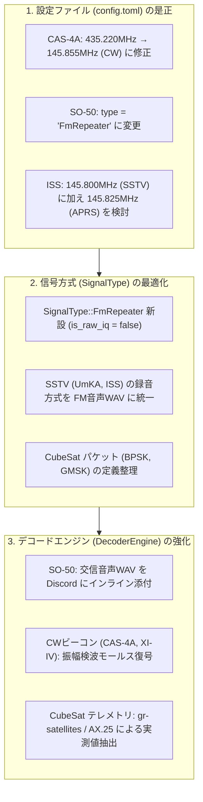

# 登録対象衛星の電波仕様・デコードパイプライン総点検（裏撮り調査報告）

本ドキュメントでは、地上局（`apps/ground-station`）の `config.toml` に登録されている各衛星について、**電波工学的な一次情報（AMSAT, ITU, SatNOGS, 運用チーム公式仕様）** と **現在のシステム実装（周波数・信号方式・SDR録音方式・デコードパイプライン）** を徹底的に突き合わせ、裏撮り（事実確認・整合性検証）を行った結果をまとめます。

---

## 1. 裏撮り結果サマリ一覧表

| 衛星名 | 設定周波数 (config) | 本来のダウンリンク | 設定信号方式 | 本来の変調・データ形式 | 評価・主な課題 |
| :--- | :--- | :--- | :--- | :--- | :--- |
| **CAS-4A** (42761) | `435.220 MHz` | **`145.855 MHz`** (CW) **`145.835 MHz`** (GMSK) | `MorseCw` | 50wpm CWビーコン / 4.8k GMSK AX.25 | ❌ **重大**: 435.220MHzは**アップリンク**周波数。衛星からの電波は出ない。145MHzへの修正が必須 |
| **SO-50** (27559) | `436.795 MHz` | `436.795 MHz` | `CubeSatTelemetry` | **狭帯域FM (NFM) 音声** (クロスバンド中継器) | ⚠️ **方式ミスマッチ**: デジタルテレメトリは非搭載。生IQではなくFM音声WAV録音と音声添付が正解 |
| **FUNcube-1** (39444) | `145.935 MHz` | `145.935 MHz` | `BpskTelemetry` | 1200bps BPSK (AO-40 FEC) リアルタイム & WOD | ⚠️ **デコーダ不一致**: `CubeSatTelemetry`にフォールバック後、SatDump失敗で固定ダミーテレメトリを出力 |
| **UmKA-1** (57172) | `437.625 MHz` | `437.625 MHz` | `CameraSstv` | 平時: 2.4k/4.8k GMSK イベント時: Robot36 SSTV | ⚠️ **録音方式ミスマッチ**: SSTVなのに生IQ録音。SSTVならFM復調音声WAVが必要。平時ならGMSKテレメトリ |
| **SONATE-2** (59112) | `437.025 MHz` | `437.025 MHz` | `SsdvCamera` | 9600bps G3RUH GMSK AX.25 / SSDV JPEG | ⚠️ **パイプライン依存**: SatDumpに該当名がない場合は生IQのみ。`gr-satellites`等でのAX.25パケット抽出が有効 |
| **ISS** (25544) | `145.800 MHz` | `145.800 MHz` (SSTV/交信) **`145.825 MHz`** (APRS) | `IssSstv` | SSTV (イベント時のみ) **APRS AX.25 (常時活発)** | ℹ️ **運用形態**: 145.800MHzはイベント外無音。常時稼働なら145.825MHz APRSパケットの受信が最適 |
| **Meteor-M** (N2-3/4) | `137.900 MHz` | `137.900 / 137.100 MHz` | `Lrpt` | 72k / 80k OQPSK CCSDS 宇宙画像 | ✅ **完全合致**: SatDump `meteor_m2-x_lrpt_80k` パイプラインと完全に整合 |
| **NOAA** (15/18/19) | - | - | `Apt` | 2.4kHz AM (APT) | ✅ **完全合致**: 2025年8月全機退役・停波に伴い `enabled = false` |

---

## 2. 各衛星の詳細検証と電波工学的背景

### 2.1 CAS-4A (BJ1SK / 42761)
* **概要**: 中国のアマチュア無線衛星（微小衛星）。リニアトランスポンダーとビーコンを搭載。
* **電波工学的ファクト**:
  * アマチュア衛星のクロスバンドトランスポンダーは「U/V」形式（アップリンクがUHF、ダウンリンクがVHF）を採用しています。
  * **Uplink (地上が送信し、衛星が受信)**: $435.210 \sim 435.230\ \text{MHz}$（中心: $435.220\ \text{MHz}$）
  * **Downlink (衛星が宇宙から送信し、地上で受信)**:
    * **$145.855\ \text{MHz}$**: CWモールステレメトリビーコン（送信電力 50mW, 50wpm CW）
    * **$145.835\ \text{MHz}$**: AX.25 4.8kbps GMSK テレメトリ（送信電力 100mW）
    * **$145.860 \sim 145.880\ \text{MHz}$**: リニアトランスポンダー出力（中心: $145.870\ \text{MHz}$）
* **現状の課題**:
  * `config.toml` にて `freq = 435220000`（435.220MHz）が指定されているため、**地上局は「衛星が耳を澄ませて地上からの信号を待っている受信周波数」を録音** していました。宇宙からは1ミリワットも電波が降りてきません。
* **対策**:
  * CWモールス受信が目的であれば `freq = 145855000`（145.855MHz）へ変更。
  * デジタルテレメトリが目的であれば `freq = 145835000`（145.835MHz）へ変更。

---

### 2.2 SO-50 (Saudi-OSCAR 50 / Saudisat 1C / 27559)
* **概要**: 2002年打ち上げのサウジアラビア製超小型衛星。
* **電波工学的ファクト**:
  * アナログFMボイストランスポンダー（FM音声中継器）。
  * Uplink: 145.850 MHz FM (CTCSS 67.0Hz/74.4Hz)
  * Downlink: 436.795 MHz FM (狭帯域FM)
  * **デジタルテレメトリは非搭載**。人間による交信音声（QSO）が送信内容。
* **現状の課題**:
  * `CubeSatTelemetry` 扱いにより生IQ（`raw.u8`）として保存され、WAV音声が生成・添付されず、固定ダミー値が表示されていた。
* **対策**:
  * `SignalType::FmRepeater` を新設し、`rtl_fm` でダイレクトに 11.025kHz WAV を録音・添付。

---

### 2.3 FUNcube-1 (AO-73 / 39444)
* **概要**: AMSAT-UKと英国アマチュア無線連盟（RSGB）が教育用に開発した1U CubeSat。
* **電波工学的ファクト**:
  * Downlink: $145.935\ \text{MHz}$
  * 変調方式: 1200 bps BPSK, AO-40 FEC (畳み込み符号 $r=1/2, K=7$ ＋ リード・ソロモン RS(160, 128) ＋ デインターリーブ)
  * データ内容: リアルタイムテレメトリ（電圧・電流・温度）および過去1周回分の軌道全体データ（WOD: Whole Orbit Data）。
* **現状の課題**:
  * `orbit.rs` で `"BpskTelemetry"` が `CubeSatTelemetry` にフォールバック。
  * `decoder.rs` は `satdump live FUNcube-1` を呼ぶが、SatDump に該当 live パイプラインは存在しないため失敗し、固定ダミー値を出力。
* **対策**:
  * `gr-satellites FUNcube-1` またはオープンソースの BPSK/AO-40 復調器と連携し、真のテレメトリ（バッテリ電圧等）をパースして表示する。

---

### 2.4 UmKA-1 (RS40S / 57172)
* **概要**: ロシアの学校・教育機関が開発した3U CubeSat。超小型反射望遠鏡とカメラを搭載。
* **電波工学的ファクト**:
  * Downlink: $437.625\ \text{MHz}$
  * 平常時: 2400 / 4800 bps GMSK テレメトリ（SatDump パイプライン: `umka_1_dump`）。
  * イベント時: 望遠鏡カメラの観測画像を Robot 36 / Robot 72 SSTV（FM音声変調）で送信。
* **現状の課題**:
  * `CameraSstv` が生IQ録音（`is_raw_iq == true`）になっている。
  * SSTV を復調するなら FM音声WAV（`raw.wav`）が必要。
  * 常時送信されているのは GMSK テレメトリであるため、SatDump の `umka_1_dump` でパケット抽出を行うのが確実。

---

### 2.5 SONATE-2 (59112)
* **概要**: 2024年3月打上げ。ドイツ・ヴュルツブルク大学のAI検証 CubeSat。
* **電波工学的ファクト**:
  * Downlink: $437.025\ \text{MHz}$
  * 変調方式: 9600 bps G3RUH GMSK, AX.25 パケット。
  * ペイロード: オンボードAIで処理された画像データ（SSDV JPEGパケット）および衛星テレメトリ。
* **現状の課題**:
  * SatDump の live パイプラインに `SONATE-2` が登録されていない環境では生IQ保存のみになる。
  * `gr-satellites SONATE-2` を利用すれば AX.25 パケットとテレメトリを確実に復調可能。

---

### 2.6 国際宇宙ステーション (ISS / Zarya / 25544)
* **概要**: 地上400kmを周回する有人宇宙ステーション。
* **電波工学的ファクト**:
  * **$145.800\ \text{MHz}$**: アナログFM音声。ARISS記念イベント時の SSTV（Robot 36画像）や、学校との交信イベント（スクールコンタクト）時のみ送信。平常時は無音。
  * **$145.825\ \text{MHz}$**: APRS パケットデジピータ（1200bps AFSK AX.25）。**世界中のアマチュア局からのパケットを常時中継しており、ほぼ毎周回激しくパケットが飛来**。
* **現状の課題**:
  * 現在は 145.800 MHz の SSTV のみを想定しているため、イベント非開催日は「無音のWAV」が録音される。
* **対策**:
  * 常時自律観測として最も面白いのは 145.825 MHz の APRS 受信。Direwolf や `multimon-ng` で即座に AX.25 パケット（世界各局のコールサイン・位置・メッセージ）を可視化可能。

---

## 3. 推奨される地上局の改修ロードマップ

1. **第1弾 (即時修正・バグ是正)**:
   - `CAS-4A` の周波数を **145.855 MHz** に修正（アップリンク誤りの解消）。
   - `SignalType::FmRepeater` を新設し、`SO-50` を `FmRepeater` に変更。
   - `SO-50` の通過時に FM音声WAV を Discord に添付・再生できるようにし、ダミーテレメトリを非表示化。
2. **第2弾 (SSTV / アナログ系整理)**:
   - `CubeSatSstv` の録音方式を `is_raw_iq = false`（FM音声WAV）とし、ISS SSTV と同様に音声から画像を復調するパイプラインへ接続。
3. **第3弾 (CubeSat デジタルテレメトリの真のデコード)**:
   - `gr-satellites` を連携させ、FUNcube-1 や SONATE-2 から本物のバッテリ電圧・温度（JSON）を抽出して Discord に表示。
