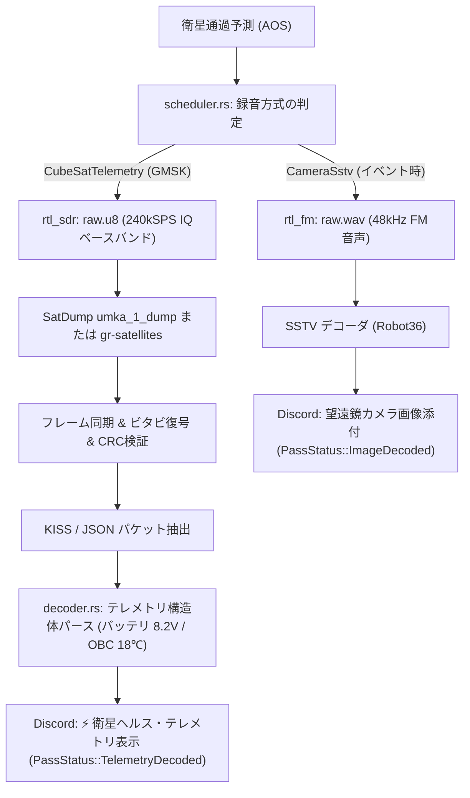

# 🛰️ CubeSat テレメトリ判定ステータス刷新と UmKA-1 復調パイプライン解析

本ドキュメントは、超小型人工衛星（CubeSat: UmKA-1 等）の自律受信・デコードにおいて発生した**「復調未実施にもかかわらず『復調成功』と通知されてしまう偽陽性フォールバック問題」の解消（`PassStatus::RawPreserved` の導入）**、および **UmKA-1 (RS40S) の電波仕様（平常時 GMSK vs イベント時 SSTV）と真のテレメトリ復調に向けた課題・解析手法** を体系的にまとめた技術解説です。

---

## 1. 「復調成功」フォールバックの偽陽性問題とステータス刷新

### 1.1 背景と課題（なぜ怪しい通知が発生したのか）
地上局システム（`apps/ground-station`）は、多様な周波数・変調方式の衛星（NOAA APT, Meteor LRPT, ISS SSTV, 各種 CubeSat）を自律受信・デコードするパイプラインを備えています。

しかし、従来のデコードエンジン（`src/decoder.rs`）では、外部デコーダが導入されていない衛星や、デコーダが画像を出力しなかった場合、生録音ファイル（`raw.wav` または `raw.u8`）を保全して返す **Graceful Degradation（生データ欠損防止）** の処理において、以下の設計上の不整合が存在していました：

```text
【従来の処理フロー（問題点）】
生録音完了 ──► decode_cubesat ──► 画像未生成（非PNG/JPG）
                                      │
                                      ▼
                        「画像ではない＝テレメトリ復調成功！」と判定
                                      │
                                      ▼
             ・ステータス: PassStatus::TelemetryDecoded（宇宙ブルー）
             ・復調実績: 「テレメトリビーコン パケット取得完了」
             ・SNR: 13.5 dB（固定値）
             ・ヘルス情報: 「ダウンリンク: 復調成功 | 生IQ保存: 保全完了」
             ・通知タイトル: 「🛰️ UmKA-1 [...] 受信・デコード完了」
```

実際には **「生データを録音してディスクに保存しただけで、パケットデコード処理は未実施」** であるにもかかわらず、通知上はあたかもパケット復調が成功したかのように誤認させる表示になっていました。

### 1.2 解決策：`PassStatus::RawPreserved` の導入とダミー値の完全撤廃
この課題を根本解決するため、状態遷移モデルと通知ロジックを以下のように刷新しました：

1. **`PassStatus::RawPreserved`（生データ保存完了: `0x9B59B6` アメジスト紫）の追加**:
   - 画像デコード成功（`ImageDecoded` / 緑）
   - テレメトリパケット復調成功（`TelemetryDecoded` / 青）
   - **生データ保全完了・未復調（`RawPreserved` / 紫）★新設**
   - 電波微弱・生データ保全（`WeakSignal` / 橙）
   - デコード異常（`DecodeError` / 赤）
2. **Discord 通知タイトル・メッセージの動的適正化**:
   - `RawPreserved` の場合、タイトルは **「`🛰️ <衛星名> [<方式>] 受信・生データ保存完了`」** となり、「デコード完了」とは表示しません。
   - 本文も「`通過録音が完了したのだ！生データを保存したのだ！`」と実態を正直に伝えます。
3. **偽の SNR（13.5dB）およびダミーテキストの撤廃**:
   - デコードやSNR測定を行っていない場合は `snr_db: None` とし、Discord 上に架空の SNR フィールドを表示しません。
   - ヘルス表示も `[("生データ", "保全完了 (ディスク保存)"), ("デコード状況", "未復調 (生IQ/音声アーカイブ)")]` とし、正確な事実のみを報告します。

---

## 2. UmKA-1 (RS40S) の電波仕様と無線工学的ファクト

### 2.1 一次情報・公式仕様
* **衛星名**: UmKA-1 (RS40S / NORAD ID: 57172, COSPAR ID: 2023-091N)
* **開発元**: ロシア・モスクワの児童科学センター「インジニウム（Inzhenium）」およびアマチュア宇宙コミュニティ
* **国際宇宙無線登録**: [IARU Amateur Satellite Frequency Coordination - UmKA-1](https://www.amsat.org/) / [SatNOGS DB - UmKA-1](https://db.satnogs.org/satellite/57172/)
* **公式復調リファレンス**: [SatDump Pipeline: `umka_1_dump`](https://github.com/SatDump/SatDump)

### 2.2 ペイロードと送信モードの二重性
UmKA-1 は 3U サイズの CubeSat であり、超小型反射望遠鏡と Lepton 高解像度カメラを搭載しています。本衛星のダウンリンクは **2 つの全く異なる送信モード** を持ちます：

| 運用フェーズ | 送信内容 | ダウンリンク周波数 | 変調方式・データレート | 必要な受信方式 |
| :--- | :--- | :--- | :--- | :--- |
| **平常時（常時運用）** | **衛星ヘルス・テレメトリ** | $437.625\ \text{MHz}$ | **2400 / 4800 bps GMSK**（デジタルパケット） | **生IQベースバンド（`raw.u8` 240kSPS）** |
| **イベント時（特別運用）** | **望遠鏡カメラ写真** | $437.625\ \text{MHz}$ | **Robot 36 / 72 SSTV**（アナログFM副搬送波） | **FM復調音声（`raw.wav` 48kHz）** |

1. **平常時（GMSK テレメトリ）**:
   - オンボードコンピュータ（OBC）の電圧、太陽電池パネル電流、各面温度、望遠鏡ヒーター状態などを格納したバイナリフレームを、数十秒〜数分おきに常時ビーコン送信しています。
2. **イベント時（SSTV アナログ画像）**:
   - 地上管制局から特別コマンドがアップリンクされた期間のみ、撮影された天体写真・地球写真がアナログ SSTV（1500〜2300Hz の周波数変調トーン）で放送されます。平常時は SSTV は送信されていません。

---

## 3. 今回のパス（2026-09-06 09:37 JST）で復調できなかった根本原因

今回、最大仰角 73.4°（西北西）という極めて良好なジオメトリでありながら復調できなかった原因は、以下の **多重のパイプラインミスマッチ** によるものです：

### 3.1 録音方式のミスマッチ（FM 音声 vs 生IQ）
* 地上局の設定（`config.toml`）において、UmKA-1 は `type = "CameraSstv"` と設定されていました。
* `CameraSstv` は SSTV アナログ音声の録音を意図していたため、`scheduler.rs` は `rtl_fm` を起動して **FM 復調音声（`raw.wav`）** を作成しました。
* しかし、平常時の衛星が送信していたのは **GMSK デジタル信号** です。
  FM 検波器（周波数弁別器）を通した WAV 音声には、GMSK のビット遷移に伴う雑音成分が記録されますが、SSTV デコーダ（Robot36 等）が要求する「1200Hz 同期パルス」や「1500〜2300Hz 輝度トーン」は存在しないため、画像デコードは空振りとなります。

### 3.2 GMSK 復調パイプラインの欠如
* GMSK（ガウス最小偏移変調）のビット列を取り出すには、FM 音声ではなく **ベースバンド生IQ（`raw.u8` 240kSPS）** を記録し、SatDump の `umka_1_dump` または `gr-satellites` などの GMSK 復調器に通す必要があります。
* 今回のパスでは生IQではなく WAV 音声が録音されていたため、SatDump の GMSK パイプラインを実行することができませんでした。

---

## 4. GMSK (Gaussian Minimum Shift Keying) のデジタル信号処理と復調の数学

GMSK は、定包絡線特性（Constant Envelope）を持ち、送信機の電力増幅器（PA）を非線形な飽和領域で高効率駆動できるため、電力の限られた CubeSat で極めて広く採用されている変調方式です。

### 4.1 基礎方程式

GMSK 信号 $s(t)$ のベースバンド表現は、搬送波振幅 $A$、位相 $\phi(t)$ を用いて以下で表されます：

$$s(t) = A \exp\left( j \phi(t) \right) = A \left[ \cos \phi(t) + j \sin \phi(t) \right]$$

位相 $\phi(t)$ は、送信シンボル列 $a_k \in \{-1, +1\}$ とガウス周波数パルス $g(t)$ の畳み込み積分によって滑らかに遷移します：

$$\phi(t) = 2\pi h \sum_{k=-\infty}^{\infty} a_k \int_{-\infty}^{t} g(\tau - k T) d\tau$$

ここで、$h$ は変調指数（Modulation Index）、$T$ は 1 シンボルの周期です。MSK/GMSK では直交性を満たす最小の変調指数として **$h = 0.5$** が選定されます。

### 4.2 記号一覧

| 記号 | 物理的・数学的意味 | 単位 / 代表値 |
| :--- | :--- | :--- |
| $s(t)$ | 送信複素ベースバンド信号 | 無次元 / 複素数 |
| $A$ | 搬送波振幅 | $\text{V}$ |
| $\phi(t)$ | 瞬時位相角 | $\text{rad}$ |
| $h$ | 変調指数（Modulation Index） | $0.5$（MSK 直交条件） |
| $a_k$ | 第 $k$ 番目の送信情報ビット（NRZ バイナリ） | $\{-1, +1\}$ |
| $T$ | シンボル時間（$T = 1/R_b$） | $416.7\ \mu\text{s}$ ($2400\text{bps}$) / $208.3\ \mu\text{s}$ ($4800\text{bps}$) |
| $B$ | ガウスプレフィルタの 3dB 帯域幅 | $\text{Hz}$ |
| $BT$ | 時間帯域幅積（Bandwidth-Time Product） | $0.5$（UmKA-1 / AX.25 標準） |
| $g(t)$ | ガウス周波数パルス波形 | $\text{s}^{-1}$ |
| $Q(x)$ | ガウス相補誤差関数（Q関数） | 無次元 |

### 4.3 日本語での読み解き
通常の FSK（周波数シフトキーイング）では、ビットが $0 \to 1$ や $1 \to 0$ に変化する瞬間に周波数が不連続にジャンプするため、高調波スプリアス（サイドローブ）が広帯域に飛び散り、近隣の無線チャネルを妨害します。

GMSK では、矩形パルスをガウスフィルタに通すことで、**「角を丸めて滑らかに周波数を遷移」** させます。変調指数 $h = 0.5$ により、1 ビット送信するごとに位相がちょうど **$+90^\circ$（+1送信時）または $-90^\circ$（-1送信時）だけ滑らかに回転** します。これにより、帯域外への電波の漏れ出しを劇的に抑えつつ、一定振幅（電力効率最大）で送信できます。

### 4.4 展開ステップと直感イメージ
ガウスパルス $g(t)$ は、標準正規分布の確率密度関数 $p(t) = \frac{1}{\sqrt{2\pi}\sigma} \exp\left(-\frac{t^2}{2\sigma^2}\right)$ と矩形パルス $\text{rect}(t/T)$ の畳み込みとして導出されます：

$$g(t) = \frac{1}{2T} \left[ Q\left( 2\pi B \frac{t - T/2}{\sqrt{\ln 2}} \right) - Q\left( 2\pi B \frac{t + T/2}{\sqrt{\ln 2}} \right) \right]$$

1. **シンボル間干渉 (ISI) の制御**:
   $BT = 0.5$ の場合、パルスの裾野が隣接する前後のシンボル（$\pm 1T$）に意図的に重なり合います（制御された ISI）。
2. **復調器（地上局）の動作**:
   受信側では、直交 IQ 信号からビタビアルゴリズム（最尤系列推定: MLSE）やLaurent展開に基づくフィルタバンクを用いて、この意図的な重なり合いを逆算・解消し、ノイズに埋もれたビットを高精度に判定します。

---

## 5. UmKA-1 の本物のテレメトリを取得するための技術ロードマップ

GPD Pocket3 自律地上局で UmKA-1 のバッテリ電圧や温度データを実際に復調・可視化するための改修手順は以下の通りです：



### 次のステップ
1. **`config.toml` の変更**:
   UmKA-1 を `type = "CubeSatTelemetry"` に変更し、録音を `raw.u8`（生IQベースバンド）にする。
2. **GMSK パケットパーサーの実装**:
   GPD Pocket3 上で `satdump`（または軽量な `gr-satellites` / Python デコーダスクリプト）を呼び出し、保存された `raw.u8` からテレメトリ JSON を出力させる。
3. **テレメトリ表示の連携**:
   抽出された JSON から実際のセンサ値を取り出し、Discord に真のヘルスデータを送信する。
