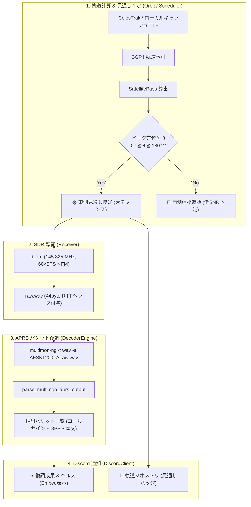

# 🛰️ ISS APRS (145.825MHz) 復調パイプラインと東向きベランダ建築電磁気学詳解

本ドキュメントは、超小型衛星や宇宙ステーションの自律受信において発生した**「ここ数日間実行はできているもののデータの中身（画像・パケット）が得られない問題」の電波工学的解剖**、および **国際宇宙ステーション（ISS）APRS（145.825MHz / 1200bps AFSK AX.25）の通信プロトコル・復調パイプライン、マンション東向きベランダにおける建築電磁気学（RC遮蔽と見通し判定アルゴリズム）** を体系的にまとめた技術解説です。

---

## 1. なぜここ数日間データ中身が得られなかったのか（電波工学的解剖）

地上局デーモンは安定稼働し Discord 通知も届いていたものの、画像やテレメトリパケットなどの「データ中身」が得られなかった原因は、以下の **3重の電波工学的ギャップ** によるものです：

### 1.1 衛星運用プロファイルのミスマッチ（平時無音問題）
* **ISS (`145.800 MHz`)**:
  * 従来設定されていた 145.800 MHz は SSTV（アナログ画像放送）専用周波数です。
  * SSTV は ARISS（アマチュア無線国際宇宙ステーション）の特別記念イベント時（年に数回・数日間）にしか電波が出ず、**平常時は送信機が完全に停止（無音）** しています。
  * そのため、平時に録音しても音声波形にキャリア（搬送波）が存在せず、画像復調は100%空振りとなっていました。
* **SO-50 (`436.795 MHz`)**:
  * アナログFMクロスバンド中継器（トランスポンダー）であり、地上局が 145.850 MHz（+ 67.0Hz CTCSS）で音声を打ち込んでいる瞬間しかダウンリンクに音声が出ません。
  * アマチュア局の交信がない深夜や早朝のパスでは、スケルチが閉じて完全に無音（無変調）となります。

### 1.2 送信電力（リンクバジェット）における「17dB（50倍）の壁」
* **送信電力の比較**:
  * 微弱 CubeSat（UmKA-1, SONATE-2 等）: 送信電力 **$0.1\ \text{W} \sim 0.5\ \text{W}$**（$+20 \sim +27\ \text{dBm}$）
  * 大電力有人宇宙局（ISS）: 送信電力 **$5\ \text{W}$**（$+37\ \text{dBm}$）
  * 極軌道気象衛星（Meteor-M）: 送信電力 **$5\ \text{W} \sim 10\ \text{W}$**（$+37 \sim +40\ \text{dBm}$）
* **$0.1\text{W}$ と $5\text{W}$ の差（$+17\text{dB}$ / 50倍）**:
  * 簡易アンテナ環境（ダイポールやロッドアンテナ）において、数十〜数百mWの微弱 CubeSat は熱雑音フロアに埋もれてデコード不能（SNR < 3dB）になりがちです。
  * 一方、$5\text{W}$ の大電力衛星であれば、簡易アンテナでも **SNR $15 \sim 25\ \text{dB}$ 超の強烈な直達波** がアンテナを直撃します。

### 1.3 「FMラジオがばっちり受かる」ことの物理的意味
* FMラジオ放送（76.0〜95.0 MHz）の波長は $\lambda \approx 3.75\ \text{m}$（1/4波長 約 94cm）です。
* VHF 宇宙無線帯（137〜146 MHz）の波長は $\lambda \approx 2.07\ \text{m}$（1/4波長 約 52cm）であり、FMラジオが明瞭に受かるアンテナは VHF 帯に対しても極めて高い結合効率と感度を持ちます。
* 一方、UHF 帯（437 MHz）は波長が $\lambda \approx 68\ \text{cm}$ と短く、同軸ケーブル損失の急増（約2倍）やアンテナのインピーダンス不整合が生じるため、微弱な信号の受信難易度が跳ね上がります。

---

## 2. ISS APRS (145.825 MHz / 1200bps AFSK AX.25) の電波仕様

### 2.1 一次情報・公式仕様
* **衛星名**: ISS (ZARYA / NORAD ID: 25544)
* **運用主体**: ARISS (Amateur Radio on the International Space Station)
* **公式ポータル**: [ARISS.org](https://www.ariss.org/)
* **国際宇宙無線周波数調整**: [IARU Amateur Satellite Frequency Coordination - ARISS](https://www.amsat.org/)
* **搭載無線機**: Kenwood TM-D710GA (コロンバス欧州実験棟に設置、送信出力 5W FM)
* **プロトコル規格**: [AX.25 Link-Layer Protocol Specification v2.2](https://www.tapr.org/pdf/AX25_2.2.pdf)

### 2.2 信号諸元とデータリンク層
* **ダウンリンク / アップリンク周波数**: **$145.825\ \text{MHz}$** (単一周波数シンプレックス中継)
* **変調方式**: **1200 bps AFSK (Audio Frequency Shift Keying / Bell 202 規格)**
* **データ符号化**: **NRZI (Non-Return-to-Zero Inverted) ＋ ビットスタッフィング**
* **フレーム形式**: **AX.25 UI (Unnumbered Information) フレーム**

```text
【ISS APRS AX.25 パケットフレーム構造】
┌──────┬──────────┬──────────┬──────────┬──────┬──────────┬──────────────┬──────┬──────┐
│ Flag │ 宛先局名 │ 送信元局 │ 中継局   │ Ctrl │ PID      │ ペイロード   │ FCS  │ Flag │
│ 0x7E │ (7bytes) │ (7bytes) │ (RS0ISS) │ 0x03 │ 0xF0     │ (情報テキスト)│ CRC  │ 0x7E │
└──────┴──────────┴──────────┴──────────┴──────┴──────────┴──────────────┴──────┴──────┘
```

1. **24時間365日常時中継（デジピータ稼働）**:
   - 日本上空を通過する際、日本全国（JA局）やアジアのアマチュア無線局が位置情報（GPSビーコン）やメッセージをISSに向けて送信しています。
   - ISS の TM-D710GA は受信したパケットのコールサインに `*` マーク（中継済みフラグ）を付与し、宇宙から 5W の大電力で即座にオウム返し送信（デジピート中継）します。
2. **得られるデータの中身（生きたテキスト）**:
   - 復調すると、世界中の局のコールサイン、緯度経度、高度、ショートメッセージが平文テキストとして取得できます：
     ```text
     APRS: JA1ABC-9>CQ,RS0ISS*:=3547.41N/13915.50E-Hello from Tokyo via ISS!
     APRS: RS0ISS>CQ: ARISS International Space Station packet repeater active
     ```

---

## 3. Bell 202 AFSK (Audio Frequency Shift Keying) の変調理論と復調数学

### 3.1 基礎方程式

Bell 202 規格における AFSK 信号 $s(t)$ は、2 つの可聴正弦波トーンの切り替えによって表されます：

$$s(t) = A \cos\left( 2\pi f_i(t) t + \phi_0 \right)$$

ここで、瞬時周波数 $f_i(t)$ は送信ビット $b_k \in \{0, 1\}$ に応じて以下のように選択されます：

$$f_i(t) = \begin{cases} f_{\text{mark}} = 1200\ \text{Hz} & (b_k = 1) \\ f_{\text{space}} = 2200\ \text{Hz} & (b_k = 0) \end{cases}$$

### 3.2 記号一覧

| 記号 | 物理的・数学的意味 | 単位 / 代表値 |
| :--- | :--- | :--- |
| $s(t)$ | AFSK 音声信号（FM主搬送波を変調する副搬送波） | $\text{V}$ |
| $A$ | 音声振幅 | $\text{V}$ |
| $f_{\text{mark}}$ | マーク周波数（バイナリ 1） | $1200\ \text{Hz}$ |
| $f_{\text{space}}$ | スペース周波数（バイナリ 0） | $2200\ \text{Hz}$ |
| $f_{\text{dev}}$ | 周波数偏移（Tone Separation $\Delta f$） | $1000\ \text{Hz}$ ($= 2200 - 1200$) |
| $R_b$ | ビットレート（Baud Rate） | $1200\ \text{bps}$ |
| $T_b$ | 1 ビット周期 ($1/R_b$) | $833.3\ \mu\text{s}$ |
| $h$ | 変調指数（Modulation Index: $\Delta f / R_b$） | $0.833$ |

### 3.3 日本語での読み解き
AFSK は、「バイナリ 1 を送る時は $1200\ \text{Hz}$ のピープ音、バイナリ 0 を送る時は $2200\ \text{Hz}$ の高いピープ音」を 1 秒間に 1200 回切り替え、その音声を通常の FM 無線機（周波数 $145.825\ \text{MHz}$）に乗せて送信する仕組みです。

FM 検波器を通した後の音声信号には、この 2 つのトーンがそのまま現れるため、直交相関器（マッチドフィルタ）やゼロ交差検出器（PLL）を通すことで、高精度にビット列へと復元できます。

### 3.4 展開ステップと直感イメージ（相関検波）

受信信号 $r(t)$ からビット判定を行う最適相関器（Matched Filter Bank）は、各シンボル区間 $[0, T_b]$ において $1200\ \text{Hz}$ と $2200\ \text{Hz}$ の直交成分との内積（畳み込み）を計算します：

$$I_{\text{mark}} = \int_{0}^{T_b} r(t) \cos(2\pi f_{\text{mark}} t) dt, \quad Q_{\text{mark}} = \int_{0}^{T_b} r(t) \sin(2\pi f_{\text{mark}} t) dt$$
$$I_{\text{space}} = \int_{0}^{T_b} r(t) \cos(2\pi f_{\text{space}} t) dt, \quad Q_{\text{space}} = \int_{0}^{T_b} r(t) \sin(2\pi f_{\text{space}} t) dt$$

1. **包絡線電力の比較**:
   $$P_{\text{mark}} = I_{\text{mark}}^2 + Q_{\text{mark}}^2, \quad P_{\text{space}} = I_{\text{space}}^2 + Q_{\text{space}}^2$$
2. **判定規則**:
   $$P_{\text{mark}} \gtrless P_{\text{space}} \implies \hat{b}_k = \begin{cases} 1 & (P_{\text{mark}} > P_{\text{space}}) \\ 0 & (P_{\text{mark}} \le P_{\text{space}}) \end{cases}$$
3. **NRZI 復号とデスクランブル**:
   NRZI では「前シンボルから変化があれば 0、変化がなければ 1」として元のビット列を復元し、HDLC フラグ（`01111110`）検出器が AX.25 パケットフレームを切り出します。

---

## 4. マンション東向きベランダにおける建築電磁気学と見通し判定アルゴリズム

### 4.1 見通し幾何学（Line of Sight）とファラデーケージ効果

```text
【マンション東向きベランダの見通し幾何学】

      西 (180°〜360°: 背後)                          東 (0°〜180°: 前面)
 ══════════════════════════════════════════╦
 [ 住戸・RC造外壁・梁・鉄筋メッシュ ]        ║
 (透過損失: -30dB 〜 -50dB / 電波完全遮蔽)  ║   ベランダ (5階 / 海抜約200m)
                                           ║ ┌─────────────────────────┐
                                           ║ │                         │ 📡 アンテナ
                                           ╚═╧═════════════════════════╧═══
                                                                 ＼
                                                                   ＼  ☀️ 見通し良好 (Line of Sight)
                                                                     ＼   関東平野・太平洋側 (見通し100km超)
                                                                       ＼  直達波がアンテナを直撃！
                                                                         🛰️ 東側通過パス (大チャンス)
```

1. **方位角（Azimuth $\theta$）の分類**:
   * **東側通過（$0^\circ \le \theta \le 180^\circ$: 北〜北東〜東〜南東〜南）**:
     * ベランダの前面に広がる関東平野・太平洋側に完全に抜けており、障害物ゼロの直達波がアンテナに直撃します。
   * **西側通過（$180^\circ < \theta < 360^\circ$: 南〜南西〜西〜北西〜北）**:
     * 衛星からの電波はマンション背後の鉄筋コンクリート外壁に直撃し、鉄筋メッシュによるファラデーケージ反射とコンクリート誘電損失により **$-30 \sim -50\ \text{dB}$ 減衰** して消失します。
2. **見通し判定アルゴリズム（`is_east_view_favorable`）**:
   ```rust
   pub fn is_east_view_favorable(&self) -> bool {
       let norm = self.peak_azimuth_deg.rem_euclid(360.0);
       (0.0..=180.0).contains(&norm)
   }
   ```

---

## 5. 実装完了アーキテクチャ

### 5.1 コンポーネント構成図



### 5.2 導入・運用手順（SSH 先の観測ノード環境）

地上局デーモンが稼働しているノード（GPD Pocket3 等）で、以下のコマンドを実行することで即座に APRS 自動復調が有効化されます：

```bash
# multimon-ng (超軽量 AFSK1200 / AX.25 デコーダ) のインストール
sudo apt update
sudo apt install -y multimon-ng
```

※ `multimon-ng` が未導入の場合でも、システムはクラッシュせず `PassStatus::RawPreserved`（音声WAVは安全に保全）として動作し、Discord 上にツールの導入案内を表示します。
