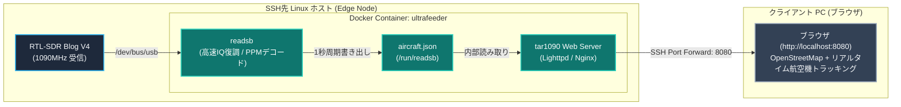

# ADS-B 航空機情報受信と tar1090 Web レーダー構築詳解

本ドキュメントでは、RTL-SDR Blog V4 を用いて民間航空機のトランスポンダ信号（ADS-B: 1090MHz）を受信し、Docker コンテナ（Ultrafeeder / tar1090）を用いてリアルタイムな Web レーダー画面（Flightradar24 自前版）を構築するための電波工学・デジタル信号処理（DSP）の数学的基礎、および実践手順を体系的に解説します。

---

## 1. ADS-B の電波工学とアンテナ設計

### 1.1 周波数と波長計算
航空機の ADS-B (Automatic Dependent Surveillance-Broadcast) は、国際民間航空機関（ICAO）の Mode S 拡張スキッター規格に基づき、**1090 MHz** のマイクロ波（UHF/SHF境界帯）で常時ブロードキャストされています。

$$ \lambda = \frac{c}{f} $$

#### 記号一覧
| 記号 | 物理量 | 単位 | 値 / 備考 |
|---|---|---|---|
| $\lambda$ | 電波の波長 (Wavelength) | $\text{m}$ | 求める値 |
| $c$ | 真空中の光速 (Speed of Light) | $\text{m/s}$ | 約 $2.9979 \times 10^8 \text{ m/s}$ |
| $f$ | 送信中心周波数 (Carrier Frequency) | $\text{Hz}$ | $1090 \text{ MHz} = 1.090 \times 10^9 \text{ Hz}$ |

#### 日本語での読み解き
電波は周波数 $f$ が高くなるほど、波長 $\lambda$（1周期あたりの空間的な長さ）が短くなります。1090 MHz という高周波帯では、波長はわずか約 27.5 cm となり、アンテナのエレメントサイズを非常にコンパクトに設計できます。

#### 展開ステップと直感イメージ
$$ \lambda = \frac{2.9979 \times 10^8 \text{ m/s}}{1.090 \times 10^9 \text{ s}^{-1}} \approx 0.2750 \text{ m} = 27.5 \text{ cm} $$

アンテナの共振長は波長 $\lambda$ を基準に決定されます：
1. **1/4波長ホイップ（モノポールアンテナ）**:
   $$ L_{\lambda/4} = \frac{\lambda}{4} \approx \frac{27.5 \text{ cm}}{4} \approx 6.88 \text{ cm} $$
   短縮率（金属線内の電波伝搬速度の低下、約 0.95〜0.98）を考慮すると、**約 6.5 cm 〜 6.8 cm** が最適共振長となります。
2. **1/2波長ダイポールアンテナ（付属アンテナキット）**:
   付属の伸縮ダイポールを使用する場合、給電点（中央）から左右/上下に伸びる各エレメントの長さをそれぞれ **約 6.5 cm 〜 6.8 cm**（一番縮めた状態）にセットします。
   航空機の ADS-B 偏波面は **垂直偏波（Vertical Polarization）** です。そのため、ダイポールアンテナは「地面に対して垂直（上下）」に立てることで、偏波損失（最大 20dB 以上の減衰）を防ぐことができます。

---

### 1.2 見通し距離（Line of Sight）と実効地球半径モデル

1090 MHz のマイクロ波は光と同様に極めて直進性が高く、山やビル、地平線（地球の丸み）に遮られると受信できません。ただし、大気の高度による気圧・水蒸気密度の変化によって電波がわずかに下向きに屈折（大気屈折）するため、幾何学的な視界よりも約 15% 遠くまで届きます。

$$ d \approx \sqrt{2 K R h_1} + \sqrt{2 K R h_2} \approx 4.12 \times \left(\sqrt{h_1} + \sqrt{h_2}\right) $$

#### 記号一覧
| 記号 | 物理量 | 単位 | 値 / 備考 |
|---|---|---|---|
| $d$ | 最大電波見通し距離 | $\text{km}$ | 受信局と航空機間の最大到達距離 |
| $R$ | 地球の平均半径 | $\text{km}$ | 約 $6,371 \text{ km}$ |
| $K$ | 実効地球半径係数 (Equivalent Earth Radius Factor) | 無次元 | 標準大気で約 $4/3 \approx 1.333$ |
| $h_1$ | 地上受信局アンテナの標高・海抜高 | $\text{m}$ | 例: 5階ベランダ＋海抜高で約 $50 \text{ m}$ |
| $h_2$ | 航空機の飛行高度 | $\text{m}$ | 巡航高度で約 $10,000 \text{ m}$ (約 33,000 ft) |

#### 日本語での読み解き
地球の丸みにより、地表から見ると航空機は遠ざかるにつれて地平線の下に隠れていきます。しかし、航空機が高高度（上空 10,000m）を飛んでいる場合、地上アンテナが数階程度の高さであっても、直線距離にして **400 km 超** の遠方まで電波が直接届く幾何学的見通しが得られます。

#### 展開ステップと直感イメージ
球体である地球の中心を $O$、半径を $R_e = K R$ とします。
地表からのアンテナ高さ $h$（$h \ll R_e$）における地平線までの見通し距離 $d_h$ は、三平方の定理より：
$$ (R_e + h)^2 = R_e^2 + d_h^2 $$
$$ R_e^2 + 2 R_e h + h^2 = R_e^2 + d_h^2 $$
ここで $h^2$ は $R_e h$（地球半径 $6371\text{km} \times h$）に比べて極めて小さいため無視（1次近似）すると：
$$ d_h^2 \approx 2 R_e h \implies d_h \approx \sqrt{2 R_e h} $$
実効地球半径 $R_e = \frac{4}{3} \times 6371 \times 10^3 \text{ m} \approx 8.495 \times 10^6 \text{ m}$ を代入し、単位を $\text{km}$ と $\text{m}$ で換算：
$$ d_h [\text{km}] \approx \sqrt{2 \times 8495 \times \frac{h [\text{m}]}{1000}} \approx \sqrt{16.99 \times h} \approx 4.12 \times \sqrt{h} $$
受信局（高さ $h_1$）と航空機（高さ $h_2$）の双方が互いに地平線の上にある限界距離は、両者の見通し距離の和となります：
$$ d = d_{h1} + d_{h2} \approx 4.12 \times (\sqrt{h_1} + \sqrt{h_2}) $$

**具体例（自宅環境の計算）**:
- 受信局: 海抜＋マンション5階で $h_1 \approx 50 \text{ m} \implies 4.12 \times \sqrt{50} \approx 29.1 \text{ km}$
- 巡航中航空機: 高度 33,000ft $\approx 10,000 \text{ m} \implies 4.12 \times \sqrt{10000} \approx 412 \text{ km}$
- **最大見通し距離 $d$**: $29.1 + 412 \approx \mathbf{441 \text{ km}}$

ベランダから見通せる空の方向であれば、東京から名古屋、仙台、あるいは太平洋沖合数百キロを飛行する航空機まで十分にキャッチできる物理的ポテンシャルがあります。

---

## 2. デジタル信号処理 (DSP) と Mode S パケット構造

### 2.1 パルス位置変調 (PPM: Pulse Position Modulation)
ADS-B は $1 \text{ Mbps}$ のデータレートで送信されますが、一般的な周波数変調（FSK）や位相変調（PSK）ではなく、**パルス位置変調（PPM）** と呼ばれる振幅パルス方式を採用しています。

- **1ビットの時間幅**: $1.0\ \mu\text{s}$
- **チップ時間**: $0.5\ \mu\text{s}$
- **ビット表現**:
  - 前半の $0.5\ \mu\text{s}$ に搬送波（パルス）が存在し、後半が無音 $\implies$ **ビット `1`**
  - 前半が無音で、後半の $0.5\ \mu\text{s}$ に搬送波（パルス）が存在 $\implies$ **ビット `0`**

```text
       1ビット幅 (1.0 μs)
      ├───────┴───────┤
ビット 1:  ┌───┐
           │   │       │  (前半 0.5μs High / 後半 0.5μs Low)
      ─────┘   └───────┴──
ビット 0:          ┌───┐
           │       │   │  (前半 0.5μs Low / 後半 0.5μs High)
      ─────┴───────┘   └──
```

#### なぜ PPM が採用されているのか？
1. **周波数・位相ドリフトへの強靭性**: 送信機（航空機）のドップラー効果や局部発振器の周波数ズレがあっても、単に「パルスがあるか・ないか（エネルギー検出）」だけでビット判定が可能です。
2. **自己同期（クロックリカバリ）**: 毎ビット必ず立ち上がりまたは立ち下がり遷移が生じるため、ビット同期が極めて容易です。

### 2.2 フレーム構造とプリアンブル同期
Mode S 拡張スキッター（ADS-B パケット）は、全長 $120\ \mu\text{s}$、112 ビットのデータで構成されます。

```text
├─ プリアンブル (8.0 μs) ─┤├────────── データブロック (112 μs = 112 bits) ──────────┤
  P1  P2    P3  P4          DF (5bit) | CA (3bit) | ICAO (24bit) | DATA (56bit) | PI/CRC (24bit)
```

1. **プリアンブル（8.0 $\mu\text{s}$）**:
   - $0.5\ \mu\text{s}$ のパルスが $0.0\ \mu\text{s}, 1.0\ \mu\text{s}, 3.5\ \mu\text{s}, 4.5\ \mu\text{s}$ の位置に正確に配置されています。
   - `readsb` や `dump1090` などのDSPデコーダは、SDRから流れてくるサンプルに対してこの 4 パルスの時間間隔との**相互相関（Cross-Correlation）**を連続計算し、相関値がしきい値を超えた瞬間にパケットの開始（フレーム同期）を検出します。
2. **パケットペイロード**:
   - **DF (Downlink Format, 5bit)**: `17` が ADS-B 拡張スキッターを表します。
   - **ICAO アドレス (24bit)**: 世界の全航空機に1対1で割り当てられた一意の機体固有ID（例: ボーイング787等）。
   - **DATA (56bit)**: 位置（CPR形式の緯度・経度）、気圧高度、対地速度、方位、コールサイン（便名）など。
   - **PI / CRC (24bit)**: 多項式除算による巡回冗長検査。ビット誤りを瞬時に破棄します。

---

## 3. システムアーキテクチャ：Ultrafeeder + tar1090

航空機追跡システムのコンテナスタックは、オープンソースコミュニティ（SDR-Enthusiasts）によって洗練された一体型コンテナ `docker-adsb-ultrafeeder` がデファクトスタンダードとなっています。



### アーキテクチャの利点
1. **CPUフットプリントの極小化**: `readsb` は純C言語で手書きSIMD最適化されており、低消費電力な小型PCやラズパイでも CPU使用率 2〜5% 程度で軽快に動作します。
2. **ローカル完結・プライバシー安全**: 外部サービス（Flightradar24等）へデータを送信することなく、手元ローカルの Docker 内で Web サーバーと地図UIが完結します。

---

## 4. SSH先での起動・検証手順

### ステップ 0: 事前確認（SDR排他制御のチェック）
RTL-SDR は同時に1つのプロセスしか掴むことができません。現在 `ground-station` や `rtl_fm`、`satdump` などが動作している場合は、一時的に停止しておきます。

```bash
# RTL-SDR を使用しているプロセスの有無を確認
lsof /dev/bus/usb/*/* 2>/dev/null || fuser /dev/bus/usb/*/*
```

### ステップ 1: アンテナの調整
1. 付属の伸縮ダイポールアンテナのロッドを**最も短い状態（約 6.5 cm 〜 7 cm）**まで縮めます。
2. アンテナを**垂直（上下）**に立て、ベランダの柵や窓際など、上空の見通しが良い場所に設置します。

### ステップ 2: Docker コンテナ（Ultrafeeder）の起動

#### 方法 A: `docker run`（最小構成・即時起動）
以下のコマンドを SSH 先の Linux ホストで実行します。
（※緯度 `READSB_LAT`、経度 `READSB_LON`、高度 `READSB_ALT` は、ご自宅の概略座標に合わせて変更してください。地図の初期中心点および距離計算に用いられます）

```bash
docker run -d \
  --name ultrafeeder \
  --restart unless-stopped \
  --device /dev/bus/usb:/dev/bus/usb \
  --device-cgroup-rule 'c 189:* rwm' \
  -p 8080:80 \
  -e TZ=Asia/Tokyo \
  -e READSB_DEVICE_TYPE=rtlsdr \
  -e READSB_GAIN=auto \
  -e READSB_LAT=35.6812 \
  -e READSB_LON=139.7671 \
  -e READSB_ALT=50m \
  ghcr.io/sdr-enthusiasts/docker-adsb-ultrafeeder:latest
```

#### 方法 B: `docker-compose.yml`（設定をファイル管理したい場合）
作業ディレクトリを作成し、以下の設定を配置して起動します：

```yaml
# /opt/adsb/docker-compose.yml
services:
  ultrafeeder:
    image: ghcr.io/sdr-enthusiasts/docker-adsb-ultrafeeder:latest
    container_name: ultrafeeder
    restart: unless-stopped
    devices:
      - /dev/bus/usb:/dev/bus/usb
    device_cgroup_rules:
      - 'c 189:* rwm'
    ports:
      - "8080:80"
    environment:
      - TZ=Asia/Tokyo
      - READSB_DEVICE_TYPE=rtlsdr
      - READSB_GAIN=auto
      - READSB_LAT=35.6812
      - READSB_LON=139.7671
      - READSB_ALT=50m
```

```bash
docker compose up -d
```

### ステップ 3: 動作ログの確認
コンテナが RTL-SDR Blog V4 を正しく認識し、1090 MHz のパケットを受信し始めているかログを確認します。

```bash
docker logs -f ultrafeeder
```

正常に受信が始まると、以下のようなログが出力され、捕捉した航空機の機数がカウントされ始めます：
```text
[readsb] Found Rafael Micro R828D tuner
[readsb] Exact sample rate is: 2000000.000000 Hz
[readsb] Gain reported by device: autogain
[readsb] Aircraft: 12 tracked, 8 with positions
```

### ステップ 4: ブラウザから Web レーダーにアクセス
手元の作業PC（Windows / Mac / WSL2等）から SSH ポートフォワーディングでトンネルを張ります。

```bash
# 手元PCのターミナルから実行（ssh_user と ssh_host は実際のエッジホスト名に変更）
ssh -L 8080:localhost:8080 ssh_user@ssh_host
```

トンネルが開いたら、手元PCのブラウザで以下にアクセスします：
👉 **`http://localhost:8080`**

画面上に OpenStreetMap が表示され、自宅周辺から数十〜数百km上空を飛ぶ航空機のアイコン、コールサイン、高度に応じた色分け、航跡ラインがリアルタイムに滑らかに表示されます。

---

## 5. トラブルシューティング（現場ノウハウ）

### 5.1 `WARNING: No obvious data input configured` / SDR を掴みに行かない
- **症状**: ログに `Device type is not rtlsdr, skipping...` や `autogain not supported for non rtl-sdr devices` が出力され、USB デバイスを開こうとしない。
- **原因**: Ultrafeeder コンテナでは、直接接続された SDR を使用する場合に環境変数 `READSB_DEVICE_TYPE=rtlsdr` の指定が必須です。指定がない場合、ネットワーク経由の Beast / SBS ストリーム待受モードとして起動します。
- **対処**: コンテナ起動オプションに `-e READSB_DEVICE_TYPE=rtlsdr` を追加します。

### 5.2 `usb_claim_interface error -6` / `Device or resource busy`
- **症状**: チューナー `Generic RTL2832U OEM` は検知されるが、直後に `usb_claim_interface error -6` で強制終了する。
- **原因 1（DVB チューナードライバ）**: Linux（Ubuntu）カーネルが RTL2832U を地デジチューナーと認識し、カーネルモジュール `dvb_usb_rtl2832u` が自動で USB インターフェースを排他占有（claim）している。
  ```bash
  # 一時解除
  sudo rmmod dvb_usb_rtl2832u rtl2832 rtl2830 dvb_usb_v2 2>/dev/null || sudo modprobe -r dvb_usb_rtl2832u

  # 恒久無効化（ブラックリスト登録）
  echo 'blacklist dvb_usb_rtl2832u' | sudo tee /etc/modprobe.d/blacklist-rtl.conf
  ```
- **原因 2（既存プロセスとの競合）**: `ground-station` や `rtl_test`、`satdump` などの別プロセスが SDR を開いたままになっている。
  ```bash
  sudo fuser -v /dev/bus/usb/*/*
  ```

---

## 6. 参考文献・一次情報リンク

1. **ICAO Annex 10 Volume IV (Surveillance and Collision Avoidance Systems)**: Mode S 拡張スキッター規格書
2. **[wiedehopf/readsb (GitHub)](https://github.com/wiedehopf/readsb)**: 高速 Mode S / ADS-B デコーダ一次情報リポジトリ
3. **[wiedehopf/tar1090 (GitHub)](https://github.com/wiedehopf/tar1090)**: Web トラッキングインターフェース一次情報リポジトリ
4. **[SDR-Enthusiasts / docker-adsb-ultrafeeder (GitHub)](https://github.com/sdr-enthusiasts/docker-adsb-ultrafeeder)**: Ultrafeeder 公式コンテナリポジトリ
5. **[SDR-Enthusiasts GitBook Documentation](https://sdr-enthusiasts.gitbook.io/ads-b/)**: システム構築・チューニングガイド
