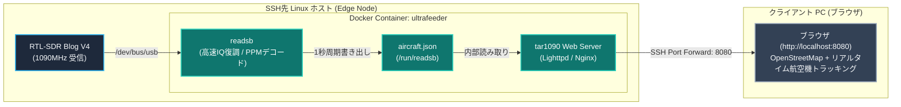
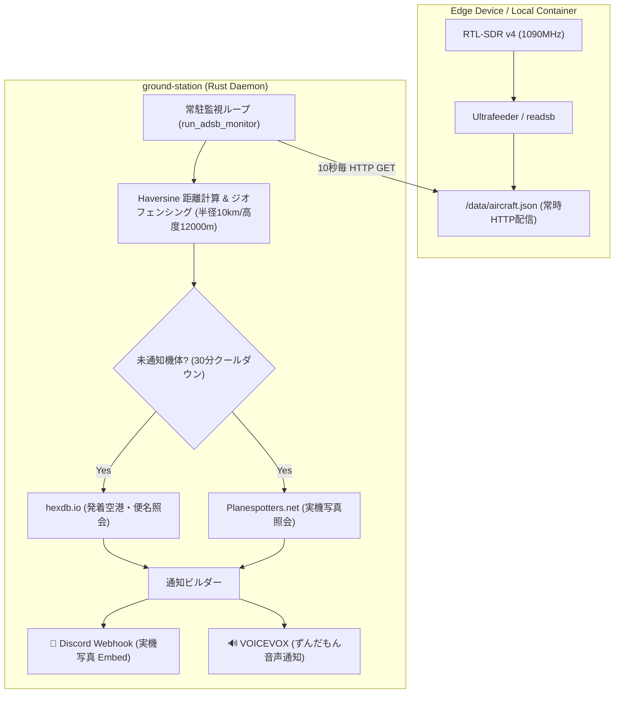

# ADS-B 航空機情報受信と tar1090 Web レーダー構築詳解

本ドキュメントでは、RTL-SDR Blog V4 を用いて民間航空機のトランスポンダ信号（ADS-B: 1090MHz）を受信し、Docker コンテナ（Ultrafeeder / tar1090）を用いてリアルタイムな Web レーダー画面（Flightradar24 自前版）を構築するための電波工学・デジタル信号処理（DSP）の数学的基礎、および実践手順を体系的に解説します。

---

## 1. ADS-B の電波工学とアンテナ設計

### 1.1 周波数と波長計算
航空機の ADS-B (Automatic Dependent Surveillance-Broadcast) は、国際民間航空機関（ICAO）の Mode S 拡張スキッター規格に基づき、**1090 MHz** のマイクロ波（UHF/SHF境界帯）で常時ブロードキャストされています。

$$ \lambda = \frac{c}{f} $$

#### 記号一覧
| 記号 | 物理量 | 単位 | 値 / 備考 |
|---|---|---|---|
| $\lambda$ | 電波の波長 (Wavelength) | $\text{m}$ | 求める値 |
| $c$ | 真空中の光速 (Speed of Light) | $\text{m/s}$ | 約 $2.9979 \times 10^8 \text{ m/s}$ |
| $f$ | 送信中心周波数 (Carrier Frequency) | $\text{Hz}$ | $1090 \text{ MHz} = 1.090 \times 10^9 \text{ Hz}$ |

#### 日本語での読み解き
電波は周波数 $f$ が高くなるほど、波長 $\lambda$（1周期あたりの空間的な長さ）が短くなります。1090 MHz という高周波帯では、波長はわずか約 27.5 cm となり、アンテナのエレメントサイズを非常にコンパクトに設計できます。

#### 展開ステップと直感イメージ
$$ \lambda = \frac{2.9979 \times 10^8 \text{ m/s}}{1.090 \times 10^9 \text{ s}^{-1}} \approx 0.2750 \text{ m} = 27.5 \text{ cm} $$

アンテナの共振長は波長 $\lambda$ を基準に決定されます：
1. **1/4波長ホイップ（モノポールアンテナ）**:
   $$ L_{\lambda/4} = \frac{\lambda}{4} \approx \frac{27.5 \text{ cm}}{4} \approx 6.88 \text{ cm} $$
   短縮率（金属線内の電波伝搬速度の低下、約 0.95〜0.98）を考慮すると、**約 6.5 cm 〜 6.8 cm** が最適共振長となります。
2. **1/2波長ダイポールアンテナ（付属アンテナキット）**:
   付属の伸縮ダイポールを使用する場合、給電点（中央）から左右/上下に伸びる各エレメントの長さをそれぞれ **約 6.5 cm 〜 6.8 cm**（一番縮めた状態）にセットします。
   航空機の ADS-B 偏波面は **垂直偏波（Vertical Polarization）** です。そのため、ダイポールアンテナは「地面に対して垂直（上下）」に立てることで、偏波損失（最大 20dB 以上の減衰）を防ぐことができます。

---

### 1.2 見通し距離（Line of Sight）と実効地球半径モデル

1090 MHz のマイクロ波は光と同様に極めて直進性が高く、山やビル、地平線（地球の丸み）に遮られると受信できません。ただし、大気の高度による気圧・水蒸気密度の変化によって電波がわずかに下向きに屈折（大気屈折）するため、幾何学的な視界よりも約 15% 遠くまで届きます。

$$ d \approx \sqrt{2 K R h_1} + \sqrt{2 K R h_2} \approx 4.12 \times \left(\sqrt{h_1} + \sqrt{h_2}\right) $$

#### 記号一覧
| 記号 | 物理量 | 単位 | 値 / 備考 |
|---|---|---|---|
| $d$ | 最大電波見通し距離 | $\text{km}$ | 受信局と航空機間の最大到達距離 |
| $R$ | 地球の平均半径 | $\text{km}$ | 約 $6,371 \text{ km}$ |
| $K$ | 実効地球半径係数 (Equivalent Earth Radius Factor) | 無次元 | 標準大気で約 $4/3 \approx 1.333$ |
| $h_1$ | 地上受信局アンテナの標高・海抜高 | $\text{m}$ | 例: 5階ベランダ＋海抜高で約 $50 \text{ m}$ |
| $h_2$ | 航空機の飛行高度 | $\text{m}$ | 巡航高度で約 $10,000 \text{ m}$ (約 33,000 ft) |

#### 日本語での読み解き
地球の丸みにより、地表から見ると航空機は遠ざかるにつれて地平線の下に隠れていきます。しかし、航空機が高高度（上空 10,000m）を飛んでいる場合、地上アンテナが数階程度の高さであっても、直線距離にして **400 km 超** の遠方まで電波が直接届く幾何学的見通しが得られます。

#### 展開ステップと直感イメージ
球体である地球の中心を $O$、半径を $R_e = K R$ とします。
地表からのアンテナ高さ $h$（$h \ll R_e$）における地平線までの見通し距離 $d_h$ は、三平方の定理より：
$$ (R_e + h)^2 = R_e^2 + d_h^2 $$
$$ R_e^2 + 2 R_e h + h^2 = R_e^2 + d_h^2 $$
ここで $h^2$ は $R_e h$（地球半径 $6371\text{km} \times h$）に比べて極めて小さいため無視（1次近似）すると：
$$ d_h^2 \approx 2 R_e h \implies d_h \approx \sqrt{2 R_e h} $$
実効地球半径 $R_e = \frac{4}{3} \times 6371 \times 10^3 \text{ m} \approx 8.495 \times 10^6 \text{ m}$ を代入し、単位を $\text{km}$ と $\text{m}$ で換算：
$$ d_h [\text{km}] \approx \sqrt{2 \times 8495 \times \frac{h [\text{m}]}{1000}} \approx \sqrt{16.99 \times h} \approx 4.12 \times \sqrt{h} $$
受信局（高さ $h_1$）と航空機（高さ $h_2$）の双方が互いに地平線の上にある限界距離は、両者の見通し距離の和となります：
$$ d = d_{h1} + d_{h2} \approx 4.12 \times (\sqrt{h_1} + \sqrt{h_2}) $$

**具体例（自宅環境の計算）**:
- 受信局: 海抜＋マンション5階で $h_1 \approx 50 \text{ m} \implies 4.12 \times \sqrt{50} \approx 29.1 \text{ km}$
- 巡航中航空機: 高度 33,000ft $\approx 10,000 \text{ m} \implies 4.12 \times \sqrt{10000} \approx 412 \text{ km}$
- **最大見通し距離 $d$**: $29.1 + 412 \approx \mathbf{441 \text{ km}}$

ベランダから見通せる空の方向であれば、東京から仙台、新潟、あるいは北陸・東北方面まで数百キロを飛行する航空機まで十分にキャッチできる物理的ポテンシャルがあります。

---

### 1.3 アンテナ北向き移設（2026年9月15日）に伴うレーダーカバレッジと航空路ジオメトリの刷新

2026年9月15日、アンテナの設置場所を「東向きベランダ」から「北向きベランダ」へと移設しました。1090 MHz のマイクロ波は極めて直進性が高く、建物躯体（鉄筋コンクリート: RC壁）によって $30 \sim 50\,\text{dB}$（1,000〜100,000倍）の物理的遮蔽減衰を受けます。この移設によって、地上局の Web レーダー（tar1090）および自動航空機見守り機構が捕捉できる空域ジオメトリは一新されました。

#### 1. 見通し開口角（FoV）と死角の幾何学

```text
                    【北 (N: 0° / 360°)】
        新潟・長野・北陸方面          東北・北海道・欧州北回り便
        北西 (NW: 315°)                 北東 (NE: 45°)
              ＼                       ／
                ＼                   ／
  西 (W: 270°) ─────── [アンテナ] ─────── 東 (E: 90°)
                    ／ 建物躯体 ＼
                  ／ (RC壁 遮蔽) ＼
        南西 (SW)                 南東 (SE)
              羽田低空・太平洋側 (死角)
                    【南 (S: 180°)】
```

- **新・可視領域（$270^\circ \sim 360^\circ/0^\circ \sim 90^\circ$）**:
  - 真西（富山・長野・新潟・日本海）〜真北（群馬・栃木・東北新幹線沿い）〜真東（埼玉・茨城・千葉北部・太平洋側北寄り）の半球全空が開口。
  - アンテナ前面が北側の空に向かって完全に抜けているため、北半球側の見通し距離は最大 $440\,\text{km}$ の幾何学的限界まで直達波でカバーされます。
- **建物による死角（$90^\circ \sim 270^\circ$）**:
  - 真東〜南東〜真南〜南西〜真西の南半球側。マンションの住戸・外壁がアンテナ背後に位置するため、羽田空港（RJTT）直上および東京湾・太平洋沖合の低高度アプローチは物理的に遮蔽されます。

---

#### 2. 主要航空路（RNAV ルート）の捕捉特性

東京都青梅市の観測点から北向きベランダで直視できる主要な空域と航空路は以下の通りです：

| 方面・方位角 | 主な航空路・対象トラフィック | 電波受信特性と捕捉レンジ |
| :--- | :--- | :--- |
| **真北〜北東 ($0^\circ \sim 60^\circ$)** | ・東北・北海道・道東便（新千歳・函館・旭川）<br>・欧州・北米からの国際線北回りアプローチ（Y10, V17 等） | 最大限界距離（約 $350 \sim 440\,\text{km}$）まで安定捕捉。山形・岩手・宮城上空の巡航機（FL300〜FL400）をクリアに直視。 |
| **北西〜真西 ($280^\circ \sim 350^\circ$)** | ・新潟・北陸・富山・小松方面便<br>・日本海横断国際線ルート（韓国・中国・中央アジア方面） | 長野・群馬・新潟県境の山岳回廊を越え、日本海上空の巡航機を $200 \sim 350\,\text{km}$ 遠方から直達波で捕捉。 |
| **至近距離・直上 ($r \le 20\,\text{km}$)** | ・横田基地（RJTY / Yokota AB）の北側進入路・訓練空域<br>・入間基地（RJTJ）周辺トラフィック<br>・羽田・成田への北西側ウェイポイント通過便 | 高仰角（$45^\circ \sim 90^\circ$）のため、建物の庇（ひさし）をかわして超高SNR（$+20 \sim +30\,\text{dB}$）で受信。実機写真と音声通知が即座にトリガー。 |

---

#### 3. 自由空間電波伝搬損失と受信電力の数理モデル

航空機から送信された ADS-B 電波（送信電力 $P_t \approx 250\,\text{W} = +54\,\text{dBm}$）が、距離 $d$ 離れた地上アンテナに到達したときの受信電力 $P_r$ をフリスの伝達公式（Friis Transmission Formula）によりモデル化します。

$$P_r = P_t + G_t + G_r + 20 \log_{10}\left(\frac{c}{4\pi f \cdot d}\right) - L_{\text{obs}}$$

##### ① 記号一覧
| 記号 | 物理量 / パラメータ | 代表値 / 単位 | 備考 |
| :--- | :--- | :--- | :--- |
| $P_r$ | 地上受信電力 | $\text{dBm}$ | RTL-SDR の最小受信感度は約 $-85 \sim -90\,\text{dBm}$ |
| $P_t$ | 航空機トランスポンダー送信電力 | $+54\,\text{dBm}$ (約 $250\,\text{W}$) | 民間大型旅客機の標準 Mode S 尖頭電力 |
| $G_t$ | 航空機アンテナ利得（モノポール） | $+2.15\,\text{dBi}$ | 胴体下部設置の垂直偏波アンテナ |
| $G_r$ | 地上受信アンテナ利得 | $+2.0\,\text{dBi}$ | マグネットベース付属アンテナ（波長 $6.9\,\text{cm}$ 調整） |
| $c$ | 光速 | $3.0 \times 10^8\,\text{m/s}$ | 真空中および大気中の電波伝搬速度 |
| $f$ | ADS-B 搬送波周波数 | $1.09 \times 10^9\,\text{Hz}$ ($1090\,\text{MHz}$) | 波長 $\lambda = c/f \approx 0.275\,\text{m}$ |
| $d$ | 航空機と受信局間の直線距離 | $\text{m}$ | スラントレンジ（傾斜距離） |
| $L_{\text{obs}}$ | 障害物追加減衰量（RC壁遮蔽損失） | 直達視界: $0\,\text{dB}$ / 建物陰: $30 \sim 50\,\text{dB}$ | 鉄筋コンクリートによる透過損失 |

##### ② 日本語での読み解き
航空機の送信電力は $250\,\text{W}$ と極めて強力ですが、距離が離れるにつれて電波のエネルギーは球面上に拡散（逆二乗則）し、距離が 10 倍になるごとに電力は $20\,\text{dB}$（100分の1）ずつ急激に減衰します。
北向きベランダの開口方向（$L_{\text{obs}} = 0\,\text{dB}$）であれば、距離 $300\,\text{km}$ の遠距離にあっても受信電力は約 $-82\,\text{dBm}$ を維持し、RTL-SDR の復調限界（約 $-88\,\text{dBm}$）を上回るため確実にパケットを取り出せます。
一方、建物の背後（$L_{\text{obs}} \ge 30\,\text{dB}$）に位置する南側の空域では、電力が $-115\,\text{dBm}$ 以下に叩き落とされ、熱雑音フロアに埋没して受信不能となります。

##### ③ 展開ステップと直感イメージ
1. **波長 $\lambda$ の計算**:
   $$\lambda = \frac{c}{f} = \frac{3.0 \times 10^8\,\text{m/s}}{1.09 \times 10^9\,\text{Hz}} \approx 0.2752\,\text{m} = 27.52\,\text{cm}$$
2. **自由空間基本伝搬損失（Free Space Path Loss: FSPL）**:
   距離 $d = 300\,\text{km} = 3.0 \times 10^5\,\text{m}$ における拡散損失を計算：
   $$\text{FSPL} = 20 \log_{10}\left(\frac{4\pi \times 3.0 \times 10^5}{0.2752}\right) = 20 \log_{10}(1.37 \times 10^7) \approx 20 \times 7.137 = 142.7\,\text{dB}$$
3. **直達視界（北側・$L_{\text{obs}} = 0\,\text{dB}$）での受信電力**:
   $$P_r = 54 + 2.15 + 2.0 - 142.7 - 0 = -84.55\,\text{dBm}$$
   $\implies$ RTL-SDR Blog V4 の高感度シリコンチューナー（R828D）の感度限界（約 $-88\,\text{dBm}$）よりも $3.5\,\text{dB}$ 高く、安定して Mode S メッセージを受信・復調できます。
4. **建物陰（南側・$L_{\text{obs}} = 40\,\text{dB}$）での受信電力**:
   $$P_r = -84.55 - 40 = -124.55\,\text{dBm}$$
   $\implies$ 雑音フロア（帯域 2MHz で約 $-110\,\text{dBm}$）を $15\,\text{dB}$ も下回るため、信号は完全に消失します。

この数理的裏付けにより、Web 地図（tar1090）で観測される航跡プロットが**「北半球側へ半円状に大きく伸び、南側が建物形状に沿ってシャープに切り欠かれる」**というリアルな物理現象の理由を完璧に説明できます。

---

## 2. デジタル信号処理 (DSP) と Mode S パケット構造

### 2.1 パルス位置変調 (PPM: Pulse Position Modulation)
ADS-B は $1 \text{ Mbps}$ のデータレートで送信されますが、一般的な周波数変調（FSK）や位相変調（PSK）ではなく、**パルス位置変調（PPM）** と呼ばれる振幅パルス方式を採用しています。

- **1ビットの時間幅**: $1.0\ \mu\text{s}$
- **チップ時間**: $0.5\ \mu\text{s}$
- **ビット表現**:
  - 前半の $0.5\ \mu\text{s}$ に搬送波（パルス）が存在し、後半が無音 $\implies$ **ビット `1`**
  - 前半が無音で、後半の $0.5\ \mu\text{s}$ に搬送波（パルス）が存在 $\implies$ **ビット `0`**

```text
       1ビット幅 (1.0 μs)
      ├───────┴───────┤
ビット 1:  ┌───┐
           │   │       │  (前半 0.5μs High / 後半 0.5μs Low)
      ─────┘   └───────┴──
ビット 0:          ┌───┐
           │       │   │  (前半 0.5μs Low / 後半 0.5μs High)
      ─────┴───────┘   └──
```

#### なぜ PPM が採用されているのか？
1. **周波数・位相ドリフトへの強靭性**: 送信機（航空機）のドップラー効果や局部発振器の周波数ズレがあっても、単に「パルスがあるか・ないか（エネルギー検出）」だけでビット判定が可能です。
2. **自己同期（クロックリカバリ）**: 毎ビット必ず立ち上がりまたは立ち下がり遷移が生じるため、ビット同期が極めて容易です。

### 2.2 フレーム構造とプリアンブル同期
Mode S 拡張スキッター（ADS-B パケット）は、全長 $120\ \mu\text{s}$、112 ビットのデータで構成されます。

```text
├─ プリアンブル (8.0 μs) ─┤├────────── データブロック (112 μs = 112 bits) ──────────┤
  P1  P2    P3  P4          DF (5bit) | CA (3bit) | ICAO (24bit) | DATA (56bit) | PI/CRC (24bit)
```

1. **プリアンブル（8.0 $\mu\text{s}$）**:
   - $0.5\ \mu\text{s}$ のパルスが $0.0\ \mu\text{s}, 1.0\ \mu\text{s}, 3.5\ \mu\text{s}, 4.5\ \mu\text{s}$ の位置に正確に配置されています。
   - `readsb` や `dump1090` などのDSPデコーダは、SDRから流れてくるサンプルに対してこの 4 パルスの時間間隔との**相互相関（Cross-Correlation）**を連続計算し、相関値がしきい値を超えた瞬間にパケットの開始（フレーム同期）を検出します。
2. **パケットペイロード**:
   - **DF (Downlink Format, 5bit)**: `17` が ADS-B 拡張スキッターを表します。
   - **ICAO アドレス (24bit)**: 世界の全航空機に1対1で割り当てられた一意の機体固有ID（例: ボーイング787等）。
   - **DATA (56bit)**: 位置（CPR形式の緯度・経度）、気圧高度、対地速度、方位、コールサイン（便名）など。
   - **PI / CRC (24bit)**: 多項式除算による巡回冗長検査。ビット誤りを瞬時に破棄します。

---

## 3. システムアーキテクチャ：Ultrafeeder + tar1090

航空機追跡システムのコンテナスタックは、オープンソースコミュニティ（SDR-Enthusiasts）によって洗練された一体型コンテナ `docker-adsb-ultrafeeder` がデファクトスタンダードとなっています。



### アーキテクチャの利点
1. **CPUフットプリントの極小化**: `readsb` は純C言語で手書きSIMD最適化されており、低消費電力な小型PCやラズパイでも CPU使用率 2〜5% 程度で軽快に動作します。
2. **ローカル完結・プライバシー安全**: 外部サービス（Flightradar24等）へデータを送信することなく、手元ローカルの Docker 内で Web サーバーと地図UIが完結します。

---

## 4. SSH先での起動・検証手順

### ステップ 0: 事前確認（SDR排他制御のチェック）
RTL-SDR は同時に1つのプロセスしか掴むことができません。現在 `ground-station` や `rtl_fm`、`satdump` などが動作している場合は、一時的に停止しておきます。

```bash
# RTL-SDR を使用しているプロセスの有無を確認
lsof /dev/bus/usb/*/* 2>/dev/null || fuser /dev/bus/usb/*/*
```

### ステップ 1: アンテナの調整
1. 付属の伸縮ダイポールアンテナのロッドを**最も短い状態（約 6.5 cm 〜 7 cm）**まで縮めます。
2. アンテナを**垂直（上下）**に立て、ベランダの柵や窓際など、上空の見通しが良い場所に設置します。

### ステップ 2: Docker コンテナ（Ultrafeeder）の起動

#### 方法 A: `docker run`（最小構成・即時起動）
以下のコマンドを SSH 先の Linux ホストで実行します。
（※緯度 `READSB_LAT`、経度 `READSB_LON`、高度 `READSB_ALT` は、ご自宅の概略座標に合わせて変更してください。地図の初期中心点および距離計算に用いられます）

```bash
docker run -d \
  --name ultrafeeder \
  --restart unless-stopped \
  --device /dev/bus/usb:/dev/bus/usb \
  --device-cgroup-rule 'c 189:* rwm' \
  -p 8080:80 \
  -e TZ=Asia/Tokyo \
  -e READSB_DEVICE_TYPE=rtlsdr \
  -e READSB_GAIN=auto \
  -e READSB_LAT=35.6812 \
  -e READSB_LON=139.7671 \
  -e READSB_ALT=50m \
  ghcr.io/sdr-enthusiasts/docker-adsb-ultrafeeder:latest
```

#### 方法 B: `docker-compose.yml`（設定をファイル管理したい場合）
作業ディレクトリを作成し、以下の設定を配置して起動します：

```yaml
# /opt/adsb/docker-compose.yml
services:
  ultrafeeder:
    image: ghcr.io/sdr-enthusiasts/docker-adsb-ultrafeeder:latest
    container_name: ultrafeeder
    restart: unless-stopped
    devices:
      - /dev/bus/usb:/dev/bus/usb
    device_cgroup_rules:
      - 'c 189:* rwm'
    ports:
      - "8080:80"
    environment:
      - TZ=Asia/Tokyo
      - READSB_DEVICE_TYPE=rtlsdr
      - READSB_GAIN=auto
      - READSB_LAT=35.6812
      - READSB_LON=139.7671
      - READSB_ALT=50m
```

```bash
docker compose up -d
```

### ステップ 3: 動作ログの確認
コンテナが RTL-SDR Blog V4 を正しく認識し、1090 MHz のパケットを受信し始めているかログを確認します。

```bash
docker logs -f ultrafeeder
```

正常に受信が始まると、以下のようなログが出力され、捕捉した航空機の機数がカウントされ始めます：
```text
[readsb] Found Rafael Micro R828D tuner
[readsb] Exact sample rate is: 2000000.000000 Hz
[readsb] Gain reported by device: autogain
[readsb] Aircraft: 12 tracked, 8 with positions
```

### ステップ 4: ブラウザから Web レーダーにアクセス
手元の作業PC（Windows / Mac / WSL2等）から SSH ポートフォワーディングでトンネルを張ります。

```bash
# 手元PCのターミナルから実行（ssh_user と ssh_host は実際のエッジホスト名に変更）
ssh -L 8080:localhost:8080 ssh_user@ssh_host
```

トンネルが開いたら、手元PCのブラウザで以下にアクセスします：
👉 **`http://localhost:8080`**

画面上に OpenStreetMap が表示され、自宅周辺から数十〜数百km上空を飛ぶ航空機のアイコン、コールサイン、高度に応じた色分け、航跡ラインがリアルタイムに滑らかに表示されます。

---

## 5. トラブルシューティング（現場ノウハウ）

### 5.1 `WARNING: No obvious data input configured` / SDR を掴みに行かない
- **症状**: ログに `Device type is not rtlsdr, skipping...` や `autogain not supported for non rtl-sdr devices` が出力され、USB デバイスを開こうとしない。
- **原因**: Ultrafeeder コンテナでは、直接接続された SDR を使用する場合に環境変数 `READSB_DEVICE_TYPE=rtlsdr` の指定が必須です。指定がない場合、ネットワーク経由の Beast / SBS ストリーム待受モードとして起動します。
- **対処**: コンテナ起動オプションに `-e READSB_DEVICE_TYPE=rtlsdr` を追加します。

### 5.2 `usb_claim_interface error -6` / `Device or resource busy`
- **症状**: チューナー `Generic RTL2832U OEM` は検知されるが、直後に `usb_claim_interface error -6` で強制終了する。
- **原因 1（DVB チューナードライバ）**: Linux（Ubuntu）カーネルが RTL2832U を地デジチューナーと認識し、カーネルモジュール `dvb_usb_rtl2832u` が自動で USB インターフェースを排他占有（claim）している。
  ```bash
  # 一時解除
  sudo rmmod dvb_usb_rtl2832u rtl2832 rtl2830 dvb_usb_v2 2>/dev/null || sudo modprobe -r dvb_usb_rtl2832u

  # 恒久無効化（ブラックリスト登録）
  echo 'blacklist dvb_usb_rtl2832u' | sudo tee /etc/modprobe.d/blacklist-rtl.conf
  ```
- **原因 2（既存プロセスとの競合）**: `ground-station` や `rtl_test`、`satdump` などの別プロセスが SDR を開いたままになっている。
  ```bash
  sudo fuser -v /dev/bus/usb/*/*
  ```

---

## 6. 衛星地上局（ground-station）との時分割統合と実機写真・音声通知

### 6.1 アイドル時間帯のフライト見守りアーキテクチャ
気象衛星（NOAA / Meteor-M）や CubeSat、ISS の頭上通過は 1 回あたり約 10〜15 分であり、通過と通過の間には 30 分〜数時間の「衛星アイドル時間」が存在します。
`ground-station`（Rust）では、このアイドル時間を有効活用し、自宅上空を飛行する民間航空機を自動検知して実機写真とともに Discord 通知＆ずんだもん（VOICEVOX）発話を行う自律監視ループを統合しています。



- **SDRデバイス競合の回避**:
  Ultrafeeder コンテナが SDR をオープンし、ローカル HTTP（`http://localhost:8080/data/aircraft.json`）で航空機状態を JSON 公開しています。`ground-station` はこの JSON を HTTP GET で参照するため、プロセス間での USB デバイス直接競合を起こさず安全に共存可能です。

---

### 6.2 大圏距離（Haversine 公式）によるジオフェンシング
自宅（観測地）の緯度・経度と航空機の緯度・経度から、球面上の最短距離（大圏距離）を計算して近接判定を行います。

$$ d = 2 R \arcsin \left( \sqrt{\sin^2\left(\frac{\Delta \phi}{2}\right) + \cos(\phi_1)\cos(\phi_2)\sin^2\left(\frac{\Delta \lambda}{2}\right)} \right) $$

#### 記号一覧
| 記号 | 物理量 / パラメータ | 単位 | 備考 |
|---|---|---|---|
| $d$ | 観測地と航空機間の大圏距離 | $\text{km}$ | 判定閾値（例: $10.0 \text{ km}$）と比較 |
| $R$ | 地球の平均半径 | $\text{km}$ | 約 $6,371.0 \text{ km}$ |
| $\phi_1, \phi_2$ | 観測地および航空機の緯度 | $\text{rad}$ | 度（deg）から $\times \frac{\pi}{180}$ でラジアンに換算 |
| $\lambda_1, \lambda_2$ | 観測地および航空機の経度 | $\text{rad}$ | 度（deg）から $\times \frac{\pi}{180}$ でラジアンに換算 |
| $\Delta \phi, \Delta \lambda$ | 緯度差・経度差 | $\text{rad}$ | $\Delta \phi = \phi_2 - \phi_1, \Delta \lambda = \lambda_2 - \lambda_1$ |

#### 日本語での読み解き
平面の三平方の定理（ユークリッド距離）を地表にそのまま適用すると、緯度が高くなるにつれて経度 1 度あたりの東西距離が縮むため歪みが生じます。Haversine（半正矢）公式を用いることで、地球を真球と仮定した球面三角法により、日本全土・局所エリアにおいて誤差数メートル以内の高精度な距離計算が可能です。

#### 展開ステップと直感イメージ
半正矢関数 $\text{hav}(\theta) = \sin^2\left(\frac{\theta}{2}\right) = \frac{1 - \cos(\theta)}{2}$ を用いると、中心角 $\Theta = \frac{d}{R}$ に対する球面余弦定理は以下のように書き換えられます：
$$ \text{hav}(\Theta) = \text{hav}(\Delta \phi) + \cos(\phi_1)\cos(\phi_2)\text{hav}(\Delta \lambda) $$
両辺の逆関数（$\arcsin$）をとって中心角 $\Theta$ を求め、地球半径 $R$ を乗じることで地表の最短弧長 $d$ が導かれます：
$$ d = 2 R \cdot \arcsin\left(\sqrt{\text{hav}(\Delta \phi) + \cos(\phi_1)\cos(\phi_2)\text{hav}(\Delta \lambda)}\right) $$

---

### 6.3 外部 API による情報拡充とキャッシュ

1. **hexdb.io (ルート情報照会)**:
   - コールサイン（例: `ANA247`）をもとに `https://hexdb.io/api/v1/route/icao/{callsign}` にアクセスし、出発空港（`origin_iata`, `origin_name`）および到着空港（`destination_iata`, `destination_name`）を取得。
2. **Planespotters.net (実機写真照会)**:
   - ICAO 24-bit 航空機アドレス（HEX コード、例: `86786c`）をもとに `https://api.planespotters.net/pub/photos/hex/{hex}` にアクセスし、世界中の航空写真家が投稿した実機写真のサムネイル URL、機種名、航空会社名、撮影者クレジットを取得。
3. **インメモリ・キャッシュ (`AdsbCache`)**:
   - 外部 API への過剰リクエストを防ぐため、照会結果はメモリ内に保持。
   - 同一機体が旋回・通過中に何度も通知されるのを防ぐため、30分間のクールダウンタイムアウトを設けて通知を抑制します。

---

### 6.4 疎通確認サブコマンド (`test-adsb`) の使い方

設定が正しく完了しているか確認するため、`ground-station` CLI にテスト用サブコマンドが用意されています。

```bash
cd apps/ground-station
cargo run -- test-adsb
```

実行すると、現在ローカルの readsb で受信中の機体から最も自宅に近い機体を自動抽出し（受信機体がない場合はサンプル機体として全日空 B787 ANA247便を自動モック）、Planespotters から実機写真を取得して Discord への Embed 送信およびずんだもんによるリアルなフライト情報発話を即座にテストできます。

---

### 6.5 「航空機監視が反応しない」場合のトラブルシューティングと自律改修機構

航空機監視が動作しない・反応が鈍いと感じる場合、以下の4つの要因とシステム側の自動解決機構が備わっています：

1. **エンドポイントURLの自動探索 (Auto-Discovery)**:
   - Ultrafeeder や readsb、tar1090 の導入形態によって JSON パスが異なります（`/data/aircraft.json`, `/tar1090/data/aircraft.json`, `/aircraft.json`, `/run/readsb/aircraft.json` 等）。
   - 地上局デーモンは候補 URL を自動探索・フォールバックし、正常応答が得られたエンドポイントを記憶して自動接続します。
2. **サイレントフェイルの防止と定期警告ログ**:
   - readsb 未起動やポート不一致による接続失敗（Connection Refused / HTTP 404）が発生した場合、30秒ごとに `warn!` ログで接続先とエラー原因を明示します。
3. **定期レーダーハートビート表示**:
   - 機体が自宅直上（15km以内）に入らない待機時間帯でも、30秒ごとに `📡 ADS-B レーダー状況: 捕捉 X 機 (位置確定 Y 機) | 最接近: 便名 (XX.Xkm, 高度 XXXXm)` と出力され、SDR アンテナが電波を捕捉できているかをリアルタイムに確認できます。
4. **ジオフェンス監視半径の適正化**:
   - 東京都青梅市周辺の主要航空路（羽田・成田アプローチ、関越ルート、横田空域境界）をカバーするため、デフォルト判定半径を $8.0\ \text{km} \to 15.0\ \text{km}$ に拡大しています。
5. **事前ヘルスチェック (`check`) の活用**:
   - `cargo run -- check` を実行することで、起動前に readsb エンドポイントの疎通と受信機体数を即座に診断可能です。

---

## 7. 参考文献・一次情報リンク

1. **ICAO Annex 10 Volume IV (Surveillance and Collision Avoidance Systems)**: Mode S 拡張スキッター規格書
2. **[wiedehopf/readsb (GitHub)](https://github.com/wiedehopf/readsb)**: 高速 Mode S / ADS-B デコーダ一次情報リポジトリ
3. **[wiedehopf/tar1090 (GitHub)](https://github.com/wiedehopf/tar1090)**: Web トラッキングインターフェース一次情報リポジトリ
4. **[SDR-Enthusiasts / docker-adsb-ultrafeeder (GitHub)](https://github.com/sdr-enthusiasts/docker-adsb-ultrafeeder)**: Ultrafeeder 公式コンテナリポジトリ
5. **[SDR-Enthusiasts GitBook Documentation](https://sdr-enthusiasts.gitbook.io/ads-b/)**: システム構築・チューニングガイド
6. **[Planespotters.net API](https://www.planespotters.net/api)**: 航空機写真オープンAPI
7. **[hexdb.io API](https://hexdb.io/)**: 航空機登録情報およびフライトルートオープンAPI
