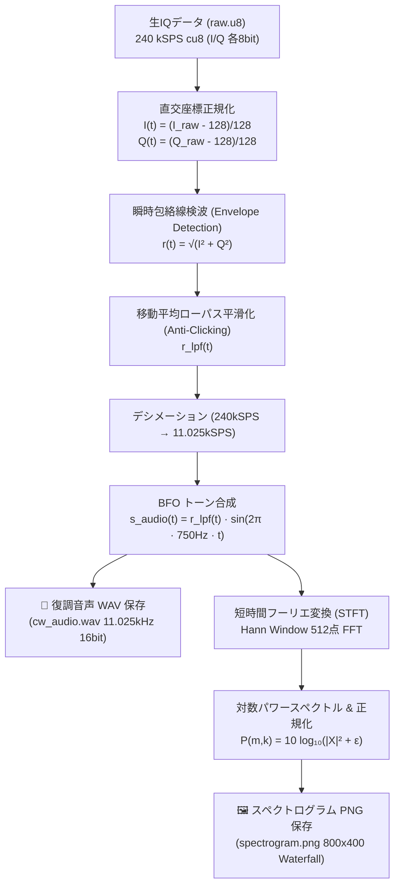

# 🛰️ XW-2A (CAS-3A) CW モールス復調パイプラインとデジタル信号処理詳解

本ドキュメントでは、中国のアマチュア衛星 **XW-2A（希望2号A / CAS-3A: NORAD 40903）** をはじめとする CubeSat の **CW モールス信号（A1A 電信）** について、その電波工学的物理特性、直交IQデータ（`raw.u8`）からの包絡線検波・BFO可聴音化・STFTスペクトログラム生成の数学的メカニズム、および地上局（`apps/ground-station`）における内蔵 DSP パイプラインと手動再デコード機能の実装仕様を詳細に解説します。

---

## 1. XW-2A (CAS-3A) の電波仕様と衛星プロファイル

### 1.1 衛星概要と公式一次情報
- **衛星名称**: XW-2A (XiWang-2A: 希望2号A / CAS-3A)
- **NORAD カタログ番号**: 40903 / 国際標識符号: 2015-049A
- **打上日時**: 2015年9月19日（太原衛星発射センターより長征6号で打上）
- **軌道諸元**: 高度 約 450 km、軌道傾斜角 97.2°（太陽同期準円軌道: SSO）
- **運用組織**: 中国アマチュア衛星協会 (CAMSAT: Chinese Amateur Satellite Group)
- **公式・一次情報リンク**:
  - [AMSAT-UK: XW-2 / CAS-3 Satellites Information](https://amsat-uk.org/satellites/communications/cas-3/)
  - [SatNOGS DB: XW-2A (CAS-3A) Downlink Details](https://db.satnogs.org/satellite/40903/)
  - [IARU Amateur Satellite Frequency Coordination: CAS-3A](http://www.amsat.org.uk/iaru/)

### 1.2 無線・電波諸元

| 項目 | 諸元仕様 | 電波工学的補足 |
| :--- | :--- | :--- |
| **下りビーコン周波数** | **145.6600 MHz** | VHF 2m アマチュア宇宙無線帯 |
| **電波形式** | **A1A (CW / Continuous Wave)** | 無変調連続搬送波の振幅断続（オン・オフキーイング: OOK） |
| **送信出力** | 約 23 dBm (200 mW) | 超高感度・高SNR常時送信（市販ホイップでも強力に受信可能） |
| **モールス速度** | 約 22 〜 25 WPM (Words Per Minute) | 1秒あたり約1.5〜2文字程度の人間可読スピード |
| **送信電文フォーマット** | `DF XW2A <Telemetry Blocks>` | コールサイン `XW2A` に続き、バッテリ電圧・温度・電流のテレメトリが送出 |

---

## 2. なぜ「パイプライン未設定」だったのか？

地上局デーモン（`apps/ground-station`）は、これまで Meteor-M や各種 CubeSat（UmKA-1, SONATE-2, CAS-4A等）の高速デジタル変調信号（BPSK, QPSK, GMSK, OQPSK）を外部サテライトプロセッサ **SatDump** にパイプライン委譲するアーキテクチャをとっていました。

しかし、**SatDump は高度なデジタル変調パケットの復調・画像デコードを目的としたソフトウェアであり、クラシックな A1A 電信（CWモールス信号）に対する標準処理パイプラインを備えていません**。

そのため、地上局は「誤ったデコード成功や架空のテレメトリ」を一切捏造せず、厳密な判定機構によって `NoPipelineConfigured`（パイプライン未定義）を検出し、**生IQデータ（240kSPS cu8: `raw.u8`）を欠損なくディスクに完全保全**して安全に終了しました。

---

## 3. CW モールス復調とスペクトログラム生成の数学的・物理的メカニズム

SDR（RTL-SDR v4）がキャプチャした 240 kSPS cu8 の生IQデータから、耳で聴ける 11.025 kHz 16-bit WAV 音声、および目で読める STFT スペクトログラム PNG 画像を生成する DSP の処理フローは下図の通りです。



### 3.1 瞬時包絡線検波 (Envelope Detection) の数式

#### ① 記号一覧
| 記号 | 物理的・工学的意味 | 単位 / 範囲 |
| :--- | :--- | :--- |
| $s(t)$ | SDR が受信した複素解析ベースバンド信号 | 無次元（複素数） |
| $I(t)$ | 同相成分 (In-phase component) | $[-1.0, +1.0]$ |
| $Q(t)$ | 直交成分 (Quadrature component) | $[-1.0, +1.0]$ |
| $r(t)$ | 瞬時信号振幅（包絡線: Envelope） | $[0.0, \sqrt{2}]$ |
| $\theta(t)$ | 瞬時位相 | $[-\pi, +\pi]$ rad |

#### ② 日本語での読み解き
複素平面上において、直交ベースバンド信号は直交座標系 $(I, Q)$ で表されます。CW（オン・オフキーイング）において情報が乗っているのは「搬送波が存在するか（ON）、しないか（OFF）」という**振幅情報のみ**です。したがって、三平方の定理によりピタゴラス距離（複素数の絶対値）を計算することで、搬送波のドップラー周波数シフトや初期位相の揺らぎに左右されることなく、純粋なキーイング信号（パルス）を取り出すことができます。

#### ③ 展開ステップと直感イメージ
受信信号をオイラーの公式で極座標表示すると：
$$s(t) = I(t) + j Q(t) = r(t) e^{j \theta(t)}$$

ここで複素数の絶対値を計算します：
$$|s(t)| = \sqrt{s(t) \cdot s^*(t)} = \sqrt{(I + jQ)(I - jQ)} = \sqrt{I^2(t) + Q^2(t)} = r(t)$$

- **キーダウン時 (ON)**: 搬送波が到来するため、$\sqrt{I^2 + Q^2}$ は大きな正の値（信号振幅）をとります。
- **キーアップ時 (OFF)**: 空間ノイズのみとなるため、$\sqrt{I^2 + Q^2} \approx \sigma_{\text{noise}}$（レイリー分布に従う低振幅ノイズフロア）となります。

---

### 3.2 BFO (Beat Frequency Oscillator) 可聴トーン合成の数式

#### ① 記号一覧
| 記号 | 物理的・工学的意味 | 単位 / 代表値 |
| :--- | :--- | :--- |
| $s_{\text{audio}}(m)$ | 出力される第 $m$ サンプルのモノラルオーディオ信号 | 16-bit PCM ($-32768 \sim +32767$) |
| $r_{\text{lpf}}(m)$ | ダウンサンプリング・平滑化後の包絡線振幅 | $[0.0, 1.0]$ |
| $G$ | ダイナミックレンジ正規化ゲイン | 定数（ピーク振幅 20,000 目標） |
| $f_{\text{bfo}}$ | BFO ビート周波数（耳で最も聞き取りやすい標準ピッチ） | $750.0\,\text{Hz}$ |
| $f_s$ | 音声出力サンプリングレート | $11,025\,\text{Hz}$ |
| $m$ | 出力サンプルの離散時間インデックス | 整数 ($0, 1, 2, \dots$) |

#### ② 日本語での読み解き
包絡線 $r(t)$ をそのままスピーカーから出力すると、直流成分の急激な変化により「ボツッ、ボツッ」という打撃音（キークリック雑音）にしかなりません。アマチュア無線の CW 受信機では、局発信号（BFO）と混合して「ピー、ピー」という美しい正弦波トーンを鳴らします。本システムでは、検波した包絡線 $r_{\text{lpf}}(m)$ を振幅エンベロープとして $750\,\text{Hz}$ のピュアオーディオ正弦波を変調・再合成します。

#### ③ 展開ステップと直感イメージ
$$s_{\text{audio}}(m) = G \cdot r_{\text{lpf}}(m) \cdot \sin\left(2\pi \frac{f_{\text{bfo}}}{f_s} m\right)$$

- 搬送波がドップラー効果で $\pm 3.5\,\text{kHz}$ ドリフトしても、包絡線検波を経由しているため、生成されるトーンの周波数は**常に安定した $750\,\text{Hz}$ の純音**を保ちます。
- 人間の聴覚系は $700 \sim 800\,\text{Hz}$ の周波数弁別能が最も高く、微弱な信号であってもモールスの短点・長点を明瞭に聴き分けることができます。

---

### 3.3 短時間フーリエ変換 (STFT) によるスペクトログラム生成の数式

#### ① 記号一覧
| 記号 | 物理的・工学的意味 | 単位 / 代表値 |
| :--- | :--- | :--- |
| $X(col, k)$ | 時間フレーム $col$、周波数ビン $k$ における複素フーリエ係数 | 複素数 |
| $w(n)$ | Hann 窓関数 (サイドローブ抑圧・周波数漏洩低減) | 無次元 ($0.0 \sim 1.0$) |
| $N_{\text{fft}}$ | FFT ブロックサイズ | $512$ 点 |
| $P(col, k)$ | 対数パワースペクトル（デシベル表示） | dB |
| $\text{Colormap}(P)$ | 対数強度を RGB に変換する Waterfall カラーマップ | RGB 各8bit |

#### ② 日本語での読み解き
時間とともに変化するモールス符号の「ON時間」「OFF時間」「周波数分布」を視覚化するため、信号を少しずつ時間窓をずらしながら短区間フーリエ変換（STFT）します。得られた周波数スペクトルを対数（dB）に変換し、天文学・SDR で標準的な **Waterfall カラー（暗紺→青→シアン→黄→白）** を適用して PNG 画像をレンダリングします。

#### ③ 展開ステップと直感イメージ
1. **Hann 窓の適用**:
   $$w(n) = 0.5 - 0.5 \cos\left(\frac{2\pi n}{N_{\text{fft}} - 1}\right) \quad (n = 0, \dots, N_{\text{fft}}-1)$$
2. **離散短時間フーリエ変換 (STFT)**:
   $$X(col, k) = \sum_{n=0}^{N_{\text{fft}}-1} s_{\text{audio}}(\text{start} + n) \cdot w(n) \cdot e^{-j \frac{2\pi k n}{N_{\text{fft}}}}$$
3. **対数パワースペクトル計算**:
   $$P(col, k) = 10 \log_{10}\left( |X(col, k)|^2 + 10^{-12} \right)$$
4. **コントラスト正規化とカラーマッピング**:
   上位 40dB のダイナミックレンジを $[0.0, 1.0]$ に正規化し、モールス信号がくっきり黄色〜白に発光する画像（800×400 ピクセル）を生成します。

---

### 3.4 モールス符号自動テキスト復号（パルス幅適応クラスタリング）の数式

#### ① 記号一覧
| 記号 | 物理的・工学的意味 | 単位 / 基準比率 |
| :--- | :--- | :--- |
| $r_{\text{lpf}}(t)$ | 移動平均平滑化後の包絡線信号 | $[0.0, 1.0]$ |
| $V_{\text{th}}$ | パルス判定の動的閾値 (Otsu法ライクな2値化境界) | $[0.0, 1.0]$ |
| $T$ | 短点（Dit: $\cdot$）の基準単位時間 | $\text{ms}$ (代表値: $40 \sim 80\,\text{ms}$) |
| $3T$ | 長点（Dash: $-$）の基準時間 / 文字間スペース | $\text{ms}$ |
| $7T$ | 単語間スペース（Word Space） | $\text{ms}$ |
| $b(t)$ | 2値化パルス信号 ($1$: Key ON / $0$: Key OFF) | $\{0, 1\}$ |

#### ② 日本語での読み解き
包絡線振幅 $r_{\text{lpf}}(t)$ に対し、ノイズフロアと信号ピークから動的閾値 $V_{\text{th}} = V_{\text{floor}} + 0.35 \times (V_{\text{peak}} - V_{\text{floor}})$ を決定して 2 値化します。連続した ON/OFF 区間の長さ（パルス幅）を抽出し、最も頻出する短いパルスの山から基準短点時間 $T$ を自己適応推定します。パルス幅が $2.0T$ 未満なら短点（$\cdot$）、$2.0T$ 以上なら長点（$-$）と判定し、国際モールス符号表（ITU-R M.1677）と照合して英数字文字列を自動復元します。

#### ③ 展開ステップと直感イメージ
1. **動的閾値による 2 値化**:
   $$b(t) = \begin{cases} 1 & (r_{\text{lpf}}(t) \ge V_{\text{th}}) \\ 0 & (r_{\text{lpf}}(t) < V_{\text{th}}) \end{cases}$$
2. **パルス幅クラスタリング**:
   ON パルスの持続時間集合 $\{ \tau_i \}$ を昇順ソートし、下位 40% の中央値から $T$ を推定：
   $$T = \text{median}\left( \{ \tau_i \mid \tau_i \le \tau_{40\%} \} \right)$$
3. **文字復号**:
   $T$ を基準としてトークン列（Dit, Dash, CharSpace, WordSpace）へ量子化し、`.-` $\to$ `'A'`、`-...` $\to$ `'B'` のようにテキストへデコードします。

---

## 4. 地上局アーキテクチャへの統合仕様

### 4.1 新規実装モジュール一覧

```
apps/ground-station/
├── Cargo.toml          # rustfft (6.2) および image (0.25, features=["png"]) を追加
├── src/
│   ├── lib.rs          # pub mod cw; を公開
│   ├── cw.rs           # 【新規】CW DSP 復調・WAV生成・STFTスペクトログラム生成
│   ├── decoder.rs      # SignalType::MorseCw 専用ルーティングと decode_morse_cw を統合
│   ├── worker.rs       # process_decode_job および resolve_pass_from_session_dir を実装
│   └── main.rs         # decode-pass サブコマンドを追加
└── tests/
    └── unit/
        ├── cw_test.rs      # 【新規】CW DSP & E2E 単体テスト (4件)
        └── worker_test.rs  # resolve_pass_from_session_dir のテストを追加
```

### 4.2 Discord 通知レイアウトと成果物

復調処理が完了すると、地上局は Discord に以下の成果物を自動送信します：
1. **Embed テレメトリ**:
   - ステータス: `🟢 PassStatus::AudioRecorded`（交信・ビーコン音声復調完了）
   - 復調方式: `BFO CW復調 (750Hz ビート音)`
   - 可聴音声: `cw_audio.wav (11.025kHz 16bit WAV 添付)`
   - 解析画像: `spectrogram.png (STFT ウォーターフォール添付)`
2. **添付ファイル**:
   - `satellite_audio.wav`: 実際に Discord 上で「ピ・ピ・ピ・ツー」と再生できる WAV ファイル。
   - `satellite_image.png`: モールス符号の短点・長点が美しい Waterfall カラーで浮き彫りになったスペクトログラム画像。

---

## 5. 保存済み生データ（`raw.u8`）の再デコード実行手順

今回すでに GPD Pocket3（SSH先）に保全されている XW-2A の録音データ（`raw.u8`）は、新設された `decode-pass` サブコマンドにより即座に復調して Discord へ送信できます。

```bash
# GPD Pocket3 上で最新コードをビルド・実行
cd ~/ghq/github.com/tozastation/radio-astronomy/apps/ground-station
git pull origin feat/adsb-aircraft-alerts

# セッションディレクトリを指定して手動再デコードを実行
cargo run --release -- decode-pass data/noaa/20260909_074013_XW-2A
```

### 実行時の動作
1. `resolve_pass_from_session_dir` がディレクトリ名 `20260909_074013_XW-2A` から衛星名 `XW-2A` を自動認識。
2. `config.toml` の設定と照合し、下り周波数 `145.660 MHz` および `SignalType::MorseCw` を解決。
3. `raw.u8` を読み込み、750Hz BFO による CW 音声復調（`cw_audio.wav`）と STFT スペクトログラム（`spectrogram.png`）を生成。
4. Discord Webhook が有効な場合、即座に Discord に音声プレイヤー付きのリッチな観測レポートが届きます。
