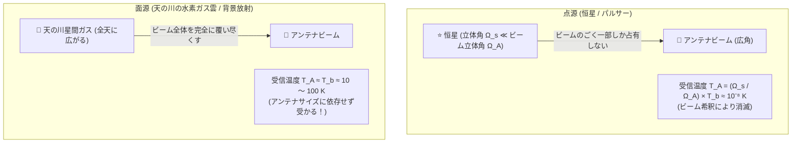
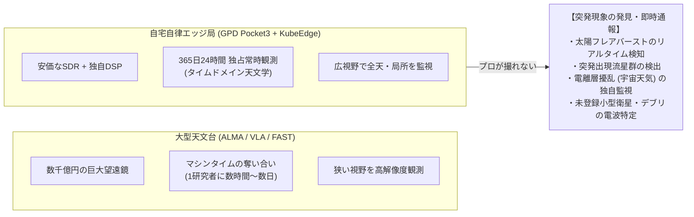

# 🌟 恒星電波の受信可能性・感度限界と電波天文学的アプローチ詳解

本ドキュメントでは、「**一般的な恒星から届く電波を、現在の個人設備（RTL-SDR Blog V4 + ベランダアンテナ + エッジ観測基盤）で受信・分析・新発見できるか？**」という疑問に対し、電波天文学、アンテナ電磁気学、統計的信号処理の数理モデルに基づいて定量的に回答し、現在の設備で狙える真の電波天文学ターゲットと「発見」のフロンティアを解説します。

---

## 🗺️ 結論と受信可能性マトリクス（TL;DR）

1. **太陽以外の「一般的な恒星（点源）」**:
   - **受信・検出は物理的に不可能** です。
   - 恒星の電波強度は極めて微弱（マイクロジャンスキー $\mu\text{Jy} \sim 10^{-6} \text{ Jy}$ レベル）であり、現在の設備と比べて **$10^6 \sim 10^9$ 倍（100万〜10億倍）も感度が不足** しています。世界最大の電波望遠鏡（ALMA、VLA、FAST、将来のSKA）で数時間〜数十時間積算してようやく捉えられる領域です。
2. **「最も身近な恒星（太陽）」**:
   - **受信・分析は極めて容易かつ有望** です。太陽フレア発生に伴うプラズマ電波バースト（Type II / Type III）は数十万〜数十億 Jy に達し、ベランダの簡易アンテナでも強烈なシグナルとして捉えられます。
3. **「星の死骸（パルサー：回転中性子星）」**:
   - 周期的な電波パルスを放つためエポック折りたたみ（Epoch Folding）や分散除去を行えば、アマチュアでも検出例があります。ただし、最低でも **直径2〜3m級以上の大型パラボラアンテナ** と極低雑音LNA（$NF < 0.5\text{ dB}$）が必須となります。
4. **「恒星ではなく星間ガス（天の川銀河の 21cm 中性水素線）」**:
   - **現在の RTL-SDR V4 ＋ 簡易缶アンテナ（Cantenna）/小型ホーン ＋ LNA で確実に受信・分析可能** です。銀河回転曲線の導出を通じて「ダークマター（暗黒物質）の存在」を自宅から実証できます。
5. **「発見（Discovery）」の可能性**:
   - 新天体（未知の星）の電波発見は巨大プロプロジェクトの領域ですが、**「24時間常時稼働エッジ基盤を活かした突発現象のタイムドメイン観測（太陽フレアの即時検知トリガー、突発流星群の検出、異常電波伝搬の可視化）」** は、個人地上局における極めて強力な市民科学フロンティアです。

| 天体・電波源 | 電波放射メカニズム | 地球での強度 (Flux Density) | 現在の設備での可否 | 必要機材・アプローチ |
| :--- | :--- | :--- | :--- | :--- |
| **太陽 (フレア・バースト)** | コロナ衝撃波・プラズマ振動 | $10^5 \sim 10^9 \text{ Jy}$ | **◎ 即座に受信可能** | ホイップ / ダイポール + RTL-SDR |
| **太陽 (静穏時・熱放射)** | コロナ熱制動放射 | $10^4 \sim 10^5 \text{ Jy}$ | **○ 受信可能** | 1GHz以上の指向性アンテナ |
| **木星 (デカメートル波)** | 衛星イオ磁気圏相互作用 | $10^4 \sim 10^6 \text{ Jy}$ | **○ 受信可能** | 20MHz 短波ダイポール + V4 Direct Sampling |
| **中性水素ガス (21cm線)** | 超微細構造スピン反転 | $T_A \approx 10 \sim 100 \text{ K}$ (面源) | **◎ 確実に受信可能** | 21cmホーン/缶アンテナ + Sawbird+ H1 |
| **強電波源 (Cas A, Cyg A)** | シンクロトロン放射 (超新星残骸) | $10^3 \sim 2 \times 10^3 \text{ Jy}$ | **△ 拡張で可能** | 2〜3m パラボラ + 積算DSP |
| **最強パルサー (B0329+54)** | 磁気圏コヒーレント放射 | 平均 $0.2 \sim 1 \text{ Jy}$ ($200\text{ mJy}$) | **△ 大規模拡張で可能** | 3m超パラボラ + パルス周期折りたたみ |
| **一般の恒星 (ベテルギウス等)** | 黒体放射 (レイリー・ジーンズ則) | $10^{-6} \sim 10^{-4} \text{ Jy}$ ($1 \sim 100\ \mu\text{Jy}$) | **× 物理的に不可能** | ALMA / VLA 等の巨大電波干渉計アレイ |

---

## 1. なぜ「一般の恒星」は受信できないのか？（電波工学と物理の定量的メカニズム）

### (1) 恒星の黒体放射とレイリー・ジーンズ則

すべての天体は温度 $T$ に応じた熱放射（黒体放射）を行っています。電波領域（$h\nu \ll k_B T$）においては、プランクの放射則は **レイリー・ジーンズの法則（Rayleigh-Jeans Law）** に近似されます。

天体から地球に届く電波フラックス密度 $S_\nu$ は、天体の輝度（Brightness）$B_\nu$ に天体の立体角（視直径）$\Omega$ を乗じたものになります：

$$S_\nu = B_\nu \cdot \Omega \approx \frac{2 k_B T}{\lambda^2} \Omega = \frac{2 k_B T \nu^2}{c^2} \cdot \pi \left( \frac{R}{d} \right)^2$$

| 記号 | 物理的意味 | 代表値 (ベテルギウスの例) | 単位 |
| :--- | :--- | :--- | :--- |
| $S_\nu$ | 地球での電波フラックス密度 (Flux Density) | $\approx 1 \sim 10 \times 10^{-29}$ | $\text{W/m}^2/\text{Hz}$ |
| $k_B$ | ボルツマン定数 | $1.380649 \times 10^{-23}$ | $\text{J/K}$ |
| $T$ | 恒星表面（光球・コロナ）の有効温度 | $\approx 3,500$ | $\text{K}$ |
| $\nu$ | 観測電波周波数 (例: 1.4 GHz) | $1.4 \times 10^9$ | $\text{Hz}$ |
| $c$ | 光速 | $2.9979 \times 10^8$ | $\text{m/s}$ |
| $R$ | 恒星の半径 (赤色超巨星) | $\approx 6 \times 10^{11}$ | $\text{m}$ |
| $d$ | 地球から恒星までの距離 ($\approx 550$ 光年) | $\approx 5.2 \times 10^{18}$ | $\text{m}$ |
| $\Omega$ | 地球から見た恒星の立体角 | $\approx 4 \times 10^{-14}$ | $\text{sr}$ (ステラジアン) |

#### 日本語での読み解き
電波の波長は光に比べて数百万倍も長いため、$1/\lambda^2$ の項が極端に小さくなります。さらに、恒星はいくら巨大であっても地球からの距離 $d$ が天文学的に遠いため、見かけの立体角 $\Omega = \pi (R/d)^2$ が $10^{-14} \sim 10^{-16} \text{ sr}$ という微小な「点」になってしまいます。この結果、地球に届く単位面積・単位周波数あたりの電力（フラックス密度）は絶望的なまでに小さくなります。

#### 直感イメージ
太陽は地球から $1.5 \times 10^8 \text{ km}$（8光分）の至近距離にあるため視直径が約 $0.5^\circ$（約 $6 \times 10^{-5}\text{ sr}$）と大きく、電波がガンガン届きます。一方、夜空で最も大きく見える赤色超巨星ベテルギウスですら、立体角は太陽の **10億分の1以下** に縮小してしまいます。

---

### (2) 電波望遠鏡の感度限界：ラジオメーターの式（Radiometer Equation）

電波望遠鏡（アンテナ＋受信機＋デジタル信号処理）が検出できる最小の信号強度は、受信システム自身が発する熱雑音の統計的揺らぎによって決定されます。これが **ラジオメーターの式** です。

#### 受信機の最小検出温度揺らぎ $\Delta T_{\text{min}}$:
$$\Delta T_{\text{min}} = \frac{T_{\text{sys}}}{\sqrt{B \cdot \tau}}$$

#### 最小検出フラックス密度 $\Delta S_{\text{min}}$:
$$\Delta S_{\text{min}} = \frac{2 k_B \Delta T_{\text{min}}}{A_e} = \frac{2 k_B T_{\text{sys}}}{A_e \sqrt{B \cdot \tau}}$$

| 記号 | 物理的意味 | 自宅エッジ設備 (RTL-SDR + 小型) | 巨大電波干渉計 (VLA / ALMA) | 単位 |
| :--- | :--- | :--- | :--- | :--- |
| $\Delta S_{\text{min}}$ | 最小検出可能フラックス密度 ($1\sigma$) | $\approx \mathbf{1,780}$ | $\approx \mathbf{0.000005}$ ($5\ \mu\text{Jy}$) | $\text{Jy}$ |
| $T_{\text{sys}}$ | システム雑音温度 (受信機+背景雑音) | $\approx 300$ | $\approx 30$ | $\text{K}$ |
| $A_e$ | アンテナの実効開口面積 | $\approx 0.005$ (ホイップ) / $0.1$ (ホーン) | $\approx 10,000$ (アレイ合成) | $\text{m}^2$ |
| $B$ | 受信帯域幅 | $2.4 \times 10^6$ (RTL-SDR上限) | $2 \times 10^9$ (2 GHz広帯域) | $\text{Hz}$ |
| $\tau$ | 積算時間 (Integration Time) | $3,600$ (1時間) | $36,000$ (10時間) | $\text{s}$ |
| $1 \text{ Jy}$ | ジャンスキー ($10^{-26} \text{ W/m}^2/\text{Hz}$) | 基準単位 | 基準単位 | - |

#### 数式の展開ステップと感度の比較計算:
自宅の RTL-SDR とベランダアンテナで1時間（$\tau = 3600\text{ s}$）積算した場合の限界値を計算します：

1. **帯域・積算積の平方根**:
   $$\sqrt{B \cdot \tau} = \sqrt{(2.4 \times 10^6) \times 3600} = \sqrt{8.64 \times 10^9} \approx 9.295 \times 10^4$$
2. **最小検出温度 $\Delta T_{\text{min}}$**:
   $$\Delta T_{\text{min}} = \frac{300 \text{ K}}{9.295 \times 10^4} \approx 3.23 \times 10^{-3} \text{ K} = 3.23 \text{ mK}$$
3. **ホイップアンテナ（$A_e \approx 0.005 \text{ m}^2$）でのフラックス感度**:
   $$\Delta S_{\text{min}} = \frac{2 \times (1.38 \times 10^{-23}) \times (3.23 \times 10^{-3})}{0.005} \approx 1.78 \times 10^{-23} \text{ W/m}^2\text{/Hz} \approx \mathbf{1,780 \text{ Jy}}$$
4. **小型ホーンアンテナ（$A_e \approx 0.1 \text{ m}^2$）の場合**:
   $$\Delta S_{\text{min}} = \frac{2 \times (1.38 \times 10^{-23}) \times (3.23 \times 10^{-3})}{0.1} \approx 8.9 \times 10^{-25} \text{ W/m}^2\text{/Hz} \approx \mathbf{89 \text{ Jy}}$$

#### 結論
- 自宅の設備で検出できるのは、どんなに頑張っても **数十〜数百 Jy 以上の強い電波源** に限られます。
- 一方、ベテルギウスやシリウスなどの恒星電波は **$1 \sim 100\ \mu\text{Jy}$（$0.000001 \sim 0.0001 \text{ Jy}$）** です。
- **必要感度と実設備の間には $10^6 \sim 10^8$ 倍（100万〜1億倍）のギャップ** があり、これが「恒星単体の電波はアマチュア設備では受信できない」物理的理由です。

---

## 2. なぜ「天の川のHI（中性水素）ガス」は小型アンテナで受かるのか？（面源と点源の決定的な違い）

ここで重要な疑問が生じます：  
「恒星が受からないのに、なぜ天の川銀河の中性水素線（1420MHz）は手作りの缶アンテナや小型ホーンで受かるのか？」

その答えは、天体が **「点源（Point Source）」** か **「広がった面源（Extended Source）」** かの違いにあります。

### ビーム希釈（Beam Dilution）の物理
アンテナで受信されるアンテナ温度 $T_A$ は、天体の輝度温度 $T_b$ と、天体の立体角 $\Omega_s$、アンテナのビーム立体角 $\Omega_A$ の比で表されます：

$$T_A = \eta_B \cdot T_b \cdot \frac{\Omega_s}{\Omega_A} \quad (\Omega_s \ll \Omega_A \text{ の場合})$$

1. **恒星（点源）の場合**:
   - アンテナが小型だとビーム角が広く（例: 半値幅 $30^\circ$、$\Omega_A \approx 0.2\text{ sr}$）、恒星の大きさ（$\Omega_s \approx 10^{-14}\text{ sr}$）に対してビームが広すぎます。
   - その結果、**ビーム希釈率 $\frac{\Omega_s}{\Omega_A} \approx 10^{-13}$** となり、天体の温度が $10,000\text{ K}$ あっても、アンテナに現れる信号温度は $10^{-9}\text{ K}$（ナノケルビン）に薄まり、熱雑音（300K）の中に完全に消滅します。
2. **天の川の水素ガス（面源）の場合**:
   - 天の川の水素ガス雲は空一面に広がっており、アンテナのビーム全体を満たします（$\Omega_s \ge \Omega_A$）。
   - このとき $\frac{\Omega_s}{\Omega_A} \to 1$ となり、**アンテナサイズ（口径）に関係なく、ガスの輝度温度 $T_b \approx 10 \sim 100\text{ K}$ がそのままアンテナ温度 $T_A$ として現れます**。
   - 300Kのシステム雑音に対して 10〜50K の温度上昇は、1秒〜数十秒の積算で極めて明確なスペクトルピークとして浮かび上がります。

---

## 3. 今の設備で受信・分析・研究できる「真のターゲット」

現在のシステム（GPD Pocket3 + RTL-SDR Blog V4 + ベランダ環境）の特性を最大限に活かし、学術的・工学的に深い分析ができる対象は以下の4つです：

### ① 太陽電波バースト（Solar Radio Burst）—「身近な恒星」の爆発観測
- **物理**: 太陽表面でフレア（磁気リコネクション）が発生すると、超高速電子線がコロナ中を突き抜けます。この電子線が周囲のプラズマを揺らすことで、局所プラズマ周波数 $f_p \approx 9 \sqrt{n_e} \text{ kHz}$ で電波が放射されます。
- **現象**: 衝撃波が上層（低密度）へ伝搬するにつれて放射周波数が高い方から低い方へとスイープする **「Type II / Type III バースト」** が発生します。
- **受信方法**:
  - RTL-SDR V4 の HF ダイレクトサンプリング機能、または VHF 帯（20MHz〜100MHz）。
  - ベランダのホイップアンテナや簡易ダイポールアンテナ。
  - 数十万 Jy の大エネルギーのため、専用の高利得アンテナがなくてもウォーターフォール上に鮮やかな斜めの軌跡（ドリフト）として現れます。

### ② 天の川銀河の 21cm 水素線観測 — 銀河の回転とダークマター分析
- **物理**: 銀河系内の水素ガスが放つ 1420.405 MHz の電波を受信し、視線速度ドップラーシフト $v_{\text{lsr}}$ を測定。
- **分析内容**:
  - 銀河面（天の川）の各銀経 $l$ に向けてアンテナを固定（または日周運動で通過させる）。
  - 銀河中心からの距離 $R$ と回転速度 $V(R)$ をプロット（銀河回転曲線）。
  - 「外側に行っても回転速度が落ちない（フラット化）」ことを確認し、**光学望遠鏡では見えないダークマターハローの質量分布を自力で算出** する。
- **必要装備**:
  - 直径 15〜20cm の金属缶（クッキードーム缶やペンキ缶）で作る **缶アンテナ（Cantenna）**、またはダンボールとアルミホイルで作る **ホーンアンテナ**。
  - 1420MHz 用 LNA + フィルター（Nooelec Sawbird+ H1 など、Bias-T 給電）。

### ③ 流星電波前方散乱観測（FRO）— 宇宙のチリ突入のリアルタイム検知
- **物理**: 流星が高度 100km の大気圏に突入した際、周囲の空気を電離して電子密度の高い「プラズマの円筒（イオントレイル）」を形成します。
- **受信方法**:
  - 福井高専などが常時発射している電波ビーコン（53.750 MHz）を受信。
  - 通常は見通し外のため受信できませんが、流星が通った瞬間だけ電波が前方散乱（反射）され、「ピキーン」「フォーン」というスパイクエコー（アンダーデンストレイル / オーバーデンストレイル）が受かります。
- **分析内容**:
  - エコー数カウントによる流星群（ペルセウス座、ふたご座等）の活動極大の自動検出。
  - エコーの減衰時間から、上層大気（中間圏界面）の拡散係数や大気密度を逆算。

### ④ 木星電波バースト（Jupiter Decametric Radio）— 惑星磁気圏レーザー
- **物理**: 木星の衛星イオの火山活動から放出された硫黄や酸素イオンが、木星の超強力な磁場と交差して数十万ボルトの起電力を発生。サイクロトロン・メーザー放射により 20MHz 付近で指向性の強いコヒーレント電波がビーム状に放たれます。
- **受信方法**:
  - 20.1 MHz 付近。RTL-SDR V4 + 長さ数メートルのワイヤーダイポール。
  - 「海の波の音（Lバースト）」や「小石を叩く音（Sバースト）」として観測されます。

---

## 4. 個人地上局における「発見（Discovery）」のフロンティア

「人類未踏の新しい天体や恒星を見つける」ことは、国家予算規模の巨大サーベイ（FAST、CHIME、Rubin天文台等）の守備範囲ですが、**「24時間自律稼働するローカルエッジ地上局」だからこそ可能な科学的・実用的発見** が数多く存在します。

### 1. タイムドメイン電波天文学（常時監視の強み）
プロの大型望遠鏡は、世界中の天文学者がプロポーザルを競い合って「1天体あたり数時間」しか観測できません。「いつ起きるかわからない突発現象」を24時間ずっと待ち構えることは、巨大望遠鏡には不可能です。
自宅の GPD Pocket3 は、**365日24時間、電気代数百円で空を見張り続けることができます**。

### 2. 具体的な「発見」のシナリオ
1. **太陽フレアの即時トリガーと早期警報（宇宙天気予報）**:
   - 宇宙天気ニュースやGOES衛星のX線速報が出る前に、自前地上局が Type III 電波バーストの急峻な周波数ドリフトをエッジDSPで検知し、Discord へ `🚨 太陽フレア電波バースト検知: ドリフト率 -20 MHz/s` とリアルタイム警報を飛ばす。
2. **未知の彗星ダストトレイル（突発流星群）の検出**:
   - 流星電波観測（FRO）のログを DuckDB で集計し、通常バックグラウンドの 5〜10 倍のエコー集中を自動検知して「突発流星活動」を検出。アマチュア流星観測ネットワーク（NMDB / Radio Meteor Observation）へデータを還元。
3. **電離層擾乱・異常伝搬の発見**:
   - 太陽フレアに伴うデリンジャー現象（短波帯の完全ブラックアウト）や、夜間のスポラディックE層（VHF帯の異常反射）を24時間プロットし、局所的な宇宙天気インパクトを可視化。
4. **未登録 CubeSat や宇宙デブリの電波捕捉（Space Domain Awareness）**:
   - 本リポジトリの `ground-station` で実装しているように、打ち上げ直後の新衛星やコールサイン不明の電波ビーコンを捕捉し、ドップラー曲線から軌道を同定・解析する。

---

## 5. まとめ

- **「恒星そのものの電波」** は物理的・感度的に受信不可能ですが、落胆する必要はありません。それは世界中の電波天文学者が数十メートル〜数百メートルの巨大アンテナや干渉計を並べてようやく挑戦している最先端の壁だからです。
- 一方で、**「太陽の爆発（恒星物理）」「天の川の水素ガス（銀河物理・ダークマター）」「流星（太陽系小天体）」「超小型人工衛星（宇宙工学）」** は、現在の設備と少しの手作りアンテナ・LNAの組み合わせで、**今夜からでも確実に受信・分析できる本物の宇宙データ** です。
- 本プロジェクトの「GPD Pocket3 によるエッジ完結・24時間自律観測」というアーキテクチャは、まさにこの **「突発現象の常時監視とリアルタイム分析」** に最も適した設計となっています。
