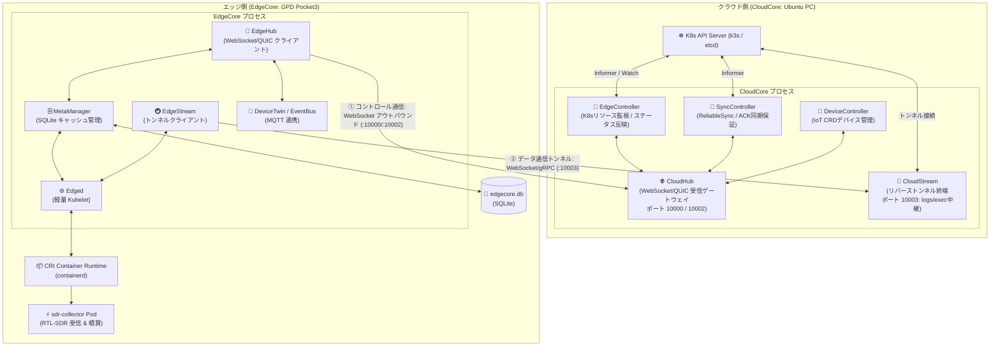

# 🛰️ KubeEdge アーキテクチャと Edge-Cloud 相互通信メカニズム詳解

本ドキュメントでは、CNCF **KubeEdge** においてクラウド側（CloudCore）とエッジ側（EdgeCore）がどのように相互通信を行い、オフライン時の自律稼働や `kubectl logs` / `exec` などの双方向トンネルを実現しているのか、その内部アーキテクチャと担当コンポーネントを SRE・分散システムの観点から技術的に解説します。

---

## 📚 公式一次情報・リファレンスリンク

- **CNCF KubeEdge 公式サイト**: [https://kubeedge.io/](https://kubeedge.io/)
- **KubeEdge 公式アーキテクチャ仕様**: [https://kubeedge.io/docs/architecture/](https://kubeedge.io/docs/architecture/)
- **KubeEdge GitHub リポジトリ**: [kubeedge/kubeedge](https://github.com/kubeedge/kubeedge)
- **CloudHub 仕様**: [https://kubeedge.io/docs/architecture/cloud/cloudhub/](https://kubeedge.io/docs/architecture/cloud/cloudhub/)
- **EdgeHub 仕様**: [https://kubeedge.io/docs/architecture/edge/edgehub/](https://kubeedge.io/docs/architecture/edge/edgehub/)
- **MetaManager 仕様**: [https://kubeedge.io/docs/architecture/edge/metamanager/](https://kubeedge.io/docs/architecture/edge/metamanager/)

---

## 1. なぜ通常の Kubernetes ではなく KubeEdge なのか？

通常の Kubernetes ワーカーノード（Kubelet）を宅内エッジ端末（GPD Pocket3 等）にそのまま配置する場合、以下の深刻な課題が発生します：

1. **常時接続前提（ネットワーク切断時の Pod Eviction）**:
   - 標準の Kubelet は Kubernetes API Server と常にハートビートを交わします。通信が途絶えると（デフォルト `node-monitor-grace-period: 40s`）、コントロールプレーンはノードを `NotReady` と判定し、数分後に Pod を強制終了（Evict）しようとします。
2. **NAT / ファイアウォール越えの困難**:
   - `kubectl logs` や `kubectl exec` は、API Server から各ノードの Kubelet（TCP 10250）へ **直接インバウンド接続** することで動作します。エッジ端末が宅内 LAN やモバイル回線、NAT 配下にある場合、外部から直接 TCP 接続を開くことができません。
3. **リソースフットプリント**:
   - フルスペックの Kubelet や kube-proxy、etcd キャッシュはメモリ・CPU 消費が大きく、エッジ端末のリソースを圧迫します。

**KubeEdge はこれらの課題を解決するために設計された CNCF インキュベーティングプロジェクト** です。

---

## 2. KubeEdge 全体アーキテクチャ図



---

## 3. Edge-Cloud 相互通信を担当するコンポーネント

KubeEdge におけるエッジとクラウドの相互通信は、**「① 制御メッセージ（メタデータ）」** と **「② トンネル（logs / exec）」** の2つの独立したパイプラインによって実現されています。

### パイプライン ①: 制御プレーンメッセージング（CloudHub $\leftrightarrow$ EdgeHub）

| 担当 | コンポーネント | 役割と動作メカニズム |
| :--- | :--- | :--- |
| **Cloud 側** | **CloudHub** | エッジ側からの接続を受け付ける通信エンドポイント（ゲートウェイ）。WebSocket（デフォルトポート `10000` または `10002`）または QUIC（ポート `10001`）で待ち受けます。 |
| **Cloud 側** | **EdgeController** | Kubernetes API Server を Watch（Informer）し、Node, Pod, ConfigMap, Secret の変更イベントを検知。CloudHub 経由で対象のエッジノードへメッセージをディスパッチします。 |
| **Cloud 側** | **SyncController** | メッセージの到達確認（ACK）を管理（ReliableSync）。エッジ側で未確認のオブジェクトを保持し、再接続時に確実に同期させます。 |
| **Edge 側** | **EdgeHub** | エッジ側の通信クライアント。起動時に CloudHub に対して **アウトバウンド（外向き）** で WebSocket / QUIC 接続を確立・維持します。定期的なハートビート送信と切断時の自動再接続を行います。 |
| **Edge 側** | **MetaManager** | EdgeHub が受信したメタデータをローカルの **SQLite データベース（`edgecore.db`）** に保存・キャッシュします。 |
| **Edge 側** | **Edged** | エッジノード上で動作する軽量 Kubelet。MetaManager から Pod の望ましい状態（Desired State）を受け取り、containerd 等の CRI 経由でコンテナを起動・監視します。 |

#### 🔑 通信の向き（アウトバウンド接続の重要性）
エッジ側の `EdgeHub` からクラウド側の `CloudHub` に対して接続を開きます。  
エッジ端末が **家庭内 LAN の NAT 配下や動的 IP 環境** にあっても、外向き（Outbound）の通信さえ通れば接続が確立し、以降は全二重（Full-Duplex）で双方向のメッセージ送受信が可能になります。エッジ側のルーターにポートフォワーディングを設定する必要はありません。

---

### パイプライン ②: ストリームトンネル（CloudStream $\leftrightarrow$ EdgeStream）

Kubernetes 管理者が `kubectl logs <pod>` や `kubectl exec -it <pod> -- bash` を実行した際、API Server は通常ノードの 10250 ポートへ接続します。しかしエッジノードには直接届きません。これを解決するのが **CloudStream と EdgeStream** です。

| 担当 | コンポーネント | 役割と動作メカニズム |
| :--- | :--- | :--- |
| **Cloud 側** | **CloudStream** | CloudCore 内でポート `10003` を開き、API Server からのリクエストを受け付けてエッジへのトンネルに中継します。 |
| **Edge 側** | **EdgeStream** | エッジ起動時に CloudStream（ポート `10003`）に対してリバーストンネル接続を開いて維持します。CloudStream から転送された logs/exec 要求を、ローカルの containerd / Edged にプロキシします。 |

```text
[ 管理者: kubectl exec ]
       │
       ▼
[ K8s API Server ] ──(iptables / apiserver-network-proxy)──► [ CloudStream (:10003) ]
                                                                     │
                                                 (既存のリバーストンネル経由で転送)
                                                                     ▼
[ ローカル containerd / Pod ] ◄────────────────────────────── [ EdgeStream ]
```

---

## 4. なぜ「オフライン自律稼働」が可能なのか？（MetaManager の役割）

電波天文学の観測ノードにおいて、最も重要なのが **「オフライン自律性（Offline Autonomy）」** です。

```text
【通常時】
API Server ──► EdgeController ──► CloudHub ──► EdgeHub ──► MetaManager ──► SQLite に保存
                                                                │
                                                                ▼
                                                              Edged ──► containerd (Pod実行)

【クラウド停止時 / ネットワーク障害時】
×× (通信切断) ××                                             MetaManager
                                                                ▲
                                                         (SQLite から読出)
                                                                ▼
                                                              Edged ──► containerd (Pod継続・再起動自律維持)
```

1. **MetaManager によるローカル SQLite 永続化**:
   - クラウドから受信した Pod 定義、環境変数、ConfigMap は、GPD Pocket3 上の `/var/lib/kubeedge/edgecore.db` に逐次書き込まれます。
2. **クラウド切断時の挙動**:
   - クラウド側の Ubuntu PC が電源 OFF になっても、エッジ側の `Edged` はローカルの SQLite を参照してステータスを維持します。
   - 万が一 GPD Pocket3 が瞬断や再起動しても、再起動時に `MetaManager` が SQLite から前回デプロイされていた Pod（`sdr-collector` 等）の情報を取得し、クラウドと一切通信できない状態でも **自律的にコンテナを復元・起動** します。
3. **ノード Eviction の抑止**:
   - KubeEdge の `EdgeController` はエッジノードがオフラインになっても、標準の Kubelet のように即座に Pod を削除・再スケジュールせず、エッジ側の自律実行を信頼して保護します。

---

## 5. ポート一覧 & 通信トポロジー（SRE ネットワーク設計シート）

Ubuntu 2台体制（Cloud: Ubuntu PC, Edge: GPD Pocket3）で開放・疎通確認が必要なポート一覧です：

| ポート番号 | プロトコル | 送信元 | 送信先（リスナー） | 用途 |
| :--- | :--- | :--- | :--- | :--- |
| **`10000` / `10002`** | TCP (WebSocket/TLS) | GPD Pocket3 (`EdgeHub`) | Ubuntu PC (`CloudHub`) | **エッジ $\rightarrow$ クラウド制御メッセージ**（Node/Podステータス、ConfigMap） |
| **`10001`** | UDP (QUIC) | GPD Pocket3 (`EdgeHub`) | Ubuntu PC (`CloudHub`) | QUIC プロトコル利用時の制御メッセージ（任意） |
| **`10003`** | TCP (TLS) | GPD Pocket3 (`EdgeStream`) | Ubuntu PC (`CloudStream`) | **ストリームトンネル**（`kubectl logs`, `exec`, `metrics-server` 中継） |
| **`10004`** | TCP (TLS) | Ubuntu PC (`CloudStream`) | GPD Pocket3 (`EdgeStream`) | エッジ側フォワードポート（トンネル転送用） |
| **`6443`** | TCP (HTTPS) | Ubuntu PC (ローカル / 開発機) | Ubuntu PC (`k3s API Server`) | Kubernetes REST API エンドポイント |

> [!TIP]
> エッジノード側（GPD Pocket3）では外部からの待ち受けポート（インバウンド）を開放する必要が基本的にありません。すべて GPD Pocket3 から Ubuntu PC へのアウトバウンド通信として確立されます。

---

## 6. まとめ: Ubuntu 2台体制での検証が最適な理由

1. **WSL2 のネットワーク仮想化ギャップを回避**:
   - WSL2 では内部 NAT と Windows 側仮想スイッチにより、外部端末（GPD Pocket3）から WSL2 内のポート 10000/10003 に直接到達させるために `netsh interface portproxy` やブリッジ設定が必要となり、トラブルシューティングが複雑化します。
   - Ubuntu PC 同士であれば、同一 L2/L3 宅内 LAN 上で固定 IP または mDNS（`.local`）によりダイレクトにポート 10000/10003 へ疎通できます。
2. **標準の Linux systemd & cgroups v2 連携**:
   - `cloudcore.service` および `edgecore.service` を systemd デーモンとして常駐させ、OS 起動時に自動起動する標準的な運用設計がそのまま適用できます。
