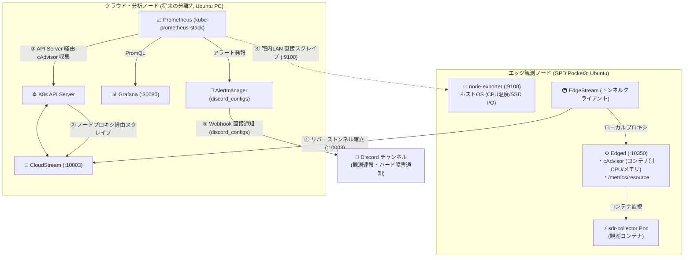

# 📊 KubeEdge メトリクス監視設計と Alertmanager Discord 連携詳解（将来分散拡張モデル）

本ドキュメントでは、初期PoC（GPD Pocket3 1台完結）から **将来的な物理分離（分析専用 Ubuntu PC ＋ エッジ観測 GPD Pocket3 の2台体制）** を見据えた、KubeEdge 環境におけるメトリクス収集アーキテクチャ（Edged / cAdvisor、Prometheus スクレイピング、トンネル透過）および **Alertmanager のネイティブ Discord Webhook 連携** について、SRE・インフラ運用の観点から体系的に解説します。

---

## 📚 公式一次情報・リファレンスリンク

- **Prometheus Alertmanager 公式設定仕様 (`<discord_config>`)**: [https://prometheus.io/docs/alerting/latest/configuration/#discord_config](https://prometheus.io/docs/alerting/latest/configuration/#discord_config)
- **KubeEdge メトリクスアーキテクチャ仕様**: [https://kubeedge.io/docs/advanced/metrics/](https://kubeedge.io/docs/advanced/metrics/)
- **KubeEdge CloudStream トンネル仕様**: [https://kubeedge.io/docs/architecture/cloud/cloudstream/](https://kubeedge.io/docs/architecture/cloud/cloudstream/)
- **Kubernetes metrics-server リポジトリ**: [https://github.com/kubernetes-sigs/metrics-server](https://github.com/kubernetes-sigs/metrics-server)
- **kube-prometheus-stack Helm Chart**: [https://github.com/prometheus-community/helm-charts/tree/main/charts/kube-prometheus-stack](https://github.com/prometheus-community/helm-charts/tree/main/charts/kube-prometheus-stack)

---

## 1. Alertmanager のネイティブ Discord Webhook 対応

### v0.25.0 以降の仕様変更
Prometheus Alertmanager は、**v0.25.0（2023年2月リリース）よりネイティブで `discord_configs` を標準サポート** しています。  
これにより、以前必要だった `alertmanager-discord` などのペイロード変換プロキシコンテナが不要となり、Alertmanager 単体で直接 Discord の Webhook URL へアラートを送信できます。

### 設定例 (`alertmanager.yaml`)
本プロジェクトの地上局・太陽観測アラートチャンネルにそのまま通知する設定例です：

```yaml
global:
  resolve_timeout: 5m

route:
  group_by: ['alertname', 'namespace']
  group_wait: 30s
  group_interval: 5m
  repeat_interval: 4h
  receiver: 'discord-astro-alerts'

receivers:
- name: 'discord-astro-alerts'
  discord_configs:
  - webhook_url: 'https://discord.com/api/webhooks/YOUR_WEBHOOK_ID/YOUR_WEBHOOK_TOKEN'
    send_resolved: true
    title: '{{ if eq .Status "firing" }}🚨 [ALERT]{{ else }}✅ [RESOLVED]{{ end }} {{ .CommonAnnotations.summary }}'
    message: |
      **Description**: {{ .CommonAnnotations.description }}
      **Severity**: `{{ .CommonLabels.severity }}`
      **Node/Pod**: `{{ .CommonLabels.node }}` / `{{ .CommonLabels.pod }}`
      {{ range .Alerts }}
      - **Details**: {{ .Annotations.message }}
      {{ end }}
```

---

## 2. KubeEdge におけるメトリクス収集アーキテクチャ（将来分散モデル）

将来、クラウドコントロールプレーン（分析用 Ubuntu PC）とエッジ観測ノード（GPD Pocket3）が物理的に分離された場合でも、**エッジ側に不要なエージェントを追加せず、KubeEdge 組み込み機能と K8s 標準の仕組みを活かしてメトリクスを集約** します。



---

## 3. Edge 側 `Edged` (cAdvisor) メトリクスの仕組みとエンドポイント

KubeEdge のエッジデーモン `edgecore` に含まれる `Edged` は、軽量化された Kubelet であり、**ポート `10350`** で以下のメトリクスエンドポイントを提供します：

| エンドポイント | 内容 | 取得できる情報 |
| :--- | :--- | :--- |
| **`/metrics/cadvisor`** | コンテナ単位の細粒度メトリクス | `container_cpu_usage_seconds_total`, `container_memory_working_set_bytes`（SDR観測PodやDuckDB Podの個別負荷） |
| **`/metrics/resource`** | metrics-server 互換サマリ | ノード全体の CPU / メモリ使用量（`kubectl top nodes/pods` のデータソース） |
| **`/metrics`** | Edged デーモン内部メトリクス | CRI 通信レイテンシ、ボリュームマウント状態、エラー回数 |

### SRE 的メリット: 「話が変わってくる」ポイント
1. **専用の Push エージェント（Grafana Alloy 等）が不要**:
   - `Edged` が標準で cAdvisor メトリクスを提供するため、エッジノード側に別途メトリクスシッパーを常駐させる必要がなく、UMPC の貴重なリソース（50〜100MB）を節約できます。
2. **`kubectl top pods` がそのまま動作**:
   - クラウドPC のターミナルから `kubectl top pod -l app=sdr-collector` を実行するだけで、リバーストンネル経由で観測Podのリソース使用率がリアルタイムに確認できます。
3. **`kube-prometheus-stack` の標準 ServiceMonitor を流用可能**:
   - API Server のノードプロキシ経由（`/api/v1/nodes/<edgenode>/proxy/metrics/cadvisor`）で Prometheus がスクレイプするため、エッジノードが NAT 配下にあっても CloudStream トンネルを通じて自動的にメトリクスが吸い上がります。

---

## 4. 将来の物理2台分離時におけるネットワーク経路と設定方針

| 収集対象 | 監視プロトコル | 分離時のネットワーク経路 | 設定箇所 |
| :--- | :--- | :--- | :--- |
| **Pod / コンテナ別負荷 (cAdvisor)** | HTTP (TLS) | Prometheus $\rightarrow$ API Server $\rightarrow$ **CloudStream/EdgeStream トンネル** $\rightarrow$ Edged (:10350) | `kube-prometheus-stack` の `kubelet` ServiceMonitor（デフォルト有効） |
| **CLI リソース確認 (`kubectl top`)** | HTTPS | `kubectl` $\rightarrow$ API Server $\rightarrow$ **metrics-server** $\rightarrow$ CloudStream $\rightarrow$ Edged | k3s 内蔵または公式 `metrics-server` |
| **ホストOS詳細 (CPU温度 / SSD I/O)** | HTTP (明文) | Prometheus $\rightarrow$ **宅内 LAN 直接アクセス** $\rightarrow$ node-exporter (:9100) | `values-minimal.yaml` の `additionalScrapeConfigs` |

> [!NOTE]
> **CloudStream トンネル転送の iptables ルール（公式仕様）**:
> Cloud 側の API Server や Prometheus、metrics-server がエッジノードのポート `10350` へリクエストを送る際、CloudCore のトンネルエンドポイント（`10003`）へ中継するために Cloud ホスト側で以下の DNAT ルールを適用します：
> ```bash
> sudo iptables -t nat -A OUTPUT -p tcp --dport 10350 -j DNAT --to 127.0.0.1:10003
> ```

---

## 5. 1台完結PoCから物理2台体制への移行チェックリスト

GPD Pocket3 単一ホストから分析PC（Ubuntu PC）を追加して2台に分離する際の手順：

1. **分析用 PC (Cloud側)**:
   - Ubuntu PC 上で k3s を起動し、`keadm init --advertise-address=<Ubuntu-PC-LAN-IP>` で CloudCore を初期化。
   - `keadm gettoken` で新クラスタの参加トークンを取得。
   - Helm で `kube-prometheus-stack` をデプロイ。
2. **GPD Pocket3 (Edge側)**:
   - k3s サービスを停止（`systemctl disable --now k3s`）。観測ノード専任化によりメモリ約500MB解放。
   - `keadm join --cloudcore-ipport=<Ubuntu-PC-LAN-IP>:10000 --token=<TOKEN>` で分析PCの CloudCore に再接続。
3. **データアクセス**:
   - 分析PC の JupyterLab から、宅内 LAN 経由で GPD Pocket3 の Parquet/DuckDB（`duckdb://192.168.x.x/...`）へ高速クエリを実行。
