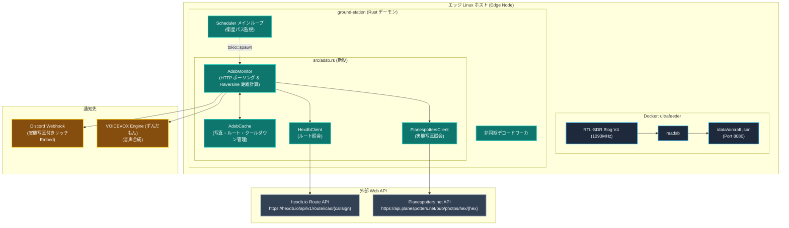

# ADS-B 航空機近接監視・実機写真付き自動通知システム 設計仕様書

## 1. 概要と目的

### 1.1 背景
衛星地上局デーモン（`ground-station`）は、極軌道気象衛星（Meteor-M）や CubeSat、ISS の飛来を予測し、自動受信・デコード・Discord/VOICEVOX 通知を行う自律システムです。
しかし、低軌道衛星の通過パスは 1 回あたり約 10 分間であり、1 日の大半は「衛星が空に存在しないアイドル時間帯」となります。

本機能は、現在エッジノード（Docker）で常時稼働している ADS-B 受信・復調基盤（Ultrafeeder / readsb / tar1090）と連携し、衛星の通過しない時間帯に自宅（東京都青梅市、海抜約200m）の上空を通過する航空機をリアルタイム検知します。
さらに、オープンな航空データベース（hexdb.io および Planespotters.net）を組み合わせて「発着地ルート（どこ行き）」および「その機体そのものの実機写真」を自動補完し、Discord リッチ Embed および VOICEVOX（ずんだもん）で通知するシステムを構築します。

### 1.2 達成目標
1. **排他制御不要なデータ収集**: SDR ドングルの競合を避け、ローカル Ultrafeeder が提供する `http://localhost:8080/data/aircraft.json` を数秒周期で軽量に HTTP ポーリング。
2. **正確な近接ジオフェンシング**: 球面三角法（Haversine 公式）により自宅座標からの水平距離と高度を計算し、指定半径（例: 8km）以内への進入を検出。
3. **多重通知の防止と状態管理**: メモリ内トラッカーにより、同一機体に対する重複通知を防止（30分クールダウン）。
4. **外部 API キャッシュ**: Planespotters.net（実機写真）および hexdb.io（ルート）のレスポンスをインメモリキャッシュし、外部負荷とレイテンシを最小化。
5. **リッチなマルチモーダル通知**: Discord 実機写真付きカード表示と、ずんだもんによる親しみやすいリアルタイム音声発話。
6. **単体検証コマンド**: デーモン常駐前に即座に近接機体・通知をテストできる `cargo run -- test-adsb` CLI の提供。

---

## 2. システムアーキテクチャ



---

## 3. 設定ファイル仕様 (`config.toml`)

`apps/ground-station/config.toml` に以下の `[adsb]` セクションを追加します：

```toml
[adsb]
enabled = true
# Ultrafeeder (readsb) の航空機 JSON エンドポイント
data_url = "http://localhost:8080/data/aircraft.json"
# tar1090 Web レーダーのベース URL (Discord Embed のリンク先)
tar1090_url = "http://localhost:8080"
# ポーリング間隔 (秒)
poll_interval_secs = 2
# 通知トリガーとなる自宅からの最大水平距離 (km)
max_distance_km = 8.0
# 対象とする高度範囲 (m) - 地上駐機や高高度オーバーフライトのフィルタリング
min_altitude_m = 500.0
max_altitude_m = 13000.0
# 同一機体の再通知クールダウン時間 (分)
cooldown_minutes = 30
# 外部情報連携
fetch_routes = true       # hexdb.io による発着地ルート取得
fetch_photos = true       # Planespotters.net による実機写真取得
# 通知チャネル
discord_alert = true      # Discord Webhook 通知
voice_alert = true        # ずんだもん音声通知
```

---

## 4. 近接判定と状態管理アルゴリズム

### 4.1 球面大圏距離（Haversine 公式）
観測地（自宅）の緯度・経度 $(\phi_1, \lambda_1)$ と、航空機の緯度・経度 $(\phi_2, \lambda_2)$ から、地表面に沿った最短距離 $d$ を計算します：

$$ \Delta \phi = \phi_2 - \phi_1, \quad \Delta \lambda = \lambda_2 - \lambda_1 $$
$$ a = \sin^2\left(\frac{\Delta \phi}{2}\right) + \cos\phi_1 \cos\phi_2 \sin^2\left(\frac{\Delta \lambda}{2}\right) $$
$$ c = 2 \arctan2\left(\sqrt{a}, \sqrt{1-a}\right) $$
$$ d = R \cdot c \quad (R = 6371.0 \text{ km}) $$

高度 $h$（フィートからメートルへ換算: $h_{\text{m}} = h_{\text{ft}} \times 0.3048$）が `min_altitude_m <= h <= max_altitude_m` の範囲にあり、かつ $d \le \text{max\_distance\_km}$ を満たした場合に「近接イベント」と判定します。

### 4.2 クールダウンと状態管理 (`AdsbCache`)
- **キー**: ICAO 24bit アドレス（小文字 Hex 文字列、例: `"86786c"`）。
- **状態構造体**:
  ```rust
  pub struct AircraftTrackState {
      pub first_seen: Instant,
      pub last_seen: Instant,
      pub min_distance_km: f64,
      pub last_notified_at: Option<Instant>,
  }
  ```
- **判定ルール**:
  1. `last_notified_at` が `None`、または経過時間が `cooldown_minutes`（例: 30分）を超えている場合のみ通知を発火。
  2. 通知発火時に `last_notified_at = Some(Instant::now())` をセット。
  3. `last_seen` から 1 時間以上更新のないエントリは定期的にメモリからパージ（GC）。

---

## 5. 外部 API 連携とキャッシュ設計

### 5.1 発着地ルート取得 (`hexdb.io`)
- **Endpoint**: `GET https://hexdb.io/api/v1/route/icao/{callsign}`
- **ヘッダ**: `User-Agent: ground-station/0.1.0`
- **データ構造**:
  ```rust
  pub struct FlightRoute {
      pub callsign: String,
      pub origin_iata: Option<String>,
      pub origin_name: Option<String>,
      pub destination_iata: Option<String>,
      pub destination_name: Option<String>,
  }
  ```
- **キャッシュ戦略**:
  - `route_cache: HashMap<String, Option<FlightRoute>>`
  - 同一コールサインに対する結果（見つからなかった場合の `None` も含む）を 12 時間キャッシュ。

### 5.2 実機写真取得 (`Planespotters.net`)
- **Endpoint**: `GET https://api.planespotters.net/pub/photos/hex/{icao_hex}`
- **ヘッダ**: `User-Agent: radio-astronomy-ground-station/0.1.0 (https://github.com/tozastation/radio-astronomy)`
- **データ構造**:
  ```rust
  pub struct AircraftPhotoMeta {
      pub thumbnail_large: String,
      pub photographer: String,
      pub aircraft_type: Option<String>,
      pub airline_name: Option<String>,
  }
  ```
- **キャッシュ戦略**:
  - `photo_cache: HashMap<String, Option<AircraftPhotoMeta>>`
  - ICAO Hex ごとの機体写真情報は不変であるため、プロセスの生存期間中永続キャッシュ。

---

## 6. 通知フォーマット仕様

### 6.1 Discord Embed
- **Title**: `✈️ 全日本空輸 ANA247便 が頭上を通過中！`
- **URL**: `http://<host>:8080/?icao=86786c`
- **Color**: `0x3498DB`（スカイブルー）
- **Description**:
  `🛫 東京国際空港 (羽田 / HND) ➜ 🛬 福岡空港 (FUK)`
- **Fields**:
  - `機体`: `Boeing 787-8 Dreamliner (JA801A)` (インライン)
  - `最接近距離`: `3.2 km` (インライン)
  - `対地速度`: `785 km/h` (インライン)
  - `高度`: `5,180 m (17,000 ft)` (インライン)
- **Image**: `https://cdn.planespotters.net/photo/...`
- **Footer**: `Photo by {photographer} (Planespotters.net) • tar1090 Radar`

### 6.2 VOICEVOX（ずんだもん）発話
- **ルート判明時**:
  > `{origin}発、{destination}行きの{airline} {flight}便、{aircraft_type}が、高度{altitude}メートルで上空を通過中なのだ！`
- **ルート不明時**:
  > `{airline}の{aircraft_type}、{flight}便が、高度{altitude}メートルで上空を通過中なのだ！`

---

## 7. モジュール設計と変更点

| ファイル | 変更区分 | 内容 |
|---|---|---|
| `src/adsb.rs` | **新規** | `AdsbMonitor`、`AdsbCache`、`HexdbClient`、`PlanespottersClient` の実装 |
| `src/config.rs` | **変更** | `AdsbConfig` 構造体の追加、デフォルト値実装 |
| `src/discord.rs` | **変更** | `send_aircraft_alert(&self, alert: &AircraftAlert)` の追加 |
| `src/scheduler.rs` | **変更** | `run_daemon` 内で `AdsbMonitor` を非同期タスクとして起動 |
| `src/main.rs` | **変更** | `Commands::TestAdsb` サブコマンドを追加 |
| `src/lib.rs` | **変更** | `pub mod adsb;` をエクスポート |
| `config.toml` | **変更** | `[adsb]` セクションの追加 |

---

## 8. 検証・テスト計画

1. **単体テスト (`tests/unit/adsb_test.rs`)**:
   - Haversine 公式の距離計算精度検証（青梅市座標と既知座標の距離誤差検証）
   - `aircraft.json` の JSON デシリアライズ検証（null フィールド、"ground" 高度値などの異常系耐性）
   - クールダウンロジックの動作検証
2. **モック結合テスト**:
   - Planespotters / hexdb.io のモックレスポンスを用いた Discord Embed 生成テスト
3. **実機手動検証**:
   - `cargo run -- test-adsb` を実行し、現在飛行中の機体が Discord および VOICEVOX に正しく出力されるか確認。
