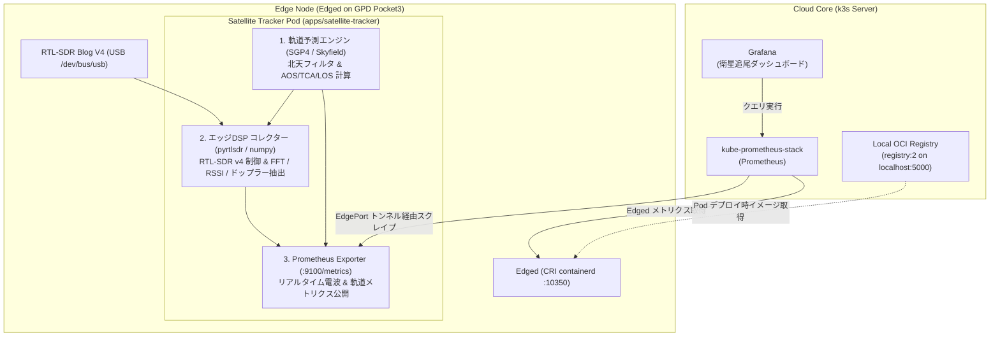

# UHF帯（435MHz）CubeSat電波観測基盤およびKubeEdge分散観測パイプライン 設計仕様書

## 1. 概要 (Overview)

本ドキュメントは、北向きベランダ（マンション5階）に設置された15cm固定長アンテナと RTL-SDR Blog V4 を用い、UHF帯（435〜438 MHz）を通過する超小型人工衛星（CubeSat / アマチュア衛星）の電波を自動観測・追尾し、Prometheus および Grafana でリアルタイム可視化するための分散観測基盤の設計仕様書である。

本システムは、エッジノード（GPD Pocket3 上の KubeEdge Edged）上で軽量な観測 Pod として自律稼働し、SGP4軌道力学計算による衛星通過予測、エッジDSPによるドップラー周波数偏移および受信信号強度（RSSI）の抽出、Prometheus メトリクスの公開、そして Grafana による物理現象のリアルタイム可視化を実現する。

---

## 2. 物理・数学的背景と観測条件 (Physical & Mathematical Principles)

### 2.1 アンテナ長と共振周波数

観測環境はベランダのエアコン室外機上に置かれた金属板（グランドプレーン）に設置された物理長 $L \approx 15\,\text{cm}$ の固定モノポールアンテナである。電気的鏡像効果（Image Theory）により $1/4$ 波長（$\lambda/4$）モノポールアンテナとして動作する。

#### 共振基本式

$$f = \frac{c \cdot k}{4 L}$$

| 記号 | 物理的意味 | 設計値 / 単位 |
| :--- | :--- | :--- |
| $f$ | 基本共振周波数 | 約 $475\,\text{MHz}$（$430 \sim 480\,\text{MHz}$ のUHF帯に最適共振） |
| $c$ | 真空中の光速 | $3.0 \times 10^8\,\text{m/s}$ |
| $L$ | アンテナ物理長 | $0.15\,\text{m}$ |
| $k$ | アンテナ先端の端面効果による短縮率 | 約 $0.95$ |

- **工学的読み解き**:
  エレメント長が波長の $1/4$ のときアンテナ内部で進行波と反射波が強め合って定在波が形成され、リアクタンス（虚数成分）がゼロとなる。放射インピーダンスは約 $36\,\Omega$ となり、RTL-SDR の入力インピーダンス（$50\,\Omega$）との整合（VSWR）が良好で、外部整合器なしに電磁波電力を効率よく伝送できる。

### 2.2 北向きベランダと極軌道衛星の幾何学

- **見通し条件**: 西〜北〜東（方位角 $270^\circ \le \theta_{\text{az}} \le 90^\circ$）が見通し良好、南側は鉄筋コンクリート（RC）躯体により遮蔽。最低仰角は手すり等の障害物を避けるため $\theta_{\text{el}} \ge 10^\circ$ とする。
- **軌道力学との相性**:
  CubeSat や地球観測衛星の大多数は太陽同期極軌道（Sun-Synchronous Polar Orbit: 軌道傾斜角約 $98^\circ$）を周回する。南北を縦断して飛行するため、北向きベランダからは「北極側からアプローチしてくるパス（北 $\to$ 南）」および「北極方向へ離脱していくパス（南 $\to$ 北）」の北半球パスを障害物なく真正面から捉えられる。

### 2.3 ドップラー効果と周波数偏移

衛星が秒速約 $7.5\,\text{km/s}$ で頭上を通過することにより、受信周波数はリアルタイムに偏移する。

$$f_{\text{rx}}(t) = f_0 \left( 1 - \frac{v_r(t)}{c} \right)$$
$$\Delta f(t) = f_{\text{rx}}(t) - f_0 = - f_0 \frac{v_r(t)}{c}$$

| 記号 | 物理的意味 | 設計値 / 単位 |
| :--- | :--- | :--- |
| $f_0$ | 衛星の公称送信周波数 | 例: $437.500\,\text{MHz}$ |
| $f_{\text{rx}}(t)$ | 観測地で受信される周波数 | $\text{Hz}$ |
| $\Delta f(t)$ | ドップラーシフト（周波数偏移） | 最大約 $\pm 10.875\,\text{kHz}$ |
| $v_r(t)$ | 観測地から見た衛星の視線速度（Radial Velocity） | $\text{m/s}$（接近時 $v_r < 0$、離脱時 $v_r > 0$） |
| $c$ | 真空中の光速 | $3.0 \times 10^8\,\text{m/s}$ |

- **展開ステップと直感イメージ**:
  - **接近時（AOS 〜 TCA）**: 衛星が接近するため視線速度は負（$v_r < 0$）となり、$\Delta f > 0$（周波数が約 $+10\,\text{kHz}$ 高い状態から徐々に低下）。
  - **最接近時（TCA: Time of Closest Approach）**: 視線速度がゼロをまたぐ瞬間（$v_r = 0$）で、$\Delta f = 0$（公称周波数と一致）。
  - **離脱時（TCA 〜 LOS）**: 衛星が遠ざかるため視線速度は正（$v_r > 0$）となり、$\Delta f < 0$（周波数が約 $-10\,\text{kHz}$ まで低下）。
  この推移により、時間軸上で滑らかなS字曲線（ドップラーS字カーブ）が描かれる。

### 2.4 受信信号強度（RSSI）と FFT パワースペクトル

$$P(f) = 10 \log_{10} \left( \frac{1}{N} \sum_{k \in \text{Channel}} |X[k]|^2 \right) + C_{\text{cal}}$$

- $X[k]$: IQ信号にハニング窓を乗算した $N$ 点 FFT のフーリエ係数
- $P(f)$: 目的周波数チャネル内の受信電力（$\text{dBm}$）
- $C_{\text{cal}}$: LNAゲイン設定に応じたキャリブレーション定数

---

## 3. システムアーキテクチャ (Architecture)



---

## 4. コンポーネント詳細仕様 (Component Specifications)

### 4.1 インフラ基盤とコンテナ配信（Registry & Build Pipeline）

- **ランタイム**: Docker daemon（dockerd）は使用せず、k3s / KubeEdge 内蔵の CRI 準拠 `containerd`（`/run/k3s/containerd/containerd.sock`）に一本化する。
- **ローカルレジストリ**:
  - `infrastructure/registry/` 配下に `registry:2` を Deployment および Service（`localhost:5000` / NodePort）として定義。
  - `/etc/rancher/k3s/registries.yaml` にローカルレジストリをミラー登録（HTTP 平文化）。
- **イメージビルド**:
  - `nerdctl` CLI を用い、containerd ソケットを直接指定して OCI イメージをビルド・プッシュする。
  ```bash
  sudo nerdctl --address /run/k3s/containerd/containerd.sock \
    build -t localhost:5000/radio-astronomy-tracker:dev -f apps/satellite-tracker/Dockerfile .
  sudo nerdctl --address /run/k3s/containerd/containerd.sock \
    push localhost:5000/radio-astronomy-tracker:dev
  ```

### 4.2 衛星観測ワークロード（`apps/satellite-tracker/`）

- **ベースイメージ**: `python:3.11-slim`（または `bookworm-slim`）
- **依存ライブラリ**:
  - `skyfield`, `sgp4`: 衛星軌道伝搬計算（SGP4）
  - `pyrtlsdr`, `numpy`, `scipy`: SDR IQ 受信および DSP / FFT 処理
  - `prometheus_client`: Prometheus Exporter 実装
  - `requests`: Celestrak TLE 自動ダウンロード
- **内部スレッド構成**:
  1. **軌道予測スレッド**:
     - Celestrak からアクティブな CubeSat / アマチュア衛星の TLE を取得（オフライン時はローカルキャッシュを利用）。
     - 観測地（北緯35.68°, 東経139.69°, 高度30m）における次期パス（AOS, TCA, LOS, 最大仰角, ドップラー予測値）を計算。
     - 北向きベランダ視界フィルタ（Azimuth: $270^\circ \sim 90^\circ$, Elevation $\ge 10^\circ$）に合致するパスのみを追尾キューに追加。
  2. **DSP 収集スレッド**:
     - パス期間中、RTL-SDR v4 を該当周波数（例: 437.500MHz）に同調させ、IQ サンプルを取得。
     - ハニング窓 + FFT 処理により、ピーク周波数・実測ドップラー偏移および RSSI（dBm）、SNR（dB）を算出。
     - 衛星非通過時は低頻度（10秒に1回等）でノイズフロア監視モードとして待機。
     - `MOCK_SDR=true` 設定時は、実機 SDR 未接続でも数学的ドップラーS字カーブとノイズを合成したテスト波形を自動生成。
  3. **Prometheus Exporter スレッド**:
     - ポート `9100`（HTTP `/metrics`）でメトリクスを公開。

### 4.3 Prometheus メトリクス定義

| メトリクス名 | 型 | ラベル | 説明 |
| :--- | :--- | :--- | :--- |
| `satellite_tracking_active` | Gauge | `satellite` | 現在追尾中か否か（1: パス中, 0: 待機） |
| `satellite_elevation_degrees` | Gauge | `satellite` | 現在の衛星の仰角（度, $0 \sim 90$） |
| `satellite_azimuth_degrees` | Gauge | `satellite` | 現在の衛星の方位角（度, $0 \sim 360$） |
| `satellite_doppler_predicted_hz` | Gauge | `satellite` | SGP4 計算に基づく理論ドップラー偏移（Hz） |
| `satellite_doppler_measured_hz` | Gauge | `satellite` | FFT ピーク検出に基づく実測ドップラー偏移（Hz） |
| `satellite_rssi_dbm` | Gauge | `satellite` | 実測受信電波強度（dBm） |
| `satellite_snr_db` | Gauge | `satellite` | ノイズフロアに対する信号雑音比（dB） |
| `satellite_passes_total` | Counter | `satellite`, `status` | パス観測完了数（`completed`, `missed` 等） |
| `satellite_next_aos_timestamp_seconds`| Gauge | `satellite` | 次回パス開始予定時刻（UNIX timestamp） |

### 4.4 Kubernetes マニフェスト構成

- **配置先**: `infrastructure/apps/satellite-tracker/`
  - `deployment.yaml`:
    - `nodeSelector`: `node-role.kubernetes.io/edge: ""`
    - `securityContext.privileged: true`
    - `hostPath`: `/dev/bus/usb` マウント
  - `service.yaml`:
    - ポート `9100`（`name: metrics`）
  - `servicemonitor.yaml`:
    - `kube-prometheus-stack` が自動検出するラベル（`release: kube-prometheus-stack`）を付与。

### 4.5 Grafana ダッシュボード定義

- **配置先**: `infrastructure/monitoring/dashboards/satellite-tracker.json`
- **パネル構成**:
  1. **ステータスバナー**: 現在追尾中の衛星名、次回 AOS カウントダウン、本日の累積パス数
  2. **電波品質（RSSI & SNR）**: 放物線を描く電波強度プロファイル
  3. **ドップラーS字カーブ解析**: 予測ドップラー偏移（理論値）と実測ドップラー偏移の重ね合わせグラフ
  4. **軌道トラッキング**: 仰角（Elevation）および方位角（Azimuth）の時系列推移
  5. **エッジリソース消費**: Edged（10350）が報告する SDR Pod の CPU 使用率（コア）およびメモリ使用量（MB）

### 4.6 KubeEdge 基本デプロイガイド

- **配置先**: `docs/setup/03_kubeedge_deployment_guide.md`
- **一次情報リンク**: KubeEdge 公式ドキュメント、keadm リポジトリ
- **記載内容**:
  - GPD Pocket3（Ubuntu 26.04 LTS）上での前提設定（udev ルール、CRI containerd 連携、`registries.yaml`）
  - CloudCore 初期化（`keadm init`）と EdgeToken 発行手順
  - EdgeCore セットアップ（`keadm join`、USB アクセス設定、Edged 10350 開通）
  - 正常性検証コマンド（`kubectl get nodes`、CloudStream トンネル経由の `kubectl logs` / `kubectl exec`）

---

## 5. エラーハンドリングとテスト方針 (Error Handling & Testing)

1. **実機 SDR 未接続時のフォールバック**:
   - `MOCK_SDR=true` フラグにより、実機がなくてもユニットテスト・結合テストおよび Grafana の描画テストがローカルで 100% 完結する設計とする。
2. **TLE 取得ネットワーク障害**:
   - インターネット遮断時でも起動できるよう、デフォルトの代表的衛星（ISS, CAS-4A 等）の静的 TLE をバンドルし、フォールバック利用する。
3. **テスト自動化**:
   - `pytest` による軌道計算（SGP4 ドップラー計算）の数学的検証。
   - FFT パワースペクトル算出およびピーク検出アルゴリズムの単体テスト。
