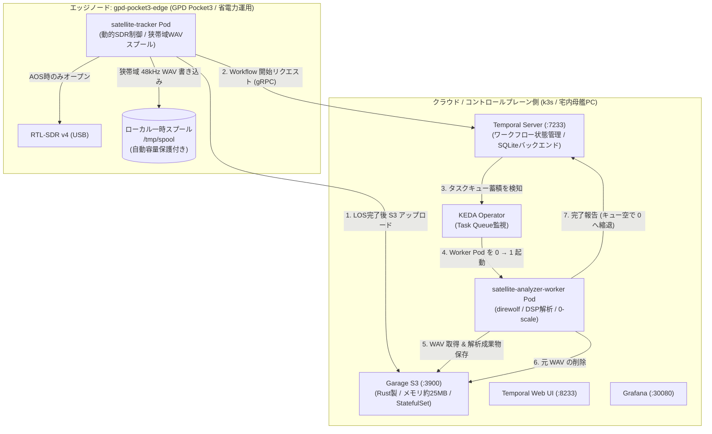

# イベント駆動型衛星解析パイプライン設計仕様書
## (Event-Driven Satellite Analysis Pipeline with Garage S3 and Temporal)

- **作成日**: 2026-10-10
- **ステータス**: 承認済み (Approved)
- **対象コンポーネント**: `satellite-tracker` (Edge), `satellite-analyzer-worker` (Batch/Cloud), Garage S3, Temporal, KEDA

---

## 1. 背景と目的

### 1.1 背景
GPD Pocket3（Ubuntu 26.04 LTS）上で KubeEdge を用いた衛星電波観測 PoC において、`satellite-tracker` Pod が 37 時間以上の完全無停止自律稼働（再起動 0 回、累計 14 回の衛星通過捕捉）を達成した。
現在のシステムはインメモリでリアルタイム FFT 解析を行い、Prometheus メトリクス（周波数、受信電力、SNR）として時系列データをストリーミングしている。しかし、ユーザーから「受信した電波の生波形や、衛星から送信されたパケット・テレメトリ（中身）を見て楽しみたい」という要求が提起された。

### 1.2 課題
1. **ストレージ消費の壁**:
   RTL-SDR v4 のサンプリングレート $2.4 \text{ MSPS}$（複素 IQ 8bit、約 $4.8 \text{ MB/s}$）を常時保存すると、1 時間で約 $17.2 \text{ GB}$ を消費し、エッジ端末のローカル SSD が枯渇する。
2. **計算負荷と消費電力・発熱**:
   エッジ端末（GPD Pocket3）上で重いソフトウェア復調（FM 検波、direwolf による APRS デコード、高解像度スペクトログラム生成）を常時実行すると、CPU 利用率と消費電力が跳ね上がり、ファンの騒音や熱ダレを招く。
3. **オブジェクトストレージの選定**:
   オブジェクトストレージとして広く使われてきた MinIO は、AGPLv3 へのライセンス変更や商用誘導などの懸念から採用を回避し、より軽量で信頼性の高い代替案が必要である。

### 1.3 目的
- **関心事の分離 (Decoupling)**: 観測（Producer: `satellite-tracker`）と解析（Consumer: `satellite-analyzer-worker`）を疎結合化する。
- **エッジの極限省電力・保護**: エッジ側は「通過時のみ狭帯域ベースバンドを一時録音し、アップロード後に即座にローカルファイルを削除する」運用とし、非通過時は SDR ドングルをサスペンドする。
- **軽量 S3 互換ストレージの採用**: Rust 製でフットプリントが極めて小さい **Garage S3** を採用する。
- **クラウド側でのオンデマンド解析 (Scale to Zero)**: **Temporal** と **KEDA** を組み合わせ、パス終了時のみ解析ワーカーを `0 → 1` に起動してデコードと画像生成を行い、完了後に `0` に縮退させる。

---

## 2. システムアーキテクチャ

エッジノード（ベランダ設置の GPD Pocket3）とクラウド／コントロールプレーン側ノードの分散構成をとる。



---

## 3. コンポーネント詳細仕様

### 3.1 エッジ観測側: `satellite-tracker`

#### ① 動的 SDR ライフサイクル（省電力制御）
- **待機中（非通過時）**: SDR デバイスのハンドルを `close()` し、USB バスからのサスペンド状態を維持して給電消費電力（約 $1.5 \sim 2.0 \text{ W}$）と発熱を停止する。
- **AOS 30 秒前**: タイマーイベントで SDR を再初期化（`open()`）し、衛星の送信周波数（ISS: 437.550 MHz, CAS-4A: 435.220 MHz）へチューニングしてウォームアップする。

#### ② ドップラー追従 ＆ 48kHz 狭帯域デシメーション録音
- 衛星の軌道力学計算（SGP4）に基づく理論ドップラー周波数 $\Delta f$ に合わせ、受信周波数を動的トラッキングする。
- 受信帯域を $2.4 \text{ MSPS}$ から、音声・パケット復調に必要な帯域幅に絞り込み、**$48 \text{ kHz}$ モノラル 16bit PCM WAV**（約 $96 \text{ KB/s}$）にデシメーション（間引き）してローカルスプールへ書き込む。
- 10 分間の可視通過でもファイルサイズは **約 $57 \text{ MB}$** に収まる。

#### ③ ローカルスプール管理と安全回路 (Circuit Breaker)
- スプール保存先: `/tmp/spool/{satellite}_{pass_id}.wav`
- **安全回路**:
  - ホスト空き容量が $10\%$ 未満、またはスプール内合計容量が $500 \text{ MB}$ を超過した場合、最古の未転送ファイルを強制削除し、エッジ側のストレージ満杯（No Space Left on Device）を絶対に防止する。

#### ④ LOS 後の自動アップロードとトリガー
- 衛星が視界外（仰角 $< 10^\circ$）へ抜けた瞬間に WAV への書き込みをクローズ。
- SDR デバイスを即座に `close()` して待機モードへ戻す。
- Garage S3 の `raw/` プレフィックスへファイルをアップロード完了後、ローカルの一時 WAV を即座に `rm` してディスク使用量をゼロ化する。
- クラウドの Temporal Server に対して `AnalyzeSatellitePassWorkflow` の実行リクエスト（gRPC）を発行する。

---

### 3.2 ストレージ基盤: Garage S3

- **選定理由**: MinIO の AGPLv3 化・商用誘導を避け、Rust 製で極めて軽量（メモリ約 $20 \sim 30 \text{ MiB}$）、完全な S3 API 互換性を持つ。
- **Kubernetes デプロイ形態**:
  - `infrastructure/storage/garage/` に K8s マニフェスト一式（StatefulSet, Service, ConfigMap, Secret）を配置。
  - `singleNode: true`（`replication_factor = 1`）で単一ノード運用。
  - ストレージは k3s の `local-path` StorageClass で `metadata`（1GB）と `data`（20GB）の PVC を確保。

#### バケット構成: `satellite-recordings`
```text
satellite-recordings/
├── raw/                              # 一時録音ファイル (解析完了後に自動削除)
│   └── ISS_20261010_090048.wav
│
└── results/                          # 永続保存成果物 (JSON / PNG)
    └── ISS/
        └── 20261010_090048/
            ├── summary.json          # パスサマリー (最高仰角, 最大RSSI/SNR, TCA時刻)
            ├── packets.json          # デコードされたパケット一覧 (APRS / テレメトリ)
            └── spectrogram.png       # ドップラーS字カーブスペクトログラム画像
```

---

### 3.3 オーケストレーション基盤: Temporal & KEDA (Scale to Zero)

#### ① Temporal Server
- **構成**: SQLite バックエンドの軽量サーバー構成（コントロールプレーン上で稼働、メモリ約 $100 \text{ MiB}$）。
- **ポート**: gRPC `:7233`、Web UI `:8233`。
- **役割**: 各解析タスクの依存関係（DAG）、リトライ、タイムアウト、ステータス遷移の完全保証。

#### ② ワークフロー定義: `AnalyzeSatellitePassWorkflow`
| ステップ | Activity 名 | 処理内容 | タイムアウト / リトライ |
| :--- | :--- | :--- | :--- |
| 1 | `DownloadRecordingActivity` | Garage S3 から対象の WAV ファイルを取得 | 3分 / 3回リトライ |
| 2 | `DecodePacketsActivity` | `direwolf`（ISS APRS）またはテレメトリパーサーを実行し、パケットを抽出 | 5分 / 2回リトライ |
| 3 | `GenerateSpectrogramActivity` | FFT 解析によりドップラー偏移をプロットしたスペクトログラム PNG を生成 | 3分 / 2回リトライ |
| 4 | `SaveResultsActivity` | 生成された `packets.json` と `spectrogram.png` を Garage S3 の `results/` に保存 | 2分 / 3回リトライ |
| 5 | `CleanupRawRecordingActivity` | Garage S3 上の元 WAV ファイルを削除 | 2分 / 3回リトライ |

#### ③ KEDA による Worker の 0 scale 制御
- `ScaledObject` 定義により、Temporal の Task Queue `satellite-analysis` のバックログメトリクスを監視。
- **アイドル時**: レプリカ数 `0`。
- **イベント発生時**: 未処理タスクが入ると即座に `1` にスケールアウト。
- **クールダウン**: 処理完了後、キューが空の状態で 120 秒経過すると `0` にスケールイン。

---

## 4. 成果物データモデル

### 4.1 パケットデコード結果: `packets.json`
```json
{
  "satellite": "ISS",
  "pass_id": "ISS_20261010_090048",
  "aos_utc": "2026-10-10T00:00:48Z",
  "los_utc": "2026-10-10T00:09:12Z",
  "packets_count": 2,
  "packets": [
    {
      "timestamp": "2026-10-10T00:03:15Z",
      "source": "JA1XXX",
      "destination": "CQ",
      "repeater": "ARISS",
      "message": "Hello from Tokyo via ISS!",
      "raw_frame": "JA1XXX>CQ,ARISS*::Hello from Tokyo via ISS!"
    },
    {
      "timestamp": "2026-10-10T00:04:22Z",
      "source": "RS0ISS",
      "destination": "BEACON",
      "repeater": "",
      "message": "ARISS Packet System Active",
      "raw_frame": "RS0ISS>BEACON::ARISS Packet System Active"
    }
  ]
}
```

### 4.2 パスサマリー: `summary.json`
```json
{
  "satellite": "ISS",
  "pass_id": "ISS_20261010_090048",
  "max_elevation_deg": 12.02,
  "tca_utc": "2026-10-10T00:04:55Z",
  "max_rssi_dbm": -19.93,
  "max_snr_db": 52.68,
  "doppler_shift_span_hz": 14013.37,
  "recording_duration_sec": 504.0,
  "raw_file_size_bytes": 48384044
}
```

---

## 5. 段階的導入計画 (Phase Roadmap)

- **Phase 1: ストレージ基盤と狭帯域スプール録音の構築**
  - Garage S3 をクラスタ内に StatefulSet としてデプロイし、バケットと API キーを作成。
  - `satellite-tracker` に AOS/LOS 連動の 48kHz WAV スプール録音、動的 SDR 省電力クローズ、および Garage S3 へのアップロード処理を実装・テスト。
- **Phase 2: 解析ワーカーとパケットデコード処理の実装**
  - `direwolf` およびスペクトログラム生成ロジックを含む `satellite-analyzer-worker` コンテナイメージをビルド。
  - 手動またはイベント駆動で WAV を解析し、JSON と PNG が Garage S3 に格納されることを確認。
- **Phase 3: Temporal オーケストレーションと KEDA 0-scale オートスケーリングの統合**
  - クラスタに Temporal Server と KEDA をデプロイ。
  - ワークフローおよび Activity の組み込みを行い、完全自律的な 0 scale パイプラインを稼働。
