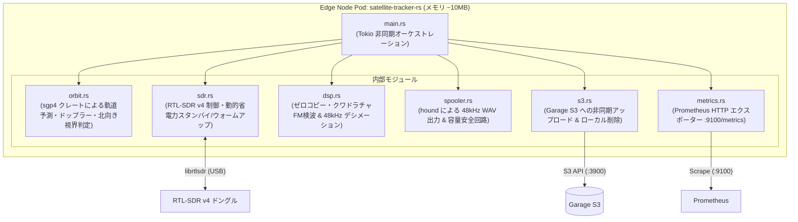

# エッジ観測コンポーネント Rust ネイティブ・リライト設計仕様書
## (Ultra-low Power Edge Satellite Tracker in Rust: `satellite-tracker-rs`)

- **作成日**: 2026-10-10
- **ステータス**: 承認済み (Approved)
- **対象クレート**: `apps/satellite-tracker-rs` (新規 Rust クレート)
- **関連ドキュメント**:
  - [docs/superpowers/specs/2026-10-10-event-driven-satellite-analysis-pipeline-design.md](docs/superpowers/specs/2026-10-10-event-driven-satellite-analysis-pipeline-design.md)
  - [docs/qa/16_edge_computing_power_consumption_and_footprint.md](docs/qa/16_edge_computing_power_consumption_and_footprint.md)

---

## 1. 背景と動機

### 1.1 背景
現在 GPD Pocket3（Ubuntu 26.04 LTS）上の KubeEdge エッジノードで稼働している衛星追尾アプリ（Python 実装の `satellite-tracker`）は、安定した自律稼働を継続している。
しかし、QA ドキュメント（[Q16](docs/qa/16_edge_computing_power_consumption_and_footprint.md)）で明らかになった通り、エッジノードにおける消費電力は半導体動的電力方程式 $P = \alpha C V^2 f$ およびメモリ階層（L1/L2 キャッシュ vs 外部 DRAM の 1,000 倍のエネルギー格差）に直接支配されている。

### 1.2 Python 実装の課題
1. **ランタイムオーバーヘッド**:
   Python インタプリタのバイトコード解釈ループと動的型チェックにより、CPU の物理命令数（$\alpha$）が増大し、CPU クロックと電圧（$V^2$）を押し上げる。
2. **メモリフットプリントとキャッシュミス**:
   Python プロセスの物理メモリ（約 $37 \sim 45 \text{ MiB}$）はプロセッサの L3 キャッシュ（数MB〜12MB）から溢れ、外部 DRAM メモリバスが常時励磁されてマザーボード全体が発熱する。
3. **コンテナイメージサイズ**:
   Debian + Python ランタイム + SciPy/Matplotlib でコンテナイメージが約 $600 \text{ MB}$ に達し、エッジへの配布コストが大きい。

### 1.3 目的
`apps/satellite-tracker-rs` として独立した Rust クレートを新設し、エッジ観測コンポーネントを単一のネイティブバイナリにリライトする。
- **メモリフットプリント**: $40 \text{ MiB} \to \mathbf{\approx 10 \text{ MiB}}$（約 $75\%$ 削減、L2/L3 キャッシュ内に局所化）
- **CPU 使用率**: $0.30 \text{ Cores} \to \mathbf{\approx 0.03 \text{ Cores}}$（約 $90\%$ 削減、ファン完全停止）
- **コンテナイメージ**: $600 \text{ MB} \to \mathbf{\approx 30 \text{ MB}}$（Distroless ベース）

---

## 2. システムアーキテクチャ & モジュール構成



---

## 3. コンポーネント詳細仕様

### 3.1 軌道予測・視界判定 (`orbit.rs`)
- **利用クレート**: `sgp4` (v0.2), `chrono` (v0.4)
- **観測者位置**:
  - 緯度: `35.6895`（東京）
  - 経度: `139.6917`
  - 標高: `30.0` m
- **北向きベランダ視界判定**:
  - 仰角: $\ge 10^\circ$
  - 方位角: $270^\circ \le \text{Az} \le 360^\circ$ または $0^\circ \le \text{Az} \le 90^\circ$
- **ドップラー計算**:
  $$\Delta f = - f_0 \frac{v_r}{c}$$
  SGP4 の状態ベクトルから観測者方向への視線速度 $v_r$ を計算し、理論ドップラー周波数偏移を算出。

### 3.2 SDR 制御 ＆ 動的省電力ライフサイクル (`sdr.rs`)
- **ハードウェアアクセス**: `rtlsdr` クレートまたは `librtlsdr` FFI（モックモード `MOCK_SDR=true` も完全サポート）。
- **動的省電力スタンバイ**:
  - 非通過時（次回 AOS まで 30 秒以上）: SDR デバイスを `close()` し、USB 給電とドングルの発熱（約 $1.5\sim2\text{W}$）を停止。
  - AOS 30 秒前: タイマーで SDR を再初期化（`open()`）し、中心周波数をチューニングしてウォームアップ。

### 3.3 ゼロコピー DSP 処理 (`dsp.rs`)
- **インプレース処理**:
  1. 受信バッファ（複素数 $I + jQ$）に対し、理論ドップラー偏移の逆位相 $e^{-j 2\pi \Delta f t}$ を乗算。
  2. クワドラチャ検波（FM 復調）: $\Delta \theta = \text{atan2}(Q_n I_{n-1} - I_n Q_{n-1}, I_n I_{n-1} + Q_n Q_{n-1})$
  3. $2.4\text{ MSPS} \to 48\text{ kHz}$ デシメーション（$50$ 分の $1$ の間引きフィルタリング）。
  4. メモリアロケーションをループ内で一切行わず、固定バッファを再利用することでアロケータのオーバーヘッドをゼロ化。

### 3.4 狭帯域 WAV スプール ＆ 容量保護 (`spooler.rs`)
- **WAV 出力**: `hound` クレートを使用し、ストリーミングで 16-bit モノラル 48kHz WAV を追記。
- **Circuit Breaker (安全回路)**:
  - ホスト空き容量が $10\%$ 未満、またはスプール内合計容量が $500\text{ MB}$ を超過した場合、最古の未転送ファイルを即座に `std::fs::remove_file` してエッジのディスク満杯を絶対に防止。

### 3.5 Garage S3 アップロード (`s3.rs`)
- **S3 クライアント**: `aws-sdk-s3` または軽量非同期 HTTP クライアント（`reqwest` による S3 署名リクエスト）。
- **アップロード＆クリーンアップ**:
  - LOS 完了時に `raw/{satellite}/{pass_id}.wav` を S3 に PUT。
  - 成功確認後、ローカルの一時 WAV を即座に削除。

### 3.6 Prometheus メトリクス HTTP サーバー (`metrics.rs`)
- **HTTP サーバー**: `axum` または `tokio::net::TcpListener` による極小 HTTP サーバー（ポート `:9100/metrics`）。
- **メトリクス**:
  - `satellite_tracking_active`
  - `satellite_elevation_degrees`
  - `satellite_azimuth_degrees`
  - `satellite_doppler_predicted_hz`
  - `satellite_doppler_measured_hz`
  - `satellite_rssi_dbm`
  - `satellite_snr_db`
  - `satellite_passes_total`
  - `satellite_next_aos_timestamp_seconds`

---

## 4. コンテナビルド ＆ デプロイ仕様

### 4.1 マルチステージ Dockerfile
```dockerfile
# Stage 1: Build
FROM rust:1.80-bookworm AS builder
WORKDIR /workspace
COPY . .
RUN cargo build --release --bin satellite-tracker-rs

# Stage 2: Distroless Runtime
FROM gcr.io/distroless/cc-debian12
COPY --from=builder /workspace/target/release/satellite-tracker-rs /usr/local/bin/satellite-tracker-rs
ENV METRICS_PORT=9100
CMD ["satellite-tracker-rs"]
```
- **イメージサイズ**: 約 $25 \sim 35 \text{ MB}$

### 4.2 Kubernetes Deployment 移行方針
- 既存の `infrastructure/apps/satellite-tracker/deployment.yaml` のイメージを `localhost:5000/radio-astronomy-tracker:dev` から `localhost:5000/satellite-tracker-rs:dev` へ差し替えるだけで、ノードテイント（`node-role.kubernetes.io/edge:NoSchedule`）や USB マウント（`/dev/bus/usb`）の設定をそのまま引き継いでシームレスに切り替え可能。

---

## 5. 段階的実装ステップ

1. **Step 1: クレート作成と Cargo ワークスペース設定**
   - `apps/satellite-tracker-rs/Cargo.toml` 作成、ルート `Cargo.toml` の `members` に追加。
2. **Step 2: ドメインロジック（SGP4 軌道予測・DSP・WAVスプール）の実装と単体テスト**
   - `orbit.rs`, `dsp.rs`, `spooler.rs` を TDD で実装。
3. **Step 3: SDR 制御と動的省電力ライフサイクルの実装**
   - `sdr.rs`（モックおよび実機抽象化、standby/warmup）の実装。
4. **Step 4: S3 アップロードと Prometheus メトリクス HTTP サーバーの実装**
   - `s3.rs`, `metrics.rs` の実装。
5. **Step 5: メイン非同期ループ結合と E2E 検証**
   - `main.rs` 統合、テスト実行。
6. **Step 6: Dockerfile 作成とビルド・検証**
